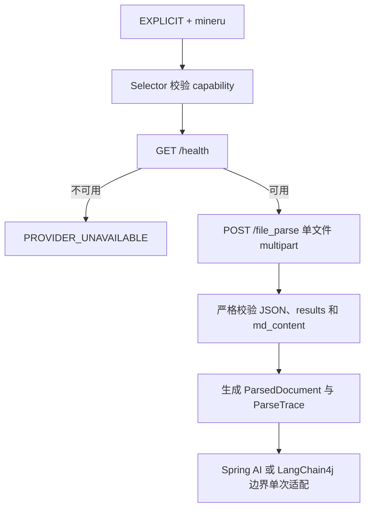

# MinerU 文档解析适配

> 适配对象：MinerU
> 所属能力域：`rag`
> 状态：已验证实现；生产安全 Gate 待确认
> 更新日期：2026-07-29

## 1. 适用场景

MinerU 用于调用方明确希望解析复杂版式、扫描件、表格、公式或 Office 文档，并接受将文档发送到其配置的 MinerU 服务时。V1 不把 MinerU 作为默认 provider。

## 2. 触发条件

1. 请求使用 `ParserSelectionMode.EXPLICIT` 并指定 `mineru`。
2. `mineru.enabled=true`，配置项完整且 HTTP/HTTPS 地址合法。
3. 健康检查通过。
4. 文档类型、精确扩展名和所需特性与 MinerU capability 匹配。
5. 文件大小未超过配置上限。

任一条件不满足都返回明确分类异常，不切换到 native 或其他 provider。

## 3. 调用流程

## 4. 协议与结果

- 健康检查：`GET /health`，要求 2xx 且响应表现为 JSON。
- 同步解析：`POST /file_parse`，使用 `multipart/form-data` 的单个 `files` part。
- V1 固定请求 Markdown，不请求 ZIP、中间 JSON、模型输出、内容列表、图片或原文件回传。
- V1 要求响应只包含一个文件结果，并从 `md_content` 读取 Markdown；空结果、多结果、缺失字段或类型错误都归类为非法响应。
- 结果保留 Markdown 标题、列表、表格、代码块和公式的结构性空白。

## 5. 格式边界

MinerU provider 仅声明已确认的 PDF、图片、DOCX、PPTX、XLSX 格式。旧 DOC、PPT、XLS 不属于 MinerU capability，可由框架 native provider 按自身支持情况处理。

## 6. 异常、回滚与安全

- 连接超时、读取超时、非 2xx、非法响应、服务解析失败、IO 错误和文件超限均有独立分类。
- 文件名使用 basename 并过滤 CR、LF 和引号；外部错误摘要限长。
- 日志、异常和轨迹不记录文档正文、认证信息或完整外部响应。
- 回滚方式为关闭 `mineru.enabled`；`DEFAULT` native 路径不受影响。
- 生产文档传输的合规性和真实部署安全仍需人工 Gate，不得据此文档宣称发布就绪。

## 7. 配置

配置前缀为 `sys.rag.document-parser.mineru`，主要配置包括 `enabled`、`base-url`、`backend`、`connect-timeout`、`read-timeout` 和 `max-file-size`。默认值及治理边界见 `../知识检索增强配置与资源文档.md`。

## 8. 证据

- `MinerUClientOptions`、`MinerUClient`、`MinerUDocumentParser`
- Spring AI 与 LangChain4j MinerU provider/adapter
- `MinerUClientTest`、双框架适配与共存测试
- `spec/features/20260728/reports/RAG文档解析器扩展-实施报告.md`
