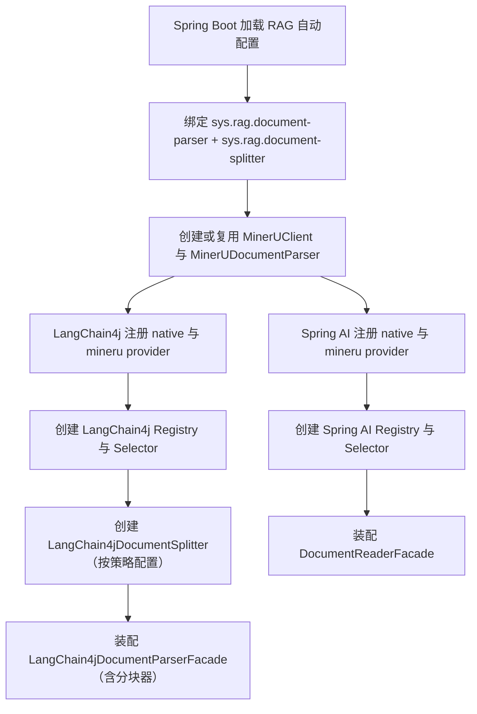
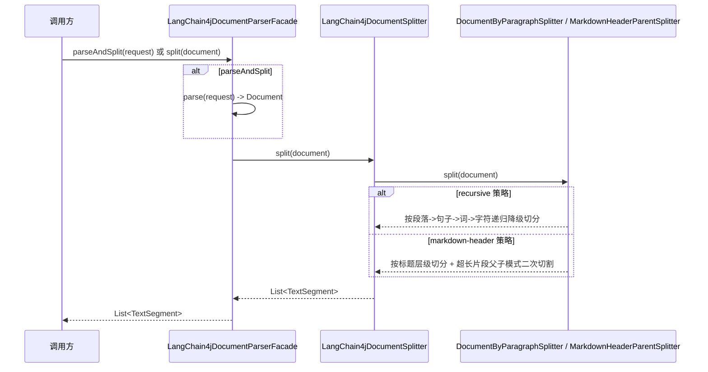
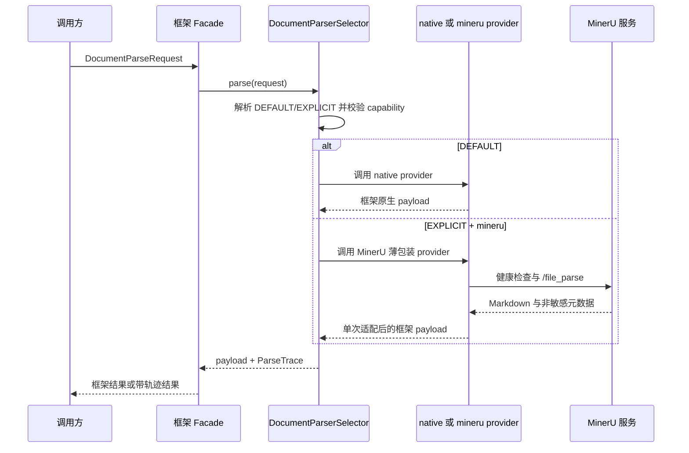

# 知识检索增强运行文档

> 能力标识：`rag`
> 文档层级：技术能力域
> 文档状态：文档解析与文档分块运行链路已汇总
> 更新日期：2026-07-30

## 1. 运行组件

| 组件 | 职责 | 生命周期 | 状态 |
| --- | --- | --- | --- |
| `DocumentParserRegistry<R>` | 保存同一框架 payload 类型的 provider 集合 | 启动期构造，运行期只读 | 已验证 |
| `DocumentParserSelector<R>` | 选择 provider、校验能力、执行解析并补齐 trace | 启动期至运行期 | 已验证 |
| `DocumentReaderFacade` | Spring AI 兼容入口与 selector 编排入口 | 启动期至运行期 | 已验证 |
| `LangChain4jDocumentParserFacade` | LangChain4j 统一解析入口，提供 parse、parseWithTrace、parseAndSplit、split 四种入口 | 启动期至运行期 | 已验证 |
| `LangChain4jDocumentSplitter` | 分块策略路由，按配置创建 recursive 或 markdown-header 内部分块器 | 启动期至运行期 | 已验证 |
| `MarkdownHeaderParentSplitter` | Markdown 标题层级分块 + 父子模式二次切割 | 单次分块调用期 | 已验证 |
| `MinerUClient` | 执行 `/health` 和 `/file_parse` 同步 HTTP 协议 | 显式 MinerU 调用期 | 已验证 |
| `MinerUDocumentParser` | 共享 MinerU capability、协议调用和中立结果构造 | 启动期至运行期 | 已验证 |
| 框架 native provider | 运行框架原生解析并直通原生结果 | 单次解析期 | 已验证 |
| 框架 MinerU provider/adapter | 将共享中立结果转换为框架文档 | 单次显式 MinerU 解析期 | 已验证 |

## 2. 场景运行落地

### 2.1 初始化链路

两个框架的注册表因 payload 类型不同而独立；共享 MinerU 协议组件使用缺省 Bean 条件，双框架同时装配时不重复创建协议实现。LangChain4j 模块在 Selector 创建后额外创建 `LangChain4jDocumentSplitter`，并注入 Facade。

### 2.3 文档分块链路（LangChain4j）

分块器在构造时按配置创建内部分块器实例，运行期不可变。`parseAndSplit` 等价于先 `parse` 再 `split`。

### 2.2 单次解析链路

## 3. 选择与失败语义

1. 未指定选型时创建 `DEFAULT`，V1 固定解析为 `native`。
2. `EXPLICIT` 必须提供 provider 标识。
3. Selector 依次校验 provider 存在性、可用性、文档类型、精确扩展名和所需特性。
4. 任一校验或解析失败均直接返回分类异常，不尝试其他 provider。
5. Selector 合并 provider 轨迹与选择原因，不把正文或认证信息写入 trace。

## 4. 运行治理

### 4.1 资源生命周期与安全

- `DocumentSource` 可重复打开新流，调用者负责最终关闭 source；临时资源关闭操作必须幂等。
- MinerU 客户端通过流式 multipart 发送单个文件，不要求将整个文件一次性加载到内存。
- MinerU 默认关闭；默认 native 路径不执行健康检查或外部文件上传。
- 文件名只使用 basename，并过滤 CR、LF 和引号，降低 multipart header 注入风险。
- 外部错误摘要限长；日志、异常、trace 和 `toString` 不得记录正文、认证信息或完整原始响应。

### 4.2 容错与可观测性

当前分类错误覆盖：非法请求、重复 provider、provider 不存在或不可用、不支持类型或特性、文件超限、连接超时、读取超时、HTTP 错误、非法响应、provider 失败和 IO 错误。

当前 `ParseTrace` 可用于诊断实际 provider、耗时、源类型、输出格式、版本、后端和选择原因。当前未发现生产级指标、告警、链路追踪或健康结果缓存的已验证规范，这些内容不得推断为已交付。

## 5. 验证与待确认

| 项目 | 状态 | 证据 |
| --- | --- | --- |
| common 契约与 MinerU 协议测试 | 已验证 | 2026-07-29，JDK 21 下 `mvn -q test` 通过 |
| Spring AI 兼容、native 与 MinerU 适配测试 | 已验证 | 2026-07-29，JDK 21 下 `mvn -q test` 通过 |
| LangChain4j native、MinerU 与双框架共存测试 | 已验证 | 2026-07-29，JDK 21 下 `mvn -q test` 通过 |
| LangChain4j 文档分块（recursive + markdown-header）测试 | 已验证 | 2026-07-30，JDK 21 下 `mvn test` 通过，55 tests, 0 failures |
| 外部文档传输人工安全 Gate | 待确认 | 实施报告标记待执行 |
| RAG reactor 全量构建 | 待确认 | 实施报告未提供通过证据 |
| 真实 MinerU 部署环境端到端验证 | 待确认 | 当前测试使用本地协议 Mock |

## 6. 事实来源

- `spec/features/20260728/reports/RAG文档解析器扩展-实施报告.md`
- `spec/features/20260729/reports/LangChain4j文档分块-实施报告.md`
- `fons4ai-rag/fons4ai-rag-common/src/main/java/com/fons/cloud/ai/rag/common/document/`
- `fons4ai-rag/fons4ai-rag-common/src/main/java/com/fons/cloud/ai/rag/common/integration/mineru/`
- `fons4ai-rag/fons4ai-rag-spring-ai-starter/src/main/java/com/fons/cloud/ai/rag/`
- `fons4ai-rag/fons4ai-rag-langchain/src/main/java/com/fons/cloud/ai/rag/langchain/`
- 对应模块测试及 2026-07-29 当前工作区复验
