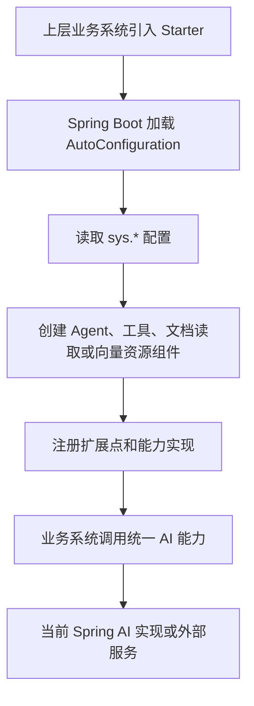

# 项目技术能力架构文档

> 文档层级：项目级
> 文档状态：基线已建立，待能力域深度建模
> 更新日期：2026-07-13

## 1. 项目技术定位

- 一句话定位：Fons4AI 是持续迭代的可插拔 AI Agent 开发框架，以 Spring Boot Starter 形式提供智能体执行引擎、工具编排、RAG 检索增强、多模态识别和图像生成等 AI 能力，供上层业务系统按需接入。
- 核心技术目标：以稳定能力契约隔离上层业务系统与底层 AI 开发框架、模型服务和外部工具接入差异。
- 主要使用方：需要按需集成 AI Agent、工具调用、知识检索或模型能力的上层业务系统。
- 不在本项目范围内的内容：上层业务领域模型、业务流程、业务数据结构和特定业务系统的接入实现。

## 2. 技术能力域总览

| 技术能力域 | 职责 | 核心平台能力 | 使用方 | 状态 |
| --- | --- | --- | --- | --- |
| Agent 编排 | 管理 Agent 执行、上下文、多轮推理、流式输出和任务生命周期 | `BaseAgent`、`ReactAgent`、`AgentTaskManager` | 上层业务系统与工具管理 | 已验证当前实现 |
| 工具管理 | 管理工具提供商、注册、发现、调用与结果解析 | `ToolProvider`、`ToolsRegistry`、MCP/Tavily 接入 | Agent 编排及后续其他执行引擎 | 已验证当前实现，待独立建模 |
| 知识检索增强 | 管理文档读取、向量写入、检索增强与向量资源适配 | `DocumentReaderFacade`、`EmbeddingService`、PgVector | Agent 编排与上层业务系统 | 已验证当前实现 |
| AI 能力接入 | 统一承载模型和 AI 服务接入，覆盖多模态与生成能力演进 | 当前图像生成服务、多模态自动配置 | Agent 编排、RAG 与上层业务系统 | 部分已实现，待收敛 |

当前物理模块为 `fons4ai-agent` 和 `fons4ai-rag`，其中工具管理位于 Agent 模块，图像生成位于 Agent 模块，多模态识别位于 RAG 模块。该组织是当前实现边界，不是最终能力域边界。

## 3. 技术接入流程

图示状态：已根据当前 Starter 自动配置和配置属性源码补全。未来适配其他 AI 框架时，应新增适配实现，不改变上层能力域语义。

## 4. 扩展点与能力适配风险

| 扩展点 | 适用场景 | 适配对象 | 风险 | 是否需要能力建模 |
| --- | --- | --- | --- | --- |
| Agent 执行实现 | 替换或新增 AI 开发框架 | Spring AI、后续框架 | 当前 `ReactAgent` 使用 Spring AI 类型，公共契约与实现边界需拆分 | 是 |
| `ToolProvider` | 接入新的工具提供商 | MCP、HTTP、内部服务、第三方工具 | 当前工具回调和结果解析受 Spring AI 工具类型影响 | 是 |
| `DocumentReaderStrategy` | 接入新的文档格式或解析器 | PDF、Markdown、Tika、图片等 | 文档元数据、失败处理和入库策略尚未统一 | 是 |
| 向量存储与 Embedding | 替换向量库或模型提供商 | PgVector、Embedding 模型 | 当前动态 PgVector 工厂与 Spring AI 实现绑定 | 是 |
| AI 服务提供商 | 接入图像、多模态或其他模型能力 | 当前图像生成供应商、后续服务商 | 图像生成当前实现存在供应商限制，能力抽象未统一 | 是 |

## 5. 平台级技术规则

| 规则编号 | 规则 | 适用范围 | 证据来源 | 状态 |
| --- | --- | --- | --- | --- |
| TR-001 | Spring Boot Starter 是当前接入形式；Spring AI 是当前实现适配，不是长期唯一框架约束 | 全项目 | 用户确认、Maven 依赖与 AutoConfiguration | 已验证 |
| TR-002 | 能力域以 Agent 编排、工具管理、RAG、AI 能力接入划分，不能直接以当前 Maven 模块替代 | 全项目 | 用户确认、源码结构 | 已验证 |
| TR-003 | 工具管理应保持独立演进边界，即使当前物理实现位于 Agent 模块 | 工具管理与 Agent 编排 | 用户确认、`ToolProvider`/`ToolsRegistry` 源码 | 已验证 |
| TR-004 | 未完成或占位实现必须标为预留能力，不得作为生产可用能力承诺 | 全项目 | 用户确认、`PlanExecuteAgent` 与源码 TODO | 已验证 |

## 6. 待确认事项

| 编号 | 问题 | 影响 | 建议处理 |
| --- | --- | --- | --- |
| TQ-001 | 首个非 Spring AI 框架适配目标及兼容范围 | Agent、工具、RAG 和 AI 能力接入的抽象设计 | 在实施前建模 `agent-orchestration` 与 `ai-capability` |
| TQ-002 | 工具管理是否需要独立 Starter、独立发布节奏和治理能力 | Maven 模块拆分与对外 API | 在工具数量或工具使用方扩大前建模 `tool-management` |
| TQ-003 | 多模态解析与图像生成的统一能力契约 | `ai-capability` 的边界和模块迁移 | 在新增第二类 AI 能力前建模 |
