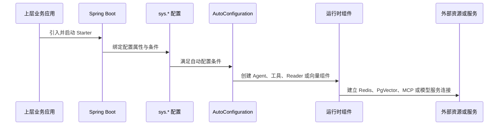

# 项目运行架构文档

> 文档层级：项目级
> 文档状态：基线已建立，待能力域深度建模
> 更新日期：2026-07-13

## 1. 运行时组件

| 组件 | 职责 | 生命周期 | 依赖 | 状态 |
| --- | --- | --- | --- | --- |
| `AgentAutoConfiguration` | 注册 Agent 任务协调组件 | 启动期 | Spring Boot、Redisson | 已验证 |
| `AgentTaskManager` | 管理流式任务并发、停止和中断 | 启动期至关闭期 | Redis/Redisson、Reactor | 已验证 |
| `ReactAgent` | 执行当前 ReAct 多轮调用链 | 单次请求运行期 | Spring AI ChatClient、工具回调 | 已验证 |
| `ToolsAutoConfigurations` 与 `ToolsRegistry` | 初始化工具并注册工具元数据 | 启动期 | Spring Boot、工具提供商 | 已验证 |
| `DocumentReaderFacade` | 汇聚并选择文档读取策略 | 启动期至运行期 | Spring Bean、Reader 策略 | 已验证 |
| `PgVectorStoreAutoConfiguration` | 创建 PgVector 数据源、向量存储工厂和检索服务 | 启动期 | PostgreSQL/PgVector、Spring AI、Hikari | 已验证 |
| 图像生成与多模态组件 | 提供当前图像生成和多模态识别接入 | 条件装配或运行期 | 配置的模型/服务商 | 部分已验证 |

## 2. 初始化链路

图示状态：已根据当前 AutoConfiguration imports、条件配置和组件源码补全。应用级配置来源与优先级缺少样例证据，不在本基线中假定。

## 3. 运行时调用链

| 调用链 | 参与组件 | 触发场景 | 关键约束 | 状态 |
| --- | --- | --- | --- | --- |
| Agent 流式执行 | `BaseAgent`、`AgentTaskManager`、`ReactAgent`、ChatClient、工具回调 | 上层发起 Agent 对话请求 | 同一会话的运行中任务受 Redis 锁控制；当前为参考链路 | 已验证 |
| 工具调用 | `ToolsRegistry`、`ToolProvider`、MCP 工具、`ReactAgent` | Agent 返回工具调用 | 工具执行由当前 ReAct 实现手动管理，并在调用前后执行 Hook | 已验证 |
| RAG 检索 | `PgVectorStoreEmbeddingService`、查询转换器、PgVector | 上层执行知识检索 | 当前链路包含问题压缩/改写、查询扩展、相似度检索和文档去重 | 已验证 |
| 文档读取 | `DocumentReaderFacade`、Reader 策略 | 上层读取待处理文档 | 通过文档类型或策略支持性选择 Reader；后续入库链路需能力域建模 | 已验证 |
| 图像生成/多模态 | 图像生成服务或多模态自动配置 | 上层调用相应 AI 服务 | 当前实现和配置分散，统一契约待建立 | 部分已验证 |

### Agent 当前参考链路

请求进入后，`BaseAgent` 检查会话是否已有运行任务，初始化上下文、会话记忆和流式 sink，再登记任务。`ReactAgent` 构造消息并进行多轮调用；若返回工具调用则执行工具、回填工具结果并继续下一轮，若得到最终答案则输出响应。收尾阶段执行 Hook 并停止任务。该链路是当前实现参考，不是不可变的最终标准。

### RAG 当前参考链路

当前检索服务执行参数校验、问题压缩/改写、查询扩展、基于元数据过滤的 PgVector 相似度检索，并按文档标识去重返回。该链路仅描述已发现的当前实现，不预设未来检索策略。

## 4. 运行风险

| 风险 | 影响 | 建议建模 |
| --- | --- | --- |
| Agent 公共模型与 Spring AI 执行类型耦合 | 后续接入其他框架时可能产生跨模块改造 | Agent 编排、AI 能力接入 |
| Redis/Redisson 是流式任务协调前提 | 未配置或异常时任务并发控制和远程停止不可用 | Agent 编排运行文档 |
| 工具调用缺少已确认的权限、限流、审计与重试规范 | 工具规模扩大后存在安全、成本和稳定性风险 | 工具管理运行文档 |
| PgVector 初始化与数据库资源绑定 | 向量表、维度、索引或连接配置不匹配会影响检索 | RAG 配置与资源文档 |
| 图像生成当前供应商实现受限 | 扩展其他模型服务商需要抽象和迁移 | AI 能力接入文档 |

## 5. 待确认事项

| 编号 | 问题 | 影响 | 建议处理 |
| --- | --- | --- |
| RQ-001 | 上层应用的线程、超时、错误传播和限流约束 | 流式 Agent 与外部工具的运行语义 | 在首个接入应用落地时补充 |
| RQ-002 | 模型服务、MCP 与向量库的健康检查和可观测性方案 | 生产运行与问题定位 | 在部署方案明确后补充 |
| RQ-003 | Plan-Execute 的实施范围和完成标准 | Agent 编排能力承诺 | 完成实现和测试后再更新基线 |
