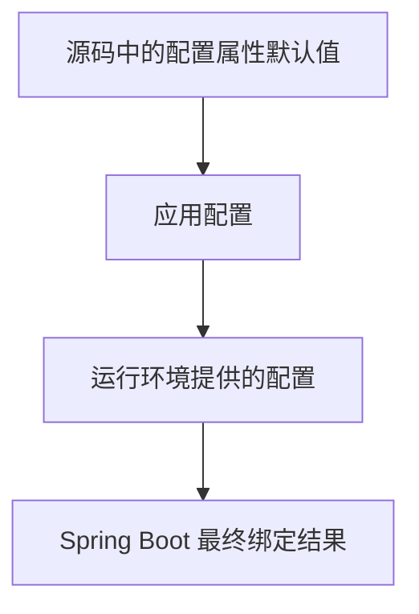

# 项目配置与资源架构文档

> 文档层级：项目级
> 文档状态：基线已建立，待能力域深度建模
> 更新日期：2026-07-13

## 1. 配置与资源架构定位

- 配置架构目标：通过 Spring Boot 配置属性和条件自动配置，按需装配 Agent、工具、RAG 与 AI 服务能力。
- 核心配置主线：`sys.tavily`、`sys.image-generation`、`sys.rag.vector`、`sys.multiple-modal`，以及 Spring AI 与外部基础设施连接配置。
- 当前可信度：配置前缀、字段和已见默认值来自源码；应用实际值、配置中心、环境变量及优先级无样例证据。
- 不在本阶段展开的内容：生产密钥管理、租户隔离、部署拓扑、配置中心策略和具体数据库表结构。

## 2. 核心配置对象

| 配置对象 | 所属能力域 | 含义 | 来源 | 默认值策略 | 风险 |
| --- | --- | --- | --- | --- | --- |
| `sys.tavily` | 工具管理 | Tavily MCP 接入的 API Key、MCP 地址和请求超时 | `TavilyConfigProperties` | 请求超时默认 300 秒；其余以应用配置为准 | 密钥与远程 MCP 可用性 |
| `sys.image-generation` | AI 能力接入 | 图像生成服务的服务商和调用参数 | `ImageGenerationProperties` | 部分字段需由应用提供；当前服务商实现有限 | 服务商锁定与密钥治理 |
| `sys.rag.vector` | RAG | PgVector 连接、向量表、维度、索引和批处理配置 | `VectorConfigProperties` | 默认类型为 PG_VECTOR；默认维度 1024、距离类型 COSINE_DISTANCE、索引 HNSW | 向量维度与模型不匹配，数据库资源不可用 |
| `sys.multiple-modal` | AI 能力接入 | 多模态识别启用开关、模型服务地址和推理参数 | `MultipleModalConfigProperties` | 由 enabled 条件决定装配；温度默认 0.2 | 能力边界尚未统一，模型服务依赖 |
| Spring AI 模型配置 | 横向基础设施 | 当前 Agent、RAG、MCP 等实现所依赖的框架配置 | Maven 依赖与当前实现 | 本仓库未提供完整配置样例 | 框架实现耦合与迁移成本 |

## 3. 运行时资源对象

| 资源对象 | 所属能力域 | 生命周期 | 所有权 | 使用方 | 治理要求 |
| --- | --- | --- | --- | --- | --- |
| Redis/Redisson 任务键与主题 | Agent 编排 | 运行期，任务键当前 TTL 为 30 分钟并定期刷新 | 上层应用基础设施 | `AgentTaskManager` | 明确 Redis 可用性、清理和多实例语义 |
| 流式响应 sink 与订阅 | Agent 编排 | 单次 Agent 请求至完成/中断 | Agent 运行时 | `BaseAgent`、调用方 | 处理取消、异常和资源释放 |
| MCP 客户端连接 | 工具管理 | 工具初始化和调用期 | 工具提供商实现 | Tavily 工具与 Agent | 管理超时、凭证和外部服务可用性 |
| PgVector 数据源与向量表 | RAG | 启动期创建连接池，运行期检索/写入 | 上层应用数据库资源 | PgVector 工厂与检索服务 | 统一连接、维度、索引和表生命周期策略 |
| 模型/AI 服务连接 | AI 能力接入 | 条件装配或调用期 | 上层应用外部服务配置 | 图像生成、多模态、Spring AI 实现 | 密钥、配额、超时与服务商切换治理 |

## 4. 配置优先级

图示状态：部分待确认。源码可验证配置属性和默认值，但仓库未提供应用配置样例或配置中心约定，不能将具体外部来源写成既定标准。

## 5. 配置所有权与变更风险

| 配置或资源 | 事实源 | 允许修改方 | 只读消费方 | 风险 |
| --- | --- | --- | --- | --- |
| `sys.tavily` 凭证和地址 | 应用配置 | 上层应用运维/配置所有者 | 工具自动配置与 Agent | 错误配置导致工具不可用或密钥泄露 |
| 向量数据库连接和索引参数 | 应用配置与 `VectorConfigProperties` | 上层应用数据库/配置所有者 | PgVector 工厂和 RAG 服务 | 变更影响向量兼容性和检索结果 |
| 多模态与图像生成服务参数 | 应用配置与属性类 | 上层应用配置所有者 | AI 能力实现 | 服务商变更可能影响请求/响应兼容性 |
| Redis/Redisson 连接 | 上层应用基础设施配置 | 上层应用基础设施所有者 | `AgentTaskManager` | 影响任务互斥、停止和中断 |

## 6. 治理规则

| 规则 | 适用对象 | 说明 | 状态 |
| --- | --- | --- | --- |
| 配置可信源 | 所有配置对象 | 不从单个样例推断全局配置标准；当前以配置属性源码为事实源 | 已验证 |
| 密钥外置 | API Key、数据库密码、模型服务凭证 | 不在代码或知识基线中记录真实密钥 | 已验证 |
| 框架适配隔离 | Spring AI 与后续框架配置 | 框架专属配置应收敛在适配 Starter，避免渗入上层能力契约 | 已确认 |
| 资源可替换性 | 向量库、模型服务、MCP 工具 | 更换资源前需核验能力契约、数据兼容性和运行链路 | 已确认 |

## 7. 待确认事项

| 编号 | 问题 | 影响 | 建议处理 |
| --- | --- | --- | --- |
| CQ-001 | 配置文件命名、配置中心、环境变量和密钥管理约定 | 全部 Starter 的生产接入 | 接入首个应用时补充配置规范 |
| CQ-002 | PgVector 表创建、迁移、隔离和备份策略 | RAG 数据生命周期 | 建模 RAG 数据与资源治理 |
| CQ-003 | 模型服务商切换、配额、成本和容错策略 | AI 能力接入的可运营性 | 建模 `ai-capability` 后补充 |
