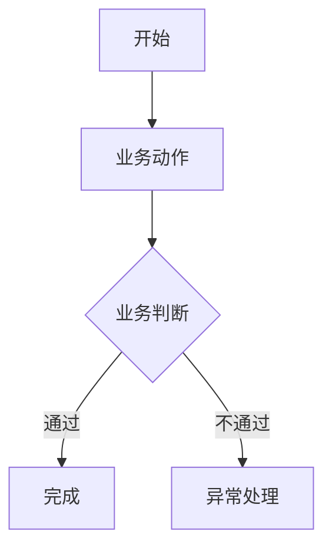
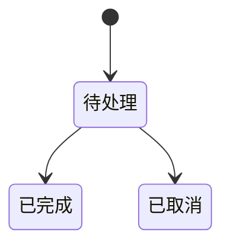

# 业务架构文档模板

## 目录

- [1. 背景与目标](#1-背景与目标)
- [2. 范围边界](#2-范围边界)
- [3. 业务参与方](#3-业务参与方)
- [4. 业务能力视图](#4-业务能力视图)
- [5. 核心业务流程](#5-核心业务流程)
- [6. 业务对象与状态](#6-业务对象与状态)
- [7. 业务规则](#7-业务规则)
- [8. 业务边界与协作](#8-业务边界与协作)
- [9. 假设与待确认事项](#9-假设与待确认事项)
- [10. 验收检查](#10-验收检查)

# 业务架构文档

> 适用范围：<系统、模块或业务域>
> 生成依据：<用户输入、现有文档、代码或待确认>
> 文档状态：<初稿 | 已评审 | 待补充>

## 1. 背景与目标

### 1.1 业务背景

<说明当前业务问题、业务机会、建设动因或现有痛点。>

### 1.2 建设目标

| 目标 | 说明 | 衡量方式 |
| --- | --- | --- |
| <目标名称> | <业务价值或预期效果> | <指标、验收方式或待确认> |

## 2. 范围边界

| 类型 | 内容 |
| --- | --- |
| 范围内 | <本次覆盖的业务域、流程、角色或能力> |
| 范围外 | <明确不覆盖的内容> |
| 待确认 | <影响范围判断的问题> |

## 3. 业务参与方

| 参与方/角色 | 业务职责 | 关键诉求 | 备注 |
| --- | --- | --- | --- |
| <角色名称> | <承担的业务责任> | <效率、合规、体验、收益等诉求> | <待确认> |

## 4. 业务能力视图

| 一级能力 | 二级能力 | 能力说明 | 当前状态 |
| --- | --- | --- | --- |
| <能力名称> | <子能力> | <该能力解决的业务问题> | <已有/新增/待确认> |

## 5. 核心业务流程

| 步骤 | 触发条件 | 执行动作 | 产出 | 异常/分支 |
| --- | --- | --- | --- | --- |
| <步骤> | <触发条件> | <业务动作> | <业务结果或单据> | <异常处理> |

## 6. 业务对象与状态

### 6.1 核心业务对象

| 业务对象 | 定义 | 关键属性 | 关系 |
| --- | --- | --- | --- |
| <对象名称> | <业务含义> | <字段或属性说明> | <与其他对象的关系> |

### 6.2 状态流转

| 对象 | 状态 | 进入条件 | 离开条件 | 备注 |
| --- | --- | --- | --- | --- |
| <对象名称> | <状态名称> | <条件> | <条件> | <待确认> |

## 7. 业务规则

| 编号 | 规则 | 适用场景 | 来源 | 状态 |
| --- | --- | --- | --- | --- |
| BR-001 | <规则描述> | <流程或对象> | <用户输入、现有系统或待确认> | <已确认/待确认> |

## 8. 业务边界与协作

| 边界对象 | 协作方 | 输入 | 输出 | 业务约束 |
| --- | --- | --- | --- | --- |
| <本系统、模块或业务域> | <外部系统、团队或角色> | <输入信息> | <输出信息> | <时效、合规、权限、口径等约束> |

## 9. 假设与待确认事项

### 9.1 关键假设

| 假设 | 影响 | 验证方式 |
| --- | --- | --- |
| <假设内容> | <对范围、流程、成本或排期的影响> | <如何确认> |

### 9.2 待确认事项

| 编号 | 问题 | 影响范围 | 建议确认人 |
| --- | --- | --- | --- |
| Q-001 | <问题描述> | <影响的能力、流程或规则> | <角色或团队> |

## 10. 验收检查

- [ ] 业务目标与范围边界已明确。
- [ ] 参与方、业务职责和关键诉求已明确。
- [ ] 核心业务流程、异常分支和产出物已描述。
- [ ] 核心业务对象、关系和状态流转已描述。
- [ ] 业务规则有来源和确认状态。
- [ ] 外部协作边界、输入输出和约束已描述。
- [ ] 假设和待确认事项已单独列出。
