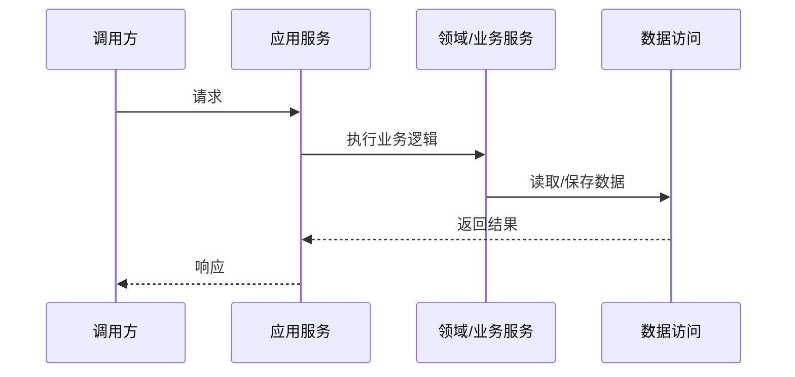

# 技术架构文档模板

## 目录

- [1. 架构目标](#1-架构目标)
- [2. 总体架构](#2-总体架构)
- [3. 模块划分](#3-模块划分)
- [4. 分层与职责](#4-分层与职责)
- [5. 核心技术流程](#5-核心技术流程)
- [6. 接口与集成](#6-接口与集成)
- [7. 非功能设计](#7-非功能设计)
- [8. 风险与待确认事项](#8-风险与待确认事项)
- [9. 验收检查](#9-验收检查)

# 技术架构文档

> 适用范围：<系统、模块或服务>
> 生成依据：<业务架构、需求文档、现有代码或待确认>
> 文档状态：<初稿 | 已评审 | 待补充>

## 1. 架构目标

| 目标 | 说明 | 约束 |
| --- | --- | --- |
| <目标> | <技术上要达成的结果> | <性能、安全、成本、交付等约束> |

## 2. 总体架构

| 架构单元 | 职责 | 关键约束 |
| --- | --- | --- |
| <单元名称> | <职责说明> | <技术或业务约束> |

## 3. 模块划分

| 模块 | 职责 | 依赖 | 备注 |
| --- | --- | --- | --- |
| <模块名称> | <核心职责> | <依赖模块或外部服务> | <待确认> |

## 4. 分层与职责

| 层级 | 职责 | 约束 |
| --- | --- | --- |
| 接入层 | <API、页面、消息入口> | <参数校验、鉴权、协议转换> |
| 应用层 | <用例编排、事务边界> | <不承载复杂业务规则> |
| 领域/业务层 | <核心业务规则> | <避免依赖基础设施细节> |
| 基础设施层 | <数据库、缓存、外部接口> | <隔离技术实现> |

## 5. 核心技术流程

| 步骤 | 组件 | 动作 | 输入 | 输出 | 异常处理 |
| --- | --- | --- | --- | --- | --- |
| <步骤> | <组件> | <技术动作> | <输入> | <输出> | <异常策略> |

## 6. 接口与集成

| 接口/集成点 | 调用方 | 提供方 | 协议 | 关键约束 |
| --- | --- | --- | --- | --- |
| <接口> | <调用方> | <提供方> | <HTTP/MQ/RPC/待确认> | <鉴权、幂等、超时、重试> |

## 7. 非功能设计

| 类型 | 要求 | 设计策略 | 状态 |
| --- | --- | --- | --- |
| 性能 | <指标> | <缓存、异步、分页等> | <待确认> |
| 安全 | <要求> | <鉴权、脱敏、审计等> | <待确认> |
| 可用性 | <要求> | <降级、重试、监控等> | <待确认> |
| 可维护性 | <要求> | <模块边界、日志、测试等> | <待确认> |

## 8. 风险与待确认事项

| 编号 | 风险/问题 | 影响 | 处理建议 |
| --- | --- | --- | --- |
| TQ-001 | <问题> | <影响范围> | <建议> |

## 9. 验收检查

- [ ] 架构目标和关键约束已明确。
- [ ] 总体架构、模块划分和依赖方向已描述。
- [ ] 分层职责和边界已描述。
- [ ] 核心技术流程、接口集成和异常策略已描述。
- [ ] 非功能要求有对应设计策略。
- [ ] 风险和待确认事项已单独列出。
