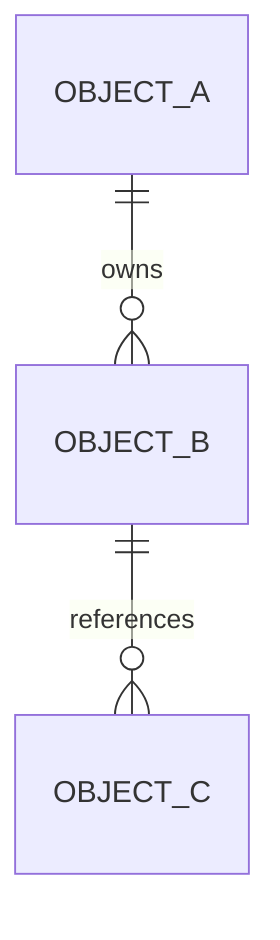
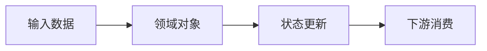

# <领域中文名>数据文档

> 文档层级：领域级
> 领域名称：<领域中文名>
> 领域标识：<domain-slug>
> 文档状态：初稿 | 已评审 | 待补充
> 更新日期：

## 1. 数据职责边界

- 本领域拥有的数据：
- 外部引用数据：
- 不归属本领域的数据：
- 数据一致性边界：

## 2. 业务对象生命周期

| 业务对象 | 产生场景 | 关键状态/字段语义 | 更新场景 | 消费场景 | 终态/归档 | 状态 |
| --- | --- | --- | --- | --- | --- | --- |
| <对象> | BS-xxx | <状态/字段含义> | <更新时机> | <消费方> | <终态> | 已验证/待确认 |

## 3. 数据关系 ER 图

图示状态：已根据事实补全 | 部分待确认 | 不适用，原因：

## 4. 业务能力变体数据差异

| 业务能力 | 业务变体 | 主数据对象 | 变体特有数据 | 状态/字段映射差异 | 外部标识/流水 | 一致性风险 | 状态 |
| --- | --- | --- | --- | --- | --- | --- | --- |
| <能力> | <变体> | <对象> | <字段/扩展对象> | <映射> | <流水/外部编号> | <风险> | 已验证/待确认 |

## 5. 数据流转

图示状态：已根据事实补全 | 部分待确认 | 不适用，原因：

## 6. SQL/DDL 参考

| 数据库/服务 | 业务模型 | 参考来源 | 数据表 | 处理状态 |
| --- | --- | --- | --- | --- |
| <database/service> | <model> | MCP/已有 SQL/Mapper 仅参考/待确认 | <table> | 已验证/待确认 |

## 7. 数据质量与治理

| 治理项 | 规则 | 适用对象 | 状态 |
| --- | --- | --- | --- |
| 状态一致性 | <规则> | <对象> | 已验证/待确认 |
| 幂等数据 | <规则> | <对象> | 已验证/待确认 |
| 外部流水 | <规则> | <对象> | 已验证/待确认 |

## 8. 待确认事项

| 编号 | 类型 | 问题 | 影响 | 建议处理 |
| --- | --- | --- | --- | --- |
| DQ-001 | 数据/DDL/字段语义 | <问题> | <影响> | <建议> |

