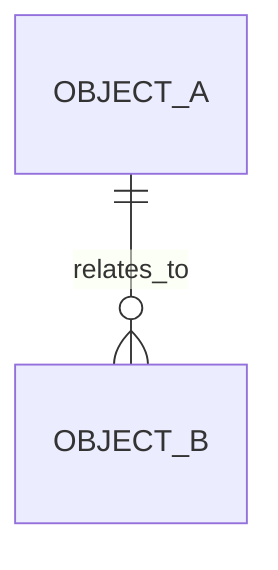

# 数据架构文档模板

## 目录

- [1. 数据架构目标](#1-数据架构目标)
- [2. 核心数据域](#2-核心数据域)
- [3. 核心数据对象](#3-核心数据对象)
- [4. 数据关系](#4-数据关系)
- [5. 数据模型与 SQL 索引](#5-数据模型与-sql-索引)
- [6. 数据流转](#6-数据流转)
- [7. 数据质量与治理](#7-数据质量与治理)
- [8. 指标口径](#8-指标口径)
- [9. 风险与待确认事项](#9-风险与待确认事项)
- [10. 验收检查](#10-验收检查)

# 数据架构文档

> 适用范围：<系统、模块或业务域>
> 生成依据：<业务架构、技术架构、数据库结构、代码或待确认>
> 文档状态：<初稿 | 已评审 | 待补充>

## 1. 数据架构目标

| 目标 | 说明 | 衡量方式 |
| --- | --- | --- |
| <目标> | <数据一致性、可追踪、可分析等目标> | <指标、验收方式或待确认> |

## 2. 核心数据域

| 数据域 | 说明 | 主要数据对象 | 负责人 |
| --- | --- | --- | --- |
| <数据域> | <业务含义> | <对象列表> | <待确认> |

## 3. 核心数据对象

| 数据对象 | 定义 | 主键/唯一标识 | 生命周期 |
| --- | --- | --- | --- |
| <对象> | <业务定义> | <标识> | <创建、变更、归档规则> |

## 4. 数据关系

## 5. 数据模型与 SQL 索引

| 数据库/服务 | 业务模型 | 数据表 | 对应业务对象 | 关键字段 | SQL 文件 | 状态 | 说明 |
| --- | --- | --- | --- | --- | --- | --- | --- |
| <database_or_service> | <business_model> | <table_name> | <业务对象> | <字段> | `.specify/sql/<database_or_service>/<business_model>.sql` | <已确认/推断/待确认> | <含义或约束> |

## 6. 数据流转

| 场景编号 | 数据产生 | 处理/校验 | 持久化 | 消费方 | 风险 |
| --- | --- | --- | --- | --- | --- |
| BS-001 | <来源> | <处理> | <表/对象> | <消费> | <风险> |

## 7. 数据质量与治理

| 治理项 | 规则 | 证据 | 待确认 |
| --- | --- | --- | --- |
| <治理项> | <规则> | <证据> | <待确认> |

## 8. 指标口径

| 指标 | 定义 | 计算方式 | 使用场景 | 状态 |
| --- | --- | --- | --- | --- |
| <指标> | <定义> | <计算方式> | <场景> | <待确认> |

## 9. 风险与待确认事项

| 编号 | 风险 | 影响 | 建议处理 |
| --- | --- | --- | --- |
| DQ-001 | <风险> | <影响> | <处理方式> |

## 10. 验收检查

- [ ] 每个核心数据对象能追溯到来源证据。
- [ ] 每个 SQL 文件只描述一个数据库/服务内的内聚业务模型。
- [ ] 证据不足的字段、类型、索引、约束或关系已标记 `推断` 或 `待确认`。
