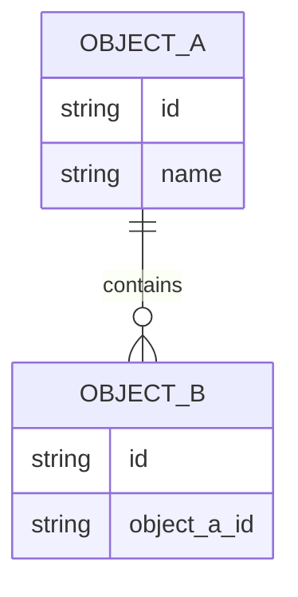

# 数据架构文档模板

## 目录

- [1. 数据架构目标](#1-数据架构目标)
- [2. 核心数据域](#2-核心数据域)
- [3. 核心数据对象](#3-核心数据对象)
- [4. 数据关系](#4-数据关系)
- [5. 数据模型与DDL索引](#5-数据模型与ddl索引)
- [6. 数据流转](#6-数据流转)
- [7. 数据质量与治理](#7-数据质量与治理)
- [8. 指标口径](#8-指标口径)
- [9. 风险与待确认事项](#9-风险与待确认事项)
- [10. 验收检查](#10-验收检查)

# 数据架构文档

> 适用范围：<系统、模块或业务域>
> 生成依据：<业务架构、技术架构、数据库结构、代码或待确认>
> 文档状态：<初稿 | 已评审 | 待补充>

## 1. 数据架构目标

| 目标 | 说明 | 衡量方式 |
| --- | --- | --- |
| <目标> | <数据一致性、可追踪、可分析等目标> | <指标、验收方式或待确认> |

## 2. 核心数据域

| 数据域 | 说明 | 主要数据对象 | 负责人 |
| --- | --- | --- | --- |
| <数据域> | <业务含义> | <对象列表> | <待确认> |

## 3. 核心数据对象

| 数据对象 | 定义 | 主键/唯一标识 | 生命周期 |
| --- | --- | --- | --- |
| <对象> | <业务定义> | <标识> | <创建、变更、归档规则> |

## 4. 数据关系

## 5. 数据模型与DDL索引

| 数据库/服务 | 业务模型 | 数据表 | 对应业务对象 | 关键字段 | DDL文件 | 状态 | 说明 |
| --- | --- | --- | --- | --- | --- | --- | --- |
| <database_or_service> | <business_model> | <table_name> | <业务对象> | <字段> | `.specify/sql/<database_or_service>/<business_model>.sql` | <已确认/推断/待确认> | <含义或约束> |

DDL 规则：

- SQL 文件按“数据库/服务 + 业务模型”归档，统一存放在 `.specify/sql/` 下。
- 同一数据库/服务内强业务耦合的多张表可以放入同一个业务模型 SQL 文件。
- 同一业务域若拆分到不同数据库、服务库或物理数据源，必须拆分为不同 SQL 文件。
- 目录名和文件名使用 lowercase snake_case，并尽量与数据库/服务名和业务模型名一致。
- 若缺少足够事实，不生成臆测 DDL；在本节标记为 `待确认`。

## 6. 数据流转

| 阶段 | 数据来源 | 处理动作 | 数据去向 | 约束 |
| --- | --- | --- | --- | --- |
| <阶段> | <来源> | <清洗、校验、转换、汇总> | <去向> | <一致性、时效、权限> |

## 7. 数据质量与治理

| 主题 | 规则 | 检查方式 | 负责人 |
| --- | --- | --- | --- |
| 完整性 | <必填、关联完整等> | <校验方式> | <待确认> |
| 一致性 | <跨表或跨系统一致> | <对账或约束> | <待确认> |
| 安全性 | <敏感字段、访问权限> | <脱敏或审计> | <待确认> |

## 8. 指标口径

| 指标 | 定义 | 计算方式 | 使用场景 | 状态 |
| --- | --- | --- | --- | --- |
| <指标> | <业务定义> | <公式或规则> | <报表、流程或考核> | <已确认/待确认> |

## 9. 风险与待确认事项

| 编号 | 问题/风险 | 影响范围 | 建议处理 |
| --- | --- | --- | --- |
| DQ-001 | <问题> | <数据域、对象或流程> | <建议> |

## 10. 验收检查

- [ ] 数据目标和适用范围已明确。
- [ ] 核心数据域、数据对象和生命周期已描述。
- [ ] 数据关系和数据模型已描述。
- [ ] 已确认的数据库/服务 + 业务模型均已索引到 `.specify/sql/**/*.sql`。
- [ ] 每个 SQL 文件只描述一个数据库/服务内的内聚业务模型。
- [ ] 跨数据库、跨服务库或跨物理数据源的表没有合并到同一个 SQL 文件。
- [ ] 数据来源、处理、存储和消费链路已描述。
- [ ] 数据质量、安全和治理规则已描述。
- [ ] 指标口径有定义、计算方式和确认状态。
- [ ] 风险和待确认事项已单独列出。
