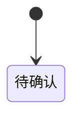

# <中文领域名>业务架构

> 领域名称：<中文领域名，如订单域>
> 领域标识：<domain-slug，如 order>
> 文档状态：初稿 | 已评审 | 待补充
> 更新日期：YYYY-MM-DD

## 1. 领域职责

- 领域目标：
- 领域边界：
- 不负责事项：
- 上游/下游协作：
- 可信度说明：

## 2. 领域识别依据

| 识别项 | 候选结论 | 证据依据 | 状态 | 待确认点 |
| --- | --- | --- | --- | --- |
| 领域边界 | <边界说明> | <用户输入/正式文档/代码事实/测试验证/接口契约> | 已验证/待确认 | <无/待确认问题> |
| 核心场景 | <场景摘要> | <证据> | 已验证/待确认 | <无/待确认问题> |
| 关键规则 | <规则摘要> | <证据> | 已验证/待确认 | <无/待确认问题> |

## 3. 核心业务对象

| 对象 | 定义 | 生命周期 | 关键状态 | 状态 |
| --- | --- | --- | --- | --- |
| <业务对象> | <定义> | <生命周期> | <状态> | 已验证/待确认 |

## 4. 核心业务场景

| 场景编号 | 场景名称 | 触发条件 | 参与方 | 输出 | 状态 |
| --- | --- | --- | --- | --- | --- |
| BS-<DOMAIN>-001 | <场景名称> | <触发条件> | <参与方> | <输出结果> | 已验证/待确认 |

## 5. 场景规则编排

| 场景编号 | 顺序 | 规则 | 判断条件 | 输出/状态变化 | 异常处理 | 来源 |
| --- | --- | --- | --- | --- | --- | --- |
| BS-<DOMAIN>-001 | 1 | <规则> | <条件> | <结果> | <失败处理> | <用户/代码/文档/待确认> |

## 6. 状态流转

图示状态：不适用，原因 | 已根据事实补全 | 部分节点待确认

## 7. 领域内待确认事项

| 编号 | 问题 | 影响 | 当前候选答案 | 建议处理 |
| --- | --- | --- | --- | --- |
| BQ-001 | <问题> | <影响> | <候选答案或无> | <处理方式> |
