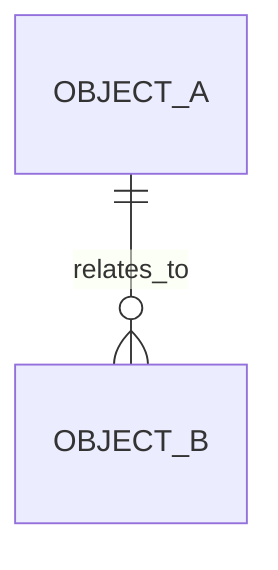

# <中文领域名>数据架构

> 领域名称：<中文领域名，如订单域>
> 领域标识：<domain-slug，如 order>
> 文档状态：初稿 | 已评审 | 待补充
> 更新日期：YYYY-MM-DD

## 1. 数据职责边界

- 领域数据对象：
- 外部引用数据：
- 不归属本领域的数据：
- 数据一致性边界：

## 2. 数据对象

| 数据对象 | 业务含义 | 生命周期 | SQL/DDL 参考 | 状态 |
| --- | --- | --- | --- | --- |
| <数据对象> | <业务含义> | <生命周期> | <已有 SQL 路径/真实 DDL 已核对不落盘/待确认/无> | 已验证/待确认 |

## 3. 数据关系

图示状态：不适用，原因 | 已根据事实补全 | 部分节点待确认

## 4. SQL/DDL 参考索引

| 数据库/服务 | 业务模型 | 参考来源 | 数据表 | 处理状态 |
| --- | --- | --- | --- | --- |
| <database_or_service> | <business_model> | <已有 SQL 路径/真实 DDL 已核对不落盘/待确认/无> | <table_names> | 已验证/待确认 |

## 5. 数据流转

| 场景编号 | 产生数据 | 变更数据 | 消费方 | 一致性要求 | 风险 |
| --- | --- | --- | --- | --- | --- |
| BS-<DOMAIN>-001 | <来源> | <对象/状态/字段> | <消费方> | <强一致/最终一致/待确认> | <风险> |

## 6. 数据质量与治理

| 治理项 | 规则 | 适用对象 | 状态 |
| --- | --- | --- | --- |
| <治理项> | <规则> | <对象> | 已验证/待确认 |

## 7. 领域内待确认事项

| 编号 | 问题 | 影响 | 建议处理 |
| --- | --- | --- | --- |
| DQ-001 | <问题> | <影响> | <处理方式> |
