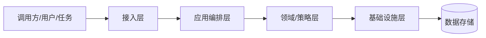
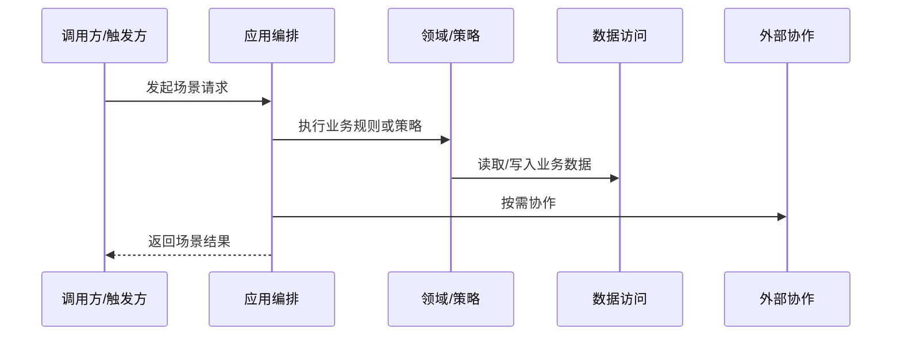

# 技术架构文档模板

## 目录

- [1. 架构目标](#1-架构目标)
- [2. 总体架构](#2-总体架构)
- [3. 模块划分](#3-模块划分)
- [4. 分层与职责](#4-分层与职责)
- [5. 核心技术流程与场景落地](#5-核心技术流程与场景落地)
- [6. 接口与集成](#6-接口与集成)
- [7. 非功能设计](#7-非功能设计)
- [8. 风险与待确认事项](#8-风险与待确认事项)
- [9. 验收检查](#9-验收检查)

# 技术架构文档

> 适用范围：<系统、模块或服务>
> 生成依据：<业务架构、需求文档、现有代码或待确认>
> 文档状态：<初稿 | 已评审 | 待补充>

## 1. 架构目标

| 目标 | 说明 | 约束 |
| --- | --- | --- |
| <目标> | <技术上要达成的结果> | <性能、安全、成本、交付等约束> |

## 2. 总体架构

## 3. 模块划分

| 模块 | 职责 | 依赖 | 备注 |
| --- | --- | --- | --- |
| <模块名称> | <核心职责> | <依赖模块或外部服务> | <待确认> |

## 4. 分层与职责

| 层级 | 职责 | 约束 |
| --- | --- | --- |
| 接入层 | <API、页面、消息、任务入口> | <参数校验、鉴权、协议转换> |
| 应用编排层 | <用例编排、事务边界、外部协作> | <不堆积复杂业务规则> |
| 领域/策略层 | <核心业务规则、状态流转、策略决策> | <避免依赖基础设施细节> |
| 基础设施层 | <数据库、缓存、外部接口、消息、文件> | <隔离技术实现> |

## 5. 核心技术流程与场景落地

> 技术文档是业务文档的落地说明。业务架构中每个核心场景都应在本节有落地行；场景名称必须来自业务架构，不从模板或示例硬编码。

### 5.1 业务场景到技术落地映射

| 场景编号 | 业务场景 | 入口/API/消息/任务 | 应用编排 | 领域行为/领域服务 | 策略/规则组件 | 数据访问/SQL | 外部协作 | 事务边界 | 异常路径 | 验证方式 | 状态 |
| --- | --- | --- | --- | --- | --- | --- | --- | --- | --- | --- | --- |
| BS-001 | <业务架构中的场景> | <入口> | <应用服务/用例> | <领域对象/领域方法> | <策略类/规则表/配置> | <Repository/Mapper/.specify/sql> | <外部系统> | <边界> | <异常/补偿> | <测试/手动> | <已确认/推断/待确认> |

### 5.2 场景级技术时序或流程

> 有足够事实时，为重要场景单独给出 Mermaid 图。事实不足时写 `待确认` 原因，不使用一个泛化图替代所有场景。

#### BS-001 <业务场景名称> 技术时序

### 5.3 事务、一致性与异常

| 场景编号 | 事务边界 | 一致性要求 | 幂等/去重 | 失败处理 | 证据状态 |
| --- | --- | --- | --- | --- | --- |
| BS-001 | <方法/服务/消息> | <强一致/最终一致/待确认> | <幂等键或规则> | <重试/补偿/人工处理> | <已确认/推断/待确认> |

## 6. 接口与集成

| 接口/集成点 | 调用方 | 提供方 | 协议 | 关键约束 |
| --- | --- | --- | --- | --- |
| <接口> | <调用方> | <提供方> | <协议> | <约束> |

## 7. 非功能设计

| 类型 | 当前事实 | 风险/待确认 |
| --- | --- | --- |
| 性能 | <事实> | <待确认> |
| 可用性 | <事实> | <待确认> |
| 安全 | <事实> | <待确认> |
| 可测试性 | <事实> | <待确认> |

## 8. 风险与待确认事项

| 编号 | 风险 | 影响 | 建议处理 |
| --- | --- | --- | --- |
| TQ-001 | <风险> | <影响> | <处理方式> |

## 9. 验收检查

- [ ] 业务架构中的核心场景均有技术落地行，或明确 `待确认` 原因。
- [ ] 关键业务规则、策略设计、接口集成、异常策略、事务边界和一致性要求已按场景描述。
- [ ] 重要场景使用场景级 Mermaid 图或明确不画图原因。
