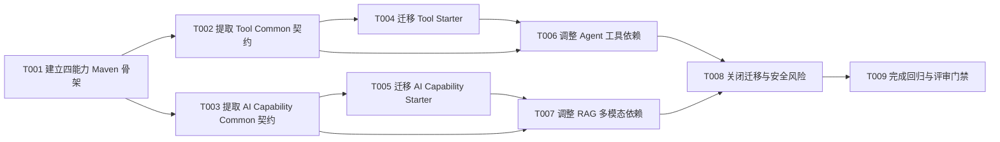

# 四能力模块拆分任务规划

> 功能标识：`four-capability-module-split`
> SDD 等级：`S2`
> 来源需求：`spec/features/20260713/四能力模块拆分-需求说明书.md`
> 来源技术设计：`spec/features/20260713/四能力模块拆分-技术设计说明书.md`
> 文档状态：completed
> 创建日期：2026-07-13
> 更新日期：2026-07-13

## 1. 任务概览

- 总任务数：9。
- 核心路径：T001 -> T002/T003 -> T004/T005 -> T006/T007 -> T008 -> T009。
- 风险任务：T008、T009，负责破坏性命名迁移、安全检查、依赖闭环、完整回归和评审门禁。
- 阻塞任务：无。
- 可并行分组：T002 与 T003 可并行；T004 与 T005 可并行；T006 与 T007 在各自前置任务完成后可并行。
- Mock/临时实现闭环：无；测试替身只用于隔离外部模型和工具，不作为生产实现。
- 可运行服务闭环：无，本项目交付库/Starter，不新增独立启动入口；以最小 Spring 上下文装配测试完成运行配置和启动验证。
- DDL/数据结构任务：无。
- 运行初始化 DML/Seed 任务：无，不涉及初始化数据脚本、执行状态或只读复核。
- 数据设计与治理任务：T008 负责配置敏感信息和日志脱敏验证；不涉及业务字段映射或持久化数据。
- 页面/交互型交付物设计确认：不适用，本需求没有 UI、页面或交互型交付物。
- 长期知识影响：需要在实现验证后更新项目架构与配置知识，但本任务规划不创建知识同步任务。

### 1.1 任务依赖图

## 2. 实现确认门禁

- 状态：已确认并执行。
- 规划产物不等于实现授权。
- 生成本任务规划文档后必须暂停，等待用户确认后才能进入代码实现。
- 用户确认执行且未指定任务 ID 时，默认执行全部未完成任务。
- 用户指定任务 ID 时，例如 `执行 T001,T002`，只执行指定任务。
- 不明确指令，例如“看看”“下一步是什么”“继续看”，不得视为实现确认。

## 3. 任务列表

- [x] T001 建立四能力 Maven 模块骨架
  - 通俗解释: 完成后项目具备 Agent、Tool、RAG、AI Capability 四个清晰的构建入口，为后续代码迁移提供稳定目录和依赖基础。
  - AC: AC-001, AC-005, AC-006
  - 来源: 技术设计说明书 §1.2、§2、§5.1、D-001、D-002
  - Files: pom.xml; fons4ai-agent/pom.xml; fons4ai-rag/pom.xml; fons4ai-tool/pom.xml; fons4ai-tool/fons4ai-tool-common/pom.xml; fons4ai-tool/fons4ai-tool-spring-ai-starter/pom.xml; fons4ai-ai-capability/pom.xml; fons4ai-ai-capability/fons4ai-ai-capability-common/pom.xml; fons4ai-ai-capability/fons4ai-ai-capability-spring-ai-starter/pom.xml
  - Depends: 无
  - Verification: 给定新增模块尚无业务实现，先执行 Maven Reactor 校验并观察新模块缺失或依赖未配置的失败信号；补齐聚合、Java 21/UTF-8 属性和最小依赖后，执行 `mvn -DskipTests validate`，确认四个聚合模块和 8 个叶子模块均进入 Reactor 且无循环或重复坐标。
  - Quality: 遵循 DDD-lite 能力边界；只新增设计确认的模块，不引入新框架，不让 Common 反向依赖 Starter，不修改无关依赖版本。
  - 专业工作流: 无
  - Done: 根 Reactor 能识别目标模块树，所有新增 POM 可解析，Agent/RAG 原顶层坐标保持不变。

- [x] T002 [P] 提取 Tool Common 公共契约
  - 通俗解释: 完成后工具定义、分类、Provider、结果解析和查询能力独立于 Agent 与 Spring AI，可以被不同执行引擎复用。
  - AC: AC-001, AC-002, AC-004, AC-005
  - 来源: 技术设计说明书 §3.1、§3.2、§5.2、D-003
  - Files: fons4ai-tool/fons4ai-tool-common/src/main/java/com/fons/cloud/ai/tool/constants/ToolCategory.java; fons4ai-tool/fons4ai-tool-common/src/main/java/com/fons/cloud/ai/tool/model/ToolMeta.java; fons4ai-tool/fons4ai-tool-common/src/main/java/com/fons/cloud/ai/tool/model/WebToolResult.java; fons4ai-tool/fons4ai-tool-common/src/main/java/com/fons/cloud/ai/tool/model/WebSearchResult.java; fons4ai-tool/fons4ai-tool-common/src/main/java/com/fons/cloud/ai/tool/model/WebExtractResult.java; fons4ai-tool/fons4ai-tool-common/src/main/java/com/fons/cloud/ai/tool/spi/ToolProvider.java; fons4ai-tool/fons4ai-tool-common/src/main/java/com/fons/cloud/ai/tool/spi/ToolResultParser.java; fons4ai-tool/fons4ai-tool-common/src/main/java/com/fons/cloud/ai/tool/registry/ToolRegistry.java; fons4ai-tool/fons4ai-tool-common/src/test/java/com/fons/cloud/ai/tool
  - Depends: T001
  - Verification: 先编写引用目标包和 `ToolRegistry` 签名的契约测试，使其因目标类型不存在而失败；迁移类型并补齐框架无关查询契约后运行 Tool Common 测试，断言 ToolMeta 分类辅助方法、未知元数据和 Provider/Parser 泛型签名保持现有语义，同时确认源码中不导入 Spring AI 类型。
  - Quality: 使用 DDD-lite 的能力契约与 SPI 边界；公共类、接口、方法和关键字段补充中文注释；不通过 JSON 或无界 Map 替代类型化模型；不修复与迁移无关的工具业务逻辑。
  - 专业工作流: 无
  - Done: Tool Common 独立编译测试通过，公共契约位于 `com.fons.cloud.ai.tool`，且不依赖 Agent、RAG、AI Capability 或 Spring AI。

- [x] T003 [P] 提取 AI Capability Common 公共契约
  - 通俗解释: 完成后图像生成和图片识别具备独立、框架无关的调用入口，Agent 与 RAG 不再拥有模型能力实现。
  - AC: AC-001, AC-002, AC-004, AC-005
  - 来源: 技术设计说明书 §3.1、§3.2、§5.3、D-003、D-006
  - Files: fons4ai-ai-capability/fons4ai-ai-capability-common/src/main/java/com/fons/cloud/ai/capability/image/ImageGenProvider.java; fons4ai-ai-capability/fons4ai-ai-capability-common/src/main/java/com/fons/cloud/ai/capability/image/ImageGenerationService.java; fons4ai-ai-capability/fons4ai-ai-capability-common/src/main/java/com/fons/cloud/ai/capability/multimodal/ImageRecognitionService.java; fons4ai-ai-capability/fons4ai-ai-capability-common/src/main/java/com/fons/cloud/ai/capability/constants/AiCapabilityResultCode.java; fons4ai-ai-capability/fons4ai-ai-capability-common/src/test/java/com/fons/cloud/ai/capability
  - Depends: T001
  - Verification: 先编写使用图片生成和识别目标接口的契约测试，使其因目标接口不存在而失败；补齐接口、Provider 和错误码归属后运行 AI Capability Common 测试，确认接口不暴露 Spring AI 类型，且迁移的图片生成和多模态错误码字符串与原值一致。
  - Quality: 使用 DDD-lite Port/Adapter 边界；能力接口只表达输入、输出和失败语义；不在 Common 放配置绑定、HTTP 客户端、模型实现或供应商 SDK；敏感字段不进入公共结果对象。
  - 专业工作流: 无
  - Done: AI Capability Common 独立编译测试通过，提供稳定的图像生成与识别契约，且无 Agent、RAG 或 Spring AI 依赖。

- [x] T004 [P] 迁移 Tool Spring AI Starter
  - 通俗解释: 完成后工具注册、Tavily 和 MCP 相关能力由独立 Tool Starter 装配，配置使用新的 `sys.tool.*` 分组。
  - AC: AC-001, AC-002, AC-003, AC-004, AC-005
  - 来源: 技术设计说明书 §3.2、§3.3、§5.2、§5.4
  - Files: fons4ai-tool/fons4ai-tool-spring-ai-starter/src/main/java/com/fons/cloud/ai/tool; fons4ai-tool/fons4ai-tool-spring-ai-starter/src/main/resources/META-INF/spring/org.springframework.boot.autoconfigure.AutoConfiguration.imports; fons4ai-tool/fons4ai-tool-spring-ai-starter/src/test/java/com/fons/cloud/ai/tool; fons4ai-agent/fons4ai-agent-spring-ai-starter/src/main/java/com/fons/cloud/ai/agent/infrastructure/tools; fons4ai-agent/fons4ai-agent-spring-ai-starter/src/main/java/com/fons/cloud/ai/agent/infrastructure/config/ToolsAutoConfigurations.java
  - Depends: T002
  - Verification: 先添加 Tool Starter 测试，证明目标自动配置、`sys.tool.tavily` 绑定、Provider 分类和结果解析在迁移前失败；迁移注册中心、Tavily 配置、Provider 和解析器后运行测试，断言新键可绑定、旧 `sys.tavily` 不绑定，工具名称分类和解析结果与迁移前一致，且 imports 只登记 Tool 自动配置。
  - Quality: 按 DDD-lite 能力边界由 Tool Starter 实现 Tool Common 契约；Spring AI `ToolCallback` 只留在适配层；API Key 配置类不得生成敏感 `toString`；日志执行脱敏；不新增真实网络测试和未经设计的 Provider。
  - 专业工作流: 无
  - Done: Tool Starter 独立装配测试通过，Agent 源目录不再保留 Tool 实现和 Tool 自动配置，旧配置键无兼容绑定。

- [x] T005 [P] 迁移 AI Capability Spring AI Starter
  - 通俗解释: 完成后图像生成和多模态识别由独立 AI Capability Starter 提供，并统一使用 `sys.ai.*` 配置。
  - AC: AC-001, AC-002, AC-003, AC-004, AC-005
  - 来源: 技术设计说明书 §3.2、§3.3、§5.3、§5.4
  - Files: fons4ai-ai-capability/fons4ai-ai-capability-spring-ai-starter/src/main/java/com/fons/cloud/ai/capability; fons4ai-ai-capability/fons4ai-ai-capability-spring-ai-starter/src/main/resources/META-INF/spring/org.springframework.boot.autoconfigure.AutoConfiguration.imports; fons4ai-ai-capability/fons4ai-ai-capability-spring-ai-starter/src/test/java/com/fons/cloud/ai/capability; fons4ai-agent/fons4ai-agent-spring-ai-starter/src/main/java/com/fons/cloud/ai/agent/infrastructure/config/ImageGenerationConfiguration.java; fons4ai-agent/fons4ai-agent-spring-ai-starter/src/main/java/com/fons/cloud/ai/agent/infrastructure/config/ImageGenerationProperties.java; fons4ai-agent/fons4ai-agent-spring-ai-starter/src/main/java/com/fons/cloud/ai/agent/infrastructure/service/ImageGenerationService.java; fons4ai-rag/fons4ai-rag-common/src/main/java/com/fons/cloud/ai/rag/config/MultipleModalConfigProperties.java; fons4ai-rag/fons4ai-rag-spring-ai-starter/src/main/java/com/fons/cloud/ai/rag/infrastructure/multiplemodal; fons4ai-rag/fons4ai-rag-spring-ai-starter/src/main/java/com/fons/cloud/ai/rag/infrastructure/config/MultipleModalAutoConfiguration.java
  - Depends: T003
  - Verification: 先添加新配置绑定和自动配置测试，证明 `sys.ai.image-generation`、`sys.ai.multimodal` 及目标服务 Bean 在迁移前不可用；迁移实现后使用本地替身而非真实外部网络验证图像生成请求/响应解析，验证多模态条件装配和空图片失败路径，断言旧 `sys.image-generation`、`sys.multiple-modal` 不再绑定，并确认现有提示词、模型参数和错误码字符串未改变。
  - Quality: 按 DDD-lite Port/Adapter 边界由 AI Capability Starter 实现 Common Port；供应商和 Spring AI 类型不泄露到 Common；配置中的 API Key 不参与 `toString` 或日志；复用 JDK HTTP 与现有 JSON 工具，不引入新客户端框架；保留现有供应商逻辑，不扩展功能。
  - 专业工作流: 无
  - Done: AI Capability Starter 独立装配和聚焦测试通过，Agent/RAG 源目录不再保留图像生成或多模态实现，旧配置键无兼容绑定。

- [x] T006 [P] 调整 Agent 对工具能力的依赖
  - 通俗解释: 完成后 Agent 仍能执行现有 Web Search 流程，但只依赖工具公共契约，不再拥有或直接依赖工具实现。
  - AC: AC-002, AC-004, AC-005, AC-006
  - 来源: 技术设计说明书 §2、§3.1、§5.2、D-003
  - Files: fons4ai-agent/fons4ai-agent-common/pom.xml; fons4ai-agent/fons4ai-agent-spring-ai-starter/pom.xml; fons4ai-agent/fons4ai-agent-common/src/main/java/com/fons/cloud/ai/agent/constants/ToolCategory.java; fons4ai-agent/fons4ai-agent-common/src/main/java/com/fons/cloud/ai/agent/infrastructure/tool; fons4ai-agent/fons4ai-agent-common/src/main/java/com/fons/cloud/ai/agent/response/WebToolResult.java; fons4ai-agent/fons4ai-agent-common/src/main/java/com/fons/cloud/ai/agent/response/WebSearchResult.java; fons4ai-agent/fons4ai-agent-common/src/main/java/com/fons/cloud/ai/agent/response/WebExtractResult.java; fons4ai-agent/fons4ai-agent-spring-ai-starter/src/main/java/com/fons/cloud/ai/agent/standard/react/websearch/WebSearchReactAgent.java; fons4ai-agent/fons4ai-agent-spring-ai-starter/src/main/resources/META-INF/spring/org.springframework.boot.autoconfigure.AutoConfiguration.imports; fons4ai-agent/fons4ai-agent-spring-ai-starter/src/test/java/com/fons/cloud/ai/agent
  - Depends: T002, T004
  - Verification: 先将 Agent 测试和编译目标切换为 Tool Common 契约，确认旧导入删除前出现失败；更新 POM、Web Search Agent 类型和 imports 后运行 Agent 模块测试与编译，断言搜索前提示、搜索/提取结果解析和最终引用输出保持一致，并使用 `rg` 确认 Agent 包内无 Tool SPI、Tavily、ToolsRegistry 实现或旧 Web 结果模型。
  - Quality: Agent 使用 DDD-lite 应用编排职责，只依赖 Tool Common；保护当前工作区中 Agent 提示词与执行流程的已有改动；不顺带修改 Agent 轮次、Hook、任务生命周期和输出协议。
  - 专业工作流: 无
  - Done: Agent 模块编译和聚焦测试通过，依赖树中不传递引入 Tool Starter，Agent 源码不再拥有工具管理实现。

- [x] T007 [P] 调整 RAG 对 AI 能力的依赖
  - 通俗解释: 完成后 RAG 的图片读取通过公共识别契约调用 AI 能力；未接入 AI Starter 时，文本类 Reader 和向量检索仍可独立使用。
  - AC: AC-002, AC-004, AC-005, AC-006
  - 来源: 技术设计说明书 §2、§3.1、§5.3、D-003
  - Files: fons4ai-rag/fons4ai-rag-common/pom.xml; fons4ai-rag/fons4ai-rag-spring-ai-starter/pom.xml; fons4ai-rag/fons4ai-rag-spring-ai-starter/src/main/java/com/fons/cloud/ai/rag/document/reader/support/ImageReadStrategy.java; fons4ai-rag/fons4ai-rag-spring-ai-starter/src/main/java/com/fons/cloud/ai/rag/infrastructure/config/DocumentReaderAutoConfiguration.java; fons4ai-rag/fons4ai-rag-spring-ai-starter/src/main/resources/META-INF/spring/org.springframework.boot.autoconfigure.AutoConfiguration.imports; fons4ai-rag/fons4ai-rag-spring-ai-starter/src/test/java/com/fons/cloud/ai/rag
  - Depends: T003, T005
  - Verification: 先添加有/无 `ImageRecognitionService` 两组上下文测试，使现有 RAG 对多模态实现类的硬依赖暴露失败；改为依赖 AI Capability Common 并增加条件装配后，断言无识别 Bean 时其他 Reader 与 PgVector 配置仍可加载，有识别 Bean 时图片 Reader 可用且输出文档文本与迁移前一致；确认 RAG imports 不再登记多模态自动配置。
  - Quality: RAG 保持 DDD-lite 文档处理与检索职责，只依赖 AI Common Port；不改变文档类型、切分、向量检索、PgVector 配置和异常语义；不得把 AI Starter 设为强制传递依赖。
  - 专业工作流: 无
  - Done: RAG 模块编译和聚焦测试通过，RAG 包内无多模态模型实现或配置，图片 Reader 条件装配符合设计。

- [x] T008 关闭破坏性迁移、依赖和数据安全风险门禁
  - 通俗解释: 完成后可以证明旧命名已彻底移除、新能力不会被错误强制装配，并且密钥等敏感配置不会因迁移泄漏。
  - AC: AC-003, AC-005, AC-006
  - 来源: 技术设计说明书 §3.3、§4.4、§8、§10.3
  - Files: pom.xml; fons4ai-agent; fons4ai-tool; fons4ai-rag; fons4ai-ai-capability; spec/features/20260713/checklists/四能力模块拆分-S2风险检查清单.md
  - Depends: T004, T005, T006, T007
  - Verification: 执行 `rg` 检查旧包和 `sys.tavily`、`sys.image-generation`、`sys.multiple-modal` 均无生产源码残留；分别构建四个能力并检查依赖树，确认无循环、Common 不依赖 Starter、Agent 不强制引入 Tool Starter、RAG 不强制引入 AI Starter；使用包含占位 API Key 的配置样例执行数据安全和日志脱敏验证，确认日志、异常、`toString` 和测试输出无明文密钥。
  - Quality: 对照 DDD-lite 能力边界逐项关闭兼容、迁移、依赖和安全风险；检查配置字段映射保持类型与默认值一致；不把旧兼容层重新引入，不修改数据库、Redis Key、消息 Topic 或外部协议。
  - 专业工作流: 无
  - Done: S2 风险检查清单完成，所有强制项有机器证据；无法验证项必须记录阻塞或用户确认的暂缓，不能标记通过。

- [x] T009 完成完整回归、Evidence Matrix 与评审门禁
  - 通俗解释: 完成后项目具备从构建、能力装配到现有行为回归的完整证据，并经过独立规格评审、代码评审和人工 Gate。
  - AC: AC-001, AC-002, AC-003, AC-004, AC-005, AC-006
  - 来源: 技术设计说明书 §10、项目 Agent 运行规则“实现者与裁判分离”和“验证门禁”
  - Files: spec/features/20260713/reports/四能力模块拆分-实施报告.md; spec/features/20260713/checklists/四能力模块拆分-S2风险检查清单.md; pom.xml; fons4ai-agent; fons4ai-tool; fons4ai-rag; fons4ai-ai-capability
  - Depends: T008
  - Verification: 执行四个能力的聚焦测试、根 Reactor 全量测试/构建、依赖树检查、自动配置最小上下文测试和旧命名负向扫描；Evidence Matrix 分别记录编译、单测、Starter 装配、外部依赖替身验证、敏感配置、回滚检查、未验证项和暂缓项；由独立 Spec Reviewer 核对 REQ/AC，由独立 Code Reviewer 检查包归属、依赖和用户改动保护，最后记录人工 Gate 结论。
  - Quality: 实现 Agent 不能自行裁定完成；遵循 DDD-lite 能力边界、代码规范、日志脱敏和最小改动原则；Critical/Important 问题必须修复并复审，旧日志或历史构建不得作为新鲜验证证据。
  - 专业工作流: 无
  - Done: 根构建与计划内测试通过，AC-001 至 AC-006 均有新鲜证据；Spec Review、Code Review 和适用的人工 Gate 已通过或有条件通过；实施报告明确记录未验证项、回滚方式和可交付判断。

## 4. AC 追踪表

| AC | 覆盖任务 | 验证方式 |
| --- | --- | --- |
| AC-001 | T001、T002、T003、T004、T005、T009 | Reactor 结构、能力契约和完整构建检查 |
| AC-002 | T002、T003、T004、T005、T006、T007、T009 | 包迁移、源实现删除和模块编译检查 |
| AC-003 | T004、T005、T008、T009 | 新配置绑定、旧配置负向验证和旧包扫描 |
| AC-004 | T002、T003、T004、T005、T006、T007、T009 | 能力单元测试、Agent/RAG 回归和错误码比对 |
| AC-005 | T001、T002、T003、T004、T005、T006、T007、T008、T009 | Common/Starter 依赖树和独立上下文装配测试 |
| AC-006 | T001、T006、T007、T008、T009 | Maven 聚焦测试、根 Reactor 构建和 Evidence Matrix |

## 5. S2 质量门禁

- [x] 破坏性包名和配置迁移已按用户确认完成，没有旧门面或旧别名残留。
- [x] 四个能力的 Common/Starter 依赖方向符合设计，无循环和反向依赖。
- [x] Agent、工具、RAG、图像生成和多模态行为具有拆分后的新鲜回归证据。
- [x] API Key、Token、连接串和外部敏感响应未进入日志、`toString`、测试快照或提交内容。
- [x] 当前工作区已有 Agent 改动已保留并纳入 diff 复核。
- [x] 回滚步骤可按任务逆序执行，且不依赖数据库或数据恢复。
- [x] Spec Reviewer、Code Reviewer 和人工 Gate 状态已记录，Critical/Important 问题已关闭或明确阻塞。

确认执行后默认执行全部未完成任务；如需指定范围，请回复：执行 T001,T002。
