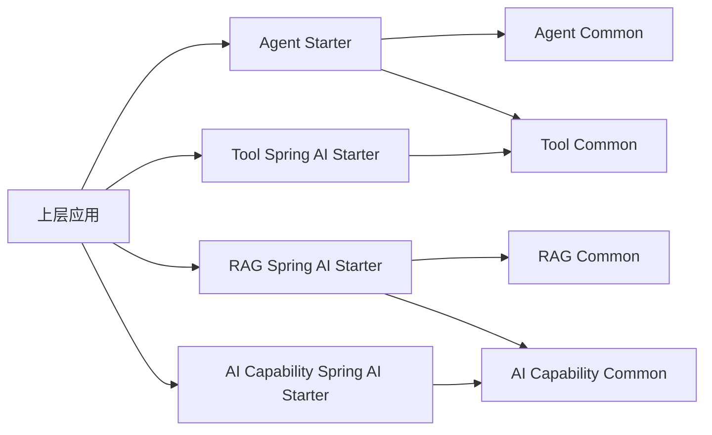

# 四能力模块拆分技术设计说明书

> 功能标识：`four-capability-module-split`
> SDD 等级：`S2`
> 来源需求：`spec/features/20260713/四能力模块拆分-需求说明书.md`
> 文档状态：已确认
> 创建日期：2026-07-13
> 更新日期：2026-07-13

## 1. 设计概要

- 功能描述：将现有 Maven 工程按 Agent 编排、工具管理、RAG、AI 能力接入四个能力域重新组织，迁移错位代码，统一包名和配置前缀，并保持功能行为不变。
- 影响模块：根聚合工程、现有 Agent/RAG 聚合及子模块、新增 Tool/AI Capability 聚合及子模块、自动配置清单和相关测试。
- 关键技术点：Maven Reactor 拆分、公共契约提取、Spring AI 适配隔离、自动配置迁移、包名与配置前缀破坏性切换、依赖去环和回归验证。
- 依赖关系：Agent Starter 依赖 Tool Common；RAG Starter 依赖 AI Capability Common；各能力 Starter 依赖自身 Common；禁止 Common 依赖 Starter。
- 非目标：不新增功能、不修复与拆分无关的缺陷、不新增非 Spring AI 适配、不修改数据库、缓存键、消息主题或外部协议。
- SDD 等级理由：跨两个核心模块并新增两个核心能力模块，同时改变 Maven 坐标、Java 公共包、配置契约和自动配置加载，兼容与回滚成本高。

### 1.1 技术栈与交付画像

| 项目事实 | 已确认结论 | 证据或原因 |
| --- | --- | --- |
| 项目形态 | 库/SDK 与 Spring Boot Starter | 根工程和能力工程均为 Maven 聚合或 Starter 制品 |
| 主要语言与运行时 | Java 21、JVM | Agent 聚合 POM 明确配置 Java 21，源码为 Java |
| 构建与测试入口 | Maven Reactor；先执行受影响模块测试，再执行根工程构建 | 根及子模块均使用 `pom.xml`，当前未发现测试源码 |
| 交付入口 | Maven 制品和 Spring Boot 自动配置 | 各 Starter 使用 `AutoConfiguration.imports` |
| 独立可运行服务 | 否，均为上层应用引入的库或 Starter | 仓库没有独立应用启动类或服务部署入口 |
| 页面/交互型交付物 | 否 | 仓库没有前端或页面资源 |
| 数据结构变更 | 否 | 需求明确不修改持久化结构和其他数据服务结构 |

### 1.2 目标模块结构

```text
fons4ai
├─ fons4ai-agent
│  ├─ fons4ai-agent-common
│  └─ fons4ai-agent-spring-ai-starter
├─ fons4ai-tool
│  ├─ fons4ai-tool-common
│  └─ fons4ai-tool-spring-ai-starter
├─ fons4ai-rag
│  ├─ fons4ai-rag-common
│  └─ fons4ai-rag-spring-ai-starter
└─ fons4ai-capability
   ├─ fons4ai-capability-common
   └─ fons4ai-capability-spring-ai-starter
```

## 2. 架构与调用链路

- 涉及入口：四个 Starter 的自动配置入口以及上层应用直接调用的公共 Java 契约。
- 涉及模块：目标结构中的 8 个叶子模块和 4 个聚合模块。
- 涉及服务：不适用，未新增独立可运行服务。
- 涉及领域对象：Agent 执行上下文、工具元数据与提供者、RAG 文档与检索请求、图像生成与图片识别能力契约。
- 涉及数据访问：现有 PgVector 访问继续归 RAG，不改变数据访问行为。
- 外部依赖：Spring AI、MCP SDK、Tavily、PgVector、Redis/Redisson、OpenAI 兼容模型服务和图像生成服务；本次只调整其依赖归属。



依赖约束：

- `fons4ai-agent-common` 不依赖 Tool、RAG 或 AI Capability。
- `fons4ai-agent-spring-ai-starter` 只依赖 `fons4ai-tool-common` 的查询契约，不强制传递 Tool Starter。
- `fons4ai-rag-spring-ai-starter` 只依赖 `fons4ai-capability-common` 的图片识别契约，不强制传递 AI Capability Starter。
- 图片 Reader 仅在存在图片识别能力 Bean 时装配；未引入 AI Capability Starter 时，其他 RAG Reader 和向量检索仍可使用。
- Tool 与 AI Capability 之间无依赖；RAG 与 Agent 之间无新增直接依赖；所有 Common 到 Starter 的反向依赖均禁止。

### 2.1 服务形态与运行态设计

- 模块形态：SDK/库包与 Spring Boot 框架扩展。
- 启动入口：不适用，由上层 Spring Boot 应用加载 `AutoConfiguration.imports`。
- 服务标识与监听端口：不适用，不新增独立进程或端口。
- 运行环境与配置来源：沿用上层应用配置来源，配置键迁移到 `sys.<能力>.*`。
- 注册发现：不适用。
- 健康检查：不适用，仍由上层应用负责。
- 核心运行链路：上层应用引入 Starter，Spring Boot 按条件创建能力 Bean，业务代码调用公共契约。
- 外部依赖：按能力独立验证模型、工具、Redis 和 PgVector 依赖；不得在无关 Starter 初始化时建立连接。
- 隔离与清理：测试使用替身或隔离资源，不访问生产服务。
- 暂缓项：无。

## 3. API / RPC / 消息契约设计

### 3.1 公共 Java 契约

| 契约 | 目标包 | 职责 | 实现位置 | AC |
| --- | --- | --- | --- | --- |
| `ToolProvider` | `com.fons.cloud.ai.tool.spi` | 判断工具归属、解析类别并提供结果解析器 | Tool Common，具体 Provider 在 Tool Starter | AC-001、AC-002 |
| `ToolResultParser<T>` | `com.fons.cloud.ai.tool.spi` | 将工具原始结果解析为类型化结果 | Tool Common，Tavily 解析器在 Tool Starter | AC-002、AC-004 |
| `ToolRegistry` | `com.fons.cloud.ai.tool.registry` | 向 Agent 暴露工具元数据和 Provider 查询 | Tool Common；Spring AI 注册实现在 Tool Starter | AC-002、AC-005 |
| `ImageGenerationService` | `com.fons.cloud.ai.capability.image` | 根据提示词执行图像生成 | AI Capability Common；当前实现位于 AI Capability Starter | AC-002、AC-004 |
| `ImageRecognitionService` | `com.fons.cloud.ai.capability.multimodal` | 接收图片内容并返回文本识别结果 | AI Capability Common；Spring AI 实现在 AI Capability Starter | AC-002、AC-004、AC-005 |

公共契约约束：

- Common 中的接口不得暴露 `ToolCallback`、`ChatModel`、`OpenAiChatModel` 等 Spring AI 类型。
- Tool Starter 的注册实现可以接收 Spring AI `ToolCallback`，但 Agent 只依赖 `ToolRegistry` 查询接口。
- RAG 图片读取策略只依赖 `ImageRecognitionService`，不直接依赖 AI Capability Starter 的实现类。
- 现有错误码字符串保持不变，仅将图片生成和多模态错误常量迁入 AI Capability 归属，避免改变可观察失败结果。
- 本次不涉及 HTTP、RPC 或消息契约。

### 3.2 Java 包迁移

| 当前归属 | 目标归属 | 迁移内容 |
| --- | --- | --- |
| `com.fons.cloud.ai.agent.constants.ToolCategory` | `com.fons.cloud.ai.tool.constants` | 工具类别 |
| `com.fons.cloud.ai.agent.infrastructure.tool` | `com.fons.cloud.ai.tool.spi` / `model` / `registry` | Tool Provider、结果解析、元数据和注册查询契约 |
| `com.fons.cloud.ai.agent.infrastructure.tools` | `com.fons.cloud.ai.tool` | 工具注册实现、Tavily 接入及解析器 |
| `com.fons.cloud.ai.agent.response.Web*` | `com.fons.cloud.ai.tool.model` | 搜索、提取和 Web 工具结果 |
| `com.fons.cloud.ai.agent.constants.ImageGenProvider` | `com.fons.cloud.ai.capability.image` | 图像生成提供者 |
| `com.fons.cloud.ai.agent.infrastructure.config.ImageGeneration*` | `com.fons.cloud.ai.capability.config` | 图像生成配置和自动配置 |
| `com.fons.cloud.ai.agent.infrastructure.service.ImageGenerationService` | `com.fons.cloud.ai.capability.image` | 图像生成契约与当前实现 |
| `com.fons.cloud.ai.rag.config.MultipleModalConfigProperties` | `com.fons.cloud.ai.capability.config` | 多模态配置 |
| `com.fons.cloud.ai.rag.infrastructure.multiplemodal` | `com.fons.cloud.ai.capability.multimodal` | 图片识别实现 |
| `com.fons.cloud.ai.rag.infrastructure.config.MultipleModalAutoConfiguration` | `com.fons.cloud.ai.capability.config` | 多模态自动配置 |

迁移后删除源包下对应类，不保留旧 FQCN 门面或转发类。Agent 与 RAG 原有职责内代码继续使用 `com.fons.cloud.ai.agent` 和 `com.fons.cloud.ai.rag`。

### 3.3 配置契约迁移

| 当前配置前缀 | 目标配置前缀 | 归属 | 兼容策略 |
| --- | --- | --- | --- |
| `sys.tavily` | `sys.tool.tavily` | Tool | 不保留旧别名 |
| `sys.image-generation` | `sys.ai.image-generation` | AI Capability | 不保留旧别名 |
| `sys.multiple-modal` | `sys.ai.multimodal` | AI Capability | 不保留旧别名 |
| `sys.rag.vector` | `sys.rag.vector` | RAG | 已符合目标分组，保持不变 |

`sys.ai.multimodal.enabled` 继续控制多模态 Bean 装配；`sys.rag.vector.type` 继续控制 PgVector 装配。未定义实际配置项的 `sys.agent.*` 不创建空配置类。

## 4. 数据模型与 DDL 影响

### 4.1 数据影响判断

| 检查项 | 是否涉及 | 处理要求 |
| --- | --- | --- |
| 持久化数据新增、修改、删除或查询 | 否 | PgVector 行为保持不变 |
| 外部数据入库、出库、同步、对账或报表 | 否 | 不新增数据流 |
| 字段映射、金额、日期、状态、流水号或客户标识 | 否 | 不适用 |
| 敏感数据、权限、安全、脱敏、加密、审计或保留期限 | 是 | 配置类迁移时禁止输出 API Key，日志不得记录密钥或完整外部响应 |
| 跨系统、跨服务、跨库或第三方数据流转 | 否 | 现有调用保持不变，不新增链路 |

### 4.2 字段映射契约

不适用，原因：不涉及业务数据导入、同步、对账或迁移。配置键迁移按 §3.3 一一映射，不改变配置值语义和类型。

### 4.3 数据流设计

不适用，原因：不新增或改变业务数据流。

### 4.4 数据安全与合规设计

| 检查项 | 设计结论 | 验证方式 |
| --- | --- | --- |
| 敏感数据识别 | API Key、服务地址和模型配置属于敏感或内部配置 | 配置类审查 |
| 传输安全 | 沿用现有外部服务调用方式，本次不改变协议 | 回归验证 |
| 存储加密 | 不新增存储，配置安全由上层应用负责 | 配置审查 |
| 展示/日志脱敏 | 配置类不得生成包含 API Key 的 `toString`；不得记录完整密钥和敏感响应 | 静态搜索和日志测试 |
| 数据权限 | 不适用，不新增数据权限 |
| 审计与追踪 | 记录能力初始化和非敏感失败上下文 | 日志审查 |
| 保留期限/删除/归档 | 不适用，不新增数据 |
| 法规或公司治理要求 | 遵循项目规则中的密钥外置和日志脱敏要求 | Code Review |

### 4.5 结构变更详设

不适用，原因：不修改数据库表、Redis Key、消息 Topic、索引、对象存储元数据或其他持久化结构。

### 4.6 ER 设计

不适用，原因：无数据模型或关系变化。

### 4.7 SQL/DDL 影响

- 是否涉及持久化结构变化：否。
- SQL 知识快照：无。
- DDL 证据状态：不适用。
- 结构详设位置：不适用。
- 迁移位置：不适用。
- 执行型变更 DDL：不适用。
- 回滚思路：不适用，不存在结构变更。

### 4.8 运行初始化 DML / Seed 数据

不适用，原因：不新增默认账号、权限、字典、配置种子或其他初始化数据。

## 5. 核心逻辑设计

### 5.1 Maven 模块拆分

1. 根 `pom.xml` 保留 Agent、RAG，并新增 Tool、AI Capability 两个聚合模块。
2. 新增两个能力聚合 POM，每个聚合 `common` 与 `spring-ai-starter` 两个子模块。
3. 将 Java 21 与 UTF-8 编译属性统一放到根 POM，避免新增模块编译口径漂移。
4. 按 §2 的依赖方向配置子模块依赖，直接声明实际使用的 Spring AI/MCP/OpenAI 依赖，不依赖旧模块的传递依赖获得类。
5. 使用 Maven `dependency:tree` 和完整 Reactor 构建检查无循环、无旧制品引用和无意外传递依赖。

### 5.2 工具管理迁移

1. 将工具类别、元数据、Provider、结果解析器、Web 工具结果和查询契约迁入 Tool Common。
2. 将 Spring AI ToolCallback 注册、Spring Bean 发现、Tavily 配置、Provider 和解析实现迁入 Tool Starter。
3. Agent 的 Web Search 实现改为依赖 Tool Common 的 `ToolRegistry`、`ToolProvider` 和类型化结果，不引用 Tool Starter 实现类。
4. Tool Starter 的自动配置入口只注册工具相关 Bean，配置改用 `sys.tool.tavily`。
5. 保持工具名称识别、类别判断、结果解析和 Agent 输出行为不变。

### 5.3 AI 能力迁移

1. AI Capability Common 定义图片生成、图片识别的框架无关契约及相关常量/错误码。
2. 图像生成配置和当前 Qwen HTTP 实现从 Agent 迁入 AI Capability Starter，配置改用 `sys.ai.image-generation`。
3. 多模态配置和 Spring AI/OpenAI 兼容实现从 RAG 迁入 AI Capability Starter，配置改用 `sys.ai.multimodal`。
4. AI Capability Starter 的自动配置清单同时登记图像生成与多模态配置。
5. RAG 的图片 Reader 依赖 `ImageRecognitionService`；只有该 Bean 存在时才装配图片 Reader。
6. 保留现有提示词、模型参数、返回文本和错误码字符串；不得借迁移重写供应商调用逻辑。

### 5.4 自动配置迁移

| 自动配置清单 | 目标内容 |
| --- | --- |
| Agent Common | 保留 Agent 任务管理自动配置 |
| Agent Spring AI Starter | 删除 Tool 自动配置登记；若无其他自动配置则移除空清单 |
| Tool Spring AI Starter | 登记 Tool 自动配置 |
| RAG Spring AI Starter | 保留 Document Reader 与 PgVector，移除多模态自动配置 |
| AI Capability Spring AI Starter | 登记图像生成与多模态自动配置 |

## 6. 领域建模与业务规则落地

| 规则/行为 | 归属对象 | 实现方式 | 验证方式 |
| --- | --- | --- | --- |
| Agent 不拥有通用工具管理 | Agent Starter 与 Tool Common | Agent 仅依赖 `ToolRegistry` 查询契约 | 依赖树和包引用检查 |
| RAG 不拥有通用多模态模型 | RAG Starter 与 AI Capability Common | 图片 Reader 依赖 `ImageRecognitionService` | 条件装配测试 |
| 能力按需接入 | 四个 Starter | 只在对应 Starter 中登记自动配置 | ApplicationContext 测试 |
| 行为保持不变 | 迁移后的实现类 | 迁移代码时保留输入、输出、错误码和分支 | 单元与回归测试 |
| 旧命名不兼容 | 包与配置绑定 | 删除旧类和旧配置绑定 | 静态搜索与负向装配测试 |

- DDD-lite 判断：本项目为技术框架，采用能力边界、Port/Adapter 和依赖倒置，不引入实体、聚合或仓储模板。
- 核心能力对象：Agent 执行契约、工具注册与解析契约、RAG 读取/检索契约、图片生成/识别契约。
- 应用服务职责：由各 Starter 完成框架适配和 Bean 装配，上层应用负责组合需要的能力。
- 贫血模型例外：请求、响应、配置和元数据对象保持数据载体职责。
- 基础设施依赖边界：Spring AI、MCP、Tavily、OpenAI、PgVector 和 Redisson 只出现在对应 Starter 或当前基础设施实现中。

## 7. 状态流转设计

不适用，原因：本次不新增或修改业务状态、Agent 任务状态或工具调用状态，只调整代码归属和装配边界。

## 8. 异常、安全、事务与性能

### 8.1 异常处理

| 异常场景 | 处理方式 | 可见结果 | 日志要求 |
| --- | --- | --- | --- |
| 使用旧包名 | 编译失败，不提供门面 | 接入方必须迁移导入 | 不适用 |
| 使用旧配置键 | 新配置对象不绑定旧值 | 对应能力可能不装配或缺少配置 | 启动日志不得输出密钥 |
| 未引入 Tool Starter | Agent 可使用非工具场景，工具 Bean 不存在 | 需要工具时由接入方显式引入 | 条件装配信息 |
| 未引入 AI Capability Starter | RAG 不装配图片 Reader，其他 Reader 与检索不受影响 | 图片识别不可用 | 条件装配信息 |
| 外部模型或工具调用失败 | 保留现有异常转换和错误码字符串 | 与迁移前一致 | 脱敏记录失败上下文 |

### 8.2 安全与权限

- 鉴权：不新增鉴权机制。
- 权限：不改变现有工具或模型服务权限。
- 数据校验：保留现有输入校验；公共能力接口必须拒绝空图片或无效输入。
- 敏感信息脱敏：API Key、Token、连接串和完整外部响应不得出现在日志、`toString` 或测试快照中。
- 防注入/越权：不新增输入拼接和权限边界；沿用现有调用方式。

### 8.3 事务与一致性

- 事务边界：不涉及数据库事务变化。
- 一致性模型：不变。
- 并发控制：AgentTaskManager 的 Redis/Redisson 行为和键名保持不变。
- 缓存一致性：不改变缓存键或 TTL。
- MQ/事件一致性：不适用。
- 失败补偿：不新增；沿用现有异常处理。

### 8.4 性能

- 查询性能：不改变 PgVector 查询流程。
- 索引影响：无。
- 缓存策略：不变。
- 限流策略：不新增。
- 预期性能指标：不引入额外远程调用或重复模型调用；Starter 条件装配不应初始化无关外部能力。

## 9. 技术决策

- 决策 D-001：保留 `fons4ai-agent` 和 `fons4ai-rag` 顶层目录及制品名称。
  - 原因：两个目录与其核心能力仍一致，重命名没有架构收益。
  - 替代方案：改名为完整能力域名称。
  - 影响：逻辑能力名与物理模块名通过架构文档映射。

- 决策 D-002：新增 `fons4ai-tool` 和 `fons4ai-capability`，均采用 `common + spring-ai-starter`。
  - 原因：匹配现有组织模式，并隔离稳定契约与当前框架适配。
  - 替代方案：只新增单一 Starter；无法提供框架无关依赖边界。
  - 影响：根 Reactor 新增 6 个 POM 文件和 4 个叶子制品。

- 决策 D-003：跨能力只依赖 Common 契约，不强制依赖目标 Starter。
  - 原因：满足按需接入并避免无关能力自动初始化。
  - 替代方案：Agent/RAG 直接依赖 Tool/AI Starter；会扩大传递依赖。
  - 影响：需要新增 `ToolRegistry`、`ImageGenerationService`、`ImageRecognitionService` 等稳定契约。

- 决策 D-004：不提供旧包或旧配置兼容层。
  - 原因：用户明确确认破坏性迁移，并要求不保留旧命名。
  - 替代方案：废弃门面和配置别名过渡；已拒绝。
  - 影响：接入方必须一次性修改依赖、导入和配置。

- 决策 D-005：配置统一按 `sys.tool.*`、`sys.rag.*`、`sys.ai.*` 分组。
  - 原因：用户确认所有配置继续以 `sys` 开头，并按能力归属。
  - 替代方案：使用 `fons4ai.*`；已拒绝。
  - 影响：Tavily、图像生成和多模态配置键发生破坏性变化。

- 决策 D-006：迁移期间保持错误码字符串和运行参数不变。
  - 原因：包和配置契约已明确破坏，但功能行为仍需保持一致。
  - 替代方案：同时统一错误码；超出本次范围。
  - 影响：部分历史错误码前缀可能与新能力名不一致，后续如需调整应单独立项。

- 新增依赖：仅允许为新增 Starter 直接声明仓库已经使用的 Spring AI/MCP/OpenAI 相关依赖，以及测试范围内的 Spring Boot/JUnit 依赖；不引入新框架。
- 新增抽象：`ToolRegistry`、`ImageGenerationService`、`ImageRecognitionService`，用于解除跨能力实现依赖。

## 10. 验证策略、AC 映射与风险

### 10.1 验证策略

| 验证对象 | 验证方式 | 覆盖 AC |
| --- | --- | --- |
| Maven 模块结构 | 根 POM 模块断言、Reactor 构建、`dependency:tree` | AC-001、AC-005、AC-006 |
| 包归属 | `rg` 负向检查旧 Tool/Image/Multimodal 包，编译验证新包 | AC-002、AC-003 |
| 配置绑定 | ApplicationContextRunner 正向绑定新键、负向验证旧键不再生效 | AC-003 |
| Tool 能力 | ToolRegistry、Provider 分类和结果解析单元测试 | AC-004、AC-005 |
| AI 能力 | 图像生成/识别接口和自动配置测试，外部调用使用替身 | AC-004、AC-005 |
| RAG 协作 | 有/无 `ImageRecognitionService` 时的 Reader 条件装配测试 | AC-004、AC-005 |
| Agent 回归 | Web Search Agent 使用 Tool Common 契约的编译和行为测试 | AC-004 |
| 完整工程 | 根 Maven 测试与构建、旧引用静态扫描、Evidence Bundle | AC-006 |

### 10.2 AC 映射

| AC | 技术实现 | 验证方式 |
| --- | --- | --- |
| AC-001 | 四个聚合模块及各自 Common/Starter | Reactor 模块与依赖树检查 |
| AC-002 | Tool 和 AI Capability 迁移表、源实现删除 | 包扫描和编译 |
| AC-003 | §3.2 包迁移和 §3.3 配置映射 | 新旧包/配置正负向测试 |
| AC-004 | 保留实现逻辑、参数和错误码字符串 | 能力单元测试及回归测试 |
| AC-005 | 跨能力只依赖 Common，条件装配可选实现 | 独立 Starter 上下文测试 |
| AC-006 | 根 Reactor 构建和验证记录 | Maven 构建与 Evidence Bundle |

### 10.3 风险与回滚

| 编号 | 风险 | 影响 | 处理方式 |
| --- | --- | --- | --- |
| R-001 | 包名和配置同时破坏 | 现有接入方无法直接升级 | 提供明确映射，按单次主版本变更发布 |
| R-002 | 当前无测试基线 | 无法证明行为不变 | 先补契约和装配测试，再移动实现 |
| R-003 | Spring AI 依赖通过旧 Starter 传递获得 | 新模块可能编译缺类 | 新 Starter 直接声明实际依赖并执行依赖树检查 |
| R-004 | 自动配置迁移遗漏 | Bean 不再加载或无关能力启动失败 | 对每个 Starter 做最小上下文测试并检查 imports |
| R-005 | 工作区已有 Agent 改动与文件迁移重叠 | 用户改动可能丢失 | 迁移前记录状态，逐文件移动并复核 diff，不覆盖已有改动 |
| R-006 | 跨能力抽象导致行为变化 | 回归失败 | 只做接口适配，保留核心实现逻辑；失败时按任务分阶段回滚 |

回滚策略：以任务为单位逆序回滚。先恢复自动配置和 POM 依赖，再恢复源路径；由于不涉及数据结构，无数据回滚。禁止使用破坏性 Git 命令覆盖工作区已有改动。

### 10.4 知识同步影响

- 是否需要知识同步：是。
- 影响类型：项目技术能力架构、运行架构、配置与资源架构，以及四个能力域后续文档。
- 处理边界：本次 SDD 不修改 `.specify/memory/`；实现验证后由用户显式触发 `fons4ai-knowledge-summary`。
- SQL 知识快照：无。
- Knowledge Sync Needed: yes

## 11. 证据清单

| 关键结论 | 证据来源 | 证据等级 | 状态 |
| --- | --- | --- | --- |
| 四个能力域及职责边界 | 正式需求说明书、项目技术能力架构文档、用户确认 | L2 | 已验证 |
| 保留 Agent/RAG 并新增 Tool/AI Capability | 用户确认、现有 Maven 聚合结构 | L2 | 已验证 |
| 新包名和 `sys.<能力>.*` 配置策略 | 用户逐项确认 | L2 | 已验证 |
| Tool 当前位于 Agent | ToolProvider、ToolsRegistry、Tavily 等源码与 POM | L1 | 已验证 |
| 图像生成位于 Agent、多模态位于 RAG |配置类、服务类和自动配置源码 | L1 | 已验证 |
| 当前以 Spring Boot Starter 交付 | 子模块 POM 与 `AutoConfiguration.imports` | L1 | 已验证 |
| 无持久化结构变更 | 正式需求说明书和用户确认 | L2 | 已验证 |
| 当前未发现测试源码 | 仓库测试文件定向搜索 | L1 | 已验证 |
