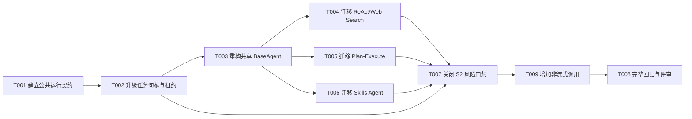

# 智能体实例共享任务规划

> 功能标识：`agent-instance-sharing`
> 版本：V1.4.0
> SDD 等级：`S2`
> 来源需求：`spec/features/20260715/智能体实例共享-需求说明书.md`
> 来源技术设计：`spec/features/20260715/智能体实例共享-技术设计说明书.md`
> 文档状态：CR-002 待实现（T001-T009 已完成，T010-T014 待执行）
> 创建日期：2026-07-15
> 更新日期：2026-07-20

## 1. 任务概览

- 总任务数：14
- 核心路径：历史 T001-T009 已完成；CR-002 路径为 T010 -> T011/T012 -> T013 -> T014
- 风险任务：T010（终态与资源释放）、T011（事件并发与提示词边界）、T012（Plan 工具权限和取消）、T014（S2 回归与评审）
- 阻塞任务：无
- 可并行分组：T004、T005、T006 在 T003 完成后可并行，分别迁移 ReAct、Plan-Execute 和 Skills，不修改同一 Agent 实现文件
- Mock/临时实现闭环：无；测试使用可控替身，不作为生产实现
- 可运行服务闭环：无；本功能交付库/Starter，不新增独立服务
- 运行服务验证：不适用；本功能不新增独立可运行服务，因此启动验证、服务注册和健康检查均不在本次交付范围内
- UI 设计确认：不适用；本功能不涉及页面、前端或交互型交付物
- DDL/数据结构任务：有，T002 实现 Redis 租约和停止消息的等价结构变更，T007 确认迁移与回滚证据；不涉及 SQL/DDL
- 运行初始化 DML/Seed 任务：无
- 数据设计与治理任务：有，T006/T007 验证技能权限和日志内容的请求级隔离

### 1.1 任务依赖图

## 2. 实现确认门禁

- 状态：已获用户确认，T001-T009 已进入实现
- 规划产物不等于实现授权。
- 生成本任务规划文档后必须暂停，等待用户确认后才能进入代码实现。
- 用户确认执行且未指定任务 ID 时，默认执行全部未完成任务。
- 用户指定任务 ID 时，例如 `执行 T001,T002`，只执行指定任务及用户明确允许补齐的必要依赖。
- `看看`、`下一步是什么`、`继续看` 等不明确指令不得视为实现确认。

## 3. 任务列表

- [x] T001 建立框架无关的 AgentRun 公共契约
  - 通俗解释: 完成后业务方可以共享同一个 Agent，通过一次执行对象获取事件、完成结果和取消能力，不再依赖 Agent 实例上的当前请求字段。
  - AC: AC-001, AC-002, AC-003, AC-009
  - 来源: 技术设计说明书 §3.1-§3.6、D-001、D-002、D-006
  - Files: fons4ai-agent/fons4ai-agent-common/src/main/java/com/fons/cloud/ai/agent/api/Agent.java; fons4ai-agent/fons4ai-agent-common/src/main/java/com/fons/cloud/ai/agent/api/AgentRun.java; fons4ai-agent/fons4ai-agent-common/src/main/java/com/fons/cloud/ai/agent/api/AgentRunState.java; fons4ai-agent/fons4ai-agent-common/src/main/java/com/fons/cloud/ai/agent/api/AgentRunResult.java; fons4ai-agent/fons4ai-agent-common/src/main/java/com/fons/cloud/ai/agent/chat; fons4ai-agent/fons4ai-agent-common/src/test/java/com/fons/cloud/ai/agent/api; fons4ai-agent/fons4ai-agent-spring-ai-starter/src/main/java/com/fons/cloud/ai/agent/chat; fons4ai-agent/fons4ai-agent-common/pom.xml
  - Depends: 无
  - Verification: 先添加公共契约测试，证明现有 Common 无法表达 `start/events/completion/cancel` 且历史消息角色依赖 Spring AI；补齐契约并迁移稳定 DTO 后，编译 Common，断言公共签名无 Spring AI/Alibaba 类型，`stream(request)` 每次订阅创建独立 Run，`AgentRun` 暴露固定 runId 和单播事件语义，现有 AgentResponse JSON 类型码未改变。
  - Quality: Common 只表达稳定 Agent 运行语义；请求和集合制作不可变/防御性副本；公共接口和 DTO 补齐中文注释；不新增第三方依赖，不通过无边界 Map 承载稳定结果，不泄露模型、Graph 或工具实现类型。
  - 专业工作流: `.specify/rules/代码编写规范.md` 的公共契约、DDD-lite 边界和 Spring AI 适配隔离规则
  - Done: Agent、AgentRun、状态和结果契约可独立编译测试；请求/结果 DTO 位于 Common 且无 Spring AI 类型；现有客户端响应协议契约测试保持通过。

- [x] T002 升级任务句柄、Redis 租约与停止命令
  - 通俗解释: 完成后每次执行都有唯一任务身份，旧请求迟到的完成或停止信号不会误伤同一会话的新请求。
  - AC: AC-004, AC-005, AC-009
  - 来源: 技术设计说明书 §3.1、§4.3-§4.5、§5.7、D-003
  - Files: fons4ai-agent/fons4ai-agent-common/src/main/java/com/fons/cloud/ai/agent/core/AgentTaskHandle.java; fons4ai-agent/fons4ai-agent-common/src/main/java/com/fons/cloud/ai/agent/core/AgentTaskLease.java; fons4ai-agent/fons4ai-agent-common/src/main/java/com/fons/cloud/ai/agent/core/AgentStopCommand.java; fons4ai-agent/fons4ai-agent-common/src/main/java/com/fons/cloud/ai/agent/core/AgentTaskManager.java; fons4ai-agent/fons4ai-agent-common/src/test/java/com/fons/cloud/ai/agent/core/AgentTaskManagerTest.java; fons4ai-agent/fons4ai-agent-spring-ai-starter/src/test/java/com/fons/cloud/ai/agent/core/AgentTaskManagerCompletionTest.java
  - Depends: T001
  - Verification: 先增加会失败的确定性测试：请求 A 释放后请求 B 使用相同 conversationId 注册，A 的旧 handle 执行 complete/cancel/远程 stop 时 B 仍保持运行；再实现版本化租约和停止命令，断言注册保存 instanceId/runId/agentType、同会话仍互斥、匹配 handle 才能设置 Disposable/续期/释放、正常完成不发送停止消息、主动停止只发送一次现有停止内容、非法或旧消息格式被安全拒绝。
  - Quality: Redis 释放使用原子 compare-and-delete 语义；本地 TaskInfo 和 Redis 租约共享同一 runId；解析错误保留诊断但不暴露请求内容；TTL 30 分钟和 5 分钟刷新口径保持不变；不生成 SQL/DDL，不把临时租约写成业务数据。
  - 专业工作流: `.specify/rules/代码编写规范.md` 的并发、幂等、停止、清理和资源释放规则
  - Done: 所有任务操作都要求精确 handle；迟到终态和停止命令测试通过；Redis 目标值契约与技术设计 §4.5 一致；正常完成和主动停止语义明确分离。

- [x] T003 重构 BaseAgent 为共享定义和请求级运行上下文
  - 通俗解释: 完成后 Agent 本身可以作为 Spring 单例共享，每个请求仍有独立响应流、计时、消息、工具记录和最终结果。
  - AC: AC-001, AC-002, AC-003, AC-005, AC-008, AC-009
  - 来源: 技术设计说明书 §2.1、§5.1、§5.2、§5.6、§7、D-001、D-002、D-004
  - Files: fons4ai-agent/fons4ai-agent-spring-ai-starter/src/main/java/com/fons/cloud/ai/agent/standard/BaseAgent.java; fons4ai-agent/fons4ai-agent-spring-ai-starter/src/main/java/com/fons/cloud/ai/agent/standard/runtime/AgentRunContext.java; fons4ai-agent/fons4ai-agent-spring-ai-starter/src/main/java/com/fons/cloud/ai/agent/standard/runtime/DefaultAgentRun.java; fons4ai-agent/fons4ai-agent-spring-ai-starter/src/main/java/com/fons/cloud/ai/agent/infrastructure/hook/AgentChatHook.java; fons4ai-agent/fons4ai-agent-common/src/main/java/com/fons/cloud/ai/agent/constants/AgentResultCode.java; fons4ai-agent/fons4ai-agent-spring-ai-starter/src/test/java/com/fons/cloud/ai/agent/standard/BaseAgentSharedInstanceTest.java
  - Depends: T002
  - Verification: 先使用可控测试 Agent 编写失败测试，覆盖同实例两个会话并发、同实例连续执行、同会话忙、正常/异常/取消终态竞争、Hook 一次、当前问题单次写入和请求集合不被修改；完成重构后断言每个 Run 的 sink、计时、工具集合、结果和 TaskHandle 独立，Agent 实例不再含 currentConversationId/currentQuestion/sink/finalAnswer/thinking/usedTools 等请求态字段，也不使用 ThreadLocal、全局同步锁或 conversationId 状态 Map。
  - Quality: BaseAgent 只保留 final/线程安全共享依赖；所有辅助方法显式接收 RunContext；Run 状态机终态不可逆；日志只记录 runId、conversationId、类型、长度和终态，不完整序列化请求；Hook 异常不得破坏任务清理和客户端终态。
  - 专业工作流: `.specify/rules/代码编写规范.md` 的共享可变状态、公共 API、异常日志与 TDD 门禁
  - Done: BaseAgent 实现实例可共享，所有基础并发和终态测试通过；一次性实例错误码/保护不再用于限制共享调用；现有 JSON 流协议保持一致。

- [x] T004 [P] 迁移 ReAct 与 Web Search 到请求级上下文
  - 通俗解释: 完成后同一个 ReAct/Web Search Agent 可以并发处理不同会话，轮次、工具结果和搜索引用不会串到其他请求。
  - AC: AC-001, AC-003, AC-006, AC-008, AC-009
  - 来源: 技术设计说明书 §5.3、§6、§7
  - Files: fons4ai-agent/fons4ai-agent-spring-ai-starter/src/main/java/com/fons/cloud/ai/agent/standard/react/ReactAgent.java; fons4ai-agent/fons4ai-agent-spring-ai-starter/src/main/java/com/fons/cloud/ai/agent/standard/react/ReactAgentRunContext.java; fons4ai-agent/fons4ai-agent-spring-ai-starter/src/main/java/com/fons/cloud/ai/agent/standard/react/websearch/WebSearchReactAgent.java; fons4ai-agent/fons4ai-agent-spring-ai-starter/src/main/java/com/fons/cloud/ai/agent/standard/react/websearch/WebSearchAgentRunContext.java; fons4ai-agent/fons4ai-agent-spring-ai-starter/src/main/java/com/fons/cloud/ai/agent/chat/AgentExecutionContext.java; fons4ai-agent/fons4ai-agent-spring-ai-starter/src/test/java/com/fons/cloud/ai/agent/standard/react; fons4ai-agent/fons4ai-agent-spring-ai-starter/src/test/java/com/fons/cloud/ai/agent/standard/react/websearch
  - Depends: T003
  - Verification: 先用可控 ChatModel 和工具替身并发执行两个会话，使现有 referenceJson/currentConversationId 等共享字段暴露隔离失败；迁移后断言轮次消息、工具回填、使用工具集合、推荐内容、搜索/提取结果、referenceJson 和 Hook 结果各自归属对应 Run，正常完成使用 complete(handle)，取消才使用主动停止流程，连续第二次执行仍成功。
  - Quality: ChatClient、不可变工具列表和无状态 Advisor 可共享；轮次/引用/工具执行状态全部进入专属 RunContext；扩展点显式接收上下文；工具并发结果按 toolCall 原顺序回填，不扩大 ReAct 算法或搜索业务行为；按 DDD-lite 将运行不变量归属 RunContext，基础设施依赖不反向进入公共契约。
  - 专业工作流: 无
  - Done: ReAct 和 Web Search 同实例并发/连续复用测试通过，现有工具调用、引用和流协议行为回归通过，生产类不保存请求级 referenceJson 或当前轮状态。

- [x] T005 [P] 迁移 Plan-Execute 到请求级 Graph 上下文
  - 通俗解释: 完成后同一个 Plan-Execute Agent 可以运行多个独立研究任务，每个任务只操作自己的 Graph 状态、checkpoint 和执行结果，共享线程池不会被单次请求关闭。
  - AC: AC-001, AC-003, AC-005, AC-006, AC-008, AC-009
  - 来源: 技术设计说明书 §5.4、§6、§7、§8.4
  - Files: fons4ai-agent/fons4ai-agent-spring-ai-starter/src/main/java/com/fons/cloud/ai/agent/standard/deepresearch/PlanExecuteAgent.java; fons4ai-agent/fons4ai-agent-spring-ai-starter/src/main/java/com/fons/cloud/ai/agent/standard/deepresearch/PlanExecuteRunContext.java; fons4ai-agent/fons4ai-agent-spring-ai-starter/src/main/java/com/fons/cloud/ai/agent/standard/deepresearch/PlanExecuteGraph.java; fons4ai-agent/fons4ai-agent-spring-ai-starter/src/main/java/com/fons/cloud/ai/agent/standard/deepresearch/model/DeepResearchExecuteContext.java; fons4ai-agent/fons4ai-agent-spring-ai-starter/src/test/java/com/fons/cloud/ai/agent/standard/deepresearch
  - Depends: T003
  - Verification: 先增加失败测试，使用同一 Agent 构建/执行两个 Run，断言 runnableConfig、last state、summary think、references、finished 和 checkpoint release 发生串用或共享线程池在第一请求后关闭；迁移后断言每个 Graph 使用独立 threadId/runId 和上下文，取消一个 Run 不关闭另一个 Run，第一请求终态后共享 Agent/线程池仍能执行第二请求，checkpoint 只释放本次配置。
  - Quality: Graph 节点只读取明确传入的 PlanExecuteRunContext/DeepResearchExecuteContext；受管 ExecutorService 在 Agent Bean 销毁时关闭，外部线程池不由 Agent 关闭；保持计划校验、波次依赖、工具重试、上下文压缩和最终报告语义不变；按 DDD-lite 将运行不变量归属 RunContext，基础设施依赖不反向进入公共契约。
  - 专业工作流: 无
  - Done: Plan-Execute 实例不再保存 runnableConfig、lastOverAllState、summaryInThink、references 等请求态；并发、取消、连续复用、线程池和 checkpoint 测试通过；既有 Graph 测试保持通过。

- [x] T006 [P] 迁移 Skills Agent 到请求级技能授权和原生 delegate
  - 通俗解释: 完成后同一个 Skills Agent 可以安全并发使用，不同请求只能使用自己成功激活的技能、专属工具和资源。
  - AC: AC-001, AC-003, AC-005, AC-006, AC-007, AC-008, AC-009
  - 来源: 技术设计说明书 §5.5、§6、D-005
  - Files: fons4ai-agent/fons4ai-agent-spring-ai-starter/src/main/java/com/fons/cloud/ai/agent/standard/skill/SkillsReactAgent.java; fons4ai-agent/fons4ai-agent-spring-ai-starter/src/main/java/com/fons/cloud/ai/agent/standard/skill/SkillsAgentRunContext.java; fons4ai-agent/fons4ai-agent-spring-ai-starter/src/main/java/com/fons/cloud/ai/agent/standard/skill/GuardedSkillRegistry.java; fons4ai-agent/fons4ai-agent-spring-ai-starter/src/main/java/com/fons/cloud/ai/agent/standard/skill/SkillCatalogSnapshot.java; fons4ai-agent/fons4ai-agent-spring-ai-starter/src/main/java/com/fons/cloud/ai/agent/standard/skill/ActivatedSkillToolCallback.java; fons4ai-agent/fons4ai-agent-spring-ai-starter/src/main/java/com/fons/cloud/ai/agent/standard/skill/SkillResourceInterceptor.java; fons4ai-agent/fons4ai-agent-spring-ai-starter/src/main/java/com/fons/cloud/ai/agent/standard/skill/SkillResourceTools.java; fons4ai-agent/fons4ai-agent-spring-ai-starter/src/test/java/com/fons/cloud/ai/agent/standard/skill
  - Depends: T003
  - Verification: 先扩展端到端测试并发执行请求 A/B：A 调用 read_skill 后可使用专属工具和资源，B 未激活时不可见且执行被拒绝；迁移后再验证同实例连续运行、多个技能合并、失败 read_skill 不授权、autoReload 新快照不改变运行中请求、原生流/工具/最终答案映射和任务精确清理，确认移除 invocationStarted 且没有共享 activatedSkills/StreamState/终态标志。
  - Quality: 原始只读 Registry、模型和配置可共享；受控 Registry、技能激活、动态工具包装、资源拦截器、Alibaba delegate 和 StreamState 每请求创建；运行固定技能目录快照；技能内容、物理路径和工具参数不写入日志；保持渐进式披露和资源安全限制。
  - 专业工作流: `.specify/rules/代码编写规范.md` 的最小权限、共享状态和安全日志规则
  - Done: Skills Agent 同实例并发与连续复用测试通过，技能/工具/资源权限无跨 Run 泄漏，原有技能安全、资源路径和端到端测试全部通过。

- [x] T007 关闭并发、租约迁移、扩展点和日志脱敏/数据安全门禁
  - 通俗解释: 完成后可以证明实例共享不会因迟到回调、旧 Redis 临时值、非线程安全扩展或敏感日志造成稳定性和安全问题，并具备明确回滚方式。
  - AC: AC-001, AC-003, AC-004, AC-005, AC-006, AC-007, AC-008, AC-009
  - 来源: 技术设计说明书 §4.4-§4.5、§8、§10.3
  - Files: fons4ai-agent/fons4ai-agent-common/src/test/java/com/fons/cloud/ai/agent/core; fons4ai-agent/fons4ai-agent-spring-ai-starter/src/test/java/com/fons/cloud/ai/agent; spec/features/20260715/checklists/智能体实例共享-S2风险检查清单.md; spec/features/20260715/智能体实例共享-技术设计说明书.md
  - Depends: T002, T004, T005, T006
  - Verification: 执行终态竞争、同会话旧 Run/新 Run、远程停止重复/迟到/非法格式、TTL 归属变化、Hook 异常、下游取消、技能权限隔离、会话记忆隔离和共享线程池连续执行测试；使用 `rg` 确认 BaseAgent/React/Plan/Skills 生产类无 currentConversationId、sink、finalAnswer、thinking、referenceJson、runnableConfig、activatedSkills 等请求态实例字段；完成日志脱敏和数据安全验证，确认日志不完整输出请求、提示词、工具参数或技能正文；记录旧 Redis 临时租约等待 TTL/停机清理和整体代码回退步骤。
  - Quality: 风险检查清单逐项给出自动证据、人工证据、阻塞或暂缓状态；不以 ThreadLocal、全局锁或 Agent 内运行状态 Map 规避设计；扩展 Hook/Advisor/ToolCallback 明确线程安全或请求级工厂边界；日志脱敏和敏感数据保护必须有可重复验证证据；不修改无关工具和 Agent 算法。
  - 专业工作流: `.specify/rules/agent运行规则.md` 的实现者与裁判分离、验证门禁和敏感信息规则
  - Done: S2 风险清单完成；迟到终态、任务租约、权限、日志、资源释放和回滚风险均有新鲜证据；Critical/Important 问题关闭或明确阻塞，Redis 格式切换状态已记录。

- [x] T008 完成完整回归、Evidence Matrix 和评审门禁
  - 实施状态: 独立 Spec Review、Code Review 和用户人工 Gate 均已通过，T008 已关闭。真实 Redis 多实例联调依赖下游宿主应用和部署拓扑，不属于本框架任务的启动或关闭条件。
  - 通俗解释: 完成后可以证明共享 Agent 在所有现有模式下可用、协议兼容、构建完整，并由独立评审确认符合需求和设计。
  - AC: AC-001, AC-002, AC-003, AC-004, AC-005, AC-006, AC-007, AC-008, AC-009, AC-010
  - 来源: 技术设计说明书 §10.1-§10.4、项目 Agent 运行规则“实现者与裁判分离”
  - Files: fons4ai-agent/fons4ai-agent-common; fons4ai-agent/fons4ai-agent-spring-ai-starter; spec/features/20260715/reports/智能体实例共享-实施报告.md; spec/features/20260715/checklists/智能体实例共享-S2风险检查清单.md
  - Depends: T007, T009
  - Verification: 先运行 Agent Common 和 Starter 聚焦测试，再执行 `mvn -pl fons4ai-agent/fons4ai-agent-spring-ai-starter -am test` 及受影响 Reactor 构建；Evidence Matrix 分别记录公共契约、TaskManager、BaseAgent、ReAct/Web Search、Plan-Execute、Skills、Memory、客户端协议、Redis 租约契约、日志安全、回滚和未验证项；由独立 Spec Reviewer 核对 REQ/AC，由独立 Code Reviewer 检查实例字段、并发、依赖边界和用户已有改动，最后记录人工 Gate。真实 Redis 多实例联调只在存在下游宿主应用、部署拓扑和集成环境后作为接入验证执行，不在本任务中启动。
  - Quality: 实现 Agent 不自行裁定完成；所有证据必须在最终源码后重新生成；Mockito/模型/Redis 替身与真实运行证据明确区分；保护当前工作区已有无关修改，不清理或覆盖用户文件；知识影响只记录，不在 SDD 任务中更新知识库。
  - 专业工作流: `.specify/rules/agent运行规则.md` 的 Evidence Bundle、独立 Reviewer 和人工 Gate 规则
  - Done: AC-001 至 AC-010 均有新鲜证据，聚焦测试和受影响 Reactor 构建通过，Spec Review、Code Review 和人工 Gate 已通过或明确阻塞，实施报告给出可交付判断、未验证项和回滚方式。

- [x] T009 增加同步非流式调用并验证双模式一致性
  - 实施状态: 代码和自动化验证已完成；按最终评审覆盖全部代码的原则，T009 已调整为 T008 的前置任务。
  - 通俗解释: 完成后业务方既可以消费流式事件，也可以通过 `call(request)` 阻塞等待并一次获得包含终态、最终答案和执行上下文的结构化结果。
  - AC: AC-010
  - 来源: CR-001、技术设计说明书 §3.1-§3.6、§5.1、§8.1、§8.4、D-007
  - Files: fons4ai-agent/fons4ai-agent-common/src/main/java/com/fons/cloud/ai/agent/api/Agent.java; fons4ai-agent/fons4ai-agent-common/src/main/java/com/fons/cloud/ai/agent/api/AgentRun.java; fons4ai-agent/fons4ai-agent-common/src/main/java/com/fons/cloud/ai/agent/api/AgentRunResult.java; fons4ai-agent/fons4ai-agent-common/src/main/java/com/fons/cloud/ai/agent/constants/AgentResultCode.java; fons4ai-agent/fons4ai-agent-common/src/test/java/com/fons/cloud/ai/agent/api; fons4ai-agent/fons4ai-agent-spring-ai-starter/src/main/java/com/fons/cloud/ai/agent/standard/runtime/DefaultAgentRun.java; fons4ai-agent/fons4ai-agent-spring-ai-starter/src/test/java/com/fons/cloud/ai/agent/standard; fons4ai-agent/fons4ai-agent-spring-ai-starter/src/test/java/com/fons/cloud/ai/agent/standard/react; fons4ai-agent/fons4ai-agent-spring-ai-starter/src/test/java/com/fons/cloud/ai/agent/standard/deepresearch; fons4ai-agent/fons4ai-agent-spring-ai-starter/src/test/java/com/fons/cloud/ai/agent/standard/skill; spec/features/20260715/reports/智能体实例共享-实施报告.md
  - Depends: T007
  - Verification: 先增加公共契约和可控模型失败测试，证明当前 API 不能同步返回结构化结果；实现后分别对基础测试 Agent、ReAct/Web Search、Plan-Execute 和 Skills Agent 调用 `call(request)`，断言成功、FAILED、REJECTED 场景均恰好返回一个非空 `AgentRunResult`，最终答案、思考、工具、技能、引用、推荐、runId 和终态准确；使用模型与工具调用计数断言每次 `call` 只创建并启动一个 Run；对同一可控场景分别执行 `stream(request)` 并读取 completion、执行 `call(request)`，断言最终结果语义一致且既有流式 JSON 快照未变化；在 Reactor 非阻塞线程调用 `call` 时断言创建 Run 和登记任务前快速失败；最后运行 Agent Common、Starter 聚焦测试和受影响 Reactor 构建，并更新 Evidence Matrix。
  - Quality: `call` 只组合 `start(request).completion()`，不得复制 BaseAgent、ReAct、Graph 或 Skills 执行循环，不得解析流式 JSON 拼装结果；`AgentRun` 以 `startOnce` 集中维护单次启动不变量；阻塞接口、参数、返回值、失败和线程边界补齐中文注释；公共结果不返回 `null`、内部异常堆栈或供应商类型；按 DDD-lite 将调用编排归属 Agent/AgentRun，Spring AI 适配不反向进入 Common 契约。
  - 专业工作流: `.specify/rules/代码编写规范.md` 的公共 API、响应式/阻塞边界、异常语义、资源释放与确定性测试规则
  - Done: `Agent.call(request)` 可独立编译并返回结构化结果；公共失败/拒绝和单次执行语义、各 Agent 成功调用、代表性双模式一致性测试通过；非阻塞线程快速失败不遗留本地任务或 Redis 租约；现有 `stream(request)` 协议、停止语义和全部回归测试保持通过；实施报告和最终评审证据覆盖 AC-010。

## 3.1 CR-002 增量任务

- [ ] T010 加固 BaseAgent 终态收口并提取安全清理逻辑
  - 通俗解释: 完成后任务协调、checkpoint 或 Hook 清理失败不会让调用方一直等待，正常、失败、取消和审批等待都能可靠结束当前执行分段。
  - AC: AC-003, AC-005, AC-009, AC-010
  - 来源: CR-002；技术设计说明书 §13.2
  - Files: fons4ai-agent/fons4ai-agent-spring-ai-starter/src/main/java/com/fons/cloud/ai/agent/standard/BaseAgent.java; fons4ai-agent/fons4ai-agent-spring-ai-starter/src/main/java/com/fons/cloud/ai/agent/standard/runtime/AgentRunContext.java; fons4ai-agent/fons4ai-agent-spring-ai-starter/src/test/java/com/fons/cloud/ai/agent/standard/BaseAgentSharedInstanceTest.java
  - Depends: T009
  - Verification: 先增加会失败的测试，让 `completeTask`、供应商资源释放和 Hook 分别抛异常，验证当前 completion 或事件流可能无法按预期收口；实现后断言四类分支的结果、事件终止、TaskHandle 清理尝试和 Hook 调用各最多一次，且保留原错误码、主动停止和 WAITING 协议。
  - Quality: 按 DDD-lite 将终态不变量归属 Run/BaseAgent；每个增强/清理步骤独立隔离异常并保留 cause；区分用户取消和真实终态资源关闭，不复制 finish/pause 的 sink/result 构造逻辑，不修改公共 API。
  - Done: 终态和暂停清理异常测试通过，BaseAgent 不再存在会阻断 completion 的未保护清理调用，现有生命周期回归保持通过。

- [ ] T011 治理事件发送、动态参数和 Web 增强重复逻辑
  - 通俗解释: 完成后并发事件不会静默丢失，非法动态参数或 Web 增强解析失败不会破坏 Agent 主执行，Web Builder 也不再复制基础配置代码。
  - AC: AC-003, AC-006, AC-008, AC-009
  - 来源: CR-002；技术设计说明书 §13.2-§13.3
  - Files: fons4ai-agent/fons4ai-agent-spring-ai-starter/src/main/java/com/fons/cloud/ai/agent/standard/BaseAgentBuilder.java; fons4ai-agent/fons4ai-agent-spring-ai-starter/src/main/java/com/fons/cloud/ai/agent/standard/runtime/AgentRunContext.java; fons4ai-agent/fons4ai-agent-spring-ai-starter/src/main/java/com/fons/cloud/ai/agent/standard/react/ReactAgent.java; fons4ai-agent/fons4ai-agent-spring-ai-starter/src/main/java/com/fons/cloud/ai/agent/standard/react/websearch/; 对应测试
  - Depends: T010
  - Verification: 先覆盖多线程同时发送、非法 XML key/value、Web 非法 JSON、缺失/异常/空结果解析器以及搜索与提取引用；实现后断言发送结果被检查、事件无静默丢失、参数使用固定标签并转义、Web 增强失败仅记录安全告警、REFERENCE 外层协议不变。
  - Quality: 按 DDD-lite 保持 Run 状态、Web 增强和基础设施解析职责分离；同一 Run 的发送采用最小串行化边界，不增加全局锁；复用 Commons/标准库和现有 `WebToolResult`；Builder 继承共享配置，不复制字段/setter；日志不输出完整参数或网页正文。
  - Done: 并发事件、参数转义、Web 容错与引用测试通过，Web Builder 重复字段已移除，既有客户端协议快照保持通过。

- [ ] T012 拆分 PlanExecuteAgent 并修复工具和取消边界
  - 通俗解释: 完成后 Plan 代码按 Graph、任务执行和结果收集分层，每个任务只能调用计划指定工具，取消或超时后不会继续写回迟到结果。
  - AC: AC-003, AC-005, AC-006, AC-009
  - 来源: CR-002；技术设计说明书 §13.4
  - Files: fons4ai-agent/fons4ai-agent-spring-ai-starter/src/main/java/com/fons/cloud/ai/agent/standard/deepresearch/PlanExecuteAgent.java; fons4ai-agent/fons4ai-agent-spring-ai-starter/src/main/java/com/fons/cloud/ai/agent/standard/deepresearch/; fons4ai-agent/fons4ai-agent-spring-ai-starter/src/test/java/com/fons/cloud/ai/agent/standard/deepresearch/
  - Depends: T010
  - Verification: 先添加失败测试，计划指定工具 A 时模型尝试工具 B、任务执行中发生取消/超时、迟到任务尝试输出或启动下一波；实现后断言内部执行器只看到工具 A，真实异步句柄收到取消，迟到结果被丢弃，现有 maxToolRetries 默认和 Builder 行为保持不变。
  - Quality: 按 DDD-lite 分离 Plan 应用编排、任务执行和基础设施适配；拆分为包内组件，不新增公共类型；不改变计划算法、审批点或重试默认值；同步外部工具只能声明最佳努力中断；线程池只创建最终实例且只由拥有者关闭。
  - Done: Plan 工具隔离、取消、超时、并发波次和连续复用测试通过，Agent 类不再直接承载 Graph 构建、任务 Future 管理和引用解析全部职责。

- [x] T013 删除确认无引用的代码并统一现有命名/注释
  - 通俗解释: 完成后仓库不再保留误导维护者的旧 Agent、空中间对象、无效配置或重复私有方法，同时现有公共入口保持不变。
  - AC: AC-002, AC-006, AC-009
  - 来源: CR-002
  - Files: fons4ai-agent/fons4ai-agent-common/src/main/java/com/fons/cloud/ai/agent/; fons4ai-agent/fons4ai-agent-spring-ai-starter/src/main/java/com/fons/cloud/ai/agent/; fons4ai-agent/fons4ai-agent-spring-ai-starter/src/main/resources/
  - Depends: T011, T012
  - Verification: 使用生产/测试全仓引用扫描确认 `SimpleReActAgent`、Round/Chunk/Parse 类型、失效配置、字段和方法确实无调用；删除后执行 Common/Starter 编译和协议测试，并再次扫描源码与配置残留。
  - Quality: 按 DDD-lite 保留公共契约、运行编排和适配层边界；只删除已确认无引用且不属于当前公共契约的内容；不删除 `AgentResumeRequest`、`AgentTaskManager`、Redisson 配置、start/stream/call 或现有响应类型；禁止整文件回退用户已有改动。
  - Done: 删除清单逐项有引用证据，编译和协议测试通过，仓库不存在已确认的死代码/失效配置残留。

- [ ] T014 执行 CR-002 完整回归、独立评审和人工 Gate
  - 通俗解释: 完成后可以证明本轮只改善代码质量和错误分支，没有改变下游调用、Redis 协议、审批恢复和流式消息行为。
  - AC: AC-001, AC-002, AC-003, AC-004, AC-005, AC-006, AC-007, AC-008, AC-009, AC-010
  - 来源: CR-002；技术设计说明书 §13.5
  - Files: fons4ai-agent/fons4ai-agent-common/src/test/; fons4ai-agent/fons4ai-agent-spring-ai-starter/src/test/; spec/features/20260715/reports/智能体实例共享-实施报告.md; spec/features/20260715/checklists/智能体实例共享-S2风险检查清单.md; spec/features/20260715/reviews/
  - Depends: T013
  - Verification: 运行聚焦测试、`mvn -pl fons4ai-agent/fons4ai-agent-spring-ai-starter -am test`、`git diff --check`、公共 API/Redis/事件协议差异扫描和删除残留扫描；独立 Spec Reviewer 核对范围，Code Reviewer 检查终态、并发、工具权限、资源释放和工作区保护。
  - Quality: 新鲜证据覆盖最终源码；历史报告只作背景；实现者不自行代替独立 Review 或人工 Gate；测试替身、真实外部依赖和未验证项明确区分。
  - Done: 自动化回归通过，Spec/Code Review 无 Critical/Important 或形成明确阻塞，用户人工 Gate 状态已记录；否则保持未完成且不得声明可交付。

## 4. AC 追踪表

| AC | 覆盖任务 | 验证方式 |
| --- | --- | --- |
| AC-001 | T001、T003、T004、T005、T006、T007、T008 | 公共 Agent 契约、同实例并发和完整回归 |
| AC-002 | T001、T003、T008 | 同实例连续执行和冷流订阅测试 |
| AC-003 | T001、T003、T004、T005、T006、T007、T008 | RunContext 输出、结果、Hook 和工具记录隔离测试 |
| AC-004 | T002、T007、T008 | 迟到 handle/远程 stop/租约精确匹配测试 |
| AC-005 | T002、T003、T005、T006、T007、T008 | 正常、异常、取消终态竞争和幂等测试 |
| AC-006 | T004、T005、T006、T007、T008 | ReAct、Web Search、Plan-Execute、Skills 共享实例测试 |
| AC-007 | T006、T007、T008 | Skills 双请求激活、工具和资源权限隔离测试 |
| AC-008 | T003、T004、T005、T006、T007、T008 | 多会话记忆和当前问题单次写入测试 |
| AC-009 | T001、T002、T003、T004、T005、T006、T007、T008 | AgentResponse 协议、正常完成和主动停止契约测试 |
| AC-010 | T009 | 同步结构化结果、单次执行、双模式一致性和非阻塞线程边界测试 |

## 5. S2 数据结构与风险闭环

- Redis 结构实施：由 T002 完成版本化任务租约和停止消息等价结构变更，不生成 SQL/DDL。
- 执行状态确认：由 T007 记录代码切换、旧临时租约 TTL/停机清理、同版本节点升级和回滚证据；当前无业务接入，不执行生产数据迁移。
- 当前结构快照：无 `.specify/sql` 影响；目标 Redis 契约以技术设计 §4.5、Java 类型和契约测试为准。
- 发布限制：T007 未确认租约格式、迟到命令和回滚证据前，T008 不得给出可交付完成判断。

## 6. 版本修订记录

| 日期 | 版本 | 说明 |
| --- | --- | --- |
| 2026-07-15 | V1.0.0 | 初始化 T001-T008 共享 Agent 实现任务 |
| 2026-07-15 | V1.1.0 | CR-001 追加 T009，同步非流式调用与双模式一致性验证 |
| 2026-07-16 | V1.2.0 | 明确真实 Redis 多实例联调属于下游接入验证，不作为框架实现任务门禁；启动独立 Spec/Code Review |
| 2026-07-16 | V1.3.0 | 独立 Spec/Code Review 和用户人工 Gate 全部通过，关闭 T008 与全部任务 |
| 2026-07-20 | V1.4.0 | CR-002 追加 T010-T014，治理终态、事件、Web、Plan 和无效代码，保持公共契约不变 |

T001-T009 已完成；T010-T014 等待实现确认。真实 Redis 多实例、真实模型和宿主生产配置仍在下游接入后按实际拓扑验证。

## 7. CR-002 实现确认门禁

- 状态：等待用户确认。
- 规划产物不等于实现授权。
- 用户确认执行且未指定任务 ID 时，默认执行 T010-T014 全部未完成任务。
- 如需指定范围，请回复：执行 T010,T011。
