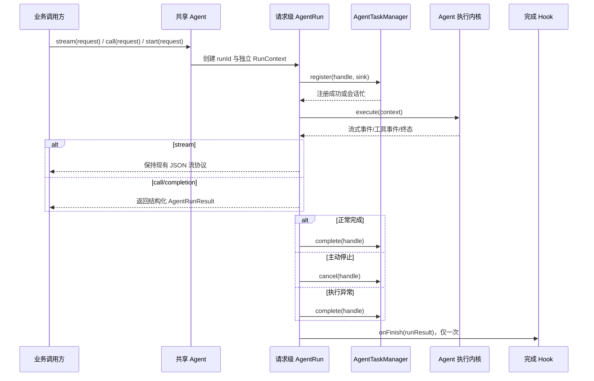
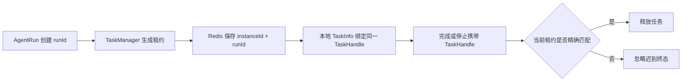
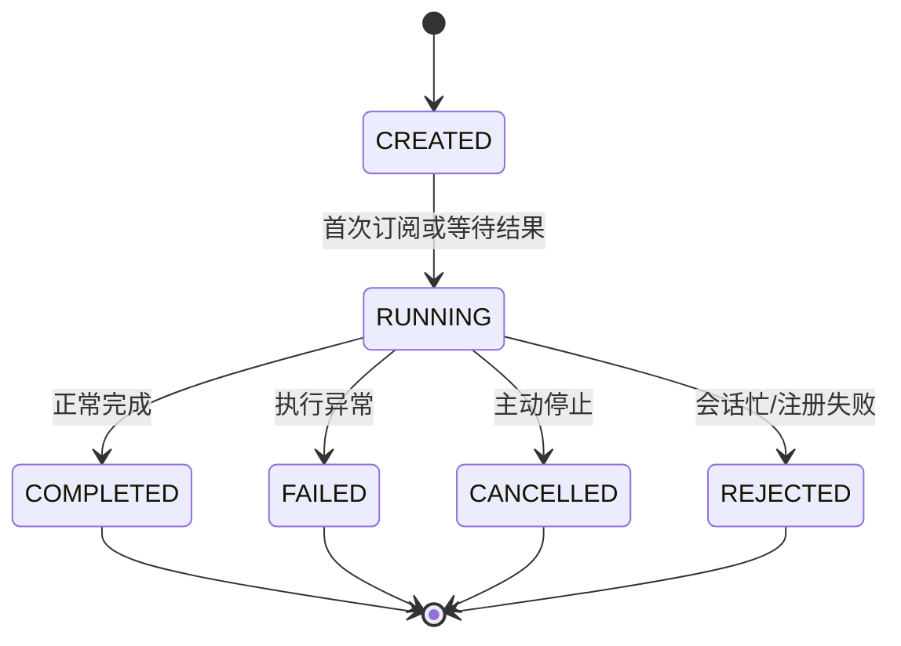

# 智能体实例共享技术设计说明书

> 功能标识：`agent-instance-sharing`
> 版本：V1.2.0
> SDD 等级：`S2`
> 来源需求：`spec/features/20260715/智能体实例共享-需求说明书.md`
> 文档状态：已完成
> 创建日期：2026-07-15
> 更新日期：2026-07-16

## 1. 设计概要

- 功能描述：将 Agent 从“实例即一次执行”调整为“共享不可变定义 + 每请求独立 AgentRun”，使同一 Agent 可安全处理连续请求和不同会话的并发请求，并同时提供流式输出和同步结构化非流式结果。
- 影响模块：`fons4ai-agent-common`、`fons4ai-agent-spring-ai-starter`。
- 关键技术点：公共运行契约、同步/流式双入口、请求级运行上下文、唯一任务句柄、原子终态、Redis 任务租约、会话记忆隔离、各 Agent 子类型运行态迁移。
- 依赖关系：复用 Reactor、Spring AI、Spring AI Alibaba、Redisson 和现有响应协议，不新增第三方依赖。
- 非目标：不新增 Agent 推理模式，不修改工具业务能力，不接入其他 AI 框架，不修改客户端流式消息结构，不增加与 `completion()` 重复的异步非流式 API。
- SDD 等级理由：变更公共 Agent 调用契约、任务协调消息和 Redis 租约结构，并跨越基础执行、ReAct、Plan-Execute、Skills 等核心流程，属于公共契约与跨核心模块 S2 变更。

### 1.1 技术栈与交付画像

| 项目事实 | 已确认结论 | 证据或原因 |
| --- | --- | --- |
| 项目形态 | 库/SDK 与 Spring Boot Starter | Maven 多模块工程，以 Common 契约和 Spring AI Starter 交付 |
| 主要语言与运行时 | Java 21、JVM、Reactor | 当前构建和源码事实 |
| 构建与测试入口 | Maven Reactor；Agent 聚焦测试使用 `-pl fons4ai-agent/fons4ai-agent-spring-ai-starter -am test` | 当前模块与既有测试入口 |
| 交付入口 | Maven 制品及 Spring Boot 自动配置 | 当前项目交付形态 |
| 独立可运行服务 | 否 | 本次调整框架组件，不新增独立服务、端口或部署单元 |
| 页面/交互型交付物 | 否 | 不涉及 UI |
| 数据结构变更 | 是 | Redis 任务租约值和停止消息增加 `runId`，详见 §4.5 |

## 2. 架构与调用链路

- 涉及入口：共享 Agent 的 `start(request)`、兼容入口 `stream(request)` 与同步非流式入口 `call(request)`。
- 涉及模块：Agent Common 提供稳定运行契约和任务句柄；Spring AI Starter 提供共享 Agent 基类和各执行适配。
- 涉及服务：不新增服务；继续使用现有模型、Redis/Redisson 和工具资源。
- 涉及核心对象：`Agent`、`AgentRun`、`AgentRunContext`、`AgentRunResult`、`AgentTaskHandle`、各 Agent 专属 RunContext。
- 涉及数据访问：仅调整现有 Redis 任务租约和停止 Topic 的内部值契约。
- 外部依赖：模型服务、Redis、工具提供方；调用方式不因本次变更新增。



### 2.1 生命周期分层

| 层级 | 生命周期 | 允许保存的状态 | 禁止保存的状态 |
| --- | --- | --- | --- |
| Agent 定义 | 应用级共享 | 模型、提示词、只读工具配置、限制、无状态 Hook/Advisor、共享资源服务 | 当前会话、sink、消息、计时、工具记录、技能激活、最终结果 |
| AgentRun | 每次请求 | runId、请求快照、运行上下文、任务句柄、终态、完成结果 | 其他请求的任何状态 |
| Conversation | 按 conversationId | 历史消息、可恢复 checkpoint | 当前订阅、Disposable、临时技能权限 |
| Infrastructure | 应用级共享 | TaskManager、Registry Provider、MemoryStore、受管线程池 | 请求专属缓冲区和终态标志 |

### 2.2 服务形态与运行态设计

- 模块形态：SDK/库包与 Spring Boot Starter 内部组件。
- 启动入口：不适用，不新增启动入口。
- 服务标识与监听端口：不适用。
- 运行环境与配置来源：沿用应用现有 Spring Boot 配置。
- 注册发现：不适用。
- 健康检查：不新增；Redis 和模型依赖沿用宿主应用治理方式。
- 核心运行链路：通过确定性模型替身和 Redisson 替身验证共享执行、停止与清理。
- 外部依赖：现有 Redis/Redisson、模型和工具；不新增依赖。
- 隔离与清理：每个 runId 独立收口；Redis key 保持现有前缀并继续使用 TTL。
- 下游接入验证：真实多实例 Redis 停止、TTL、混合版本升级和回滚依赖宿主应用部署拓扑，应在下游接入阶段验证；它不作为当前框架库/Starter 实现任务或人工 Gate 的前置条件。

## 3. API / RPC / 消息契约设计

### 3.1 公共接口列表

| 接口名称 | 类型 | 方法/标识 | 描述 | AC |
| --- | --- | --- | --- | --- |
| `Agent` | Java API | `start(request)`、`stream(request)`、`call(request)` | 共享 Agent 能力入口；`stream` 保留现有协议，`call` 同步返回结构化最终结果 | AC-001、AC-002、AC-009、AC-010 |
| `AgentRun` | Java API | `events()`、`completion()`、`cancel()` | 表示一次固定执行，提供事件流、最终结果和取消能力 | AC-003、AC-005 |
| `AgentTaskManager` | Java API | `registerTask`、`setDisposable`、`completeTask`、`cancelTask` | 使用 `AgentTaskHandle` 精确操作任务 | AC-004、AC-005 |
| Redis 任务租约 | Redis Key Value | `fons4ai-agent:task:<conversationId>` | 保存实例和 runId 归属，保持同会话互斥 | AC-004 |
| 远程停止命令 | Redis Topic | `fons4ai-agent:stop` | 携带 conversationId 和 runId，拒绝迟到停止命令 | AC-004、AC-009 |

### 3.2 `Agent` 契约

设计草图：

```java
public interface Agent {
    AgentRun start(AgentChatRequest request);

    default Flux<String> stream(AgentChatRequest request) {
        return Flux.defer(() -> start(request).events());
    }

    default AgentRunResult call(AgentChatRequest request) {
        // 实现时必须先拒绝 Reactor 非阻塞线程，再等待同一个 Run 的 completion。
        AgentRun run = start(request);
        return run.completion().block();
    }
}
```

- `Agent` 实现必须线程安全，构造后不得保存请求级可变状态。
- `stream(request)` 为冷流，每次订阅创建一个新 `AgentRun`。
- `call(request)` 为同步阻塞入口，每次调用只创建一个 `AgentRun`，并等待该 Run 的 `completion()`；不得订阅/解析 JSON 事件后另行拼装结果，也不得再次执行模型或工具。
- `call(request)` 在 Reactor 非阻塞线程上必须于创建 Run 前快速失败，避免阻塞事件循环和遗留已登记任务；响应式调用方使用 `start(request).completion()`。
- `call(request)` 不新增独立超时参数，沿用本次 Run 的模型、工具、Graph 和任务限制；需要调用侧响应式超时或取消时直接操作 `AgentRun`。
- 需要固定 runId、独立取消或读取完成结果的调用方使用 `start(request)`。
- `AgentChatRequest` 在创建 RunContext 时制作防御性快照，后续修改原请求对象不得影响执行。

### 3.3 `AgentRun` 契约

```java
public interface AgentRun {
    String runId();
    String conversationId();
    AgentRunState state();
    Flux<String> events();
    Mono<AgentRunResult> completion();
    boolean cancel();
}
```

- `events()` 表示固定执行，仅允许一个下游订阅者，保持当前单播行为。
- 订阅 `events()` 或 `completion()` 均可触发固定 Run 的 `startOnce`，多个入口竞争时只启动一次；因此同步 `call()` 无需同时消费事件流。
- `completion()` 在成功、失败或取消后均产生一个结构化 `AgentRunResult`；内部异常堆栈不进入公共结果。
- `cancel()` 通过本次任务句柄取消，重复调用返回 `false` 且不重复输出停止消息。
- `AgentRunState` 使用 `CREATED`、`RUNNING`、`COMPLETED`、`FAILED`、`CANCELLED`、`REJECTED`，终态不可逆。
- `AgentRunResult` 包含 runId、conversationId、终态、最终上下文以及可选错误码/安全错误消息；成功、失败、取消和拒绝均保证恰好一个结果，公共 API 不以 `null` 表示终态。

### 3.4 公共类型与模块边界

- `Agent`、`AgentRun`、`AgentRunState`、`AgentRunResult`、`AgentTaskHandle` 放入 `fons4ai-agent-common`，不得依赖 Spring AI 类型。
- 请求、历史消息和最终上下文的稳定 DTO 下沉到 Agent Common；历史消息角色改用项目自有枚举，由 Spring AI Starter 负责转换。
- `BaseAgent`、`AgentRunContext`、Spring AI 消息转换、原生 Graph 和模型适配保留在 `fons4ai-agent-spring-ai-starter`。
- 保留 `AgentResponse` 当前 JSON 字段和类型码，客户端流协议不变。

### 3.5 Hook 与扩展契约

- 完成 Hook 接收不可变 `AgentRunResult` 或其中的最终上下文，不再从共享 Agent getter 读取结果。
- 共享 Hook、Advisor 和 ToolCallback 必须无请求状态且线程安全；需要请求状态的扩展必须从 RunContext/ToolContext 获取，或使用每请求工厂。
- Alibaba 原生 Hook/Interceptor 如捕获技能激活集合，必须每请求创建，不得作为共享对象复用。
- 不提供 ThreadLocal 适配层，因为 Reactor 和工具执行会跨线程调度。

### 3.6 兼容性与迁移

- 保留 `agent.stream(request)` 和客户端流式 JSON 协议。
- 新增 `agent.call(request)`，它只扩展公共能力，不改变 `stream(request)` 的订阅、错误或停止语义。
- 响应式非流式调用统一使用 `agent.start(request).completion()`；不增加 `callAsync` 等同义接口。
- 移除共享 Agent 上的当前会话、当前问题、最终答案等请求态 getter；调用方改用 `AgentRun.completion()` 或完成 Hook。
- 当前无业务接入，不提供旧的“一实例一次调用”兼容标志，也不保留 `AGENT_INSTANCE_ALREADY_USED` 行为。
- Redis 租约采用新值格式，发布时要求同版本节点协同升级；旧临时 key 可等待 TTL 过期或在停机升级时清理。

## 4. 数据模型与 DDL 影响

### 4.1 数据影响判断

| 检查项 | 是否涉及 | 处理要求 |
| --- | --- | --- |
| 持久化数据新增、修改、删除或查询 | 否 | 不涉及数据库或业务持久化数据 |
| 外部数据入库、出库、同步、对账或报表 | 否 | 不适用 |
| 字段映射、金额、日期、状态、流水号或客户标识 | 否 | 不适用 |
| 敏感数据、权限、安全、脱敏、加密、审计或保留期限 | 是 | 请求、工具参数和技能内容不得写入完整日志或跨 Run 暴露 |
| 跨系统、跨服务、跨库或第三方数据流转 | 是 | 现有 Redis 任务租约和 Pub/Sub 内部契约增加 runId |

### 4.2 字段映射契约

不适用，原因：不涉及业务文件/API 入库、同步、对账、报表或业务字段迁移。

### 4.3 数据流设计



### 4.4 数据安全与合规设计

| 检查项 | 设计结论 | 验证方式 |
| --- | --- | --- |
| 敏感数据识别 | 请求正文、完整提示词、工具参数和技能正文视为不可直接记录内容 | 日志静态检查与测试日志复核 |
| 传输安全 | 沿用宿主应用对模型和 Redis 的安全配置，本次不新增通道 | 配置/依赖复核 |
| 存储加密 | 不新增持久化内容；Redis 租约只保存技术标识 | Redis 值契约测试 |
| 展示/日志脱敏 | 日志只记录 runId、conversationId、类型、长度和终态，不记录完整请求 | 日志调用静态检查 |
| 数据权限 | 技能和资源权限由请求级激活上下文控制 | 并发权限隔离测试 |
| 审计与追踪 | runId 贯穿注册、模型、工具、停止、完成和 Hook 日志 | 日志参数测试/人工复核 |
| 保留期限/删除/归档 | Redis 租约沿用 30 分钟 TTL，终态后精确删除 | TaskManager 测试 |
| 法规或公司治理要求 | 不新增个人或业务敏感数据处理 | 需求数据影响结论 |

### 4.5 结构变更详设

#### 4.5.1 结构变更总览

| 数据源/服务 | 结构对象 | 变更类型 | 现状证据 | 目标状态 | 影响 AC | 风险等级 |
| --- | --- | --- | --- | --- | --- | --- |
| Redis | `fons4ai-agent:task:<conversationId>` 值 | 修改 | 当前任务管理实现保存单一 instanceId | 保存版本化任务租约，包含 instanceId、runId、agentType | AC-004、AC-005 | 中 |
| Redis Pub/Sub | `fons4ai-agent:stop` 消息 | 修改 | 当前停止消息仅发送 conversationId | 发送版本化停止命令，包含 conversationId、runId | AC-004、AC-009 | 中 |

#### 4.5.2 现状结构证据

- 证据来源：当前 `AgentTaskManager` 运行实现和用户确认的同会话互斥/唯一执行需求。
- 证据状态：已确认。

| 字段/属性/键 | 当前类型 | 当前约束 | 当前用途 | 证据状态 |
| --- | --- | --- | --- | --- |
| Task key | String | 前缀 + conversationId，TTL 30 分钟 | 同会话分布式互斥 | 已确认 |
| Task value | String | instanceId | 标识任务所在应用实例 | 已确认 |
| Stop message | String | conversationId | 广播停止当前会话任务 | 已确认 |

#### 4.5.3 目标结构定义

| 字段/属性/键 | 技术含义 | 目标类型 | 必填 | 默认值 | 写入方/来源 | 生命周期 | 安全级别 | 确认状态 |
| --- | --- | --- | --- | --- | --- | --- | --- | --- |
| `version` | 租约/消息格式版本 | String | 是 | `1` | TaskManager | 随租约/消息 | 普通 | 已确认 |
| `instanceId` | 持有任务的应用实例 | String | 是 | 无 | TaskManager | 租约 TTL 内 | 内部 | 已确认 |
| `runId` | 唯一执行身份 | String | 是 | 无 | AgentRun | 单次执行 | 内部 | 已确认 |
| `agentType` | Agent 类型 | String | 是 | 无 | AgentRun | 租约 TTL 内 | 普通 | 已确认 |
| `conversationId` | 停止命令目标会话 | String | 停止消息必填 | 无 | 停止调用方 | 单条消息 | 内部 | 已确认 |

#### 4.5.4 约束与关系

| 类型 | 名称 | 属性 | 规则 | 目的 | 兼容性影响 | 确认状态 |
| --- | --- | --- | --- | --- | --- | --- |
| 唯一租约 | conversation lease | conversationId | 同一时刻 Redis 只允许一个值 | 保持同会话互斥 | 值格式不兼容旧版本 | 已确认 |
| 精确匹配 | task handle match | conversationId + runId | 完成、取消、TTL 刷新只处理匹配租约 | 阻断迟到终态 | 无客户端影响 | 已确认 |
| TTL | task lease ttl | key | 30 分钟并每 5 分钟续期 | 长任务存活和故障回收 | 沿用现状 | 已确认 |

#### 4.5.5 数据迁移、回填与清理

| 场景 | 数据范围 | 处理方式 | 幂等要求 | 失败处理 | 验证方式 |
| --- | --- | --- | --- | --- | --- |
| 旧租约清理 | `fons4ai-agent:task:*` 临时 key | 无业务接入时协调停机升级；等待 TTL 或在确认无任务后清理 | 重复清理安全 | 保留等待 TTL | Redis 替身测试与人工部署检查 |
| 停止消息升级 | 临时 Pub/Sub 消息 | 同版本节点同时启用新消息格式 | 重复停止由 runId 幂等过滤 | 非法/旧格式记录告警并忽略 | 消息解析和迟到命令测试 |

#### 4.5.6 参考结构表示（非执行脚本）

```json
{
  "version": "1",
  "instanceId": "node-a",
  "runId": "run-uuid",
  "agentType": "react"
}
```

停止消息：

```json
{
  "version": "1",
  "conversationId": "conversation-id",
  "runId": "run-uuid"
}
```

### 4.6 ER 设计

不适用，原因：不涉及数据库表或实体关系。

### 4.7 SQL/DDL 影响

- 是否涉及持久化结构变化：否。
- SQL 知识快照：无。
- DDL 证据状态：不适用。
- 结构详设位置：Redis 内部结构见 §4.5。
- 迁移位置：不适用。
- 执行型变更 DDL：不适用。
- 回滚思路：回退代码并等待/清理临时 Redis 租约，不涉及业务数据恢复。

### 4.8 运行初始化 DML / Seed 数据

不适用，原因：不需要系统账号、默认配置、权限、字典或其他初始化数据。

## 5. 核心逻辑设计

### 5.1 BaseAgent 共享执行模板

- 触发条件：调用 `call(request)`，或订阅 `stream(request)` / `start(request)` 返回 Run 的事件或完成结果。
- 输入：经过边界校验和防御性复制的请求快照。
- 处理步骤：创建 RunContext → 注册任务句柄 → 启动子类执行 → 适配事件 → 原子终态 → 完成结果与 Hook → 精确释放任务。
- 输出：流式入口返回保持现有协议的事件 Flux；同步入口一次返回 `AgentRunResult`；显式 Run 提供结构化完成 Mono。
- 异常分支：会话忙进入 REJECTED；同步/异步异常进入 FAILED；主动停止进入 CANCELLED。
- 幂等要求：Run 启动一次，任务登记一次，终态一次，Hook 一次，任务释放一次。

```text
function start(request):
  snapshot = validateAndCopy(request)
  context = newRunContext(runId(), snapshot)
  return new AgentRun(context, startOnce = () -> execute(context))

function call(request):
  rejectIfReactorNonBlockingThread()
  run = start(request)
  return requireNonNull(run.completion().block())

function terminate(context, terminalState, error):
  if !context.state.compareAndSet(RUNNING, terminalState):
      return
  finishSinkOnce(context)
  completeTask(context.taskHandle)
  completeResultOnce(context, error)
  invokeHookOnce(context)
```

### 5.2 请求级上下文

`AgentRunContext` 至少包含：

- 不可变：runId、Agent 类型、请求快照、conversationId、question、params、创建时间。
- 运行资源：独立 sink、完成结果 sink、StopWatch、TaskHandle、主订阅和并行任务组成的取消资源树。
- 聚合状态：并发安全的 usedTools、thinking/finalAnswer/recommendations/references/skills。
- 终态控制：原子状态、started、finalized、hookInvoked 和独立于 TaskManager 注册状态的 cancellationRequested。
- 辅助能力：`emit`、`recordUsedTool`、`recordFirstResponse`、`finish`，均只操作本上下文。

`BaseAgent` 移除所有 `currentXxx`、sink、计时器、工具集合和最终结果实例字段；共享锁不能作为请求隔离手段。

### 5.3 ReAct 与 Web Search

- `ReactAgentRunContext` 保存消息、轮次计数、最终发送标志和 ReAct 聚合缓冲区。
- `WebSearchAgentRunContext` 保存搜索/提取结果和 referenceJson。
- `scheduleRound`、工具执行、强制最终轮和完成响应均显式接收 RunContext。
- 并行工具调度必须登记到当前 Run 的取消资源树；同步工具无法中断时采用最佳努力取消，返回后的迟到结果不得写入上下文或启动下一轮。
- 共享 `ChatClient`、只读工具列表和无状态 Advisor；工具结果、轮次和引用不可写入 Agent 字段。
- 正常结束调用 `completeTask(handle)`，不得复用主动停止流程清理正常任务。

### 5.4 Plan-Execute

- `PlanExecuteRunContext` 保存 `DeepResearchExecuteContext`、RunnableConfig、最近 Graph 状态、summaryInThink、references 和 Graph Disposable。
- Graph 构建/运行可以每请求创建；模型、工具、checkpoint saver 和受管线程池共享。
- Agent 自建工具线程池只在共享 Agent Bean 销毁时关闭，禁止单次请求结束时 shutdown。
- checkpoint release 使用本次 RunContext 的 RunnableConfig，禁止读取共享实例字段；只允许在 Graph 完成、失败或取消信号真正终止后的 `doFinally` 阶段释放，并以 Run 级 CAS 保证一次。
- 图节点和工具任务通过 RunContext 判断取消，不读取其他执行的 finished 标志。

### 5.5 Skills Agent

- 共享：原始 SkillRegistry、资源解析器工厂/不可变实现、工具绑定配置、模型和限制配置。
- 每请求：技能目录快照引用、绑定该快照的资源解析视图、激活集合、受控 Registry、动态工具包装、资源拦截器、Alibaba delegate、StreamState 和原生终态标志。
- Alibaba delegate 每请求创建，因为 Skills Hook 和 Interceptor 捕获请求级授权状态；不直接共享原生 delegate。
- 移除一次性实例保护；并发安全由独立 Skills RunContext 保证。
- `autoReload` 通过共享 Catalog Provider 原子发布新快照；每个运行固定使用启动时快照，执行中不切换。
- 技能正文仍只在 `read_skill` 后进入模型上下文；快照/缓存行为不得改变渐进式开放语义。
- 捕获目录时先限制技能数量，再读取正文；正文和资源均按 UTF-8 字节限制。文件系统列表跳过符号链接，read/describe 仍通过真实路径验证根目录边界。

### 5.6 会话记忆

- ChatMemory/MemoryStore 作为共享服务按 conversationId 访问，不再通过共享 Agent 当前会话判断是否启用。
- 每次运行先复制并排序传入历史消息，不修改调用方集合。
- BaseAgent 统一决定当前问题写入一次；子类只能读取已准备的消息快照，不重复追加。
- 同会话任务互斥保证同一时刻只有一个执行写入对应会话记忆。

### 5.7 任务句柄与停止

- `registerTask` 生成/接收 `AgentTaskHandle(conversationId, runId)` 并返回句柄。
- `setDisposable`、`completeTask`、内部 cancel 均必须携带句柄并校验本地 TaskInfo 和 Redis 租约。
- 外部 `stopTask(conversationId)` 先读取当前租约，再发布包含 runId 的命令；接收方只停止精确匹配任务。
- Redis 释放采用原子 compare-and-delete 语义，不能使用先 get 后无条件 delete 的竞态流程。

## 6. 领域建模与业务规则落地

本项目为技术框架，采用 DDD-lite 的运行边界治理，不虚构业务领域对象。

| 规则/行为 | 归属对象 | 实现方式 | 验证方式 |
| --- | --- | --- | --- |
| Agent 不保存请求态 | `BaseAgent`/具体 Agent | 构造后配置不可变，运行数据进入 RunContext | 反射契约测试、并发测试 |
| 每次执行唯一 | `AgentRun` | runId 与单次启动原子标志 | 连续复用和重复启动测试 |
| 同会话互斥 | `AgentTaskManager` | Redis 租约和本地 TaskInfo | 注册冲突测试 |
| 精确终态清理 | `AgentTaskHandle` | conversationId + runId 条件匹配 | 迟到终态测试 |
| 技能权限隔离 | `SkillsAgentRunContext` | 每请求激活集合和工具包装 | 双请求权限隔离测试 |
| 会话记忆隔离 | 共享 MemoryStore + RunContext | conversationId 定位，消息防御性复制 | 多会话记忆测试 |

- 核心对象：AgentDefinition（共享能力）、AgentRun（单次执行）、AgentTaskHandle（任务身份）。
- 应用编排职责：BaseAgent 负责创建运行、任务登记、事件输出和统一终态；具体 Agent 只负责执行算法。
- 基础设施边界：Spring AI、Alibaba Graph、Redisson、ChatMemory 保留在适配/基础设施实现中，不进入核心运行语义。

## 7. 状态流转设计

| 当前状态 | 触发动作 | 前置条件 | 目标状态 | 失败处理 | 幂等 |
| --- | --- | --- | --- | --- | --- |
| CREATED | 首次订阅/等待结果 | 同一 Run 尚未启动 | RUNNING | 后续注册失败进入 REJECTED | 同一 Run 只允许一次 |
| RUNNING | 任务注册前后收到取消 | cancellationRequested 已固定 | CANCELLED | 注册成功后精确清理刚登记句柄，不启动底层执行 | 取消意图只登记一次 |
| RUNNING | 任务注册失败 | 会话忙或基础设施异常 | REJECTED | 返回明确错误 | 终态不可逆 |
| RUNNING | Graph/模型正常完成 | 最终结果已形成 | COMPLETED | 无 | CAS 一次 |
| RUNNING | 执行异常 | 尚未进入其他终态 | FAILED | sink error + 安全错误结果 | CAS 一次 |
| RUNNING | 主动停止/取消 | 任务句柄匹配 | CANCELLED | 不匹配则忽略 | CAS 一次 |
| 任意终态 | 迟到完成、异常或停止 | 已终态 | 原状态 | 忽略迟到事件 | 必须幂等 |



## 8. 异常、安全、事务与性能

### 8.1 异常处理

| 异常场景 | 处理方式 | 用户可见结果 | 日志要求 |
| --- | --- | --- | --- |
| 同会话已有任务 | Run 进入 REJECTED，不启动执行 | 沿用会话忙错误 | 记录 conversationId、runId，不记录问题正文 |
| 模型/工具/Graph 异常 | 当前 Run 进入 FAILED并释放句柄 | 沿用错误流语义 | 仅执行边界记录一次堆栈 |
| 主动停止 | 精确匹配 handle 后取消 Disposable | 沿用“用户已停止生成” | 记录 runId 和停止来源 |
| 迟到终态或停止命令 | 条件不匹配，忽略 | 无 | debug/warn，不影响新任务 |
| Hook 异常 | 记录但不得破坏已完成的客户端流和任务清理 | 无新增客户端错误 | warn/error，避免重复终态 |
| Redis 暂时异常 | 注册失败或停止失败明确返回，不假定成功 | 项目既有任务管理错误 | 保留 cause，不记录敏感内容 |
| 在 Reactor 非阻塞线程调用 `call` | 创建 Run 前快速失败 | 明确的阻塞调用边界错误 | 仅记录调用入口，不记录请求正文 |
| 非流式执行失败或被拒绝 | `completion()` 生成 FAILED/REJECTED 结果 | `call` 返回结构化终态和安全错误信息 | 异常堆栈只在执行边界记录一次 |

### 8.2 安全与权限

- 鉴权：不新增鉴权机制，沿用宿主应用边界。
- 权限：技能工具和资源权限以单次 Skills Run 激活集合为准。
- 数据校验：conversationId、question、runId、租约版本和停止消息格式在边界校验。
- 敏感信息脱敏：禁止完整序列化请求、提示词、工具参数、技能正文和模型响应到日志。
- 防注入/越权：不使用 ThreadLocal 或共享可变 Map 传递权限；动态工具执行入口再次校验本 Run 激活状态。

### 8.3 事务与一致性

- 事务边界：不涉及数据库事务。
- 一致性模型：本地 TaskInfo 与 Redis 租约使用同一 runId；终态按精确句柄条件释放。
- 并发控制：不同会话无全局锁并行；同会话由 Redis `setIfAbsent` 互斥；Run 终态由 CAS 控制。
- 缓存一致性：无业务缓存；技能目录快照使用原子替换并由运行固定引用。
- MQ/事件一致性：Redis Pub/Sub 停止命令包含 runId，重复/迟到命令幂等忽略。
- 失败补偿：注册 Redis 成功但本地登记失败时必须释放匹配租约；本地终态清理失败由 TTL 最终回收。

### 8.4 性能

- 查询性能/索引影响：不适用。
- 缓存策略：共享不可变模型客户端、工具目录、技能目录快照和线程池；不缓存请求状态。
- 限流策略：沿用模型/工具调用限制和同会话互斥，不新增全局限流。
- 预期性能指标：不同会话不得因 Agent 实例锁被串行；每请求只创建轻量 RunContext、运行适配器和必要的请求级 Hook。
- 阻塞边界：`call()` 占用调用线程直至 Run 终态，不创建隐藏线程池；不得在 Reactor 非阻塞线程调用，响应式链路使用 `completion()`。
- 资源释放：Disposable、Graph checkpoint 和请求级缓存由 Run 终态释放；共享线程池由 Bean 生命周期释放。

## 9. 技术决策

- 决策 D-001：共享无状态 Agent + 每请求 AgentRun。
  - 原因：符合 Spring 单例使用方式，同时保持请求、权限和终态隔离。
  - 替代方案：每请求完整 Agent、共享有状态 Agent、全局同步锁。
  - 影响：BaseAgent 和所有继承实现必须改为显式 RunContext。

- 决策 D-002：引入显式 `AgentRun` 公共契约并保留 `stream(request)`。
  - 原因：流式简化入口保持易用性；显式 Run 为取消、runId 和完成结果提供稳定入口。
  - 替代方案：只返回 Flux、通过 Agent getter 获取结果。
  - 影响：移除共享 Agent 的请求态 getter，结果通过 Run/Hook 获取。

- 决策 D-003：任务操作使用不可伪造的 `AgentTaskHandle`。
  - 原因：仅使用 conversationId 无法区分旧执行和后续新执行。
  - 替代方案：在 Agent 内维护 conversationId 到上下文 Map。
  - 影响：TaskManager API、Redis 值和停止消息升级。

- 决策 D-004：不采用 ThreadLocal、请求状态 Map 或全局同步锁。
  - 原因：Reactor/工具会跨线程；Map 容易泄漏且保留隐式依赖；全局锁破坏并发目标。
  - 影响：所有辅助方法显式接收 RunContext。

- 决策 D-005：Skills 的 Alibaba delegate 每请求创建。
  - 原因：Hook、Interceptor 和动态工具捕获请求级激活权限；共享 delegate 风险高于对象创建收益。
  - 替代方案：直接共享 Alibaba delegate。
  - 影响：共享模型、目录和配置，隔离 delegate 与授权状态。

- 决策 D-006：公共运行契约不暴露 Spring AI 类型。
  - 原因：Spring AI 是当前适配，不是长期唯一实现。
  - 替代方案：继续让公共请求历史直接使用 Spring AI MessageType。
  - 影响：引入项目自有消息角色并在 Starter 转换。

- 决策 D-007：同步非流式入口返回 `AgentRunResult`，响应式非流式复用 `completion()`。
  - 原因：结构化结果可统一表达成功、失败、取消、拒绝以及最终上下文；复用同一个 Run 可避免流式与非流式形成两套执行逻辑。
  - 替代方案：返回纯文本 `String`，或额外增加 `callAsync()`。
  - 影响：`Agent` 增加阻塞 `call(request)`；所有具体 Agent 必须通过现有 Run 聚合结果，不得实现独立非流式模型链路。

- 新增依赖：否。
- 新增抽象：是，`Agent`、`AgentRun`、`AgentRunResult`、`AgentTaskHandle` 和分层 RunContext；用于建立长期生命周期边界。

## 10. 验证策略、AC 映射与风险

### 10.1 验证策略

| 验证对象 | 验证方式 | 覆盖 AC |
| --- | --- | --- |
| BaseAgent 共享与隔离 | 可控测试 Agent 并发执行两个会话，校验事件、结果、Hook、工具记录 | AC-001、AC-002、AC-003、AC-005 |
| TaskManager 精确句柄 | Redis 替身验证迟到 complete/cancel/stop、TTL 和 compare-delete | AC-004、AC-005 |
| React/Web Search | 可控 ChatModel 执行并发 ReAct 和引用输出 | AC-006、AC-009 |
| Plan-Execute | 两个 RunContext 并发构建/运行 Graph，校验状态和线程池生命周期 | AC-006 |
| Skills | 两请求共享 Agent，只有一方激活技能并访问专属工具/资源 | AC-006、AC-007 |
| ChatMemory | 多会话历史隔离、当前问题单次写入、输入集合不被修改 | AC-008 |
| 客户端协议 | 对文本、思考、引用、推荐、错误、停止 JSON 做契约快照 | AC-009 |
| 非流式公共契约 | 对每类 Agent 使用 `call()`，验证单次执行、结构化终态、完整最终上下文、失败/拒绝结果及非阻塞线程快速失败 | AC-010 |
| 双模式一致性 | 使用同一可控模型场景分别执行 `stream()+completion()` 与 `call()`，校验最终结果语义一致且流式协议未变化 | AC-009、AC-010 |
| 完整回归 | Agent 模块聚焦测试、Reactor 构建、静态扫描实例请求字段 | AC-001 至 AC-010 |

### 10.2 AC 映射

| AC | 技术实现 | 验证方式 |
| --- | --- | --- |
| AC-001 | Agent 共享配置 + 每请求 RunContext | 不同会话并发测试 |
| AC-002 | 冷流 `stream` 和可重复 `start` | 同实例连续执行测试 |
| AC-003 | RunContext 聚合状态和完成结果 | 事件/Hook/结果隔离测试 |
| AC-004 | runId、TaskHandle、版本化 Redis 租约/停止命令 | 迟到终态和远程停止测试 |
| AC-005 | 原子状态机与 finalizeOnce | 终态竞争测试 |
| AC-006 | React/Plan/Skills 专属 RunContext | 各 Agent 共享实例测试 |
| AC-007 | Skills 请求级激活集合、工具包装和 delegate | 双请求技能权限测试 |
| AC-008 | 共享 MemoryStore 按会话访问与消息快照 | 多会话记忆测试 |
| AC-009 | AgentResponse 协议保持、主动停止分支独立 | 协议契约测试 |
| AC-010 | `call()` 复用 `start().completion()` 与 Run 的 `startOnce` | 各 Agent 非流式契约、单次执行、失败/拒绝和线程边界测试 |

### 10.3 风险与回滚

| 编号 | 风险 | 影响 | 处理方式 |
| --- | --- | --- | --- |
| R-001 | 遗漏实例级请求字段 | 并发串流或结果污染 | 静态扫描 + 每个 Agent 并发测试 |
| R-002 | 扩展 Hook/ToolCallback 非线程安全 | 共享实例产生竞态 | 明确线程安全契约；请求态扩展改用工厂 |
| R-003 | TaskManager 本地与 Redis 状态不一致 | 任务无法停止或被误清理 | runId 精确匹配、原子删除、TTL 回收 |
| R-004 | Plan-Execute 关闭共享线程池 | 后续请求失败 | 线程池改为 Bean/Agent 生命周期并测试连续执行 |
| R-005 | Skills reload 改变运行中快照 | 权限或提示词不稳定 | 运行固定快照，reload 原子发布新快照 |
| R-006 | 公共 API 调整遗漏调用点 | 编译或行为回归 | 全仓调用扫描与 Reactor 构建 |
| R-007 | `call()` 在事件循环阻塞或形成第二套执行链路 | 线程饥饿、重复模型/工具调用、结果不一致 | 非阻塞线程快速失败、Run `startOnce`、双模式一致性和调用计数测试 |

回滚：整体回退公共契约和各 Agent 迁移；停止所有运行任务后回退 TaskManager，旧 Redis 临时租约等待 TTL 或人工确认后清理。无数据库、业务数据和 DDL 回滚。

### 10.4 知识同步影响

- 是否需要知识同步：是。
- 能力域运行文档：建议后续建立/更新 `agent-orchestration` 能力域运行文档，记录共享 Agent 与请求级 Run 生命周期。
- 项目运行架构文档：需在实现验证后将 Agent 生命周期从“单次请求实例”更新为“共享定义 + 请求级执行”。
- 知识卡片：建议沉淀 AgentRun 状态机和任务句柄不变量。
- SQL 知识快照：无。
- Knowledge Sync Needed: yes。

## 11. 证据清单

| 关键结论 | 证据来源 | 证据等级 | 状态 |
| --- | --- | --- | --- |
| 目标生命周期为共享 Agent + 每请求独立执行 | 用户确认、正式需求 Q2/REQ-001/REQ-002 | L2 | 已验证 |
| 当前无业务接入，可进行公共契约调整 | 用户确认、正式需求 Q3 | L2 | 已验证 |
| 当前请求状态位于共享 Agent 实例字段 | `BaseAgent`、React、Plan-Execute、Skills 当前源码 | L2 | 已验证 |
| 当前任务租约仅保存 instanceId，停止消息仅含 conversationId | `AgentTaskManager` 当前运行实现 | L3 | 已验证 |
| Redis 租约必须增加唯一执行身份 | 正式需求 REQ-003、AC-004 和用户确认 | L3 | 已验证 |
| Agent 编排属于项目核心能力且公共契约存在耦合风险 | 项目技术能力和运行架构基线 | L1 | 已验证 |
| 当前已有 TaskManager、Plan、Skills 聚焦测试可扩展 | Agent Starter 现有测试 | L1 | 已验证 |
| 不涉及数据库、DDL 或业务持久化数据 | 正式需求数据影响结论、受影响源码范围 | L2 | 已验证 |
| 非流式采用同步 `call(request)` 返回结构化结果，响应式场景复用 `completion()` | 用户对 CR-001 推荐方案的明确确认、正式需求 Q4/REQ-008/AC-010 | L2 | 已验证 |

## 12. 版本修订记录

| 日期 | 版本 | 说明 |
| --- | --- | --- |
| 2026-07-15 | V1.0.0 | 初始化共享 Agent 与请求级运行上下文技术设计 |
| 2026-07-15 | V1.1.0 | CR-001 增加同步非流式 `call(request)`、线程边界和双模式一致性设计 |
| 2026-07-16 | V1.2.0 | 明确下游联调边界，调整最终评审覆盖 T009/AC-010，并补充评审发现的取消与资源快照约束 |
