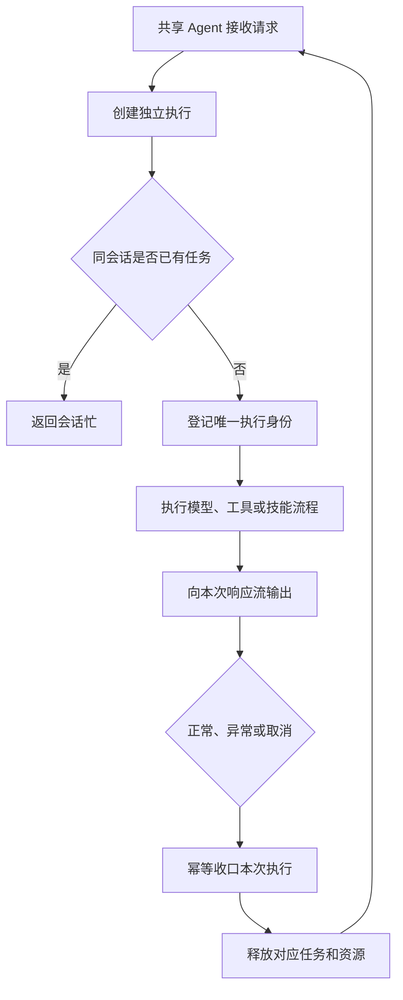

# 智能体实例共享需求说明书

> 功能标识：`agent-instance-sharing`
> 版本：V1.1.0
> 文档状态：已确认
> 创建日期：2026-07-15
> 更新日期：2026-07-15

## 一句话说明

让上层业务系统能够安全复用同一个已配置的 Agent，同时确保每次请求的消息、状态、工具权限和任务生命周期完全隔离。

## 需求澄清摘要

### 已确认内容

| 序号 | 澄清问题 | 已确认结论 | 影响范围 |
| --- | --- | --- | --- |
| Q1 | 本次变更应归入既有模块拆分功能还是独立立项？ | 独立新建“智能体实例共享”S2 功能，不挂接到已完成的模块拆分功能。 | 功能归属、SDD 等级、验收范围 |
| Q2 | Agent 长期生命周期采用共享实例还是每请求创建完整实例？ | Agent 作为无请求状态的能力定义可被共享；每次请求创建独立运行上下文，运行状态不得保存在共享实例中。 | 核心流程、并发隔离、安全、验收 |
| Q3 | 是否需要兼容已有业务接入方式？ | 当前框架尚无业务接入，不保留旧的“每请求创建完整 Agent”使用约束；保留现有客户端流式消息协议和同会话任务互斥行为。 | 兼容范围、公共行为、迁移风险 |
| Q4 | 非流式调用采用什么公共返回契约？ | 增加同步 `call(request)` 并返回结构化 `AgentRunResult`；响应式非流式调用复用 `start(request).completion()`，不增加重复的异步 API。 | 公共 API、执行语义、异常与测试 |

### 待确认内容

- 无。

## 背景与目标

- 背景：Fons4AI 是供上层业务系统接入的 Agent 开发框架。当前 Agent 将请求运行状态保存在实例中，依赖“一次请求创建一个实例”保证隔离。
- 当前问题：这种生命周期约束不符合 Spring 应用常用的共享组件使用方式；如果业务方错误复用实例，会发生请求状态覆盖、流式输出串用、技能权限串用和任务误清理。
- 目标：让同一个已配置 Agent 可以安全服务多个会话和并发请求，每次执行仍保持完整隔离，并为后续 Agent 注册、路由和统一治理建立稳定的生命周期模型。
- 不做会怎样：业务接入方必须理解并正确维护特殊实例作用域；随着 Agent 类型和并发量增加，误用实例的安全与稳定性风险会持续放大。

## 需求范围

### 本次包含

- Agent 配置和请求运行状态分离。
- 同一个 Agent 支持不同会话并发执行。
- 每次执行拥有独立的消息、流式或非流式输出、计时、工具记录、最终结果和终态控制。
- ReAct、Web Search、Plan-Execute 和 Skills Agent 采用一致的运行隔离模型。
- 技能激活、动态工具权限和技能资源权限按单次执行隔离。
- 任务注册、停止、正常完成和迟到回调按唯一执行身份隔离。
- 会话记忆按会话标识隔离，当前问题不得重复写入。
- 保持现有客户端流式消息类型和内容结构不变。
- 提供同步非流式调用，一次返回包含终态和最终上下文的结构化结果。

### 本次不包含

- 新增新的 Agent 推理模式或业务能力。
- 接入非 Spring AI 的其他 Agent 框架。
- 改变工具业务能力、技能内容或技能资源目录规则。
- 修改数据库表、持久化业务数据或生产部署架构。
- 为尚未接入的业务系统提供旧实例创建方式的兼容层。

## 角色与场景

| 角色或参与方 | 使用场景 | 触发条件 | 期望结果 |
| --- | --- | --- | --- |
| 框架接入开发者 | 在 Spring 应用中配置并复用 Agent | 应用启动后持续接收多个对话请求 | 无需为每次请求重建完整 Agent，且请求互不影响 |
| 最终对话用户 | 并发使用 Agent 获取流式或一次性回答 | 不同会话同时执行 | 只收到本次请求的流式内容或结构化最终结果 |
| 运维或任务控制方 | 停止指定会话的运行任务 | 用户取消、超时或远程停止 | 只停止目标执行，不影响其他会话或后续新任务 |
| Agent 扩展开发者 | 开发新的 Agent 类型或 Hook | 扩展共享 Agent 执行能力 | 有统一的请求运行上下文和生命周期边界可复用 |

## 需求列表

| 需求编号 | 需求内容 | 优先级 | 关联场景 | 关联验收 |
| --- | --- | --- | --- | --- |
| REQ-001 | 已配置的 Agent 必须能够作为共享能力被重复调用，不要求调用方按请求重新创建完整实例。 | P0 | Agent 共享接入 | AC-001、AC-002 |
| REQ-002 | 每次执行必须拥有独立运行状态，任何请求的输出、计时、消息、工具记录和最终结果不得进入其他请求。 | P0 | 并发执行 | AC-001、AC-003 |
| REQ-003 | 任务停止、正常完成和资源清理必须绑定唯一执行身份，旧执行的迟到终态不得清理后续任务。 | P0 | 任务控制 | AC-004、AC-005 |
| REQ-004 | 所有基于统一 Agent 基础能力实现的 Agent 类型必须遵守相同的共享和隔离规则。 | P0 | Agent 扩展 | AC-006 |
| REQ-005 | 技能激活、技能工具和资源访问权限必须限定在触发它们的单次执行中。 | P0 | Skills Agent | AC-007 |
| REQ-006 | 会话历史必须继续按会话隔离；一次请求的当前问题只能加入一次上下文。 | P1 | 多轮对话 | AC-008 |
| REQ-007 | 本次调整不得改变客户端现有流式消息协议和用户主动停止的可观察语义。 | P0 | 客户端接入 | AC-009 |
| REQ-008 | 共享 Agent 必须支持同步非流式调用并返回结构化最终结果；流式与非流式必须复用同一次执行模型和生命周期语义。 | P0 | Agent 同步接入 | AC-010 |

## 业务规则

| 规则编号 | 规则内容 | 适用场景 | 例外或边界 |
| --- | --- | --- | --- |
| BR-001 | Agent 共享只共享稳定配置和无请求状态的依赖，不共享任何单次执行状态。 | 所有 Agent 执行 | 无 |
| BR-002 | 不同会话可以在同一个 Agent 上并发执行。 | 并发执行 | 受应用总体资源限制约束 |
| BR-003 | 同一会话同一时间只允许一个运行任务。 | 任务注册 | 已完成或已停止的任务释放后允许新任务 |
| BR-004 | 正常完成只释放任务占用，不得产生“用户停止生成”消息。 | 正常终态 | 无 |
| BR-005 | 用户主动停止只作用于目标执行，并保留现有停止提示语义。 | 取消执行 | 目标任务不存在时不得影响其他任务 |
| BR-006 | 每次执行的完成回调、流完成和任务清理最多各生效一次。 | 所有终态 | 正常、异常和取消竞争时同样适用 |
| BR-007 | 技能只有在本次执行成功读取后才视为激活，其他执行不得继承该权限。 | Skills Agent | 无 |
| BR-008 | `call(request)` 必须只创建并启动一个执行，等待该执行的完成结果，不得通过再次调用模型或解析客户端流事件拼装结果。 | 同步非流式调用 | 调用方需要自定义响应式超时时使用 `start(request).completion()` |

## 业务流程

### 主要流程

1. 应用启动并完成 Agent 配置，Agent 作为共享能力持续提供服务。
2. 请求到达后，系统为该请求创建独立执行并分配唯一执行身份。
3. 系统校验同一会话是否已有任务，成功后登记本次任务。
4. Agent 使用共享配置和本次独立状态执行模型、工具或技能流程；流式调用持续输出事件，非流式调用等待结构化完成结果。
5. 正常、异常或取消发生后，系统只收口本次执行，向调用方交付对应输出并释放任务和运行资源。
6. 同一个共享 Agent 可以继续接收后续请求，不残留上一请求的状态或权限。

### 异常或分支

- 同一会话已有任务时，新请求明确返回会话忙，不改变原任务。
- 用户取消时，仅取消目标执行，并完成对应响应流。
- 模型、工具或 Graph 异常时，仅结束本次执行并释放对应任务。
- 旧执行的迟到回调与新执行竞争时，迟到回调不得清理或完成新任务。

### 流程图

## 业务数据口径

### 数据影响判断

| 检查项 | 是否涉及 | 说明 |
| --- | --- | --- |
| 新增、修改、删除或查询持久化数据 | 否 | 不修改业务持久化数据或数据库结构 |
| 外部数据入库、出库、同步、对账或报表 | 否 | 不涉及 |
| 字段映射、金额、日期、状态、流水号或客户标识 | 否 | 不涉及业务数据口径 |
| 手机号、证件号、银行卡、合同、地址、交易流水等敏感数据 | 否 | 不新增敏感数据处理 |
| 跨系统、跨服务、跨库或第三方数据流转 | 否 | 保持现有模型、工具和任务协调链路，不新增数据流转 |

### 关键数据口径

不适用，原因：本需求调整 Agent 运行生命周期，不新增或改变业务数据。

## 影响说明

| 影响对象 | 影响说明 |
| --- | --- |
| 框架接入开发者 | Agent 可以按共享组件使用，不再承担按请求创建完整实例的约束 |
| 既有 Agent 类型 | 执行状态迁移到每请求独立上下文，外部流式结果保持一致 |
| 任务控制 | 任务操作从仅按会话识别升级为同时识别唯一执行，避免迟到终态误清理 |
| 会话记忆 | 保持按会话隔离，运行过程不再依赖共享 Agent 的当前会话字段 |
| Skills 权限 | 技能激活和动态工具权限按执行隔离，不能跨请求继承 |
| 长期扩展 | 新 Agent 类型必须基于统一运行上下文实现，不得在共享 Agent 保存请求状态 |
| 公共调用方式 | 在保留 `stream(request)` 的基础上增加同步 `call(request)`；异步非流式调用通过执行对象的完成结果获取 |

## 验收标准

- AC-001：Given 一个已配置且共享的 Agent，when 两个不同会话并发发起请求，then 两个请求均可完成，且各自只收到自己的流式内容和最终结果。关联需求：REQ-001、REQ-002。
- AC-002：Given 一个共享 Agent 已完成一次请求，when 同一实例继续执行后续请求，then 后续请求无需重新构建完整 Agent，且不读取前一次请求的临时状态。关联需求：REQ-001。
- AC-003：Given 两个请求并发执行，when 任一请求产生思考内容、工具记录、推荐内容或完成回调，then 这些信息只归属于对应执行。关联需求：REQ-002。
- AC-004：Given 请求 A 已停止或已结束且请求 B 随后使用相同会话开始，when 请求 A 的迟到终态到达，then 请求 B 的任务登记和响应流保持有效。关联需求：REQ-003。
- AC-005：Given 一个执行同时收到正常完成、异常或取消信号，when 多个终态发生竞争，then 完成回调、任务清理和响应流终止最多各生效一次。关联需求：REQ-003。
- AC-006：Given ReAct、Web Search、Plan-Execute 和 Skills Agent 使用共享实例，when 分别执行并发请求和连续请求，then 全部满足相同的状态隔离、停止和完成规则。关联需求：REQ-004。
- AC-007：Given 请求 A 已成功激活某技能而请求 B 未激活，when 两个请求使用同一个 Skills Agent，then 只有请求 A 能看到并执行该技能的专属工具和资源工具。关联需求：REQ-005。
- AC-008：Given 启用了会话记忆，when 请求进入共享 Agent，then 只加载对应会话历史，当前问题只在上下文中出现一次。关联需求：REQ-006。
- AC-009：Given 客户端按现有协议消费流式消息，when 完成实例共享改造后执行文本、思考、引用、推荐、错误和主动停止场景，then 消息类型、内容结构和主动停止语义保持不变。关联需求：REQ-007。
- AC-010：Given 同一个已配置 Agent 支持流式和非流式调用，when 使用 `call(request)` 执行成功、失败或被拒绝的请求，then 每次调用只启动一个执行，并一次返回对应的 `AgentRunResult`；成功结果中的最终答案、思考、工具、技能、引用和推荐信息与同一执行链路的完成结果一致，失败或拒绝以结构化终态和安全错误信息表达，且不要求调用方消费流式 JSON。关联需求：REQ-008。

## 质量要求

- 性能：共享 Agent 不得通过全局锁串行化不同会话；每请求运行对象的创建不得重复初始化模型客户端、共享注册表或应用级线程池。
- 安全：请求消息、工具参数、技能激活、资源权限、结果和异常不得跨执行泄漏。
- 兼容：当前无业务接入，不承诺旧的实例创建方式；客户端流式消息协议和同会话互斥行为必须保持兼容；非流式能力作为新增 API，不改变现有 `stream(request)` 行为。
- 调用边界：`call(request)` 是阻塞 API，只允许在可阻塞线程调用；响应式链路应使用 `start(request).completion()`，不得在 Reactor 非阻塞线程上调用同步接口。
- 可用性：任一请求异常、取消或超时不得使共享 Agent 失效，后续请求仍可正常执行。
- 可测试性：并发、连续复用、终态竞争、停止、记忆和技能权限隔离必须能够通过确定性自动化测试复现。

## 风险与待确认

### 风险

- 现有 Agent 实现广泛读取实例级当前请求字段，迁移遗漏会形成隐蔽的并发串用风险。
- 原生 Graph、Hook、Advisor、工具回调或模型客户端是否可安全共享，需要在设计阶段逐项确定生命周期。
- 任务清理如果仍仅依赖会话标识，可能出现旧执行误清理新执行的竞争条件。

### 假设

- 模型客户端、只读配置和无请求状态的注册表允许作为应用级依赖共享；不满足线程安全要求的扩展将在设计阶段定义请求级工厂。
- 本次以 Spring AI 作为当前实现适配，但公共运行契约不固化为 Spring AI 专用语义。

### 待确认

- 无阻塞项。具体公共类型命名和包归属由技术设计阶段确定。

## 版本修订记录

| 日期 | 版本 | 说明 |
| --- | --- | --- |
| 2026-07-15 | V1.0.0 | 初始化需求说明书，确认共享 Agent 与每请求独立执行模型 |
| 2026-07-15 | V1.1.0 | CR-001 新增同步非流式 `call(request)` 与结构化结果要求 |
