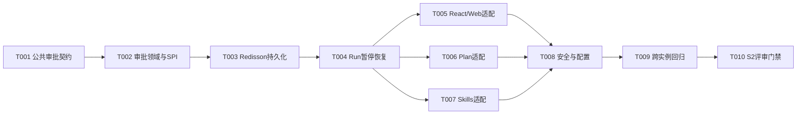
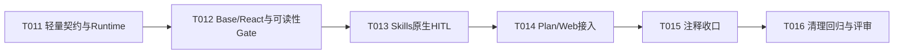

# Agent运行时审批任务规划

> 功能标识：`agent-runtime-approval`
> SDD 等级：`S2`
> 来源需求：`spec/features/20260716/Agent运行时审批-需求说明书.md`
> 来源技术设计：`spec/features/20260716/Agent运行时审批-技术设计说明书.md`
> 文档状态：CR-002 待实现（T001-T016 已完成，T017-T019 待执行）
> 创建日期：2026-07-16
> 更新日期：2026-07-20

## 1. 任务概览

- 总任务数：19（T001～T009 为原重型方案历史实现，T010 被 CR-001 取代，T011～T016 已完成，T017～T019 为 CR-002 增量任务）
- 当前核心路径：历史 T011-T016 已完成；CR-002 路径为 T017 -> T018 -> T019
- 风险任务：T002（状态不变量）、T003（跨实例 CAS/清理）、T004（暂停恢复生命周期）、T008（敏感数据与配置）、T009（跨实例回归）、T010（S2 Gate）
- 阻塞任务：T013～T016 在 T012 负责人可读性 Gate 通过前不得启动
- 可并行分组：T005、T006、T007 在 T004 完成后可并行，分别修改不同 Agent 适配目录
- Mock/临时实现闭环：无；测试替身仅用于确定性验证，不作为生产实现
- 可运行服务闭环：无；本功能为库/Starter，不新增独立服务
- DDL/数据结构任务：有，T002 定义逻辑结构，T003 实现当前 Redisson 适配；不涉及数据库 DDL/SQL
- 运行初始化 DML/Seed 任务：无
- 数据设计与治理任务：有，T003、T008、T009
- UI 设计确认：不适用；文档中的 React 均指 ReAct Agent/`ReactAgent` 类名，不是 React 前端或页面交付物，本功能不提供交互界面

### 1.1 任务依赖图

CR-001 的当前实施依赖：

## 2. 实现确认门禁

- 状态：已确认；用户已授权执行全部剩余任务
- 规划产物不等于实现授权。
- 生成本任务规划文档后必须暂停，等待用户确认后才能进入业务代码实现。
- 用户确认执行且未指定任务 ID 时，默认执行全部未完成任务。
- 用户指定任务 ID 时，例如 `执行 T001,T002`，只执行指定任务。
- `看看`、`下一步是什么`、`继续看` 等不明确指令不得视为实现确认。

## 3. 任务列表

- [x] T001 建立供应商无关的审批公共契约
  - 通俗解释: 完成后所有 Agent 和下游都可以用统一类型描述审批点、Run 选项、审批请求、最终决定、查询结果和流式事件，而不依赖 Alibaba、Spring AI 或 Redis 类型。
  - AC: AC-001, AC-002, AC-003, AC-007, AC-014
  - 来源: 技术设计说明书 §3.1～§3.5、§9 D-001/D-002
  - Files: `fons4ai-agent/fons4ai-agent-common/src/main/java/com/fons/cloud/ai/agent/api/`; `fons4ai-agent/fons4ai-agent-common/src/main/java/com/fons/cloud/ai/agent/approval/`; `fons4ai-agent/fons4ai-agent-common/src/main/java/com/fons/cloud/ai/agent/constants/`; `fons4ai-agent/fons4ai-agent-common/src/test/java/com/fons/cloud/ai/agent/`
  - Depends: 无
  - Verification: 先添加公共契约编译测试、状态终态测试、审批关闭默认值和 JSON 协议快照使其失败；实现后断言 `Agent.start(request)` 行为兼容、`start(request, options)` 可选择 Profile、Common 包不引用供应商类，新增审批事件包含 runId/sequence 且不改变既有消息编码。
  - Quality: 公共 DTO 不返回 null 集合、不暴露内部异常或 checkpoint payload；点位使用可扩展值对象；`REJECTED` 与 `APPROVAL_REJECTED` 语义分离；关键字段和线程边界补充中文注释。
  - 专业工作流: `.specify/rules/代码编写规范.md` 的公共 API、兼容和供应商边界规则
  - Done: Common 新契约可独立编译，AC 对应契约测试通过，审批默认关闭且供应商静态扫描无命中。

- [x] T002 实现审批聚合、状态机和持久化 SPI
  - 通俗解释: 完成后框架具备统一的审批状态规则，可以可靠判断首个决定、重复重试、冲突、拒绝模式、超时、取消和数据保留，而具体存储产品可以替换。
  - AC: AC-003, AC-004, AC-007, AC-008, AC-009, AC-010, AC-011, AC-012, AC-013, AC-015, AC-016
  - 来源: 技术设计说明书 §4.5、§5.1～§5.2、§6、§7
  - Files: `fons4ai-agent/fons4ai-agent-common/src/main/java/com/fons/cloud/ai/agent/approval/`; `fons4ai-agent/fons4ai-agent-spring-ai-starter/src/main/java/com/fons/cloud/ai/agent/standard/approval/`; `fons4ai-agent/fons4ai-agent-spring-ai-starter/src/test/java/com/fons/cloud/ai/agent/standard/approval/`
  - Depends: T001
  - Verification: 使用内存并发测试替身同时提交批准/拒绝/超时/取消，断言只有一个转换成功；相同 idempotencyKey 与决定摘要返回既有结果，冲突追加审计；拒绝默认终止、配置恢复时保留反馈；PENDING 在任意清理时间都保留，终态 checkpoint/audit 可使用不同保留策略。
  - Quality: `AgentApproval` 聚合维护不变量，Coordinator 只编排，Store/Clock/Crypto/Recovery 为 SPI；不得使用共享 Agent 字段或 ThreadLocal 保存请求态；原子方法名称表达 compare-and-* 语义。
  - 专业工作流: `.specify/rules/agent运行规则.md` 的权限、安全和独立证据规则
  - Done: Approval 聚合和 SPI 覆盖全部状态分支，确定性并发测试通过，没有绑定 Redis 或 Alibaba。

- [x] T003 实现当前 Redisson 审批、checkpoint、事件与审计适配
  - 通俗解释: 完成后待审批 Run 可以在共享存储中跨进程保存和查询，并由其他实例安全提交决定或获得唯一恢复所有权。
  - AC: AC-004, AC-005, AC-006, AC-012, AC-013, AC-014, AC-015, AC-016
  - 来源: 技术设计说明书 §4.3～§4.6、§5.3、§8.2
  - Files: `fons4ai-agent/fons4ai-agent-spring-ai-starter/src/main/java/com/fons/cloud/ai/agent/standard/approval/persistence/`; `fons4ai-agent/fons4ai-agent-common/src/main/java/com/fons/cloud/ai/agent/core/AgentTaskManager.java`; `fons4ai-agent/fons4ai-agent-spring-ai-starter/src/test/java/com/fons/cloud/ai/agent/standard/approval/persistence/`
  - Depends: T002
  - Verification: 用两个 Coordinator/Store 实例共享可控 Redisson 替身：实例 A 创建 PENDING 和 checkpoint，丢弃本地对象后实例 B 查询、决定、获取 fence；并发决定只有一个成功；事件按 sequence 补发；PENDING 不设置清理 TTL，终态 checkpoint/audit 根据不同配置清理；过期和迟到决定不会恢复 Run。
  - Quality: 按 DDD-lite 保持持久化适配只实现聚合所需原子语义；逻辑 Key/索引集中定义并带版本；所有删除和更新检查状态、version、digest/fence；不把物理 Key 或 Redisson 类型暴露到 Common；日志不输出 payload、规则快照或意见。
  - 专业工作流: 技术设计说明书 §4.5 结构变更详设
  - Done: 当前 Redisson 适配满足 SPI 原子契约和逻辑结构，双实例确定性测试覆盖决定、恢复、事件、超时和独立清理；真实宿主 Redis 拓扑留给下游接入验证。

- [x] T004 改造 BaseAgent Run 生命周期、恢复编排和事件重连
  - 通俗解释: 完成后 Agent 可以在审批点真正暂停而不是错误结束，客户端断线后可按游标补收事件，应用重启后不依赖旧 Java 对象即可恢复同一逻辑 Run。
  - AC: AC-001, AC-004, AC-005, AC-006, AC-008, AC-009, AC-010, AC-011, AC-014
  - 来源: 技术设计说明书 §3.3～§3.4、§5.1～§5.3、§7.1
  - Files: `fons4ai-agent/fons4ai-agent-spring-ai-starter/src/main/java/com/fons/cloud/ai/agent/standard/BaseAgent.java`; `fons4ai-agent/fons4ai-agent-spring-ai-starter/src/main/java/com/fons/cloud/ai/agent/standard/runtime/`; `fons4ai-agent/fons4ai-agent-spring-ai-starter/src/main/java/com/fons/cloud/ai/agent/standard/approval/`; `fons4ai-agent/fons4ai-agent-spring-ai-starter/src/test/java/com/fons/cloud/ai/agent/standard/BaseAgentSharedInstanceTest.java`; `fons4ai-agent/fons4ai-agent-spring-ai-starter/src/test/java/com/fons/cloud/ai/agent/standard/approval/`
  - Depends: T003
  - Verification: RED 阶段证明当前 Graph/Flux 完成会被收口终态；实现后断言持久化成功前不发 approval_required，WAITING 不触发 onFinish/completeTask/清理，取消与决定竞争只产生一个终态；删除原 RunContext 后可按 checkpoint 创建新上下文；`events(runId, afterSequence)` 补发且不重复；`call` 遇暂停快速返回 WAITING 快照。
  - Quality: 暂停与终态分别建模，统一 finishRun 仍只处理真正终态；恢复不查本地 AgentRun；共享 Agent 无审批请求字段；原有取消注册竞态保护保持有效。
  - 专业工作流: `.specify/rules/代码编写规范.md` 的响应式、资源释放与确定性测试规则
  - Done: Base 生命周期支持暂停/恢复/重连，现有无审批测试全部通过，跨实例恢复不依赖本地 sink 或对象。

- [x] T005 [P] 接入 ReactAgent 与 WebSearchReactAgent 审批点
  - 通俗解释: 完成后下游可以在模型输出、工具执行、搜索和抓取前选择性要求人工审批，同时未配置审批时行为完全不变。
  - AC: AC-001, AC-002, AC-003, AC-006, AC-008, AC-009, AC-010
  - 来源: 技术设计说明书 §3.5、§5.4
  - Files: `fons4ai-agent/fons4ai-agent-spring-ai-starter/src/main/java/com/fons/cloud/ai/agent/standard/react/`; `fons4ai-agent/fons4ai-agent-spring-ai-starter/src/main/java/com/fons/cloud/ai/agent/standard/react/websearch/`; `fons4ai-agent/fons4ai-agent-spring-ai-starter/src/main/java/com/fons/cloud/ai/agent/standard/approval/alibaba/`; `fons4ai-agent/fons4ai-agent-spring-ai-starter/src/test/java/com/fons/cloud/ai/agent/standard/react/`
  - Depends: T004
  - Verification: 可控模型先生成待审批工具调用；未启用时直接执行，启用后工具调用次数保持 0 并进入 WAITING；批准后从同一 thread/checkpoint 执行一次；拒绝终止不执行，拒绝恢复把意见反馈模型；Web 搜索和抓取点分别触发；Alibaba 类型只存在适配包。
  - Quality: 按 DDD-lite 让审批规则归属 Approval 聚合、Agent 适配只发布点位；原生 `HumanInTheLoopHook` 只作为当前静态适配，动态 Policy 仍由 Fons4AI 控制；工具参数摘要脱敏并绑定 digest；恢复时迟到旧订阅不得输出。
  - 专业工作流: 技术设计说明书 §5.4 Alibaba 适配边界
  - Done: React/Web 四个审批点可配置、可暂停恢复且无重复工具调用，审批关闭回归通过。

- [x] T006 [P] 接入 PlanExecuteAgent 阶段审批并修正 checkpoint 生命周期
  - 通俗解释: 完成后下游可以在计划生成、任务执行和报告生成等阶段插入审批，等待期间计划状态不会丢失或被提前清理。
  - AC: AC-001, AC-002, AC-004, AC-006, AC-008, AC-009, AC-010, AC-011
  - 来源: 技术设计说明书 §3.5、§5.4、§10 R-001
  - Files: `fons4ai-agent/fons4ai-agent-spring-ai-starter/src/main/java/com/fons/cloud/ai/agent/standard/deepresearch/`; `fons4ai-agent/fons4ai-agent-spring-ai-starter/src/test/java/com/fons/cloud/ai/agent/standard/deepresearch/PlanExecuteAgentGraphTest.java`
  - Depends: T004
  - Verification: 在 after-plan、before/after-task、before-report 插入默认直通节点；配置审批后断言 Graph 停在目标点且 `doFinally` 不释放 checkpoint；实例对象丢失后恢复保持 plan/task ID；拒绝恢复意见驱动重新规划，终止/超时/取消才释放；同一 fence 不创建第二个 Graph。
  - Quality: 审批节点不包含业务规则；现有 Plan 已实现与预留能力明确区分；checkpoint 只在真实终态单次释放；不扩大 Plan 算法重构。
  - 专业工作流: 技术设计说明书 §5.4 与现有 Plan checkpoint 规则
  - Done: 四个 Plan 审批点具备一致语义，WAITING 保留、终态释放和跨实例恢复测试通过。

- [x] T007 [P] 接入 SkillsReactAgent 技能、资源和工具审批点
  - 通俗解释: 完成后下游可以在技能激活、资源访问或技能工具执行前审批，并且审批恢复不会改变原 Run 的技能快照或提升权限。
  - AC: AC-001, AC-002, AC-003, AC-004, AC-006, AC-008, AC-009, AC-010
  - 来源: 技术设计说明书 §3.5、§5.4、§8.3
  - Files: `fons4ai-agent/fons4ai-agent-spring-ai-starter/src/main/java/com/fons/cloud/ai/agent/standard/skill/`; `fons4ai-agent/fons4ai-agent-spring-ai-starter/src/test/java/com/fons/cloud/ai/agent/standard/skill/`
  - Depends: T004
  - Verification: 可控链路分别触发 before-activation/resource/tool；等待前持久化 catalog/activatedSkills/资源授权摘要；reload 后由另一实例恢复仍使用旧快照；拒绝意见不能激活技能、增加工具或访问未授权资源；等待时不自动 releaseThread，终态精确释放。
  - Quality: 按 DDD-lite 保持审批聚合与技能授权领域边界分离；审批不是授权来源，只能阻止或允许既有权限内动作；恢复重建 delegate 但不重载权限快照；资源 ID 和技能正文不进入普通审批事件。
  - 专业工作流: 技术设计说明书 §5.4 Skills 权限边界
  - Done: 三个 Skills 审批点、快照恢复和权限负向测试通过，激活集合不在并发 Run 间串用。

- [x] T008 完成自动配置、数据安全与治理能力
  - 通俗解释: 完成后接入方可以声明审批 Profile、存储和保留策略；框架在配置错误或基础设施不可用时安全失败，并保护 checkpoint、规则快照和审批意见。
  - AC: AC-001, AC-003, AC-007, AC-011, AC-014, AC-015, AC-016
  - 来源: 技术设计说明书 §4.4、§8、§9 D-007
  - Files: `fons4ai-agent/fons4ai-agent-spring-ai-starter/src/main/java/com/fons/cloud/ai/agent/standard/approval/`; `fons4ai-agent/fons4ai-agent-spring-ai-starter/src/main/java/com/fons/cloud/ai/agent/autoconfigure/`; `fons4ai-agent/fons4ai-agent-spring-ai-starter/src/main/resources/`; `fons4ai-agent/fons4ai-agent-spring-ai-starter/src/test/java/com/fons/cloud/ai/agent/standard/approval/`
  - Depends: T005, T006, T007
  - Verification: 无 Profile 时零持久化 IO；Profile 请求审批但 Store/Checkpoint/Crypto 能力缺失时返回明确失败而非自动批准；超大 checkpoint/comment/ruleSnapshot 被限制；审批事件和日志不含敏感明文；PENDING 清理被拒绝，终态两类 retention 独立生效；篡改 runId/version/digest 的决定被拒绝并审计。
  - Quality: 配置项有安全默认值和校验；身份鉴权/业务授权责任明确属于下游；不内置交互界面、会签或行业规则；不新增依赖。
  - 专业工作流: `.specify/rules/agent运行规则.md` 的敏感数据、外部权限和配置责任边界
  - Done: 自动配置、失败语义、限额、脱敏、完整性和清理测试通过，接入文档注释说明下游责任。

- [x] T009 执行跨实例、恢复、兼容和安全完整回归
  - 通俗解释: 完成后可以证明审批能力在进程对象丢失、多实例竞争、断线重连和各类终态下仍然可靠，同时默认关闭不会破坏现有 Agent。
  - AC: AC-001, AC-002, AC-003, AC-004, AC-005, AC-006, AC-007, AC-008, AC-009, AC-010, AC-011, AC-012, AC-013, AC-014, AC-015, AC-016
  - 来源: 技术设计说明书 §10.1～§10.3
  - Files: `fons4ai-agent/fons4ai-agent-common/src/test/`; `fons4ai-agent/fons4ai-agent-spring-ai-starter/src/test/`; `spec/features/20260716/checklists/Agent运行时审批-S2风险检查清单.md`
  - Depends: T008
  - Verification: 以两个 Coordinator/Agent 运行实例和共享持久化替身执行端到端链路：实例 A 暂停并丢弃本地对象，客户端断线按 sequence 重连，实例 B 决定并恢复；并发批准/拒绝/超时/取消只产生一个结果和最多一个恢复 Graph；覆盖五类 Agent、拒绝两模式、数据清理、安全负向用例；最后运行 Agent Common/Starter 聚焦测试与 `mvn -pl fons4ai-agent/fons4ai-agent-spring-ai-starter -am test`。
  - Quality: 区分确定性框架契约证据与未来宿主真实 Redis、鉴权和交互界面接入证据；不得把测试替身描述为生产联调；`git diff --check`、供应商边界、请求态字段和敏感日志静态扫描通过。
  - 专业工作流: `.specify/rules/agent运行规则.md` 的 Evidence Bundle 与独立角色规则
  - Done: AC-001～AC-016 均有新鲜自动化证据，完整 Reactor 构建通过，S2 风险清单记录回滚、兼容、安全、未验证和下游接入项。

- [x] T010 完成独立评审、Evidence Matrix 和人工 Gate（已被 CR-001 取代，不表示评审通过）
  - 通俗解释: 完成后实现者之外的评审角色和用户可以确认公共契约、审批安全、恢复语义与证据足够，才将功能标记为可交付。
  - AC: AC-001, AC-002, AC-003, AC-004, AC-005, AC-006, AC-007, AC-008, AC-009, AC-010, AC-011, AC-012, AC-013, AC-014, AC-015, AC-016
  - 来源: 技术设计说明书 §10、S2 门禁
  - Files: `spec/features/20260716/reviews/Agent运行时审批-Spec-Review.md`; `spec/features/20260716/reviews/Agent运行时审批-Code-Review.md`; `spec/features/20260716/reports/Agent运行时审批-实施报告.md`; `spec/features/20260716/checklists/Agent运行时审批-S2风险检查清单.md`
  - Depends: T009
  - Verification: 独立 Spec Reviewer 核对 REQ/AC 和下游职责边界；独立 Code Reviewer 检查共享 Agent 请求态、CAS、恢复 fence、checkpoint 释放、Skills 权限和敏感数据；Evidence Matrix 记录构建、测试、五类链路、跨实例替身、数据结构、安全、回滚和下游未验证项；最后由用户人工 Gate 确认公共 API、当前 Redisson/Alibaba 适配升级策略和接入责任。
  - Quality: 实现者不得替代 Reviewer 或人工 Gate；Critical/Important 必须关闭或明确阻塞；框架项目不强制启动不存在的下游宿主、审批交互界面或真实多节点环境，但必须如实标为接入验证项。
  - 专业工作流: `.specify/rules/agent运行规则.md` 的独立 Reviewer、人工 Gate 和 Evidence 规则
  - Done: Spec Review 与 Code Review 均形成 `BLOCKED` 结论；用户选择放弃原重型方案并进入 CR-001 轻量化重构，因此本任务以 `superseded` 关闭，原方案不得声明通过或可交付。

- [x] T011 收缩公共审批契约并建立轻量 HumanInTheLoopRuntime
  - 通俗解释: 完成后下游只需要理解审批点、策略、中断和统一恢复入口，不再接触 checkpoint、Redis、审计平台或每种 Agent 的 ResumeHandler。
  - AC: AC-001, AC-003, AC-017, AC-018, AC-019, AC-020
  - 来源: CR-001；技术设计说明书 §12.1～§12.3、§12.7
  - Files: `fons4ai-agent/fons4ai-agent-common/src/main/java/com/fons/cloud/ai/agent/api/`; `fons4ai-agent/fons4ai-agent-common/src/main/java/com/fons/cloud/ai/agent/approval/`; `fons4ai-agent/fons4ai-agent-common/src/main/java/com/fons/cloud/ai/agent/constants/`; `fons4ai-agent/fons4ai-agent-spring-ai-starter/src/main/java/com/fons/cloud/ai/agent/standard/approval/`; `fons4ai-agent/fons4ai-agent-spring-ai-starter/src/main/java/com/fons/cloud/ai/agent/autoconfigure/`; 对应测试
  - Depends: 无
  - Verification: 先用契约测试证明下游无需供应商类型和 Agent 专属 Handler；实现后验证默认关闭、`APPROVE/EDIT/REJECT` 输入校验、首决定、相同重复决定、冲突决定、过期/不存在中断和 Common 供应商依赖扫描。
  - Quality: 按 DDD-lite 保持公共契约、运行时状态和内核适配边界；只保留 CR-001 §12.2 列出的公共语义；进程内实现使用每中断原子状态和一次性 continuation；不保留 Redis/CAS/fencing/audit/retention/encryption 抽象；删除前用引用扫描保护非审批改动。
  - Done: 公共 API 可由一个最小接入示例完整说明，下游不实现 ResumeHandler；轻量 Runtime 聚焦测试通过，重型公共/Starter 类型已删除或形成明确的后续删除清单。

- [x] T012 接入 BaseAgent 与 ReactAgent 轻量审批并完成第一阶段可读性 Gate
  - Gate 结论: 负责人完成 Policy、HumanInterrupt、Decision、Runtime 图解复核，并确认自研 React 保持轻量、业务长期推荐 Alibaba ReactAgent Adapter；随后明确要求继续任务。
  - 通俗解释: 完成后 Base 只负责共享 Agent 的每 Run 生命周期，React 在工具执行前可暂停并在同进程恢复；负责人可以沿一条链路看懂流式、非流式和下游恢复方式。
  - AC: AC-001, AC-002, AC-004, AC-008, AC-009, AC-010, AC-011, AC-012, AC-013, AC-017, AC-018, AC-019, AC-020, AC-022, AC-023
  - 来源: CR-001；技术设计说明书 §12.4～§12.5、§12.8、§12.10
  - Files: `fons4ai-agent/fons4ai-agent-spring-ai-starter/src/main/java/com/fons/cloud/ai/agent/standard/BaseAgent.java`; `standard/runtime/`; `standard/react/ReactAgent.java`; `standard/react/ReactAgentRunContext.java`; 对应测试
  - Depends: T011
  - Verification: 可控模型生成工具调用，审批前工具计数为 0；批准和编辑各执行一次，拒绝终止不执行，拒绝反馈回到模型但不提升权限；流式发中断事件、非流式返回 WAITING；两个并发 Run 的中断、消息、工具和终态互不影响。
  - Quality: 按 DDD-lite 将生命周期编排归属 Base、工具审批归属 React 适配；删除 Base 的 Coordinator/checkpoint/全局审批点；工具审批集中在一个 `ApprovalAwareToolExecutor` 或等价入口；类级 JavaDoc 画清 Base/React 流程，字段和入口说明共享/每 Run、线程安全和副作用；阶段结束后必须由负责人完成可读性 Gate。
  - Done: Base/React 聚焦测试通过；负责人能根据源码和最小接入示例说明“如何触发、如何收到中断、如何恢复、重启后会怎样”；未通过 Gate 时 T013～T016 保持阻塞。

- [x] T013 使用 Spring AI Alibaba 原生 HITL 接入 Skills 并补齐 Skills 注释
  - L3 证据: 2026-07-17 运行 Skills 聚焦回归共 23 项，0 failure、0 error、1 项因 Windows 符号链接权限跳过；真实 Alibaba Graph 覆盖 APPROVE、EDIT、两种 REJECT、delegate 重建恢复及共享 Run 中断隔离。
  - 通俗解释: 完成后 Skills 不再维护自研审批 Gate 和恢复协议，而是把公共决定映射到 Alibaba 原生中断/反馈；原有技能渐进加载和资源安全能力保持可读、可验证。
  - AC: AC-002, AC-004, AC-006, AC-010, AC-017, AC-018, AC-019, AC-021, AC-022, AC-023
  - 来源: CR-001；技术设计说明书 §12.4、§12.6、§12.8
  - Files: `fons4ai-agent/fons4ai-agent-spring-ai-starter/src/main/java/com/fons/cloud/ai/agent/standard/skill/`; 对应 Skills 测试
  - Depends: T012 且负责人可读性 Gate 已通过
  - Verification: 可控 Alibaba Graph 真实产生工具中断，销毁 delegate 后使用同一 thread/Saver/Human Feedback 恢复；批准/编辑只执行一次，拒绝不执行且不能激活新技能/工具/资源；原 Skills 目录、工具冲突、资源越权和共享 Run 隔离回归通过。
  - Quality: 按 DDD-lite 分离审批决定、Skills 授权和 Alibaba 适配；删除审批专用 Skills 类型；保留并注释 §12.6 的核心类；类和关键方法说明 Registry 快照、渐进开放、资源白名单、工具可见性、线程/Run 边界和原生 HITL 流程；不为待删除类型补注释。
  - Done: Skills 原生 HITL 集成测试和原能力回归通过，审批实现不再分散到 Registry/Resource/Tool 包装器，负责人可从 `SkillsReactAgent` 类注释追踪完整流程。

- [x] T014 接入 Plan Graph interrupt 并让 Web 复用统一工具审批
  - L3 证据: 2026-07-18 使用 clean + 强制 javac 运行 Plan/React/Web 聚焦回归 24 项，0 failure、0 error；覆盖三个 Plan Graph 中断点、恢复后目标副作用单次执行、拒绝终止、流式中断、非流式 WAITING、并发 Run 隔离，以及 Web 搜索/抓取统一复用 `react.before-tool`。
  - 通俗解释: 完成后 Plan 只在计划后、任务前和报告前暂停，Web 搜索/抓取作为普通工具复用 React 审批，不再有各自的恢复协议。
  - AC: AC-002, AC-004, AC-008, AC-009, AC-010, AC-011, AC-012, AC-013, AC-017, AC-018, AC-019, AC-020, AC-022, AC-023
  - 来源: CR-001；技术设计说明书 §12.4、§12.8
  - Files: `fons4ai-agent/fons4ai-agent-spring-ai-starter/src/main/java/com/fons/cloud/ai/agent/standard/deepresearch/`; `standard/react/websearch/`; 对应测试
  - Depends: T013
  - Verification: 运行真实可控 StateGraph，在 after-plan/before-task/before-report 中断后所有后继副作用保持 0，恢复后目标节点只执行一次；Web 搜索和抓取复用工具中断；流式/非流式结果和并发 Run 隔离通过。
  - Quality: 按 DDD-lite 分离 Plan 阶段编排、人工决定和 Web 工具适配；使用通用 `HumanApprovalNode` 或等价小组件；移除 `plan.after-task` 和 Plan/Web ResumeHandler/RecoveryAdapter；不得扩大 Plan 算法重构；日志不输出完整 RunnableConfig、反馈或工具参数。
  - Done: Plan/Web 聚焦测试通过，类注释可清楚解释节点顺序、暂停位置、恢复方式和终态清理，代码中不存在独立的 Web/Plan 分布式恢复协议。

- [x] T015 对所有保留 Agent 与 Skills 类型完成注释和流程可读性收口
  - L3 证据: 2026-07-18 完成 Base、Runtime、React、Web、Plan、Skills 及公共审批契约的流程/生命周期/共享边界/审批点注释审计；完整 Maven 回归中 Agent Common 18 项、Starter 72 项全部通过，1 项 Windows 符号链接权限跳过。
  - 可读性结论: 四条主链路均可直接从类级 JavaDoc 看出执行顺序、审批位置、请求态归属和终态；Builder 注释明确默认值、安全上限及共享要求；旧 SimpleReActAgent 明确标记为非共享兼容实现。
  - 通俗解释: 完成后负责人无需阅读 SDD 就能从源码看懂每个 Agent 如何执行、哪里可能审批、数据放在哪里、流式和非流式如何结束。
  - AC: AC-022, AC-023
  - 来源: CR-001；技术设计说明书 §12.4、§12.8
  - Files: `standard/BaseAgent.java`; `standard/runtime/`; `standard/react/`; `standard/react/websearch/`; `standard/deepresearch/`; `standard/skill/`; Common 中保留的审批字段、枚举和入口
  - Depends: T014
  - Verification: 逐类检查类 JavaDoc、字段、枚举常量、构造器/Builder/公共保护方法和关键私有流程；使用编译、Javadoc/静态检查和人工阅读清单验证；纯注释不得改变测试快照或运行行为。
  - Quality: 注释说明 DDD-lite 的公共契约、编排和适配边界，以及职责、生命周期、默认值、共享/每 Run、线程安全、敏感性、副作用、异常和 HITL；避免逐行翻译、重复 getter 注释和过时描述；重点覆盖 CR-001 §12.6 列出的原 Skills 类。
  - Done: 注释检查清单无遗漏，负责人抽查 Base、React、Plan、Skills 四条主链路均能准确复述流程，源码编译和行为回归无变化。

- [x] T016 删除剩余重型实现与失效测试，完成回归、独立评审和人工 Gate
  - L3 证据: 2026-07-18 在隔离临时副本执行 clean 全量回归，共 98 项，0 failure、0 error、1 Windows 符号链接权限跳过，6 个 Reactor 模块全部 SUCCESS；独立 Spec Review、Code Review 均 PASS 且无 Critical/Important。2026-07-20 负责人回复“通过”，人工可读性 Gate 已完成。
  - 通俗解释: 完成后仓库只剩轻量 HITL 所需代码和测试，旧分布式审批平台不会继续误导维护者；交付结论由独立评审和负责人确认。
  - AC: AC-001, AC-002, AC-003, AC-004, AC-006, AC-008, AC-009, AC-010, AC-011, AC-012, AC-013, AC-017, AC-018, AC-019, AC-020, AC-021, AC-022, AC-023
  - 来源: CR-001；技术设计说明书 §12.7、§12.9～§12.10
  - Files: Common/Starter 审批包和测试；自动配置；`spec/features/20260716/reviews/`; `reports/`; `checklists/`
  - Depends: T015
  - Verification: 引用扫描确认 Redisson Persistence、PayloadProtector、Retention、Audit/Query、RecoveryRegistry、Agent 专属 ResumeHandler 和审批专用 Skills 类型均无残留；运行 Agent Common/Starter 聚焦测试、完整 Maven 回归、`git diff --check` 和供应商边界扫描。
  - Quality: 复核 DDD-lite 的公共契约、运行编排和基础设施适配边界；保护工作区中 Agent 共享和 Skills 的非审批改动；测试只删除延期能力对应断言，不得删除共享隔离、资源安全和原行为回归；由独立 Spec Reviewer、Code Reviewer 和用户人工 Gate 判断可交付。
  - Done: 完整回归通过，评审无 Critical/Important 或明确阻塞；实施报告区分同进程能力、Alibaba 原生能力和延期能力，用户确认代码可理解后才能标记交付。

## 3.1 CR-002 增量任务

- [ ] T017 提取 Alibaba 原生恢复公共校验与 checkpoint 支持
  - 通俗解释: 完成后 React、Plan、Skills 仍使用现有恢复 API，但不再各自重复校验 threadId、checkpoint 和决定参数。
  - AC: AC-019, AC-020, AC-021, AC-023
  - 来源: CR-002；技术设计说明书 §13.1-§13.2
  - Files: fons4ai-agent/fons4ai-agent-spring-ai-starter/src/main/java/com/fons/cloud/ai/agent/standard/adaptor/; fons4ai-agent/fons4ai-agent-spring-ai-starter/src/main/java/com/fons/cloud/ai/agent/standard/react/ReactAgent.java; fons4ai-agent/fons4ai-agent-spring-ai-starter/src/main/java/com/fons/cloud/ai/agent/standard/deepresearch/PlanExecuteAgent.java; fons4ai-agent/fons4ai-agent-spring-ai-starter/src/main/java/com/fons/cloud/ai/agent/standard/skill/SkillsReactAgent.java; 对应恢复测试
  - Depends: T016
  - Verification: 先用现有三类恢复测试标记重复路径，再增加 threadId 不匹配、checkpoint 缺失、EDIT 参数非法和决定为空的等价契约测试；提取后断言三类 Agent 的异常类型、恢复分段、APPROVE/EDIT/REJECT 和事件字段保持不变。
  - Quality: 按 DDD-lite 分离公共契约、恢复校验与 Agent 编排；新组件为 Starter 包内实现，不进入 Common 或公共 API；只负责输入关联与 checkpoint 查找，不包含业务审批策略、权限提升或 Agent 专属 Graph 重建；保留原 cause 和安全日志。
  - Done: 三类 Agent 不再重复拼接/验证 threadId 和查找 checkpoint，原恢复 API 与全部聚焦测试保持通过。

- [ ] T018 验证并加固 Skills 恢复权限快照
  - 通俗解释: 完成后技能目录在审批等待期间发生 reload 时，恢复执行仍只能使用原 Run 已激活的技能、工具和资源权限。
  - AC: AC-007, AC-021, AC-022
  - 来源: CR-002；技术设计说明书 §13.3
  - Files: fons4ai-agent/fons4ai-agent-spring-ai-starter/src/main/java/com/fons/cloud/ai/agent/standard/skill/SkillsReactAgent.java; fons4ai-agent/fons4ai-agent-spring-ai-starter/src/main/java/com/fons/cloud/ai/agent/standard/skill/SkillsAgentRunContext.java; fons4ai-agent/fons4ai-agent-spring-ai-starter/src/main/java/com/fons/cloud/ai/agent/standard/skill/SkillCatalogSnapshot.java; 对应 Skills 原生恢复/资源安全测试
  - Depends: T017
  - Verification: 先构造可控 Alibaba checkpoint：Run A 激活技能后暂停，更新目录/工具映射并恢复；修复后断言 A 不能获得新增工具或资源，Run B 才使用新快照，缺失或不一致快照明确失败，批准和拒绝均不能提升权限。
  - Quality: 按 DDD-lite 保持审批决定与 Skills 授权边界；复用现有 CatalogSnapshot、GuardedRegistry 和 checkpoint 状态，不新增持久化 Store 或下游字段；审批不是授权来源；技能正文、资源路径和工具参数不进入普通日志。
  - Done: Skills reload/恢复、权限负向、共享 Run 隔离和原生 HITL 测试通过，恢复代码不存在“按最新目录重新授权”的路径。

- [ ] T019 执行 CR-002 审批回归、独立评审和人工 Gate
  - 通俗解释: 完成后可以证明恢复代码更精简且 Skills 权限更安全，同时下游仍按原来的 AgentResumeRequest 方式接入。
  - AC: AC-017, AC-018, AC-019, AC-020, AC-021, AC-022, AC-023
  - 来源: CR-002；技术设计说明书 §13.4
  - Files: fons4ai-agent/fons4ai-agent-spring-ai-starter/src/test/; spec/features/20260716/reports/Agent运行时审批-实施报告.md; spec/features/20260716/checklists/Agent运行时审批-S2风险检查清单.md; spec/features/20260716/reviews/
  - Depends: T018；智能体实例共享 T010
  - Verification: 运行 React/Plan/Skills 原生恢复聚焦测试、Agent Common/Starter 完整 Maven 回归、`git diff --check`、公共 API 签名和审批事件协议扫描；独立 Reviewer 检查重复代码、快照授权、终态清理和无范围扩大。
  - Quality: 复核 DDD-lite 的公共契约、运行编排和供应商适配边界；不修改公共 Resume API、Redisson、Saver 配置和下游职责；历史 Review 不替代当前源码的新鲜证据；当前会话无法完成的人工 Gate 必须记录待执行。
  - Done: 自动化验证通过，Spec/Code Review 无 Critical/Important 或明确阻塞，人工 Gate 状态已记录；未通过时不得声明审批能力可交付。

## 4. AC 追踪表

| AC | 覆盖任务 | 主要验证 |
| --- | --- | --- |
| AC-001 | T001, T004-T009 | 默认关闭、五类原回归、零审批 IO |
| AC-002 | T001, T005-T007, T009 | 五类审批点实际触发 |
| AC-003 | T001, T002, T005, T007-T009 | Profile/Policy、无硬编码扫描 |
| AC-004 | T002-T004, T006-T009 | checkpoint 原子创建、WAITING |
| AC-005 | T003, T004, T009 | 丢弃本地对象后查询/重连 |
| AC-006 | T003-T007, T009 | 实例 A 暂停、实例 B 恢复 |
| AC-007 | T001-T003, T008-T010 | 最终决定和审计字段 |
| AC-008 | T002, T004-T007, T009 | 批准恢复与单 fence |
| AC-009 | T002, T004-T007, T009 | 默认拒绝终态 |
| AC-010 | T002, T004-T007, T009 | 携意见恢复/重规划 |
| AC-011 | T002-T004, T006, T008-T009 | 超时/取消竞争与终态 |
| AC-012 | T002-T003, T009 | 相同重试幂等 |
| AC-013 | T002-T003, T009 | 冲突拒绝与审计 |
| AC-014 | T001-T003, T008-T010 | 生命周期查询和顺序 |
| AC-015 | T002-T003, T008-T009 | PENDING 禁止清理 |
| AC-016 | T002-T003, T008-T009 | checkpoint/audit 独立治理 |

### 4.1 CR-001 增量 AC 追踪

| AC | 覆盖任务 | 主要验证 |
| --- | --- | --- |
| AC-017 | T011-T016 | 默认关闭、支持点位目录、删除低价值点位 |
| AC-018 | T011-T014, T016 | 审批前无副作用、无 Agent 专属 ResumeHandler |
| AC-019 | T011-T014, T016 | 流式中断事件、非流式 WAITING、统一恢复入口 |
| AC-020 | T011-T012, T014, T016 | 自研 Agent 同进程一次性恢复和重启限制 |
| AC-021 | T013, T016 | Alibaba 同 thread/Saver/Human Feedback 真实恢复 |
| AC-022 | T012-T016 | 共享 Agent 并发 Run 隔离 |
| AC-023 | T012-T016 | 类级流程、字段/枚举/入口/关键逻辑注释与人工可读性 Gate |

## 5. S2 发布与回滚约束

- T009、T010 未完成前不得声明框架功能发布就绪。
- 回滚必须先禁止新审批 Profile，再处理现有 PENDING；不得直接删除待审批 checkpoint。
- 当前 Redisson/Alibaba 适配是实现事实，不得升级为长期唯一标准。
- 真实宿主鉴权、多人审批聚合、审批交互界面和部署拓扑属于下游接入验证，不是当前框架仓库可伪造的测试条件。
- 实现确认和任务执行均已完成；真实宿主接入与发布验证仍按下游项目另行开展。

## 6. CR-001 实现确认门禁

- 状态：已确认并执行完成。
- T012 第一阶段可读性 Gate 通过后，用户已明确要求继续 T013～T016。
- 2026-07-20 负责人回复“通过”，T016 最终人工可读性 Gate 完成。

## 7. CR-002 实现确认门禁

- 状态：等待用户确认。
- 规划产物不等于实现授权。
- 用户确认执行且未指定任务 ID 时，默认执行 T017-T019 全部未完成任务。
- 如需指定范围，请回复：执行 T017,T018。
