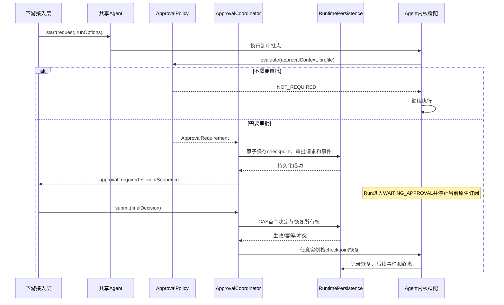
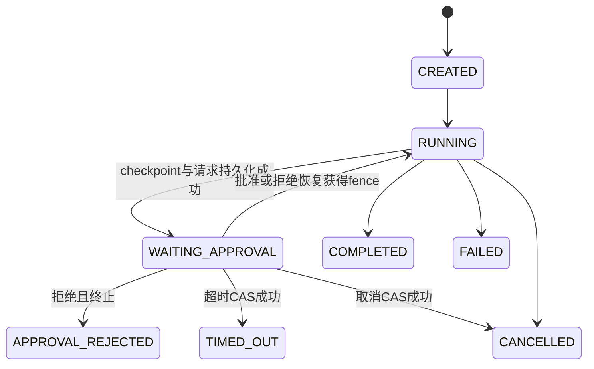
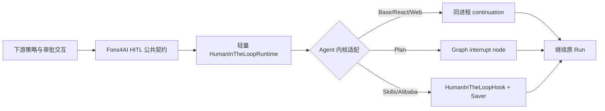

# Agent运行时审批技术设计说明书

> 功能标识：`agent-runtime-approval`
> SDD 等级：`S2`
> 来源需求：`spec/features/20260716/Agent运行时审批-需求说明书.md`
> 文档状态：CR-002 待实现
> 创建日期：2026-07-16
> 更新日期：2026-07-20

> **CR-001 生效说明**：自 V1.1.0 起，`## 12. CR-001 轻量 HITL 覆盖设计` 优先于前述通用分布式审批设计。前述内容保留为历史方案，不再作为轻量 V1 的实现目标。

## 1. 设计概要

- 功能描述：为共享 Agent + 每请求 Run 架构增加默认关闭、可由下游按运行阶段编排的 Human-in-the-Loop 能力。框架统一负责审批点检查、暂停、持久化、决定、恢复、超时、取消、事件重连和审计；下游负责身份鉴权、业务规则及多人决定聚合。
- 影响模块：`fons4ai-agent-common` 公共契约、`fons4ai-agent-spring-ai-starter` 生命周期和五类 Agent 适配、任务协调与当前 Redis/Alibaba 适配。
- 关键技术点：供应商无关审批契约、非终态暂停、持久化 checkpoint、跨实例恢复、CAS 最终决定、恢复 fencing、事件游标、审批数据治理。
- 依赖关系：复用当前 AgentRun、RunContext、TaskManager、流协议和 Spring AI Alibaba 1.1.2.0 Graph checkpoint/HITL；不新增外部技术框架。
- 非目标：业务审批流、用户鉴权、会签/或签、审批 UI、行业规则以及固定存储产品。
- SDD 等级理由：变更公共 API、运行状态和数据服务结构，涉及跨实例一致性、安全、兼容和高风险恢复语义，按 S2 管理。

### 1.1 技术栈与交付画像

| 项目事实 | 已确认结论 | 证据或原因 |
| --- | --- | --- |
| 项目形态 | 库/SDK 与 Spring Boot Starter | 项目知识基线和 Maven 模块 |
| 主要语言与运行时 | Java 21/JVM、Reactor | 当前源码和最终回归环境 |
| 构建与测试入口 | `mvn -pl fons4ai-agent/fons4ai-agent-spring-ai-starter -am test` | 当前 Agent Reactor 构建入口 |
| 交付入口 | Common 公共契约与 Starter 自动配置/Bean | 不新增独立服务 |
| 独立可运行服务 | 否；由下游宿主应用加载 | Starter 项目形态 |
| 页面/交互型交付物 | 否；只提供事件和调用契约 | UI、HTTP Controller 和鉴权由下游负责 |
| 数据结构变更 | 是；新增审批、checkpoint、事件和审计逻辑结构 | 支持跨重启和多实例恢复所必需 |

## 2. 架构与调用链路

新增 `approval` 公共能力域，Agent 只发布审批点，策略和执行协调由框架组件完成：



### 2.1 模块边界

| 层 | 新增或调整职责 | 禁止事项 |
| --- | --- | --- |
| Common API | 审批点、Profile 引用、RunOptions、请求/决定/结果/状态、查询服务 | 不依赖 Spring AI、Alibaba、Redis |
| Agent Runtime | 状态转换、审批上下文、事件序号、暂停/恢复编排 | 不保存跨请求审批状态到共享 Agent 字段 |
| Approval Application | Policy、Coordinator、决定处理、超时、清理和恢复调度 | 不执行下游鉴权或多人聚合 |
| Persistence SPI | Approval/Checkpoint/Event/Audit 原子存储契约 | 不把 Redis Key 暴露到 Common |
| Vendor Adapter | Alibaba HITL/Graph checkpoint 与五类 Agent 执行点适配 | 不向下游暴露 `InterruptionMetadata` |
| Downstream | 选择 Profile、配置触发规则、身份鉴权、聚合最终决定、提供 UI/API | 不绕过框架状态和 CAS 直接恢复内核 |

### 2.2 运行载体说明

不新增独立服务。审批能力作为普通框架组件/Starter 扩展运行在宿主进程中。多实例共享存储和恢复路由由 SPI 适配提供；当前可提供 Redisson 默认适配，但它不是长期唯一实现。

## 3. API / RPC / 消息契约设计

### 3.1 Common 公共契约

```java
public record AgentApprovalPoint(String value) {}

public record AgentRunOptions(
        String approvalProfileId,
        Map<String, Object> attributes) {}

public interface AgentApprovalPolicy {
    ApprovalRequirement evaluate(AgentApprovalContext context,
                                 AgentRunOptions options);
}

public interface AgentApprovalService {
    Mono<AgentApprovalRequest> pending(String approvalId);
    Mono<AgentApprovalResult> decide(AgentApprovalDecision decision);
}

public interface AgentRunQueryService {
    Mono<AgentRunSnapshot> get(String runId);
    Flux<AgentEvent> events(String runId, long afterSequence);
}
```

现有 `Agent` 保持兼容并新增重载：

```java
AgentRun start(AgentChatRequest request, AgentRunOptions options);

default AgentRun start(AgentChatRequest request) {
    return start(request, AgentRunOptions.defaults());
}
```

`stream(request)`、`call(request)` 继续使用默认 Options；需要审批的同步 `call` 不得无限阻塞，遇到暂停时返回包含 `WAITING_APPROVAL` 和待审批引用的结构化结果，恢复后的最终结果通过查询服务获取。

### 3.2 核心类型

| 类型 | 关键内容 | 约束 |
| --- | --- | --- |
| `AgentApprovalContext` | point、runId、conversationId、agentType、actionId、actionName、脱敏参数、attributes | 每次检查创建防御性副本 |
| `ApprovalRequirement` | required、title、description、allowedActions、timeout、rejectionMode | 默认 NOT_REQUIRED；请求审批但基础设施缺失时失败，禁止自动批准 |
| `AgentApprovalRequest` | approvalId、runId、point、profile/version、actionDigest、state、expiresAt | 不包含供应商对象；原动作以 digest 防止 TOCTOU |
| `AgentApprovalDecision` | approvalId、runId、requestVersion、APPROVE/REJECT、comment、actorId、ruleSnapshot、idempotencyKey | 下游已完成鉴权和多人聚合 |
| `ApprovalRejectionMode` | TERMINATE、RESUME_WITH_FEEDBACK | 默认 TERMINATE |
| `AgentApprovalResult` | 是否首个生效、是否幂等、当前状态、恢复引用、冲突原因 | 冲突不得覆盖首个决定 |

V1 不提供用户直接编辑工具参数。下游如需修改动作，应拒绝当前审批并发起新的 Run 或由拒绝后恢复模式驱动 Agent 重新规划，避免审批后动作摘要失效。

### 3.3 AgentRun 状态契约

在现有状态基础上增加：

- `WAITING_APPROVAL`：非终态，当前原生执行已暂停且持久化成功。
- `APPROVAL_REJECTED`：拒绝且 TERMINATE 的终态，不复用“Run 注册被拒绝”的 `REJECTED`。
- `TIMED_OUT`：审批等待超时终态。

`completion()` 在当前进程内暂停时可返回 WAITING 快照；跨重启后的最终结果使用 `AgentRunQueryService` 查询。不得让本地 `Mono` 成为持久化恢复的唯一事实源。

### 3.4 流式事件

`AgentMessageType` 增加：

- `APPROVAL_REQUIRED`
- `APPROVAL_RESOLVED`
- `RUN_PAUSED`
- `RUN_RESUMED`

每个事件增加 `runId`、全局单调 `sequence`、`occurredAt`。审批事件的 `data` 只包含审批 ID、点位、动作摘要、允许操作、到期时间和版本；不得输出完整 checkpoint、密钥或原始敏感参数。

`AgentRun.events()` 保持当前连接兼容；新增按 `runId + afterSequence` 重连能力。持久化事件先成功写入再发送，客户端重复收到相同 sequence 时自行去重。

### 3.5 审批点目录

| Agent | 内置审批点 | 点位数据 | 默认 |
| --- | --- | --- | --- |
| BaseAgent | `agent.before-run`、`agent.before-finalize` | 请求摘要、终态摘要 | 不审批 |
| ReactAgent | `react.after-model`、`react.before-tool` | round、toolCallId、工具名、脱敏参数摘要 | 不审批 |
| WebSearchReactAgent | 继承 ReAct；增加 `web-search.before-search`、`web-search.before-fetch` | 查询摘要、目标域名/资源摘要 | 不审批 |
| PlanExecuteAgent | `plan.after-plan`、`plan.before-task`、`plan.after-task`、`plan.before-report` | plan/task ID、计划或结果摘要 | 不审批 |
| SkillsReactAgent | 继承 ReAct；增加 `skills.before-activation`、`skills.before-resource`、`skills.before-tool` | skill、resourceId、授权工具摘要 | 不审批 |

审批点是可扩展字符串值对象，不使用封闭枚举；框架保留命名空间并在构建时检测重复或非法点位。

## 4. 数据模型与 DDL 影响

### 4.1 数据影响判断

| 检查项 | 是否涉及 | 处理要求 |
| --- | --- | --- |
| 持久化数据新增/查询/清理 | 是 | 新增审批、checkpoint、事件、审计逻辑结构 |
| 外部业务数据入库/同步 | 否 | 只接收最终决定，不承接业务审批表单 |
| 状态、标识、时间 | 是 | 统一状态版本、ID、时间基准和 sequence |
| 敏感数据、权限、审计、保留 | 是 | checkpoint 和意见按潜在敏感数据治理 |
| 跨服务/跨实例流转 | 是 | 任意实例决定、恢复和查询 |

### 4.2 字段映射契约

| 来源数据项 | 目标数据项 | 转换与校验 | 安全要求 | 状态 |
| --- | --- | --- | --- | --- |
| 下游 final decision | `AgentApprovalDecision` | 必须携带 approvalId、runId、version、actorId、ruleSnapshot；决定仅 APPROVE/REJECT | comment 和 ruleSnapshot 限长、脱敏、可加密 | 已确认 |
| Agent 阶段动作 | `AgentApprovalContext` | 生成 actionId 与规范化参数 digest，展示参数单独脱敏 | 原始参数不进入普通事件/日志 | 已确认 |
| 内核 checkpoint | `AgentCheckpointEnvelope` | providerId、formatVersion、payloadRef、digest、fencingToken | payload 加密或交由安全 Store 保存 | 已确认 |

### 4.3 数据流设计


### 4.4 数据安全与合规设计

| 检查项 | 设计结论 | 验证方式 |
| --- | --- | --- |
| 敏感数据识别 | checkpoint、参数、规则快照、意见均按潜在敏感数据处理 | 敏感样例测试和日志扫描 |
| 传输安全 | 下游负责入口 TLS/鉴权；框架 Service 不绕过身份上下文 | 接入契约审查 |
| 存储加密 | Store SPI 声明加密能力；当前适配允许注入 codec/key provider | 加密往返测试；明文扫描 |
| 展示/日志脱敏 | 事件只输出摘要；日志只含技术 ID、状态和异常类型 | 静态扫描、协议快照 |
| 数据权限 | 下游鉴权；框架强制 runId/approvalId/version/digest 关联校验 | 越权和篡改测试 |
| 审计与追踪 | 所有决定、重复、冲突、恢复、超时、取消均追加不可覆盖事件 | 审计序列测试 |
| 保留/删除 | PENDING 禁止清理；终态 checkpoint/audit 分别配置 | 清理器时钟测试 |

### 4.5 结构变更详设

本功能不增加数据库 DDL；新增的是 `AgentRuntimePersistence` SPI 下的逻辑结构。当前 Redisson 适配可采用以下命名，其他实现必须保持相同语义而非相同物理结构。

#### 4.5.1 结构总览

| 逻辑对象 | 当前适配建议 | 变更 | 生命周期 |
| --- | --- | --- | --- |
| ApprovalRecord | `fons4ai-agent:approval:{approvalId}` | 新增 | PENDING 不设终态清理；终态按配置 |
| RunApprovalIndex | `fons4ai-agent:approval-run:{runId}` | 新增 | 随相关审批索引治理 |
| CheckpointEnvelope | `fons4ai-agent:approval-checkpoint:{runId}:{checkpointId}` | 新增 | PENDING 禁止清理，终态独立 TTL |
| EventLog | `fons4ai-agent:run-events:{runId}` | 新增 | 支持 sequence 游标；按事件策略 |
| AuditLog | `fons4ai-agent:approval-audit:{approvalId}` | 新增 | 追加写；可长于 checkpoint |
| TimeoutIndex | `fons4ai-agent:approval-timeout` | 新增 | 决定/取消后移除或忽略 |

#### 4.5.2 ApprovalRecord 目标属性

| 属性 | 类型 | 必填 | 约束/索引 | 安全级别 |
| --- | --- | --- | --- | --- |
| approvalId | string | 是 | 主标识、不可复用 | 普通 |
| runId/conversationId | string | 是 | 关联校验 | 普通 |
| point/actionId/actionDigest | string | 是 | 防止决定替换动作 | 敏感摘要 |
| profileId/profileVersion | string | 是 | 决定规则快照版本 | 普通 |
| state/version | enum/long | 是 | CAS 条件 | 普通 |
| rejectionMode | enum | 是 | 默认 TERMINATE | 普通 |
| decision/actor/comment/ruleSnapshot | object | 否 | 仅首个合法决定写入 | 敏感 |
| checkpointId/providerId/formatVersion | string | 是 | 恢复适配选择 | 普通 |
| resumeGeneration/fencingToken | long/string | 是 | 同一逻辑 Run 只授予一次恢复代次 | 机密技术数据 |
| createdAt/expiresAt/decidedAt/resumedAt | instant | 按状态 | UTC、一致时间源 | 普通 |

决定写入使用 `state=PENDING && version=expectedVersion` 的原子 CAS。相同 idempotencyKey 与决定摘要返回既有结果；不同摘要记录冲突审计。恢复使用独立 fencing token；抢占成功后不得创建第二个恢复代次。

若恢复所有者在原生执行开始后崩溃，为满足“最多恢复一次”的安全要求，不自动从同一 checkpoint 再启动，而标记 `RECOVERY_REQUIRED` 并由下游发起新 Run 或人工处置。工具和外部副作用仍必须遵守各自幂等契约，框架不能承诺跨外部系统的分布式 exactly-once。

### 4.6 SQL/DDL 与初始化数据

- 数据库 DDL：不涉及。
- `.specify/sql`：无变化。
- Redis/其他数据服务：新增逻辑结构，目标定义见 §4.5，证据状态为“设计建议-待实现评审”。
- 执行型 DDL/DML/Seed：不适用；运行配置由下游提供，不生成种子数据。
- 回滚：关闭审批 Profile，停止新请求；等待/取消已有审批并按状态导出必要审计，再删除新增逻辑结构；现有任务租约和 Agent 流协议保持兼容。

## 5. 核心逻辑设计

### 5.1 审批点检查与暂停

1. Agent 生成审批上下文，Policy 根据 Profile 返回 NOT_REQUIRED 或 Required。
2. Required 但 Coordinator/Store/Checkpoint 能力缺失时失败为 `APPROVAL_CAPABILITY_UNAVAILABLE`，禁止自动批准。
3. 先捕获 checkpoint，再在同一原子工作流中创建 ApprovalRecord 和 `approval_required` 事件。
4. 只有持久化成功后，Run 才从 RUNNING 进入 WAITING_APPROVAL 并向客户端公开请求。
5. 停止当前原生订阅，但不把暂停当作完成、失败或取消，不释放 checkpoint。

### 5.2 最终决定与恢复

```text
decide(command):
  validate association, version, digest, expiry
  result = approvalStore.compareAndDecide(command)
  if result.sameDecisionRetry: return existing
  if result.conflict: appendConflictAudit(); reject
  if approved: acquireResumeFence(); resumeFromCheckpoint()
  if rejected and mode == RESUME_WITH_FEEDBACK:
      persistFeedback(); acquireResumeFence(); resumeFromCheckpoint()
  else: finalizeRun(APPROVAL_REJECTED)
```

超时扫描和主动取消只允许从 PENDING 原子转换；与决定竞争时只有一个转换成功。取消 Run 时同步取消待审批请求、释放等待索引并按终态治理策略处理 checkpoint。

### 5.3 跨实例恢复与事件重连

- 恢复不查找原本的 Java `AgentRun` 对象，而是读取持久化 Run/approval/checkpoint。
- 恢复实例通过 `AgentRecoveryAdapterRegistry` 按 agentType/providerId 选择适配器，创建新的请求级 RunContext 和内核 delegate。
- 共享 Agent Bean 仍无请求状态；恢复状态只进入新的 RunContext。
- 所有输出先追加 EventLog，再发布本地流；客户端使用 `afterSequence` 补发后继续实时订阅。
- 现有 `unicast sink` 只负责当前连接，不再承担跨重启事实存储。

### 5.4 Alibaba 与五类 Agent 适配

- React/Skills：当前 1.1.2.0 原生 `HumanInTheLoopHook`、`InterruptionMetadata.ToolFeedback` 和 `RunnableConfig.addHumanFeedback` 可作为静态工具审批适配；动态 Policy 由 Fons4AI Hook/Interceptor 在供应商边界转换，不把原生类型放入 Common。
- 原生 `InterruptionMetadata` 必须映射为 ApprovalRequest；恢复时以同一 threadId/checkpoint 和反馈构造新 config。
- 等待审批时禁止 `releaseThread(true)` 或等价自动清理；只有真实终态释放 Graph thread/checkpoint。
- PlanExecute：在计划生成后、任务前后和报告前插入无业务策略的审批节点；现有 `doFinally` checkpoint 释放需判断终态，WAITING 时保留。
- WebSearch：复用 ReAct 工具边界，专属搜索/抓取点通过同一 ApprovalSupport。
- Skills：恢复时固定使用原 Run 的 catalog snapshot、activatedSkills 和资源授权快照；审批不得新增技能或提升权限。

## 6. 领域建模与业务规则落地

| 规则/行为 | 归属对象 | 实现方式 | 验证 |
| --- | --- | --- | --- |
| 首个决定生效 | `AgentApproval` 聚合 | 版本 CAS 与决定摘要 | 并发测试 |
| 相同重试幂等 | `ApprovalDecisionReceipt` | idempotencyKey + digest | 重复提交测试 |
| 冲突不可覆盖 | `AgentApproval` | 返回冲突并追加审计 | 多实例门闩测试 |
| 仅一次恢复代次 | `ResumeFence` | 原子 fencing token | 并发恢复测试 |
| 默认拒绝终止 | `ApprovalRequirement` | 默认 RejectionMode | 默认配置测试 |
| PENDING 禁止清理 | `ApprovalRetentionPolicy` | 清理器前置状态校验 | 虚拟时钟测试 |

DDD-lite：`AgentApproval` 是维护状态不变量的聚合；Coordinator 是应用编排；Store、Clock、Crypto、Vendor Adapter 属于基础设施。Agent 子类只声明点位和构造上下文，不复制决定/恢复算法。

## 7. 状态流转设计

### 7.1 Agent Run



### 7.2 Approval

| 当前状态 | 触发 | 目标 | 幂等/失败处理 |
| --- | --- | --- | --- |
| PENDING | APPROVE | APPROVED | CAS；相同重试返回既有结果 |
| PENDING | REJECT | REJECTED | CAS；按 rejectionMode 后续处理 |
| PENDING | TIMEOUT | TIMED_OUT | 与决定竞争，仅一方成功 |
| PENDING | CANCEL | CANCELLED | 与决定竞争，仅一方成功 |
| APPROVED/REJECTED | acquire fence | RESUMING | 仅恢复模式允许，单代次 |
| RESUMING | 原生恢复已启动 | RESUMED | 不允许第二次自动启动 |
| RESUMING | 启动前失败 | DECIDED_RETRYABLE | 可在同一 fence 规则内重试 |
| RESUMING | 启动后所有者丢失 | RECOVERY_REQUIRED | 不自动重放外部副作用 |

## 8. 异常、安全、事务与性能

### 8.1 异常与错误码

| 场景 | 错误码/处理 | 用户可见结果 |
| --- | --- | --- |
| 审批能力缺失 | `APPROVAL_CAPABILITY_UNAVAILABLE` | Run FAILED，不自动批准 |
| 请求不存在/关联不匹配 | `APPROVAL_NOT_FOUND` / `APPROVAL_MISMATCH` | 拒绝决定 |
| 已过期 | `APPROVAL_EXPIRED` | 返回 TIMED_OUT 快照 |
| 冲突决定 | `APPROVAL_DECISION_CONFLICT` | 首个决定不变并审计 |
| checkpoint 不可读/版本不支持 | `APPROVAL_CHECKPOINT_UNAVAILABLE` | 标记恢复失败，不启动工具 |
| 恢复所有权冲突 | `APPROVAL_ALREADY_RESUMING` | 返回既有状态 |
| Profile 不存在/版本漂移 | `APPROVAL_PROFILE_UNAVAILABLE` | 创建审批前失败；恢复使用持久化快照 |

### 8.2 一致性与事务

- 物理 Store 不必支持数据库事务，但必须提供 `createPendingWithCheckpoint`、`compareAndDecide`、`acquireResumeFence` 等原子语义。
- 审批记录是状态事实，事件/审计采用同一原子操作或 outbox 等价语义；不得先通知后落盘。
- Profile 在请求创建时固化 ID、版本和必要规则摘要，恢复不重新解释最新配置。
- 清理器只能删除终态且超过对应保留期的数据；ApprovalRecord 的最小审计索引需保留到冲突重试窗口结束。

### 8.3 安全

- 框架验证技术关联，不声明下游 actor 有业务权限。
- actionDigest 覆盖规范化动作、点位、runId 和 profileVersion，防止审批对象被替换。
- 审批意见注入模型前作为不可信输入，并追加系统边界说明；不得让意见授予工具/技能权限。
- checkpoint payload、规则快照和意见不得记录到普通日志；异常消息安全化。

### 8.4 性能

- 未启用审批时只执行一次轻量 capability/profile 空判断，不进行持久化 IO。
- EventLog 与 AuditLog 支持批量/异步追加，但审批请求与 checkpoint 创建、最终决定和恢复 fence 必须同步确认。
- 单 Run 事件 sequence 原子递增；查询按 runId/sequence 范围读取。
- 不预设生产吞吐；实现阶段以并发决定、断线补发和 checkpoint 大小构建基线测试。

## 9. 技术决策

- D-001：采用框架级 Approval SPI + Agent 审批点，而不是在具体 Agent 硬编码规则。保证下游编排和跨内核适配。
- D-002：审批默认关闭，现有 start/stream/call 契约保留；新增 Options 和查询服务采用增量 API。
- D-003：暂停是非终态，持久化成功后才公开；本地 sink 和 Agent 实例不是恢复事实源。
- D-004：首个决定 CAS + 恢复 fencing；安全优先采用 at-most-once 恢复，不宣称外部副作用 exactly-once。
- D-005：SPI 定义逻辑数据结构，Redisson 为当前默认适配但不是长期唯一标准。
- D-006：Alibaba 原生 HITL 用于当前 React/Skills 适配；动态审批策略及公共契约由 Fons4AI 控制。
- D-007：V1 不支持审批中编辑原动作，避免 actionDigest、schema 和授权发生 TOCTOU；拒绝后恢复用于重新规划。
- 新增依赖：否。
- 新增抽象：是；公共审批、持久化、恢复和查询 SPI 是跨 Agent 复用与供应商隔离所必需。

## 10. 验证策略、AC 映射与风险

### 10.1 验证策略

- Common 契约：供应商边界、状态终态、默认关闭、序列化兼容测试。
- Runtime：审批暂停、决定、超时、取消、终态竞争和 Hook 恰好一次测试。
- Persistence：多实例共享 fake/Redisson 替身的 CAS、幂等、冲突、清理和事件游标测试。
- Recovery：断线重连、实例 A 暂停/实例 B 恢复、重建 RunContext、checkpoint 版本失败测试。
- Agent：五类 Agent 每类至少一个实际点位测试；React/Skills 使用可控 Alibaba Graph；Plan 验证 WAITING 不释放 checkpoint。
- 安全：篡改 digest、越权关联、敏感日志、超大 payload/意见和未激活技能测试。
- 回归：审批关闭时运行现有完整 Agent Reactor 测试并保持协议快照。

### 10.2 AC 映射

| AC | 技术实现 | 验证方式 |
| --- | --- | --- |
| AC-001 | 默认 Profile/Capability 空路径 | 五类 Agent 原回归与零持久化调用 |
| AC-002 | AgentApprovalPoint + 五类适配 | 每类点位触发测试 |
| AC-003 | Profile 快照与 Policy SPI | 策略隔离/Agent 无业务规则扫描 |
| AC-004 | createPendingWithCheckpoint 原子语义 | 写失败不公开、成功后 WAITING |
| AC-005 | 持久化 Store + EventLog | 断线/进程对象丢失后查询 |
| AC-006 | RecoveryAdapter + checkpoint + fence | 实例 A 暂停、实例 B 恢复 |
| AC-007 | 单个 final decision 契约与审计 | actor/rule/comment/time 断言 |
| AC-008 | APPROVE CAS 与单恢复代次 | 并发批准只启动一次 |
| AC-009 | 默认 TERMINATE | APPROVAL_REJECTED 终态测试 |
| AC-010 | RESUME_WITH_FEEDBACK | 意见安全注入与重规划测试 |
| AC-011 | 超时/取消 CAS | 虚拟时钟和竞争测试 |
| AC-012 | 决定摘要幂等 | 跨实例相同重试测试 |
| AC-013 | 冲突拒绝与追加审计 | 冲突决定门闩测试 |
| AC-014 | Audit/Event 查询 | 生命周期顺序与责任主体测试 |
| AC-015 | PENDING 清理保护 | 清理器不得删除测试 |
| AC-016 | 独立 RetentionPolicy | checkpoint/audit 不同 TTL 测试 |

### 10.3 风险与回滚

| 编号 | 风险 | 处理 |
| --- | --- | --- |
| R-001 | 暂停被误当终态释放 checkpoint | 状态机与 Plan/Alibaba 生命周期专项测试 |
| R-002 | 多实例重复恢复外部副作用 | CAS fence、at-most-once、工具幂等责任文档 |
| R-003 | checkpoint 含敏感或超大上下文 | 限额、加密 SPI、脱敏、拒绝明文日志 |
| R-004 | 事件持久化与实时推送不一致 | 先落盘后发布、sequence 补发 |
| R-005 | 供应商 checkpoint 格式升级不兼容 | providerId/formatVersion、版本拒绝和迁移策略 |
| R-006 | 默认关闭路径性能回退 | 零 IO 回归基线 |
| R-007 | 等待数据无限增长 | PENDING 不清理但提供告警；终态独立治理 |

回滚顺序：禁止新 Profile → 等待或取消现有 PENDING → 导出必要审计 → 停止恢复调度器 → 回退 Agent 新点位/API 适配 → 清理新增数据服务结构。不得直接删除仍为 PENDING 的 checkpoint。

### 10.4 知识同步影响

- 是否需要知识同步：是，在实现验证后更新 `agent-orchestration` 能力域运行、配置和资源事实。
- SQL 知识快照：无。
- Knowledge Sync Needed: yes；本 SDD 不自动执行知识汇总。

## 11. 证据清单

| 关键结论 | 证据来源 | 等级 | 状态 |
| --- | --- | --- | --- |
| 审批边界、持久恢复、决定与治理语义 | 已确认需求 REQ-001～010、AC-001～016 | L2 | 已验证 |
| 共享 Agent + 每 Run 状态架构 | 当前 AgentRun、AgentRunContext、BaseAgent 及上一功能验收 | L2 | 已验证 |
| 当前任务协调依赖 Redis/Redisson但不能作为长期唯一标准 | 项目知识基线与 AgentTaskManager | L2 | 已验证 |
| Alibaba 1.1.2.0 提供 HITL、InterruptionMetadata 和 checkpoint resume | 本地依赖源码 | L2 | 已验证 |
| Plan/Skills 等待期间需要调整自动释放 | 当前 Plan `doFinally`、Skills delegate/thread 生命周期与供应商 API | L2 | 已验证 |
| 新数据服务物理结构与性能容量 | 本设计逻辑结构，尚未实现/联调 | L1 | 设计建议-待实现评审 |

## 12. CR-001 轻量 HITL 覆盖设计

### 12.1 收缩目标与架构边界

Fons4AI 只提供稳定的 HITL 语义和 Agent 适配点，不再承担供应商无关的分布式执行平台。下游决定“何时需要人审、谁能审批、审批页面如何展示”；具体 Agent 内核决定“如何暂停、保存和恢复执行”。



职责边界：

| 组件 | 负责 | 不负责 |
| --- | --- | --- |
| 下游接入层 | Policy、审批人鉴权、UI/通知、最终决定、业务审计 | Agent checkpoint、Graph 恢复、各 Agent ResumeHandler |
| Fons4AI Common | 审批点、上下文、请求、决定、动作、拒绝模式、等待状态和中断事件 | Redis、Alibaba、Graph 或本地 continuation 实现 |
| 轻量 Runtime | 当前进程中断注册、首决定、一次性恢复和明确失败 | 跨重启、多实例一致性、通用审计/Retention |
| 内核 Adapter | 把公共决定转换为内核的 continue/interrupt/human feedback | 业务审批规则或权限提升 |
| Spring AI Alibaba | 原生 Graph interruption、Saver、同 thread 恢复 | Fons4AI 公共契约和下游业务策略 |

### 12.2 公共契约

保留并简化以下类型：

- `AgentRunOptions`：仅承载本次 Run 选择的审批策略/Profile 和受控属性；字段必须说明允许值和序列化边界。
- `AgentApprovalPoint`、`AgentApprovalContext`、`AgentApprovalPolicy`、`ApprovalRequirement`：表达审批判断，不保存执行 checkpoint。
- `AgentApprovalRequest`、`AgentApprovalDecision`、`AgentApprovalAction`、`ApprovalRejectionMode`：表达一次中断及 `APPROVE/EDIT/REJECT` 决定；编辑只允许由目标 Adapter 验证并替换受控参数。
- `HumanInterrupt`：包含 `interruptId`、runId、point、动作名、脱敏摘要、允许动作和到期时间，不包含供应商对象或完整工具参数。
- `HumanInTheLoopRuntime`：只暴露 `pending(interruptId)` 和 `resume(interruptId, decision)`；下游不得接触 RunnableConfig、InterruptionMetadata、checkpoint 或 Agent 专属恢复接口。
- `AgentRunState.WAITING_APPROVAL`、`AgentRunResult.pendingApprovalId` 和审批中断事件继续作为流式/非流式兼容边界。

删除或延期以下平台型公共契约：

- `AgentApprovalAuditRecord`
- `AgentCheckpointEnvelope`
- `AgentEvent`
- `AgentRunQueryService`、`AgentRunSnapshot`
- `ApprovalDecisionStatus`
- 当前包含分布式状态细节的 `AgentApprovalResult`/`AgentApprovalService`，由轻量 Runtime 返回类型替换

当前没有下游接入，以上实验性 API 不提供兼容层；删除前必须通过编译引用扫描确认没有非本功能调用方。

### 12.3 轻量运行时与恢复策略

进程内 Runtime 使用 `ConcurrentHashMap<String, PendingInterrupt>` 保存当前中断；每个 `PendingInterrupt` 仅包含：

- 不可变的 `HumanInterrupt`；
- `Sinks.One<HumanDecision>` 或等价的一次性决定通道；
- `PENDING/RESOLVED` 原子状态；
- 内核 Adapter 提供的一次性 continuation；
- 创建和到期时间。

决定处理顺序：

1. 校验 interruptId、runId、允许动作和编辑参数。
2. 使用原子状态让首个合法决定生效；相同重复提交返回既有结果，冲突提交返回明确错误。
3. Adapter 在恢复前重新校验原动作与权限上限。
4. 批准执行原 continuation；编辑执行验证后的 continuation；拒绝按 `TERMINATE` 或 `RESUME_WITH_FEEDBACK` 处理。
5. continuation 启动后从 Runtime 移除中断；任何重复决定不得再次执行副作用。

自研 Agent 进程重启后中断不存在，返回 `INTERRUPT_NOT_FOUND_OR_EXPIRED`。这是 V1 的显式限制，不通过 Redis 或静态共享对象伪装恢复。

Alibaba Adapter 不把 continuation 复制到 Fons4AI：中断映射保存原生 thread/checkpoint 引用，恢复时使用相同 threadId、Saver 和 Human Feedback 调用内核；原生资源生命周期由 Alibaba 配置负责。

### 12.4 Agent 审批点与流程

只保留副作用前或明确阶段边界的审批点：

| Agent | V1 审批点 | 实现方式 |
| --- | --- | --- |
| BaseAgent | 无内置全局点位 | 只承载生命周期和 WAITING 结果，不在 before-run/finalize 强插审批 |
| ReactAgent | `react.before-tool` | 统一 `ApprovalAwareToolExecutor` 在工具执行前拦截 |
| WebSearchReactAgent | 搜索、抓取作为标准工具复用 `react.before-tool` | 不再维护独立恢复协议 |
| PlanExecuteAgent | `plan.after-plan`、`plan.before-task`、`plan.before-report` | 通用 `HumanApprovalNode` + Graph interrupt；移除 `plan.after-task` |
| SkillsReactAgent | Alibaba 原生工具执行前审批 | `HumanInTheLoopHook`；技能激活和资源读取继续由权限模型约束，不设独立审批点 |

取消/延期点位：`agent.before-run`、`agent.before-finalize`、`react.after-model`、`plan.after-task`、`skills.before-activation`、`skills.before-resource`。这些点位增加了恢复分支但没有稳定副作用边界，V1 不保留。

各 Agent 类注释必须呈现以下流程：

- Base：start → 快照依赖 → 创建 RunContext → 注册任务 → streamExecute → 完成/失败/取消/等待 → 清理与 Hook。
- React：消息 → 模型 → 无工具则结束 / 有工具则进入工具执行器 → 可选 HITL → 工具结果 → 下一轮模型。
- Web：问题 → 模型 → 搜索/抓取工具 → 复用工具 HITL → 汇总 → 最终回答。
- Plan：问题 → planner → 可选计划审批 → 任务调度 → 可选任务前审批 → 结果 → 可选报告前审批 → reporter。
- Skills：构建受控 Registry → 注入技能摘要 → `read_skill` 激活 → 动态工具/资源 → Alibaba 工具 HITL → 同 thread 恢复 → 最终回答。

### 12.5 BaseAgent 和共享实例边界

`BaseAgent` 不再持有 `AgentApprovalCoordinator`、checkpoint、全局 pending ID 或恢复路由。它只负责：

- 为每次 start 生成不可变配置快照和独立 `AgentRunContext`；
- 将流式和非流式请求统一到同一执行生命周期；
- 在 Runtime 报告中断时把当前 Run 置为 `WAITING_APPROVAL`，但不把等待当作完成、失败或用户取消；
- 决定恢复后由 Adapter 继续原内核并再次进入同一终态收口；
- 用原子终态保证 sink、completion、TaskManager 清理和 `onFinish` 各执行一次。

共享 Agent 的模型、工具定义和配置可复用；消息、轮次、计划、技能激活、中断、Disposable、Hook 结果和最终答案必须保存在每 Run 上下文中。

### 12.6 Skills 适配与原有能力保留

删除审批专用 Skills 类型：

- `SkillApprovalGate`
- `SkillApprovalPendingException`
- `SkillsPendingAction`
- `SkillsPermissionSnapshot`
- `SkillsReactRecoveryAdapter`
- `SkillsReactResumeHandler`
- `SkillsResumeTarget`
- 仅为重型审批恢复引入的 `SnapshottingSkillRegistry`（若其版本快照仍被非审批能力使用，则保留并更名为明确的目录快照契约）

保留并完整注释以下 Skills 核心类：

- `SkillsReactAgent`
- `SkillsAgentRunContext`
- `GuardedSkillRegistry`
- `SkillCatalogSnapshot`
- `ActivatedSkillToolCallback`
- `SkillResourceTools`
- `SkillResourceResolver`
- `FileSystemSkillResourceResolver`
- `SkillResourceInterceptor`
- `SkillResourceDescriptor`
- `SkillTextResource`

原有技能安全规则不变：渐进加载、保留工具名冲突检查、技能名/正文大小限制、资源目录白名单、真实路径防逃逸、二进制资源不直接进模型、审批不能授予新权限。

### 12.7 Starter 自动配置

自动配置只装配：

- 默认关闭的 HITL properties；
- `AgentApprovalPolicy`（下游显式提供）；
- `HumanInTheLoopRuntime`（默认进程内实现）；
- 按 Agent 内核发现的 `HumanInTheLoopAdapter`；
- Alibaba 原生 Hook/Saver 所需的适配配置。

删除或延期：Redisson Persistence、AES-GCM PayloadProtector、RetentionManager、Audit/Query Service、RecoveryRegistry、各 Agent RecoveryAdapter/ResumeHandler 和分布式恢复调度器。

### 12.8 注释与可读性规范

实现完成后再做注释收口，避免为即将删除的类型补写无效说明。所有保留类型遵守：

- 类 JavaDoc：职责、完整执行流程、共享/每 Run 状态边界、HITL 扩展点、流式/非流式差异和安全限制。
- 字段：语义、生命周期、默认值、是否共享、线程安全策略、是否敏感及归属方。
- 枚举及每个常量：适用条件、是否终态、能否恢复、默认选择和与相邻状态的差异。
- 构造器、Builder、公共/保护方法和关键私有入口：目的、参数、返回、异常、副作用、线程/Run 边界以及是否可能进入 HITL。
- 关键代码块：依赖快照、共享实例隔离、流式/非流式汇合、工具聚合、审批前禁止副作用、恢复幂等、不可信反馈、Graph interruption、Skills 渐进加载、终态竞争和清理顺序。
- 注释解释“为什么和边界”，不得逐行翻译代码；单纯 getter/setter 可用字段注释覆盖，避免机械噪声。

### 12.9 验证策略

删除或延期以下测试：Redis/CAS/fencing、加密、Retention、全局事件索引、跨实例自动恢复、Agent 专属 ResumeHandler 注册和多节点序列一致性。

保留或新增：

- 默认关闭行为不变、Policy 直通、流式和非流式等待结果；
- 审批前工具/搜索/抓取/计划后继节点副作用为 0；
- approve/编辑/reject 两模式和重复决定不会重复执行；
- 自研 Agent 同进程恢复和进程重启限制；
- Alibaba 同 thread/Saver 的真实中断恢复；
- 共享 Agent 并发 Run 的中断、消息、计划、技能和工具隔离；
- Skills 渐进加载、工具冲突、资源越权和符号链接逃逸回归；
- 公共类型无供应商依赖，Starter 可编译，`git diff --check` 通过；
- 独立 Spec Review、Code Review 和负责人可读性 Gate。

### 12.10 分阶段实施与停止条件

1. T011～T012：先完成公共契约、轻量 Runtime、Base/React；运行聚焦测试后停止，负责人确认能读懂下游接入和恢复流程。
2. T013：接入 Skills 原生 HITL，保留原有技能能力；聚焦验证后停止复核。
3. T014：接入 Plan Graph interrupt 和 Web 工具边界。
4. T015：只对最终保留代码补齐全量注释和类级流程。
5. T016：删除剩余重型实现与失效测试，执行完整回归和独立评审。

任一阶段出现公共契约缺口、需要重新引入分布式恢复、无法证明审批前无副作用或负责人仍无法理解流程时，停止实现并返回 CR，不继续扩展抽象。

### 12.11 新增技术决策

- D-008：Fons4AI HITL 是轻量扩展层，不是通用分布式审批平台。
- D-009：恢复由内核 Adapter 负责；下游永远不实现 Agent ResumeHandler。
- D-010：自研 Agent V1 只支持同进程恢复，Alibaba 复用原生 Saver；跨实例 Fons4AI Runtime 延期。
- D-011：只在副作用前和明确阶段边界审批，取消低价值全局/事后点位。
- D-012：共享 Agent 只共享无请求状态依赖，中断和 continuation 必须每 Run 隔离。
- D-013：注释在结构收缩后统一补齐，可读性是发布 Gate，不为待删除类型增加维护成本。
- D-014：当前无下游接入，允许删除未发布的重型公共 API；首次正式发布后再建立兼容承诺。

## 13. CR-002 恢复逻辑复用与权限校验覆盖设计

### 13.1 设计边界

- 保持 `ResumableAgent.resume(AgentResumeRequest)`、审批事件字段、Alibaba Saver 和现有下游职责不变。
- 不增加新的 Runtime、Store、Resume API、幂等协议或跨进程能力。
- 仅提取 React、Plan、Skills 已有恢复入口的重复校验与 checkpoint 加载逻辑，并补齐原 Run 权限快照的安全验证。

### 13.2 内部恢复支持组件

- 新增包内 `NativeResumeSupport`，集中完成 request 非空、conversationId/runId/threadId 关联、checkpointId 非空、Saver checkpoint 存在和决定参数基本校验。
- Support 只返回经过校验的 RunnableConfig/checkpoint，不保存请求状态，不暴露新公共接口，也不决定具体 Agent 如何映射 Human Feedback。
- React、Plan、Skills 仍分别负责自己的 Graph 重建和决定分支，但不重复拼接 threadId、查找 checkpoint 或生成同义异常。

### 13.3 Skills 权限快照

- Skills 恢复前验证 checkpoint 中的技能激活和资源授权信息能够与原 Run 的目录快照关联；缺失、漂移或越权时安全失败，不使用恢复时最新目录扩大权限。
- 审批决定仍只能放行原 Run 已有权限内的动作；拒绝意见和编辑参数不能激活新技能、增加工具或改变资源根目录。
- 先使用真实可控 Alibaba checkpoint 测试证明暂停后目录 reload 的风险，再实施最小快照绑定或验证修复。

### 13.4 终态和回归

- 审批暂停阶段的 TaskManager 清理复用 BaseAgent 安全清理，清理异常不得让 WAITING 结果或事件连接悬挂。
- React、Plan、Skills 的 APPROVE、EDIT、两类 REJECT、checkpoint 缺失、threadId 不匹配和并发 Run 隔离均需保持原协议。
- 若修复需要下游新增字段、重新提交不同对象或引入持久化状态，停止本 CR 并返回变更规划。

### 13.5 AC 映射

| AC | CR-002 设计覆盖 |
| --- | --- |
| AC-017、AC-018 | 默认关闭和审批前无副作用行为不变，公共校验提取不得新增审批点或提前执行动作 |
| AC-019、AC-020 | 原流式/非流式 WAITING 与当前恢复入口保持，公共 Support 统一关联和 checkpoint 校验 |
| AC-021 | Alibaba 同 thread/Saver 恢复保持，Skills 增加原 Run 权限快照验证 |
| AC-022 | 共享 Agent 的恢复上下文和 Skills 授权继续按 Run 隔离 |
| AC-023 | 公共 Support、三类 Agent 恢复入口和权限边界使用职责化注释说明 |
