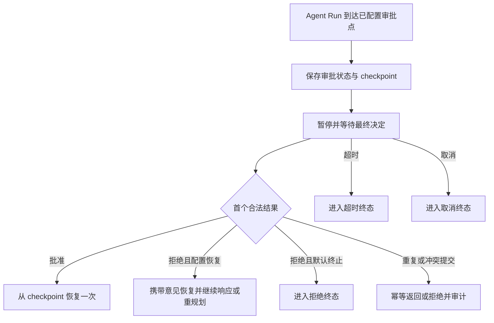

# Agent运行时审批需求说明书

> 功能标识：`agent-runtime-approval`
> 版本：V1.1.0
> 文档状态：已确认
> SDD 等级：S2
> 创建日期：2026-07-16
> 更新日期：2026-07-16
>
> **更新时间维护规则**：任何正文修改必须同步更新 `更新日期` 为本次修改日期，并在 `版本修订记录` 中追加变更记录。不得正文已变更而更新日期仍停留在旧日期。

## 一句话说明

为 Fons4AI 的 Agent 运行过程提供默认关闭、可由下游编排的人工审批能力，使执行可在关键阶段安全暂停，并在审批完成后跨客户端断线、应用重启和多实例继续原有 Run。

## 需求澄清摘要

### 已确认内容

| 序号 | 澄清问题 | 已确认结论 | 影响范围 |
| --- | --- | --- | --- |
| Q1 | 审批等待是否需要跨客户端断线、应用重启和多实例恢复 | 必须完整持久化审批状态和执行 checkpoint；审批人可稍后在任意实例提交决定并恢复原 Run | 核心流程、数据、可用性、兼容性 |
| Q2 | 多审批人及规则聚合由谁负责 | 每个审批点只维护一个审批请求；身份鉴权及会签、或签、法定人数等聚合由下游完成，框架只接收最终决定 | 范围、角色、安全、数据 |
| Q3 | 审批拒绝后如何处理原 Run | 同时支持终止原 Run，以及携带审批意见从 checkpoint 恢复 Agent 继续响应或重规划；由下游按审批点配置，默认拒绝即终止 | 业务规则、流程、兼容性 |
| Q4 | 重复或冲突的最终决定如何处理 | 首个合法最终决定原子生效；相同决定的重复提交幂等返回既有结果；后续冲突决定拒绝受理并审计；同一 Run 最多恢复一次 | 并发、幂等、审计、验收 |
| Q5 | checkpoint 与审计数据如何保留和清理 | 待审批期间不得清理；进入终态后分别支持下游配置保留周期和清理策略，框架不硬编码时长，审计可比 checkpoint 保留更久 | 数据治理、安全、运维 |

已接受澄清问题数量：5。

### 待确认内容

- 无。

## CR-001 轻量化范围调整

本节自 V1.1.0 起优先于 V1.0.0 中与其冲突的范围、流程、数据治理和验收描述。V1.0.0 保留为历史决策依据，不再作为轻量 V1 的全部发布门禁。

### 调整后的产品边界

- 框架提供可插拔的 HITL 公共契约、审批点上下文、策略判断、暂停结果和恢复入口；下游负责配置策略、展示审批交互、鉴权并提交最终决定。
- 自研 Base/React/Web/Plan Agent 的 V1 恢复限定在同一宿主进程；进程重启后明确报告中断已失效，不承诺跨实例自动恢复。
- 基于 Spring AI Alibaba 的 Agent 复用其原生 `HumanInTheLoopHook`、Graph interruption、Saver 和同一 thread 恢复能力；Fons4AI 只做公共类型映射，不复制原生 checkpoint 协议。
- 审批只放行 Agent 原本已获得权限的动作，不能通过审批意见新增工具、激活技能、访问资源或提升系统指令权限。
- 通用分布式 checkpoint、Redisson 审批聚合、Run 查询/审计平台、CAS/fencing、outbox、加密信封和独立 Retention 延期到有真实下游需求后重新设计。
- 原审批实现尚未发布且没有业务接入，因此允许在本轮清理未通过 Gate 的公共类型和配置，不提供对这些实验性类型的兼容承诺。

### 原 REQ / AC 生效矩阵

| 原条目 | V1.1 状态 | 调整说明 |
| --- | --- | --- |
| REQ-001、AC-001 | 保留 | 审批默认关闭，未配置时行为不变 |
| REQ-002、AC-002、AC-003 | 调整后保留 | 只保留关键副作用前和阶段边界审批点，取消低价值全局/事后点位 |
| REQ-003、AC-004 | 调整后保留 | 必须先形成可恢复中断再报告等待；自研 Agent 只保证进程内，Alibaba 使用原生 Saver |
| REQ-004、AC-005、AC-006 | 延期/部分保留 | Fons4AI 通用跨重启、多实例恢复延期；Alibaba 原生恢复仍需支持 |
| REQ-005、AC-007 | 延期 | 完整规则快照和审计平台不进入轻量 V1；身份与业务审批责任仍归下游 |
| REQ-006、AC-008～AC-010 | 保留并扩展 | 支持批准、编辑、拒绝终止和拒绝携带意见恢复；默认拒绝终止 |
| REQ-007、AC-011 | 调整后保留 | 同进程中断支持超时/取消终态；不新增分布式超时调度器 |
| REQ-008、AC-012、AC-013 | 调整后保留 | 同进程内首个决定生效、重复决定不重复执行；不承诺跨实例 CAS |
| REQ-009、AC-014 | 延期 | 通用 Run 查询和完整审计平台延期；仍保留必要中断事件 |
| REQ-010、AC-015、AC-016 | 延期 | 通用 checkpoint/audit Retention 延期；具体 Saver 治理由宿主配置 |

### 新增需求

| 需求编号 | 需求内容 | 优先级 | 关联验收 |
| --- | --- | --- | --- |
| REQ-011 | HITL 必须以公共契约 + 可替换内核 Adapter 提供，下游不需要实现或理解各 Agent 的 ResumeHandler、checkpoint 或供应商中断对象 | P0 | AC-017、AC-018 |
| REQ-012 | 只在工具调用、搜索/抓取、计划阶段和原生技能工具等关键副作用前触发审批；低价值全局和事后审批点不进入 V1 | P0 | AC-017 |
| REQ-013 | 流式入口输出审批中断事件，非流式入口返回 `WAITING_APPROVAL` 和中断 ID；两者通过同一恢复入口继续 | P0 | AC-019 |
| REQ-014 | 共享 Agent 的中断、决定和 continuation 必须保存在每 Run 上下文或轻量运行时中，不得串到其他并发 Run | P0 | AC-020、AC-021 |
| REQ-015 | 所有 Agent 与 Skills 核心类必须可由框架负责人直接阅读：类注释说明完整流程，字段、枚举、入口方法和关键逻辑说明语义、生命周期、线程边界和副作用 | P0 | AC-022、AC-023 |

### 新增验收标准

- AC-017：Given 下游未配置审批或策略返回不需要审批，when Base/React/Web/Plan/Skills 执行，then 不创建中断且原流程、流式和非流式结果保持不变。
- AC-018：Given 任一 Agent 到达受支持的关键副作用前审批点，when 策略要求审批，then 副作用计数保持 0；下游只收到供应商无关的中断信息，不需要提供 Agent 专属 ResumeHandler。
- AC-019：Given 同一中断分别通过流式和非流式入口触发，when Agent 暂停，then 流式返回审批中断事件，非流式返回 `WAITING_APPROVAL + interruptId`，批准/编辑/拒绝均通过统一恢复入口处理。
- AC-020：Given 自研 Agent 仍在同一进程，when 首个合法决定恢复中断，then continuation 最多执行一次；进程重启或中断不存在时返回明确不可恢复结果，不伪造成功。
- AC-021：Given Spring AI Alibaba Agent 触发审批，when 下游提交决定，then Fons4AI 使用同一 thread 和原生 Saver/Human Feedback 恢复；批准或编辑后的动作最多执行一次，拒绝不能提升权限。
- AC-022：Given 一个共享 Agent 并发运行多个 Run，when 其中一个 Run 等待或恢复审批，then 其他 Run 的状态、工具、技能、资源权限、流和最终 Hook 不受影响。
- AC-023：Given 负责人阅读 Base、React、Web、Plan、Skills 及 Skills 资源相关类，when 查看类、字段、枚举、Builder/公共入口和关键流程，then 能从中文注释直接识别执行顺序、共享/每 Run 边界、HITL 扩展点、流式/非流式差异、安全约束和异常结果。

## 背景与目标

- 背景：Fons4AI 当前提供多种 Agent 执行形态，上层系统需要在高风险工具调用、关键计划步骤或其他自定义阶段插入人工判断，但 Agent 运行时尚缺少统一的暂停、审批、恢复、超时、取消和审计能力。
- 当前问题：接入方若各自实现审批等待，容易产生运行状态丢失、应用重启后无法恢复、多实例重复恢复以及业务审批策略侵入 Agent 内核等问题。
- 目标：建立与具体业务审批规则解耦的运行时审批能力，让下游决定是否启用、在哪个阶段触发、由谁审批以及采用何种审批规则；框架负责可靠保存、状态推进、恢复、并发保护和审计。
- 不做会怎样：关键 Agent 操作无法获得统一的人工 Gate；接入方需要重复建设，且难以保证跨实例恢复和一致性。

## 需求范围

### 本次包含

- 提供通用的运行时暂停、审批、恢复、超时、取消和审计能力。
- 当前基础执行、ReAct、联网搜索 ReAct、计划执行和技能增强 ReAct 五类 Agent 形态均可被编排审批点。
- 下游可决定是否启用审批、审批点所在关键阶段、审批规则、审批人以及拒绝后的处理模式。
- 持久化审批状态、完整恢复所需的执行 checkpoint 和审计信息。
- 支持客户端断线、应用重启和多实例切换后的查询、决定与恢复。
- 提供重复提交幂等、冲突决定拒绝和单次恢复保护。
- 提供 checkpoint 与审计记录相互独立的保留和清理治理能力。

### 本次不包含

- 研发过程中的 SDD 评审或实现确认门禁。
- 业务审批流程、业务角色模型、会签/或签/法定人数等多审批人聚合能力。
- 下游用户身份认证、权限体系和审批页面。
- 为具体行业或业务场景硬编码审批策略。
- 指定唯一的持久化产品、数据库或部署拓扑。
- 技术设计、任务拆解和业务代码实现。

## 角色与场景

| 角色或参与方 | 使用场景 | 触发条件 | 期望结果 |
| --- | --- | --- | --- |
| 下游接入层 | 编排审批点和审批策略 | 某类 Agent Run 创建前或运行期间 | 可按业务风险决定是否暂停、谁审批及拒绝后行为，Agent 内核不含业务策略 |
| 审批决定提交方 | 提交已完成鉴权和聚合的最终决定 | 审批请求处于待审批状态 | 决定被可靠接受并产生可查询的审计结果 |
| Agent 使用方 | 等待或继续一次 Agent Run | Run 到达已配置审批点 | 执行安全暂停，批准后可从原位置继续，且断线或重启不丢失 |
| 运维与审计人员 | 查询状态、定位异常和执行数据治理 | 发生等待、决定、恢复、超时、取消或冲突提交 | 能追踪完整生命周期，并按配置治理 checkpoint 与审计数据 |

## 需求列表

| 需求编号 | 需求内容 | 优先级 | 关联场景 | 关联验收 |
| --- | --- | --- | --- | --- |
| REQ-001 | 审批能力默认关闭；未启用或未配置审批点时，既有 Agent Run 的可观察行为保持不变 | P0 | 兼容接入 | AC-001 |
| REQ-002 | 下游可为当前五类 Agent 形态编排审批点，并决定启用条件、触发阶段、审批规则、审批人和拒绝处理模式 | P0 | 审批编排 | AC-002、AC-003 |
| REQ-003 | Run 到达审批点后必须暂停，并可靠保存审批状态及完整恢复所需的 checkpoint | P0 | 暂停等待 | AC-004 |
| REQ-004 | 客户端断线、应用重启或多实例切换后，待审批请求仍可查询、提交决定，并由任意可用实例恢复原 Run | P0 | 跨实例恢复 | AC-005、AC-006 |
| REQ-005 | 框架只接收下游完成身份鉴权及多审批人规则聚合后的单个最终决定，并记录最终决定人、规则快照、意见和决定时间 | P0 | 最终决定与审计 | AC-007 |
| REQ-006 | 批准后恢复原 Run；拒绝后可按审批点配置终止，或携带审批意见恢复 Agent 继续响应或重规划，默认拒绝即终止 | P0 | 决定处理 | AC-008、AC-009、AC-010 |
| REQ-007 | 审批超时和取消必须进入可区分的明确终态，且不得自动恢复原 Run | P0 | 异常与终止 | AC-011 |
| REQ-008 | 同一审批请求的最终决定必须原子生效；相同重复提交幂等返回，冲突决定拒绝并审计，同一 Run 最多恢复一次 | P0 | 并发与幂等 | AC-012、AC-013 |
| REQ-009 | 审批全生命周期必须可查询和审计，覆盖请求创建、暂停、决定、恢复、超时、取消、重复和冲突提交 | P1 | 运维与审计 | AC-014 |
| REQ-010 | 待审批数据在决定、超时或取消前不得清理；终态 checkpoint 与审计记录须支持分别配置保留周期和清理策略 | P0 | 数据治理 | AC-015、AC-016 |

## 业务规则

| 规则编号 | 规则内容 | 适用场景 | 例外或边界 |
| --- | --- | --- | --- |
| BR-001 | 审批默认关闭；是否启用及触发位置均由下游显式编排 | 所有 Agent Run | 未配置审批时不得隐式暂停 |
| BR-002 | 每次 Run 到达一个审批点实例时，只形成一个待处理审批请求 | 审批点触发 | Run 后续再次到达同一逻辑审批点可形成新的审批点实例，但不得复用已终结请求 |
| BR-003 | 框架不执行身份认证或多审批人聚合，只接受下游提交的最终决定 | 最终决定提交 | 非法或未授权请求应在下游被拦截；框架仍需校验请求当前状态 |
| BR-004 | 首个合法最终决定不可被后续冲突决定覆盖 | 并发提交 | 内容相同的重复提交按幂等请求处理 |
| BR-005 | 批准仅允许触发一次恢复，同一 Run 不得因重试或并发决定重复执行 | Run 恢复 | 恢复失败的重试不得绕过既有恢复状态 |
| BR-006 | 拒绝处理模式由下游按审批点配置；未配置时按“拒绝即终止”执行 | 拒绝决定 | 选择恢复模式时必须把审批意见带回原 Run 上下文 |
| BR-007 | 超时和取消是明确终态，不自动恢复 | 超时、主动取消 | 如需再次执行，应由下游发起新的 Run，不复用终态审批请求 |
| BR-008 | 待审批状态及其 checkpoint 在决定、超时或取消前不得按保留策略清理 | 数据清理 | 无 |
| BR-009 | 终态 checkpoint 与审计记录使用相互独立的保留周期；允许审计记录保留更久 | 数据治理 | 框架不硬编码固定保留时长 |
| BR-010 | Agent 不硬编码业务审批策略、审批人或业务风险判断 | 所有审批点 | 通用状态校验、幂等和安全保护属于框架职责 |

## 业务流程

### 主要流程

1. 下游为某类 Agent Run 显式启用审批，并配置审批点、规则信息、审批对象和拒绝处理模式。
2. Run 到达审批点后，框架创建唯一审批请求，保存审批状态与完整 checkpoint，并暂停继续执行。
3. 下游完成身份鉴权和多审批人规则聚合后，向任意可用实例提交一个最终决定。
4. 框架原子接受首个合法决定，记录规则快照、最终决定人、意见和时间。
5. 若决定为批准，Run 从 checkpoint 恢复；若为拒绝，则按审批点配置终止或携带意见恢复。
6. 框架记录恢复或终止结果，并按配置对终态 checkpoint 与审计记录分别执行后续数据治理。

### 异常或分支

- 审批等待期间发生客户端断线、应用重启或实例切换时，审批请求保持待处理，后续可在任意可用实例继续。
- 审批超时或被取消时，进入对应终态，不自动恢复。
- 收到与既有决定内容相同的重复提交时，返回既有结果，不重复恢复。
- 收到与既有决定冲突的提交时，拒绝受理并记录冲突审计，不覆盖首个决定。
- 拒绝处理未显式配置时，按安全默认策略终止原 Run。

### 流程图

## 业务数据口径

只记录接入方需要理解的数据含义，不限定具体存储方案、数据结构或实现框架。

### 数据影响判断

| 检查项 | 是否涉及 | 说明 |
| --- | --- | --- |
| 新增、修改、删除或查询持久化数据 | 是 | 新增审批请求状态、执行 checkpoint、决定结果和审计记录，并支持终态清理 |
| 外部数据入库、出库、同步、对账或报表 | 否 | 不要求外部业务数据入库、对账或报表；下游仅提交最终审批决定 |
| 字段映射、金额、日期、状态、流水号或客户标识 | 是 | 涉及 Run 标识、审批请求标识、审批状态和各类时间；不涉及金额或客户业务标识 |
| 手机号、证件号、银行卡、合同、地址、交易流水等敏感数据 | 可能涉及 | checkpoint、规则快照或审批意见可能承载下游业务上下文，应按潜在敏感数据保护 |
| 跨系统、跨服务、跨库或第三方数据流转 | 是 | 下游接入层向任意框架实例提交最终决定，审批数据需支持多实例共享和恢复 |

### 关键数据口径

| 业务对象/数据项 | 用户能理解的含义 | 来源或产生方式 | 单位/格式/状态口径 | 本次是否变化 | 是否关键 | 确认状态 |
| --- | --- | --- | --- | --- | --- | --- |
| Run 标识 | 唯一定位一次 Agent 运行 | Run 创建时产生 | 全局唯一、跨实例可识别 | 是 | 是 | 已确认 |
| 审批请求标识 | 唯一定位一次审批点实例 | Run 到达审批点时产生 | 唯一且不可与已终结请求混用 | 是 | 是 | 已确认 |
| 审批状态 | 表达请求正处于等待、已决定、已超时、已取消或已恢复等阶段 | 框架按生命周期推进 | 各终态可区分且不可被冲突决定覆盖 | 是 | 是 | 已确认 |
| 执行 checkpoint | 恢复原 Run 所需的完整运行上下文 | Run 暂停时产生 | 必须足以跨断线、重启和实例恢复 | 是 | 是 | 已确认 |
| 最终决定 | 下游完成鉴权和聚合后的批准或拒绝结果 | 下游接入层提交 | 每个审批请求仅首个合法决定生效 | 是 | 是 | 已确认 |
| 规则快照 | 形成最终决定时下游所采用规则的可审计快照 | 下游随最终决定提供 | 保存决定时的版本，不随未来配置变化 | 是 | 是 | 已确认 |
| 最终决定人 | 对最终决定负责的主体标识 | 下游完成鉴权后提供 | 可追踪且与决定记录关联 | 是 | 是 | 已确认 |
| 审批意见 | 最终决定附带的说明，拒绝恢复模式下作为 Agent 后续输入 | 下游随最终决定提供 | 保持原意，按潜在敏感数据保护 | 是 | 是 | 已确认 |
| 生命周期时间 | 请求创建、决定、恢复、超时、取消及审计事件的发生时间 | 相应事件发生时记录 | 使用一致时间基准，可排序和追踪 | 是 | 是 | 已确认 |
| 保留与清理策略 | 终态 checkpoint 和审计记录各自的保留周期与清理规则 | 下游配置 | 两类数据独立配置，不设框架固定时长 | 是 | 是 | 已确认 |

## 影响说明

| 影响对象 | 影响说明 |
| --- | --- |
| 上层接入系统 | 新增审批点编排、最终决定提交、状态查询和数据治理接入能力 |
| 当前 Agent 形态 | 基础执行、ReAct、联网搜索 ReAct、计划执行和技能增强 ReAct 均需具备一致的可编排审批语义 |
| 既有 Agent Run | 默认关闭时保持原有行为；启用后运行生命周期新增暂停和恢复分支 |
| 公共能力契约 | 新增审批请求、状态、决定、恢复、取消、查询和审计相关通用契约，需避免绑定单一 AI 开发框架 |
| 运行资源 | 需要能够被多实例共同访问的持久化状态和 checkpoint；具体资源由设计阶段确定 |
| 安全与合规 | checkpoint、规则快照和意见按潜在敏感数据治理，身份认证及业务授权由下游负责 |
| 长期知识库 | 功能落地并验证后，应通过知识治理工作流更新 Agent 编排能力的运行、配置和资源事实 |

## 验收标准

- AC-001：Given 审批能力未启用或某 Run 未配置审批点，when 任一当前 Agent 形态按既有方式运行，then 不出现额外暂停或审批请求，既有可观察行为保持不变。关联需求：REQ-001。
- AC-002：Given 下游为任一当前 Agent 形态配置审批点，when Run 到达指定关键阶段，then 框架创建审批请求并暂停继续执行。关联需求：REQ-002。
- AC-003：Given 下游配置审批规则、审批对象和拒绝处理模式，when 审批请求创建，then 请求保存本次编排快照，Agent 本身不包含具体业务审批策略。关联需求：REQ-002。
- AC-004：Given Run 到达审批点，when 框架完成暂停，then 审批状态和完整 checkpoint 已可靠保存，未完成保存前不得把请求报告为可审批。关联需求：REQ-003。
- AC-005：Given 审批请求处于等待状态，when 客户端断线、应用重启或原实例退出，then 请求和 checkpoint 不丢失，仍可被查询和处理。关联需求：REQ-004。
- AC-006：Given 待审批请求由其他可用实例接收合法批准，when 该实例执行恢复，then 原 Run 从对应 checkpoint 继续且上下文保持一致。关联需求：REQ-004。
- AC-007：Given 下游已完成身份鉴权和多审批人规则聚合，when 提交单个最终决定，then 框架记录最终决定、决定人、规则快照、意见和决定时间，并不自行执行会签或或签计算。关联需求：REQ-005。
- AC-008：Given 首个合法最终决定为批准，when 决定生效，then 原 Run 从 checkpoint 恢复且最多恢复一次。关联需求：REQ-006。
- AC-009：Given 最终决定为拒绝且审批点未配置拒绝后恢复，when 决定生效，then 原 Run 进入拒绝终态且不自动恢复。关联需求：REQ-006。
- AC-010：Given 最终决定为拒绝且审批点已配置拒绝后恢复，when 决定生效，then 审批意见随 checkpoint 恢复给 Agent，Agent 可继续响应或重规划。关联需求：REQ-006。
- AC-011：Given 审批等待达到下游配置的超时条件或收到合法取消，when 状态生效，then 请求分别进入可区分的超时或取消终态，原 Run 不自动恢复。关联需求：REQ-007。
- AC-012：Given 某审批请求已有生效决定，when 任意实例再次提交内容相同的决定，then 返回既有结果，不产生第二次决定或恢复。关联需求：REQ-008。
- AC-013：Given 某审批请求已有生效决定，when 任意实例提交冲突决定，then 冲突决定被拒绝、首个决定保持不变，并新增冲突审计记录。关联需求：REQ-008。
- AC-014：Given 审批请求经历创建、等待、决定、恢复、超时、取消、重复或冲突事件，when 有权限的接入方查询审计信息，then 可按 Run 和审批请求追踪已发生事件、责任主体和时间顺序。关联需求：REQ-009。
- AC-015：Given 审批请求仍处于等待状态，when 执行任何保留期清理，then 审批状态、checkpoint 和必要审计数据均不被清理。关联需求：REQ-010。
- AC-016：Given 审批请求已进入终态，when 下游分别配置 checkpoint 与审计记录的保留周期和清理策略，then 两类数据按各自策略治理，并允许审计记录保留时间长于 checkpoint。关联需求：REQ-010。

## 质量要求

- 性能：不得预设未经验证的固定吞吐或延迟指标；设计阶段需给出审批状态读写、恢复和并发决定的性能基线与验证方法。
- 安全：身份认证和业务审批授权由下游负责；框架必须保护 checkpoint、规则快照、决定人和审批意见，避免在无权限查询或普通运行日志中泄露。
- 兼容：审批默认关闭；现有接入在不采用新能力时无需改变运行语义。公共能力不得被表述或实现为只适用于单一 AI 开发框架。
- 可用性：待审批请求必须经受客户端断线、应用重启和多实例切换；多实例并发决定只能有一个合法结果生效。
- 可审计性：所有状态变化、最终决定、恢复、重复和冲突处理均应具备可追踪记录。
- 可治理性：待审批数据不得提前清理；终态 checkpoint 和审计记录支持独立保留与清理策略。

## 风险与待确认

### 风险

- checkpoint 可能包含较大的运行上下文或上层敏感数据，设计阶段需控制存储成本、访问权限、加密、日志脱敏和失败恢复。
- 跨实例并发恢复若缺少原子状态保护，可能导致同一 Run 重复执行关键动作。
- 拒绝后恢复并重规划可能再次到达审批点，设计阶段需防止错误复用已终结审批请求，并明确新审批点实例的关联关系。
- 当前计划执行形态存在预留或未完善能力，设计与验证时必须区分已实现链路和待完善链路，不得把预留能力写成既有生产能力。

### 假设

- 下游接入层能够完成身份鉴权、业务授权和多审批人规则聚合，并向框架提交可信的最终决定及审计上下文。
- 下游会为需要超时处理的审批点提供明确超时配置；框架不硬编码统一业务时长。
- 具体持久化介质、数据结构、恢复协议和资源拓扑由技术设计阶段基于项目事实确定。

### 待确认

- 无阻塞需求问题。具体存储适配、错误码、接口形态、状态模型细节、加密方案和性能指标属于技术设计决策，不改变本需求已确认的业务语义。

## 版本修订记录

| 日期 | 版本 | 说明 |
| --- | --- | --- |
| 2026-07-16 | V1.0.0 | 初始化已确认需求说明书，记录五项澄清结论及 S2 验收范围 |
| 2026-07-16 | V1.1.0 | 依据 CR-001 收缩为轻量可插拔 HITL，延期通用分布式审批平台并增加可读性验收 |
