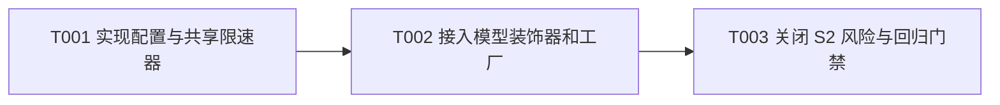

# 向量化请求限速任务规划

> 功能标识：`embedding-request-rate-limit`
> SDD 等级：`S2`
> 来源需求：`spec/features/20260722/向量化请求限速-需求说明书.md`
> 来源技术设计：`spec/features/20260722/向量化请求限速-技术设计说明书.md`
> 文档状态：pending
> 创建日期：2026-07-22
> 更新日期：2026-07-22

## 1. 任务概览

- 总任务数：3
- 核心路径：T001 -> T002 -> T003
- 风险任务：T003，关闭并发共享、异常直传、分批及零部分写入的 S2 回归门禁
- 阻塞任务：无
- 可并行分组：无，各任务存在实现或验证依赖
- Mock/临时实现闭环：无
- 可运行服务闭环：无，本模块是 Spring Boot Starter，不是独立服务
- DDL/数据结构任务：无
- 运行初始化 DML/Seed 任务：无
- 数据设计与治理任务：无，本次不改变数据字段、内容和流转口径

### 1.1 任务依赖图

## 2. 实现确认门禁

- 状态：等待用户确认
- 规划产物不等于实现授权。
- 生成本任务规划文档后必须暂停，等待用户确认后才能进入业务代码实现。
- 用户确认执行且未指定任务 ID 时，默认执行全部未完成任务。
- 用户指定任务 ID 时，例如 `执行 T001,T002`，只执行指定任务。
- 不明确指令，例如 `看看`、`下一步是什么`、`继续看`，不得视为实现确认。

## 3. 任务列表

- [x] T001 实现限速配置和单实例共享固定间隔限速器
  - 通俗解释: 上层应用可以配置向量请求的最小发送间隔；默认不等待，启用后同一实例的所有线程共同遵守一条请求时间线。
  - AC: AC-001, AC-002, AC-003
  - 来源: 技术设计说明书 §3、§5.1、§8.3、§9 D-002
  - Files: fons4ai-rag/fons4ai-rag-spring-ai-starter/src/main/java/com/fons/cloud/ai/rag/infrastructure/config/VectorConfigProperties.java; fons4ai-rag/fons4ai-rag-spring-ai-starter/src/main/java/com/fons/cloud/ai/rag/embed/support/EmbeddingRequestRateLimiter.java; fons4ai-rag/fons4ai-rag-spring-ai-starter/src/test/java/com/fons/cloud/ai/rag/embed/support/EmbeddingRequestRateLimiterTest.java
  - Depends: 无
  - Verification: RED 阶段分别给定默认配置、`0ms`、正数间隔、负数间隔和两个并发调用编写失败测试；GREEN 后断言默认值为 0、0 不触发等待、顺序与并发许可时间差均不小于配置值、负数初始化失败、中断时恢复中断标记且不发放许可；测试使用可控单调时钟和等待器，不依赖秒级真实休眠。
  - Quality: 使用 `System.nanoTime()` 语义的单调时间源，循环重检提前唤醒；同步临界区只覆盖等待和许可时间更新；命名体现“最小请求启动间隔”而非吞吐或并发数；执行 DDD-lite/领域建模检查并确认该能力属于基础设施支持类、不引入伪业务对象；不新增第三方依赖，不记录请求正文或凭证。
  - 专业工作流: 无
  - Done: 配置 `sys.rag.vector.embedding.min-request-interval-ms` 可绑定且默认 0；限速器的关闭、正间隔、并发、中断和非法配置测试稳定通过，生产代码无真实时间测试耦合。

- [x] T002 接入受限速的 EmbeddingModel 装饰器和 PgVectorStore 工厂
  - 通俗解释: 无论大文件产生多少批次，还是多个导入任务同时运行，所有经 RAG 工厂发起的向量模型调用都会共享限速；调用方和分批方式不用改变。
  - AC: AC-001, AC-002, AC-003, AC-005
  - 来源: 技术设计说明书 §2、§5.2、§6、§9 D-001 与 D-003
  - Files: fons4ai-rag/fons4ai-rag-spring-ai-starter/src/main/java/com/fons/cloud/ai/rag/embed/support/RateLimitedEmbeddingModel.java; fons4ai-rag/fons4ai-rag-spring-ai-starter/src/main/java/com/fons/cloud/ai/rag/embed/support/DynamicPgVectorStoreFactory.java; fons4ai-rag/fons4ai-rag-spring-ai-starter/src/test/java/com/fons/cloud/ai/rag/embed/support/RateLimitedEmbeddingModelTest.java; fons4ai-rag/fons4ai-rag-spring-ai-starter/src/test/java/com/fons/cloud/ai/rag/embed/support/DynamicPgVectorStoreFactoryTest.java
  - Depends: T001
  - Verification: RED 阶段用记录调用次数的伪 `EmbeddingModel` 覆盖 `call(EmbeddingRequest)`、`embed(Document)`、文本默认调用路径及两个工厂产物；GREEN 后断言每次实际委托前仅获取一次许可、同一工厂创建的 VectorStore 复用同一限速状态、配置 0 时行为兼容；让委托模型抛出代表 429 的异常，断言装饰器只调用一次并原样传播，不新增重试。
  - Quality: 装饰器只覆盖 Spring AI 必需入口并委托原始模型；网络调用在限速锁外；执行 DDD-lite/领域建模检查并保持应用服务只负责编排、限速细节隔离在基础设施支持类；不得注册第二个全局 `EmbeddingModel` Bean 导致注入歧义；不得在每次 `create` 时创建独立限速器；不改变 `EmbeddingService` 公共接口、`DocumentCountBatchingStrategy` 或 POM 依赖。
  - 专业工作流: 无
  - Done: 工厂构造生命周期内只创建一个受限速模型装饰器并供所有 PgVectorStore 使用；模型调用路径、共享范围和异常直传测试全部通过，代码完成重构且无重复等待逻辑。

- [x] T003 关闭并发、兼容、异常和持久化回归门禁
  - 通俗解释: 证明限速只改变请求节奏，不改变 9 条分批、文档顺序、失败语义和“模型全部成功后才写库”的安全行为。
  - AC: AC-001, AC-002, AC-003, AC-004, AC-005
  - 来源: 技术设计说明书 §8、§10.1、§10.2、§10.3
  - Files: fons4ai-rag/fons4ai-rag-spring-ai-starter/src/test/java/com/fons/cloud/ai/rag/embed/support/DocumentCountBatchingStrategyTest.java; fons4ai-rag/fons4ai-rag-spring-ai-starter/src/test/java/com/fons/cloud/ai/rag/embed/support/PgVectorStoreEmbeddingServiceTest.java; fons4ai-rag/fons4ai-rag-spring-ai-starter/src/test/java/com/fons/cloud/ai/rag/embed/support/EmbeddingRequestRateLimiterTest.java; fons4ai-rag/fons4ai-rag-spring-ai-starter/src/test/java/com/fons/cloud/ai/rag/embed/support/RateLimitedEmbeddingModelTest.java; fons4ai-rag/fons4ai-rag-spring-ai-starter/src/test/java/com/fons/cloud/ai/rag/embed/support/DynamicPgVectorStoreFactoryTest.java
  - Depends: T002
  - Verification: 对 20 个文档断言模型请求仍为 9/9/2 且顺序不变；令第三批抛出 429，断言没有新增重试且 JdbcTemplate 写入次数为 0；并发测试断言所有线程共享最小间隔；复核数据口径、文档内容、向量结果和持久化目标均未因限速改变；执行 RAG Starter 全量 Maven 测试并确认既有 7 个测试及新增测试全部通过；审查默认配置下无主动等待、无 DDL、无公共 API 或依赖变更。
  - Quality: 时间相关断言使用确定性时钟，避免脆弱的墙上时钟误差；回归只补充与 AC 和风险直接相关的测试；执行 DDD-lite/领域建模检查并确认没有业务规则错误下沉或新增贫血领域对象；检查中断、异常日志不泄露文档正文、向量或凭证；保留现有用户工作区中的无关改动。
  - 专业工作流: 无
  - Done: AC-001 至 AC-005 均有自动化证据，R-001 至 R-005 的代码可控项已验证或边界已记录；模块全量测试通过，确认无需数据迁移且回滚可恢复为工厂直接使用原始模型。

## 4. AC 追踪表

| AC | 覆盖任务 | 验证方式 |
| --- | --- | --- |
| AC-001 | T001, T002, T003 | 默认配置和 `0ms` 无等待测试、全量回归 |
| AC-002 | T001, T002, T003 | 顺序许可时间线及模型委托前许可测试 |
| AC-003 | T001, T002, T003 | 并发共享时间线和工厂共享装饰器测试 |
| AC-004 | T003 | 20 文档保持 9/9/2、顺序不变、全部模型成功后才写库的回归测试 |
| AC-005 | T002, T003 | 429 单次委托、异常直传和第三批失败零数据库写入测试 |

## 5. S2 风险与回归说明

- 并发风险：由 T001 的共享时间线测试和 T003 的并发回归关闭。
- 兼容风险：由默认 `0ms`、公共接口/依赖不变检查关闭。
- 一致性风险：由第三批模型失败时零数据库写入回归关闭。
- 回滚风险：无数据结构变化；回滚到工厂直接使用原始模型即可。
- 多实例和模型客户端内部重试：属于已确认非目标，不作为本次发布完成条件，但必须在配置说明和实施交付中保留边界说明。

## 6. 规划完成证据

- 输入产物：已读取正式需求说明书和正式技术设计说明书。
- 需求与设计状态：无草案、阻塞或待确认项。
- 数据/DDL：不涉及。
- 实现确认状态：`pending`。
- SDD 校验：已执行严格校验，结果为 `OK: spec/features/20260722 SDD artifacts are valid`。
