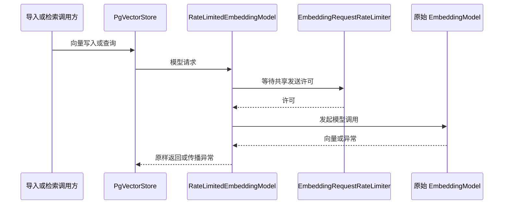

# 向量化请求限速技术设计说明书

> 功能标识：`embedding-request-rate-limit`
> SDD 等级：`S2`
> 来源需求：`spec/features/20260722/向量化请求限速-需求说明书.md`
> 文档状态：已确认
> 创建日期：2026-07-22
> 更新日期：2026-07-22
>
> **更新时间维护规则**：任何正文修改必须同步更新 `更新日期` 为本次修改日期。不得正文已变更而更新日期仍停留在旧日期。

## 1. 设计概要

- 功能描述：在 RAG Starter 内对同一应用实例发起的向量模型请求统一施加可配置的最小启动时间间隔。
- 影响模块：`fons4ai-rag/fons4ai-rag-spring-ai-starter`。
- 关键技术点：`EmbeddingModel` 装饰器、单实例共享限速状态、单调时钟、可中断等待、线程安全。
- 依赖关系：复用 JDK 并发原语与现有 Spring AI `EmbeddingModel`，不新增第三方限流依赖。
- 非目标：不新增 429 自动重试，不做跨实例协调，不修改文档分批、数据库结构或公共业务接口。
- SDD 等级理由：变更虽小，但涉及并发限速边界和外部向量服务调用时序，按契约归为 S2。

### 1.1 技术栈与交付画像

| 项目事实 | 已确认结论 | 证据或原因 |
| --- | --- | --- |
| 项目形态 | 库/SDK，Spring Boot Starter | RAG 能力由上层应用引入 Starter 使用 |
| 主要语言与运行时 | Java / JVM / Spring Boot / Spring AI | 模块源码与 POM |
| 构建与测试入口 | Maven 模块测试 | 模块 `pom.xml` 与既有测试 |
| 交付入口 | Starter 随上层应用发布 | 自动配置创建 RAG 组件 |
| 数据结构变更 | 否 | 仅调整模型请求发起时序 |

## 2. 架构与调用链路

- 涉及入口：`EmbeddingService.embedAndStore(List<Document>)` 以及 `PgVectorStore` 内部需要生成查询向量的调用。
- 涉及模块：RAG Spring AI Starter。
- 涉及服务：`PgVectorStoreEmbeddingService`、`DynamicPgVectorStoreFactory`。
- 涉及领域对象：无新增业务领域对象；新增基础设施级限速器和模型装饰器。
- 涉及数据访问：沿用 `PgVectorStore` 的既有写入与查询逻辑。
- 外部依赖：现有向量模型服务。
- 调用链路：工厂在单例生命周期内创建一个共享限速器和一个受限速的 `EmbeddingModel` 装饰器；所有由该工厂创建的 `PgVectorStore` 复用该装饰器。Spring AI 每次调用装饰器的 `call(EmbeddingRequest)` 或 `embed(Document)` 前先取得发送许可，再调用原始模型。



### 2.1 服务形态与运行态设计

- 模块形态：Spring Boot Starter / 框架扩展组件。
- 运行边界：本 Starter 由上层应用装配和托管，本次不新增独立进程、网络监听或运行态探针。
- 运行环境与配置来源：沿用 `VectorConfigProperties` 的 Spring Boot 配置绑定。
- 核心运行链路：上层应用调用 RAG 能力时，在进程内同步等待发送许可。
- 外部依赖：既有向量模型服务和 PostgreSQL/PGVector；本次不改变连接方式。
- 隔离与清理：限速状态仅存于应用实例内存，实例终止后自然释放。
- 暂缓项：跨实例配额协调不在本次范围。

## 3. API / RPC / 消息契约设计

### 3.1 接口列表

无新增 HTTP、RPC、消息或公共 Java 业务接口。新增配置项建议为：

| 配置项 | 类型 | 默认值 | 语义 | AC |
| --- | --- | --- | --- | --- |
| `sys.rag.vector.embedding.min-request-interval-ms` | `long` | `0` | 同一实例相邻向量模型请求的最小启动间隔（毫秒）；`0` 表示关闭 | AC-001、AC-002、AC-003 |

### 3.2 接口详情

- 兼容性：未配置时绑定默认值 `0`，调用方代码无需改变。
- 校验：负数属于非法配置，组件初始化时快速失败，不允许转换为关闭状态以掩盖配置错误。
- 错误码：不新增业务错误码；模型异常原样沿现有调用链传播。
- 契约文件：无。

## 4. 数据模型与 DDL 影响

### 4.1 数据影响判断

| 检查项 | 是否涉及 | 处理要求 |
| --- | --- | --- |
| 持久化数据新增、修改、删除或查询 | 否 | PgVector 既有持久化语义不变 |
| 外部数据入库、出库、同步、对账或报表 | 否 | 不改变写入内容和顺序 |
| 字段映射、金额、日期、状态、流水号或客户标识 | 否 | 不涉及 |
| 敏感数据、权限、安全、脱敏、加密、审计或保留期限 | 否 | 不新增数据和日志内容 |
| 跨系统、跨服务、跨库或第三方数据流转 | 是 | 仅改变调用向量模型的时间，不改变请求内容 |

### 4.2 字段映射契约

不适用，本次不改变跨系统传输字段或持久化字段。

### 4.3 数据流设计

不适用，本次不改变既有向量数据流，只在模型调用前增加进程内等待。

### 4.4 数据安全与合规设计

| 检查项 | 设计结论 | 验证方式 |
| --- | --- | --- |
| 敏感数据识别 | 不新增 | 代码审查 |
| 传输安全 | 沿用现状 | 不改变模型客户端 |
| 存储加密 | 不适用 | 不改变存储 |
| 展示/日志脱敏 | 不记录文档、请求正文或凭证 | 代码审查 |
| 数据权限 | 不适用 | 不改变访问控制 |
| 审计与追踪 | 沿用现状 | 不新增强制日志 |
| 保留期限/删除/归档 | 不适用 | 不新增数据 |
| 法规或公司治理要求 | 不适用 | 无新增数据处理 |

### 4.5 结构变更详设

不适用，不涉及数据库、缓存、搜索引擎、对象存储或消息结构变更。

### 4.6 ER 设计

不适用，无新增表、关系或多表协作。

### 4.7 SQL/DDL 影响

- 是否涉及持久化结构变化：否。
- SQL 知识快照、DDL 证据、迁移位置、执行型 DDL、回滚 DDL：均不适用。

### 4.8 运行初始化 DML / Seed 数据

不适用，不需要初始化数据。

## 5. 核心逻辑设计

### 5.1 单实例共享固定间隔限速

- 触发条件：向量模型装饰器收到 `call(EmbeddingRequest)` 或 `embed(Document)`。
- 输入：非负毫秒配置；模型请求。
- 处理步骤：
  1. `DynamicPgVectorStoreFactory` 初始化时读取配置并创建唯一的共享限速器与模型装饰器，后续创建的所有 `PgVectorStore` 复用该装饰器。
  2. 间隔为 `0` 时直接调用原始模型，不主动等待。
  3. 间隔为正数时，在同步临界区内用 `System.nanoTime()` 计算距上一次许可发放时间尚需等待的时长。
  4. 使用可中断等待补足间隔；醒来后重新读取单调时钟，防止提前唤醒导致间隔不足。
  5. 在真正调用模型前记录本次许可时间，退出临界区后调用原始模型。临界区不覆盖网络请求，因此慢请求不阻塞后续请求超过既定启动间隔。
  6. 装饰器只委托一次，不捕获并重试 429 或其他模型异常。
- 输出：原始模型返回结果，或原样传播的异常。
- 异常分支：等待被中断时恢复线程中断标记并抛出非受检状态异常，不发起模型请求。
- 幂等要求：不适用；限速不改变请求内容，也不新增重放。

```text
acquire():
  if interval == 0: return
  synchronized gate:
    while now < nextAllowed:
      interruptibleWait(nextAllowed - now)
      now = monotonicNow()
    lastStart = now

call(request):
  limiter.acquire()
  return delegate.call(request)
```

### 5.2 Spring AI 调用覆盖

- `EmbeddingModel.embed(List<Document>, options, batchingStrategy)` 的默认实现会按批次调用当前对象的 `call(EmbeddingRequest)`，因此每个 9 文档批次都会经过限速。
- `embed(String)`、`embed(List<String>)`、`embedForResponse(List<String>)` 的默认实现最终也进入 `call`，覆盖查询向量等文本调用。
- `embed(Document)` 是抽象方法，装饰器必须显式限速后委托。
- `dimensions()` 使用默认调用路径，不单独绕过限速。
- 原始模型客户端内部自行发起的重试不可被该装饰器逐次观察；本次不接管或重定义其内部重试策略。

## 6. 领域建模与业务规则落地

| 业务规则/行为 | 归属对象 | 实现方式 | 验证方式 |
| --- | --- | --- | --- |
| 默认 `0ms` 不等待 | `EmbeddingRequestRateLimiter` | 快速返回 | 单元测试 |
| 相邻请求启动间隔不小于配置值 | `EmbeddingRequestRateLimiter` | 共享单调时间线与同步门 | 确定性时钟单元测试 |
| 所有工厂产物共享限速状态 | `DynamicPgVectorStoreFactory` | 工厂构造期只创建一个装饰器 | 单元测试/代码审查 |
| 不新增自动重试 | `RateLimitedEmbeddingModel` | 单次委托、异常直传 | 异常单元测试 |
| 分批和先模型后写库不变 | Spring AI 默认批处理及既有策略 | 不改 `DocumentCountBatchingStrategy` 和 `embedAndStore` | 回归测试 |

- DDD-lite 判断：基础设施能力，不引入业务聚合或实体。
- 核心领域对象：无。
- 应用服务职责：`PgVectorStoreEmbeddingService` 继续只负责编排向量写入和检索。
- 贫血模型例外：不适用。
- 基础设施依赖边界：限速实现和模型装饰器置于 RAG Starter 的 embedding support 包，外部仅暴露配置。

## 7. 状态流转设计

不涉及持久化业务状态。限速器仅维护进程内的“上次许可时间”，用于下一次请求的等待计算。

## 8. 异常、安全、事务与性能

### 8.1 异常处理

| 异常场景 | 处理方式 | 用户可见结果 | 日志要求 |
| --- | --- | --- | --- |
| 配置小于 0 | 初始化快速失败 | 应用启动失败并指出非法配置 | 不输出敏感信息 |
| 等待线程被中断 | 恢复中断标记并停止调用模型 | 当前操作失败 | 可记录简洁原因，不记录文档正文 |
| 模型返回 429 | 不重试，原样传播 | 当前向量化失败 | 沿用既有模型/调用链日志 |
| 模型返回其他异常 | 不转换、不重试 | 当前操作按既有语义失败 | 沿用现状 |

### 8.2 安全与权限

- 鉴权、权限：不改变。
- 数据校验：配置必须为非负毫秒数。
- 敏感信息脱敏：新增代码不记录请求正文、向量或凭证。
- 防注入/越权：不适用，无新增输入接口或权限边界。

### 8.3 事务与一致性

- 事务边界：限速等待发生在向量模型调用前，不新增数据库事务；网络调用不占有限速同步锁。
- 一致性模型：延续 `PgVectorStore` 全部模型批次完成后才进入数据库写入阶段的行为。
- 并发控制：同一工厂实例的所有调用共享一个同步门和许可时间线。
- 缓存、MQ/事件一致性：不适用。
- 失败补偿：不新增补偿或重试。

### 8.4 性能

- 查询性能、索引影响、缓存策略：不变。
- 限流策略：固定最小请求启动间隔；不限制并发中的在途请求数量。
- 预期性能指标：间隔为 `0` 时无主动休眠；间隔为正数时，相邻许可时间差不小于配置值。约 23 次模型请求在 `3000ms` 配置下，纯限速等待至少约 66 秒（首个请求无需等待）。
- 公平性：同步竞争不承诺严格 FIFO；目标仅是共享速率边界。

## 9. 技术决策

- 决策 D-001：使用轻量 `EmbeddingModel` 装饰器作为限速切入点。
  - 选择：覆盖 `call` 与 `embed(Document)`，复用接口默认方法覆盖其他调用。
  - 原因：无需改变上游 `embedAndStore`、Spring AI 分批策略或公共接口。
  - 替代方案：在 `embedAndStore` 循环中休眠；无法覆盖并发任务和检索调用，且会重新引入业务层分批编排。
  - 影响：工厂内部需保存受限速模型，而不是每次创建独立限速器。

- 决策 D-002：使用 JDK 同步原语和 `System.nanoTime()`。
  - 选择：基于单调时钟计算等待，支持中断和提前唤醒重检。
  - 原因：最小改造、无新增依赖，并避免系统时钟回拨影响。
  - 替代方案：Resilience4j/Guava RateLimiter；能力过重并增加依赖。使用 `currentTimeMillis`；受墙上时钟调整影响。
  - 影响：通过包级可见的时钟/等待抽象提供确定性测试入口，生产默认实现仍使用 JDK。

- 决策 D-003：仅主动限速，不接管重试。
  - 选择：装饰器单次委托并直传异常。
  - 原因：满足已确认边界，避免整批重放和重复请求风险。
  - 替代方案：429 指数退避重试；需额外定义次数、退避和幂等边界，不属于本次最小改造。
  - 影响：配置不符合供应商配额时仍可能出现 429。

- 新增依赖：否。
- 新增抽象：是，新增进程内限速器和模型装饰器；均为 Starter 内部实现。
- 不采用方案：业务层 `Thread.sleep`、每个 VectorStore 独立限速、分布式限流、自动重试。

## 10. 验证策略、AC 映射与风险

### 10.1 验证策略

| 验证对象 | 验证方式 | 覆盖 AC |
| --- | --- | --- |
| 默认配置和关闭行为 | 配置/限速器单元测试 | AC-001 |
| 顺序请求间隔 | 注入可控单调时钟与等待器的确定性单元测试 | AC-002 |
| 并发共享状态 | 多线程单元测试，断言统一许可时间线 | AC-003 |
| 模型调用路径和单次委托 | 装饰器单元测试 | AC-002、AC-003、AC-005 |
| 分批、顺序和数据库写入回归 | 既有批处理与 `PgVectorStoreEmbeddingService` 测试 | AC-004、AC-005 |
| 模块整体兼容性 | Maven 执行 RAG Starter 全量测试 | AC-001 至 AC-005 |

测试不得依赖秒级真实休眠；生产时钟和等待器通过包级测试入口替换为可控实现，降低竞态和时间抖动导致的偶发失败。

### 10.2 AC 映射

| AC | 技术实现 | 验证方式 |
| --- | --- | --- |
| AC-001 | 配置默认 `0`，限速器快速返回 | 默认值及零等待单元测试 |
| AC-002 | 单调时钟、共享许可时间、可中断等待 | 顺序调用时间线测试 |
| AC-003 | 工厂单例内唯一限速器/装饰器 | 并发调用测试与工厂测试 |
| AC-004 | 不修改分批策略与 `embedAndStore` 编排 | 9/9/2 分批和顺序回归测试 |
| AC-005 | 装饰器不捕获重试；模型阶段失败不写库 | 委托调用次数及零写入测试 |

### 10.3 风险与回滚

| 编号 | 风险 | 影响 | 处理方式 |
| --- | --- | --- | --- |
| R-001 | 间隔配置过小 | 仍可能收到 429 | 由接入方根据模型配额调大并观察 |
| R-002 | 间隔配置过大 | 导入或检索延迟增加 | 默认关闭，显式配置，提供耗时估算 |
| R-003 | 多实例各自限速 | 聚合请求量仍超配额 | 文档明确单实例边界，后续另行设计分布式限流 |
| R-004 | 等待实现不正确或时间测试抖动 | 间隔不足或线程阻塞 | 单调时钟、循环重检、确定性单元测试 |
| R-005 | 原始模型内部重试绕过逐次限速 | 供应商实际请求数高于框架可见请求数 | 明确边界，不改变模型客户端内部策略 |

- 回滚：删除内部模型装饰器和限速器，使工厂重新直接使用原始 `EmbeddingModel`；保留配置项为无效兼容项或同步删除。无数据回滚和 DDL 操作。

### 10.4 知识同步影响

- 是否需要知识同步：是。
- 能力域：`rag`。
- 能力域运行文档、配置与资源文档：需要在实现验证完成后通过独立知识治理工作流评估并同步限速链路和配置语义。
- 领域技术/数据文档、知识卡片、SQL 快照：无。
- 知识同步标记：Knowledge Sync Needed: yes。

## 11. 证据清单

| 关键结论 | 证据来源 | 证据等级 | 状态 |
| --- | --- | --- | --- |
| 单实例共享、默认关闭、仅主动限速 | 用户对 Q1、Q2 回复“按推荐”；需求说明书 | L3 | 已验证 |
| Spring AI 文档批处理逐批调用当前模型的 `call` | 本地 `spring-ai-model-1.1.0.jar` 的 `EmbeddingModel` 字节码 | L2 | 已验证 |
| `embed(String)` 等默认路径最终调用 `call`，`embed(Document)` 需显式实现 | 本地 `EmbeddingModel` 接口字节码 | L2 | 已验证 |
| 工厂是 `PgVectorStore` 注入模型和批处理策略的集中位置 | `DynamicPgVectorStoreFactory.java` | L2 | 已验证 |
| 当前写入入口一次调用 `vectorStore.doAdd(documents)` | `PgVectorStoreEmbeddingService.java` | L2 | 已验证 |
| 不涉及数据库结构或公共业务接口变化 | 需求范围与当前代码调用链 | L2 | 已验证 |
