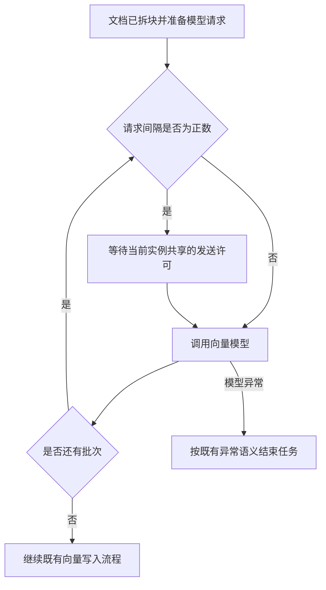

# 向量化请求限速需求说明书

> 功能标识：`embedding-request-rate-limit`
> 版本：V1.0.0
> 文档状态：已确认
> 创建日期：2026-07-22
> 更新日期：2026-07-22
>
> **更新时间维护规则**：任何正文修改必须同步更新 `更新日期` 为本次修改日期，并在 `版本修订记录` 中追加变更记录。不得正文已变更而更新日期仍停留在旧日期。

## 一句话说明

为同一应用实例内的文档向量化请求提供可配置的发送间隔，降低大文件或并发导入时连续请求向量模型而触发 429 限流的概率。

## 需求澄清摘要

### 已确认内容

| 序号 | 澄清问题 | 已确认结论 | 影响范围 |
| --- | --- | --- | --- |
| Q1 | 最小改造需要覆盖哪种限速范围？ | 采用单应用实例内全局共享的固定最小请求间隔；只主动限速，不自动重试 429；不做多实例分布式协调。 | 范围、异常行为、验收 |
| Q2 | 默认限速值和兼容策略是什么？ | 新增最小请求间隔配置，单位为毫秒；默认 `0ms` 表示关闭，上层应用按模型配额显式设置。 | 配置、兼容、验收 |

### 待确认内容

- 无。

## 背景与目标

- 背景：大文件解析后可能形成 200 多个文档块，按既定批次调用向量模型时会在较短时间内产生 20 多次连续请求。
- 当前问题：单次请求包含的文档数量受到控制，但请求之间没有统一时间间隔；当模型服务存在每分钟请求配额时，连续请求可能收到 HTTP 429。
- 目标：允许上层应用按实际模型配额配置同一实例内的最小请求间隔，并确保并发导入任务共享该限制。
- 不做会怎样：大文件或并发导入仍可能集中请求模型，导致向量化任务失败，影响知识入库的稳定性。

## 需求范围

### 本次包含

- 提供以毫秒为单位的最小请求间隔配置。
- 在单个应用实例内，对所有 RAG 向量化模型请求共享限速。
- 默认配置为 `0ms`，保持既有请求发送行为。
- 配置为正数时，保证相邻向量模型请求的开始时间间隔不小于配置值。
- 保持现有文档拆块和单次请求批次大小不变。
- 保持现有异常传播和向量模型阶段失败时不写入本次文档的行为。

### 本次不包含

- 不自动重试 HTTP 429 或其他模型异常。
- 不提供跨应用实例的分布式限速。
- 不新增向量模型供应商专属配额规则。
- 不改变文档内容、文档标识、向量数据或既有检索行为。
- 不修改持久化数据结构。

## 角色与场景

| 角色或参与方 | 使用场景 | 触发条件 | 期望结果 |
| --- | --- | --- | --- |
| 上层应用配置维护者 | 根据向量模型配额设置请求间隔 | 接入文档向量化能力并已知模型服务配额 | 通过配置控制请求发送节奏，无需修改调用代码 |
| 文档导入调用方 | 导入包含大量文档块的文件 | 单次导入需要连续调用多个向量化批次 | 请求按统一间隔发送，降低短时间集中调用导致的 429 风险 |
| 并发导入调用方 | 同一实例同时执行多个导入任务 | 多个任务同时准备调用向量模型 | 所有任务共享同一个请求间隔约束，不因任务并发绕过限速 |

## 需求列表

| 需求编号 | 需求内容 | 优先级 | 关联场景 | 关联验收 |
| --- | --- | --- | --- | --- |
| REQ-001 | 系统应提供可配置的向量模型最小请求间隔，单位为毫秒，默认值为 0。 | P0 | 配置维护 | AC-001、AC-002 |
| REQ-002 | 当配置为正数时，同一应用实例内的所有向量化请求必须共享间隔约束，包括来自不同并发导入任务的请求。 | P0 | 大文件导入、并发导入 | AC-002、AC-003 |
| REQ-003 | 限速不得改变文档分块结果、单次模型请求批次大小和全部模型批次成功后再进入写入阶段的既有行为。 | P0 | 大文件导入 | AC-004、AC-005 |
| REQ-004 | 本次只做主动限速；模型返回 429 或其他异常时不得由限速能力自动重试，异常继续交给既有调用链处理。 | P0 | 异常处理 | AC-005 |

## 业务规则

| 规则编号 | 规则内容 | 适用场景 | 例外或边界 |
| --- | --- | --- | --- |
| BR-001 | 最小请求间隔为 `0ms` 时关闭主动等待。 | 默认兼容 | 不改变模型客户端自身已有行为 |
| BR-002 | 最小请求间隔为正数时，相邻模型请求开始时间的间隔不得小于配置值。 | 单任务及并发任务 | 仅保证当前应用实例内的请求 |
| BR-003 | 同一应用实例中的并发任务必须共享限速状态。 | 并发导入 | 不协调其他应用实例 |
| BR-004 | 限速只调整请求时间，不调整每批文档数量和文档顺序。 | 所有向量化任务 | 无 |
| BR-005 | 限速能力不捕获并重试 429；模型异常继续按既有语义结束当前任务。 | 异常处理 | 模型客户端自身已有重试不属于本能力新增范围 |

## 业务流程

### 主要流程

1. 上层应用配置最小请求间隔，未配置时使用 `0ms`。
2. 文档导入任务完成解析和拆块，并按既有批次准备向量模型请求。
3. 每个模型请求发送前参与当前实例共享的间隔控制。
4. 获得发送许可后调用向量模型；后续批次重复步骤 3。
5. 所有模型批次成功后，继续既有向量写入流程。

### 异常或分支

- 最小请求间隔为 `0ms` 时，不增加主动等待。
- 模型返回 429 或其他异常时，不执行本能力新增的自动重试，当前任务按既有异常语义失败。
- 多实例同时运行时，各实例独立限速，不提供全局配额协调。

### 流程图

## 业务数据口径

### 数据影响判断

| 检查项 | 是否涉及 | 说明 |
| --- | --- | --- |
| 新增、修改、删除或查询持久化数据 | 否 | 本次只调整模型请求时间，不改变持久化数据内容或结构 |
| 外部数据入库、出库、同步、对账或报表 | 否 | 既有文档向量写入流程不变 |
| 字段映射、金额、日期、状态、流水号或客户标识 | 否 | 不涉及此类业务数据口径 |
| 手机号、证件号、银行卡、合同、地址、交易流水等敏感数据 | 否 | 不新增或改变敏感数据处理 |
| 跨系统、跨服务、跨库或第三方数据流转 | 是 | 既有向量模型调用属于外部交互，本次只改变请求时间，不改变传输内容 |

### 关键数据口径

| 业务对象/数据项 | 用户能理解的含义 | 来源或产生方式 | 单位/格式/状态口径 | 本次是否变化 | 是否关键 | 确认状态 |
| --- | --- | --- | --- | --- | --- | --- |
| 最小请求间隔 | 同一实例相邻向量模型请求开始时间之间至少等待的时长 | 上层应用配置，未配置使用默认值 | 非负毫秒数；`0` 表示关闭 | 是 | 是 | 已确认 |
| 文档块批次 | 一次发送给向量模型的文档块集合 | 既有文档拆块与批次配置 | 数量和顺序保持既有口径 | 否 | 是 | 已确认 |

## 影响说明

| 影响对象 | 影响说明 |
| --- | --- |
| 上层应用配置维护者 | 可选择设置最小请求间隔；不配置时保持既有行为 |
| 文档导入调用方 | 调用方式不变；启用限速后总体处理时长会按请求数量和配置间隔增加 |
| 并发导入任务 | 同一实例内共享请求间隔，单个任务的等待时间可能受到其他任务影响 |
| 既有向量化与检索 | 文档批次、异常传播、写入和检索结果语义不变 |

## 验收标准

- AC-001：Given 上层应用未配置最小请求间隔或配置为 `0ms`，when 连续执行多个向量模型请求，then 系统不增加主动限速等待，既有调用行为保持不变。关联需求：REQ-001。
- AC-002：Given 最小请求间隔配置为正数，when 同一任务连续产生多个向量模型请求，then 任意相邻请求的开始时间间隔不小于配置值。关联需求：REQ-001、REQ-002。
- AC-003：Given 最小请求间隔配置为正数，when 同一应用实例内多个导入任务并发请求向量模型，then 所有请求共同遵守同一间隔约束，不因任务并发缩短请求间隔。关联需求：REQ-002。
- AC-004：Given 文档已经按既有规则拆块和分批，when 启用限速执行向量化，then 每次模型请求的文档数量、文档顺序以及全部模型批次成功后再进入写入阶段的行为与启用前一致。关联需求：REQ-003。
- AC-005：Given 某个模型批次返回 HTTP 429，when 当前向量化任务执行，then 限速能力不自动重试该批次，异常按既有链路传播，并且本次任务在模型阶段失败时不写入部分文档。关联需求：REQ-003、REQ-004。

## 质量要求

- 性能：启用限速后只增加配置要求的必要等待；关闭时不得引入可观察的固定延迟。
- 安全：不得在限速日志中新增文档正文、模型凭证或其他敏感内容。
- 兼容：默认关闭；不改变既有公共调用方式、模型批次配置、异常语义和持久化结构。
- 可用性：并发请求间隔控制必须线程安全；等待不得形成无限期阻塞。

## 风险与待确认

### 风险

- 配置间隔小于模型服务实际配额要求时，仍可能收到 429。
- 配置间隔过大时，大文件导入总耗时会明显增加。
- 多实例部署时，各实例独立限速，聚合请求量仍可能超过供应商配额。

### 假设

- 上层应用配置维护者能够根据实际模型配额选择合理的毫秒间隔。
- 本次限速只管理框架发起向量化批次请求的时间，不接管模型客户端内部行为。

### 待确认

- 无。

## 版本修订记录

| 日期 | 版本 | 说明 |
| --- | --- | --- |
| 2026-07-22 | V1.0.0 | 初始化需求说明书，记录 2 项已接受澄清结论 |
