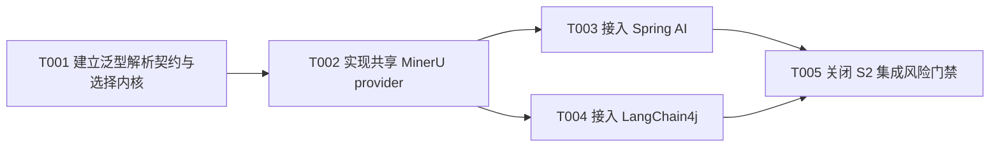

# RAG文档解析器扩展任务规划

> 功能标识：`rag-document-parser-extension`
> SDD 等级：`S2`
> 来源需求：`spec/features/20260728/RAG文档解析器扩展-需求说明书.md`
> 来源技术设计：`spec/features/20260728/RAG文档解析器扩展-技术设计说明书.md`
> 文档状态：pending
> 创建日期：2026-07-28
> 更新日期：2026-07-29

## 1. 任务概览

- 总任务数：5
- 核心路径：T001 -> T002 -> T003/T004 -> T005
- 风险任务：T001（泛型公共契约与资源所有权）、T002（外部协议与敏感文档传输）、T003（Spring AI native 直通兼容）、T004（LangChain4j native 直通与依赖边界）、T005（S2 回归与安全门禁）
- 阻塞任务：T001 阻塞其余实现；T002 阻塞两个框架的 MinerU 接入；T003、T004 阻塞组合验收
- 可并行分组：T003 与 T004 在 T002 完成后可并行，二者不得修改对方模块
- Mock/临时实现闭环：T002 使用 JDK `HttpServer` 作为协议测试替身，不进入生产代码；T005 确认无未授权 Mock 或 fallback 残留
- 可运行服务闭环：不新增独立服务；T005 仅验证外部 MinerU 健康检查、客户端协议和组件装配，不新增启动入口
- DDL/数据结构任务：无，本次无持久化结构变化
- 运行初始化 DML/Seed 任务：无，本次不产生初始化数据或脚本
- 数据设计与治理任务：有，T002、T005 验证文档外发、字段映射、临时文件清理和日志脱敏
- UI 设计确认：不适用，技术设计明确无页面/交互型交付物

### 1.1 任务依赖图

## 2. 实现确认门禁

- 状态：等待用户确认
- 规划产物不等于实现授权。
- 生成本任务规划文档后必须暂停，等待用户确认后才能进入业务代码实现。
- 用户确认执行且未指定任务 ID 时，默认执行全部未完成任务。
- 用户指定任务 ID 时，例如 `执行 T001,T002`，只执行指定任务。
- 不明确指令，例如 `看看`、`下一步是什么`、`继续看`，不得视为实现确认。

## 3. 任务列表

- [x] T001 建立泛型解析契约与选择内核
  - 通俗解释: 完成后，Spring AI 和 LangChain4j 使用同一套请求、能力、选择和 trace 语义，同时各自保留原生 Document 结果类型；默认固定使用 native，任何失败都不会暗中切换 MinerU。
  - AC: AC-002、AC-003、AC-004、AC-009
  - 来源: 技术设计说明书 §3.1、§3.2、§5.1、§5.2、§6、§8.1
  - Files: `fons4ai-rag/fons4ai-rag-common/src/main/java/com/fons/cloud/ai/rag/common/constants/DocumentType.java`; `fons4ai-rag/fons4ai-rag-common/src/main/java/com/fons/cloud/ai/rag/common/document/`; `fons4ai-rag/fons4ai-rag-common/src/test/java/com/fons/cloud/ai/rag/common/document/`
  - Depends: 无
  - Verification: 先编写失败测试，再实现内存/临时文件两类 repeatable source、`DocumentParseProvider<R>`、`DocumentParseResult<R>`、泛型 Registry/Selector 和严格选择；以至少两种 payload 类型验证 Registry 类型隔离、result 保持 payload 引用、`map` 只转换 payload 且保留 trace，并覆盖 DEFAULT=native、EXPLICIT、重复/不可用/能力不匹配、native 失败时 MinerU 零调用和 source 成败清理。
  - Quality: 使用 DDD-lite 值对象承载选择不变量，Registry 构造后只读；common 主代码不得引用 Spring AI、LangChain4j 或 Spring 类型；泛型结果信封不得要求 native 转换成 `ParsedDocument`；Map 做不可变副本和边界校验；资源所有权、异常分类、命名和中文边界注释清晰，不引入 AUTO/fallback。
  - Done: common 请求、泛型 SPI/结果信封、Registry、Selector、异常和 source 测试全部通过；`DocumentType` 能区分新类型与精确扩展名；payload/trace 映射和所有失败路径均符合设计且不调用其他 provider。

- [x] T002 实现共享 MinerU provider 与协议适配
  - 通俗解释: 完成后，两个框架可以复用同一个 MinerU 客户端，把显式选择的受支持文档同步解析为结构不被破坏的 Markdown。
  - AC: AC-004、AC-005、AC-006、AC-007、AC-009
  - 来源: 技术设计说明书 §3.3、§3.4、§3.5、§4.2、§4.4、§5.3、§8
  - Files: `fons4ai-rag/fons4ai-rag-common/src/main/java/com/fons/cloud/ai/rag/common/integration/mineru/`; `fons4ai-rag/fons4ai-rag-common/src/test/java/com/fons/cloud/ai/rag/common/integration/mineru/`; `fons4ai-rag/fons4ai-rag-common/pom.xml`
  - Depends: T001
  - Verification: 使用 JDK `HttpServer` 先覆盖 `/health` 和 `/file_parse` multipart 契约，再实现 JDK `HttpClient`；断言固定表单字段和关闭其他返回项，覆盖支持格式、旧 Office 拒绝、100 MB 上限、超时、非 2xx、空/多结果、非法 JSON、业务失败、Markdown 字符级保持、所有资源清理，以及返回 `DocumentParseResult<ParsedDocument>` 时 provider version/backend trace 完整。
  - Quality: MinerU 协议收敛在 `integration.mineru`，不依赖知识库实体、MinIO、Qwen 或框架类型；字段映射仅消费已确认字段；文件名防 multipart header 注入；错误摘要限长脱敏，不记录正文、认证信息或原始响应；遵守 common 的 DDD-lite 边界。
  - Done: MinerU capability 仅声明官方 V1 格式；开关关闭、配置非法或健康失败时不可用；所有协议与异常矩阵测试通过，输出 `MARKDOWN` 且 blocks/assets 为空，不下载 ZIP 或上传资产。

- [x] T003 [P] 以 native 直通方式接入 Spring AI
  - 通俗解释: 完成后，旧 Spring AI 调用不改代码仍直接获得原生 `List<Document>`；native 对象不经过中立模型重建，需要复杂解析时才把 MinerU 结果适配成 Spring AI Document。
  - AC: AC-001、AC-003、AC-005、AC-007、AC-008、AC-009
  - 来源: 技术设计说明书 §3.6、§5.4、§8.1、§10.1
  - Files: `fons4ai-rag/fons4ai-rag-common/src/main/java/com/fons/cloud/ai/rag/common/request/DocumentReaderRequest.java`; `fons4ai-rag/fons4ai-rag-spring-ai-starter/src/main/java/com/fons/cloud/ai/rag/document/reader/`; `fons4ai-rag/fons4ai-rag-spring-ai-starter/src/main/java/com/fons/cloud/ai/rag/infrastructure/config/DocumentReaderAutoConfiguration.java`; `fons4ai-rag/fons4ai-rag-spring-ai-starter/src/main/resources/META-INF/spring/org.springframework.boot.autoconfigure.AutoConfiguration.imports`; `fons4ai-rag/fons4ai-rag-spring-ai-starter/src/test/java/com/fons/cloud/ai/rag/document/reader/`; `fons4ai-rag/fons4ai-rag-spring-ai-starter/src/test/java/com/fons/cloud/ai/rag/infrastructure/config/DocumentReaderAutoConfigurationTest.java`
  - Depends: T002
  - Verification: 先扩展既有 Facade 与自动配置回归测试，使用返回已知 ID、Media、Metadata 和 ContentFormatter 的伪 strategy，断言 `read` 返回同一 List/Document 实例；旧请求缺少 selection 时走 native，原 `params`/`cleanDocument` 和多 Document 行为兼容；显式 MinerU 只适配一次并原样保留 Markdown，`readWithTrace` 返回相同 payload 与完整 trace，异常保留公共分类和 cause。
  - Quality: `SpringAiNativeDocumentParser` 聚合旧 strategy 为唯一 native provider并直接包装其结果；`SpringAiMinerUDocumentParser` 才调用 `SpringAiDocumentAdapter`，adapter 不包含 MinerU HTTP 或 provider 判断；保持既有公共签名、现有 strategy 扩展点和 DDD-lite 职责边界；禁止 native -> `ParsedDocument` -> native 往返，MinerU 不进入旧空白清洗。
  - Done: 现有 PDF、DOC、Markdown、JSON、Text native 测试不回归；native 对象引用及原生属性保持；显式 MinerU、结构化 Markdown、trace、异常映射和自动配置测试通过；Spring 泛型 Registry 使用明确 Bean 名/Qualifier。

- [x] T004 [P] 以 native 直通方式接入 LangChain4j
  - 通俗解释: 完成后，LangChain4j native Apache Tika 结果保持原生对象直通；只有显式 MinerU 结果执行一次 LangChain4j 适配，并继续支持标准 `DocumentParser` 调用方式。
  - AC: AC-005、AC-008、AC-009
  - 来源: 技术设计说明书 §3.7、§5.5、§9 D-002、§10.1
  - Files: `fons4ai-rag/fons4ai-rag-langchain/pom.xml`; `fons4ai-rag/fons4ai-rag-langchain/src/main/java/com/fons/cloud/ai/rag/langchain/document/`; `fons4ai-rag/fons4ai-rag-langchain/src/main/java/com/fons/cloud/ai/rag/langchain/infrastructure/config/`; `fons4ai-rag/fons4ai-rag-langchain/src/main/resources/META-INF/spring/org.springframework.boot.autoconfigure.AutoConfiguration.imports`; `fons4ai-rag/fons4ai-rag-langchain/src/test/java/com/fons/cloud/ai/rag/langchain/`
  - Depends: T002
  - Verification: 先建立 native Tika 原生对象引用保持、MinerU 单次适配、Metadata 标量转换、`parseWithTrace` 和 `asDocumentParser(...)` 测试；实现 LangChain4j 独立泛型 Registry、native/MinerU provider、Facade、Document adapter 和配置绑定，断言 native 不调用 adapter，MinerU 内容和轨迹一致，非法 metadata 不泄漏或错误序列化，并验证依赖版本对齐。
  - Quality: LangChain4j 模块只依赖 common，不引用 Spring AI strategy；native 禁止转换为 `ParsedDocument`，adapter 只处理 MinerU 中立结果且不重复选择或协议；保持当前模块坐标和用户已有 POM 改动，采用 DDD-lite 端口/适配边界，不创建 MinerU Starter。
  - Done: LangChain4j native 原生对象直通和显式 MinerU 聚焦测试通过；标准 `DocumentParser` 适配器可用；Registry 注册本框架 native 与 MinerU 薄包装 provider，共享协议实现唯一，dependency tree 无冲突。

- [x] T005 关闭双框架集成、安全与回归风险门禁
  - 通俗解释: 完成后，可以证明两套 Starter 同时使用不会冲突，默认路径不会外发文档，错误和日志不会泄露正文，并形成可审核的 S2 交付证据。
  - AC: AC-001、AC-002、AC-003、AC-004、AC-005、AC-006、AC-007、AC-008、AC-009
  - 来源: 技术设计说明书 §4.4、§8、§10.1、§10.3、§10.4
  - Files: `fons4ai-rag/fons4ai-rag-langchain/src/test/java/com/fons/cloud/ai/rag/langchain/integration/DocumentParserCoexistenceTest.java`; `fons4ai-rag/fons4ai-rag-langchain/pom.xml`; `fons4ai-rag/README.md`; `spec/features/20260728/reports/RAG文档解析器扩展-实施报告.md`; `spec/features/20260728/checklists/RAG文档解析器扩展-S2风险检查清单.md`
  - Depends: T003、T004
  - Verification: 同时加载两套自动配置，验证结果类型不同的两个独立 Registry、唯一共享 MinerU client/中立 parser、DEFAULT 零 HTTP、EXPLICIT 才上传；通过 spy 证明 native adapter 调用次数为零、MinerU adapter 恰好一次，并断言 Spring ID/Media/Metadata 与 LangChain4j 原生对象不被重建；执行三模块测试和 reactor 构建，扫描 common 框架依赖、native 往返转换、未授权分支/fallback、正文日志和 Mock 残留；完成敏感样例、临时文件、外部健康检查及 Evidence Matrix。
  - Quality: 对照 R-001 至 R-008 逐项关闭泛型注入、原生对象保真、兼容、依赖、安全、协议、资源和回滚风险；不覆盖工作区已有改动，不扩大到向量化/切片/存储；实施报告按 DDD-lite、可读性、方法长度、命名、重复逻辑和依赖门禁记录证据，许可证边界只引用官方事实。
  - Done: AC-001 至 AC-009 的 Evidence Matrix 全部有自动测试、代码审查或明确人工 Gate 证据；S2 风险清单关闭或记录经用户确认的暂缓项；README 说明部署、配置、健康检查、超时、格式与许可证边界；三模块测试和 reactor 构建通过。

## 4. AC 追踪表

| AC | 覆盖任务 | 验证方式 |
| --- | --- | --- |
| AC-001 | T003、T005 | Spring AI 旧入口、native 原生对象直通与组合回归 |
| AC-002 | T001、T005 | 泛型 Registry/Selector、结果信封和轨迹断言 |
| AC-003 | T001、T003、T005 | DEFAULT native 失败及 MinerU 零调用断言 |
| AC-004 | T001、T002、T005 | provider、类型、扩展名和特性严格失败矩阵 |
| AC-005 | T002、T003、T004、T005 | 同一 Mock MinerU 响应的双框架单次适配、内容与元数据对比 |
| AC-006 | T002、T005 | MinerU 异常矩阵、资源清理与脱敏日志断言 |
| AC-007 | T002、T003、T005 | 结构化 Markdown 字符级保持测试 |
| AC-008 | T003、T004、T005 | 双自动配置共存、独立泛型 Registry、native 直通与唯一共享 Bean 测试 |
| AC-009 | T001、T002、T003、T004、T005 | ParseTrace、异常和日志敏感信息检查 |

## 5. S2 质量门禁

- 公共契约门禁：common 主代码不出现 Spring AI、LangChain4j 或 Spring 编译依赖；泛型结果信封可承载不同框架 payload。
- 原生对象门禁：Spring AI 和 LangChain4j native 结果不经过 `ParsedDocument`，对象引用和框架原生属性有保持证据；adapter 调用次数为零。
- 兼容门禁：旧 Spring AI 入口、构造方式、strategy 扩展点、`params`、`cleanDocument` 和 native 行为有回归证据。
- 选择语义门禁：DEFAULT 固定 native；任何选择或解析失败均无 fallback；仅 EXPLICIT MinerU 发生外部调用。
- 协议门禁：MinerU `/health`、`/file_parse` multipart 和 JSON 映射有当前官方协议测试，响应严格校验。
- 数据安全门禁：日志、异常、trace 和 `toString` 不含文档正文、认证信息或原始外部响应；临时文件在所有路径清理。
- 组合门禁：Spring AI 与 LangChain4j 的泛型 Registry 同时装配，无 Bean/provider 冲突；MinerU 协议实现只有一份、框架 adapter 各执行一次且仅在 MinerU 路径执行。
- 依赖门禁：LangChain4j Apache Tika parser 与现有版本对齐，三模块聚焦测试和 RAG reactor 构建通过。
- 回滚门禁：MinerU 默认关闭且可通过开关停用；无 DDL/DML/持久化回滚事项。
