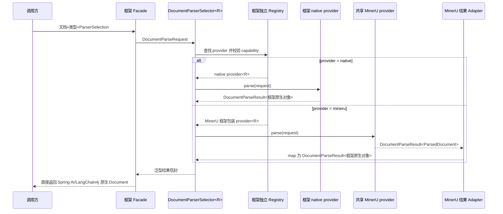
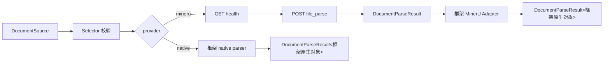
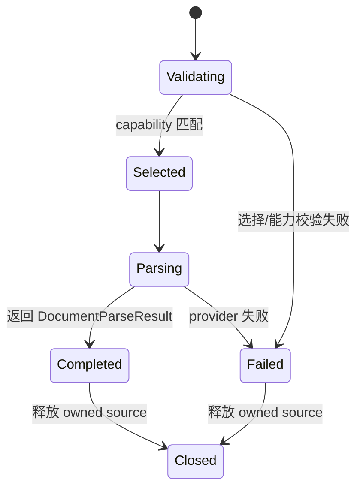

# RAG文档解析器扩展技术设计说明书

> 功能标识：`rag-document-parser-extension`
> SDD 等级：`S2`
> 来源需求：`spec/features/20260728/RAG文档解析器扩展-需求说明书.md`
> 文档状态：已确认
> 创建日期：2026-07-28
> 更新日期：2026-07-29
>
> **更新时间维护规则**：任何正文修改必须同步更新 `更新日期` 为本次修改日期。

## 1. 设计概要

- 功能描述：在 RAG 公共层建立框架无关的文档解析请求、provider 能力注册、模型化选择和泛型结果信封；native 解析保留框架原生对象直通，MinerU 作为共享中立 provider，仅在框架边界执行一次结果适配。
- 影响模块：`fons4ai-rag-common`、`fons4ai-rag-spring-ai-starter`、已有的 `fons4ai-rag-langchain`。
- 关键技术点：可重复文档源、`DocumentParseProvider<R>` 泛型 SPI、`DocumentParseResult<R>` 结果信封、provider 唯一注册、`DEFAULT/EXPLICIT` 选择、native 原生对象直通、MinerU multipart/JSON 协议、单次框架类型转换、旧 Spring AI 入口兼容。
- 依赖关系：common 仅使用 JDK `HttpClient` 和项目已有 JSON 能力，不引入 Spring AI 或 LangChain4j 类型；双框架模块单向依赖 common。
- 非目标：不新增 MinerU 模块，不实现 LLM 自动选型、静默 fallback、MinerU 异步任务、ZIP/图片资产处理、向量化或切片重构。
- SDD 等级理由：新增跨三个核心模块的公共 Java 契约，改造既有文档读取选择语义，并接入外部文档解析服务，存在兼容、资源清理、敏感文档传输和第三方协议风险，归类为 S2。

### 1.1 技术栈与交付画像

| 项目事实 | 已确认结论 | 证据或原因 |
| --- | --- | --- |
| 项目形态 | Java 库/SDK 与 Spring Boot Starter | Maven 多模块结构及现有 RAG Starter |
| 主要语言与运行时 | Java 21 / JVM | 根 `pom.xml` |
| 构建与测试入口 | Maven 模块测试与 reactor 构建 | 各模块 `pom.xml` 与既有 JUnit 测试 |
| 交付入口 | common JAR、Spring AI Starter、LangChain4j RAG JAR | 现有 Maven 模块 |
| 独立可运行服务 | 否 | Fons4AI 只作为 MinerU API 客户端，不在本仓库内部署 MinerU |
| 页面/交互型交付物 | 否 | 无 UI 变更 |
| 数据结构变更 | 否 | 无数据库、缓存、索引、Topic 或对象存储结构变更 |

## 2. 架构与调用链路

- 涉及入口：Spring AI `DocumentReaderFacade.read(DocumentReaderRequest)`；LangChain4j 新增 `LangChain4jDocumentParserFacade` 及其标准 `DocumentParser` 适配器工厂方法。
- 涉及模块：common 承载请求/能力模型、泛型 SPI、选择算法、结果信封和 MinerU 协议；两个框架模块承载各自 native provider，以及只面向中立结果的类型转换。
- 涉及服务：用户配置的 MinerU `mineru-api` 或兼容 `mineru-router`。
- 涉及领域对象：`ParserSelection`、`DocumentParserCapability`、`DocumentParseResult<R>`、`ParsedDocument`、`ParseTrace`，属于技术能力契约，不构造业务聚合。
- 涉及数据访问：无持久化访问。
- 外部依赖：MinerU HTTP API；LangChain4j native 解析使用 LangChain4j 官方 Apache Tika parser 扩展。



### 2.1 标准扩展复用设计

- 本需求属于标准 Provider/Adapter 扩展场景，复用项目已有的 Strategy 概念，但将选择条件从单一 `DocumentType -> Strategy` 映射提升为 provider capability 模型。
- common 使用 `DocumentParseProvider<R>`、`DocumentParserRegistry<R>` 和 `DocumentParserSelector<R>` 统一选择语义，`R` 由当前框架注册表确定；common 不需要知道 `R` 是否为 Spring AI 或 LangChain4j 类型。
- 既有 `DocumentReaderStrategy` 继续作为 Spring AI native 扩展点，不在 V1 废弃；`SpringAiNativeDocumentParser` 将这些 strategy 聚合为唯一 `native` provider，并把其返回的 `List<Document>` 原样放入结果信封，不转换为 `ParsedDocument`。
- 框架 adapter 只转换共享 provider 的中立 `ParsedDocument`。新增中立 provider 时实现 common provider 并为目标框架增加薄包装；新增框架专属 native provider 时直接返回该框架原生类型。
- 不对 `fons4ai-rag-langchain` 进行模块重命名，以保护当前用户已建立的模块坐标与工作区改动。

### 2.2 服务形态与运行态设计

不适用。本次交付普通组件/Starter，不新增独立启动入口、监听端口、注册发现或服务健康端点。MinerU `/health` 是外部 provider 可用性检查，不是 Fons4AI 新服务的运行态闭环。

## 3. API / RPC / 消息契约设计

### 3.1 common 公共 Java 契约

| 类型 | 关键字段/方法 | 语义与边界 |
| --- | --- | --- |
| `DocumentSource extends AutoCloseable` | `fileName()`、`size()`、`contentType()`、`openStream()` | `openStream()` 每次返回可独立关闭的新流；调用者关闭 source 以释放临时资源 |
| `DocumentParseRequest` | `source`、`documentType`、`parserSelection`、`options`、`metadata` | 构建时完成必填、扩展名、选型组合和 Map 边界校验；Map 保存不可变副本 |
| `ParserSelection` | `mode`、`provider`、`requiredFeatures` | `DEFAULT` 不得指定非 native provider；`EXPLICIT` 必须指定非空 provider |
| `ParserSelectionMode` | `DEFAULT`、`EXPLICIT` | V1 稳定枚举，不预留未实现的 AUTO |
| `ParserFeature` | `OCR`、`TABLE`、`FORMULA`、`LAYOUT` | 用于能力筛选，不直接透传为任意第三方参数 |
| `DocumentParserCapability` | `provider`、`supportedDocumentTypes`、`supportedFileExtensions`、`features`、`available`、`priority` | 同时校验文档类型和精确扩展名，避免 `DOC` 类型把旧 `doc` 误判为 MinerU 支持 |
| `DocumentParseProvider<R>` | `capability()`、`parse(DocumentParseRequest)` | 泛型 provider SPI；返回 `DocumentParseResult<R>`，common 不约束 `R` 为某个框架类型 |
| `DocumentParseResult<R>` | `payload`、`parseTrace`、`map(Function<R,T>)` | 统一结果信封；信封不可变但不复制未知类型 payload，payload 生命周期由 provider/框架负责；`map` 只转换 payload 并保留 trace |
| `ParsedDocument` | `content`、`contentFormat`、`metadata`、`blocks`、`assets` | 框架中立内容模型，仅供 MinerU 等共享 provider 或明确需要中立结果的调用方使用；不是所有 native provider 的强制中间态 |
| `ParsedDocumentBlock` | `content`、`metadata` | 中立 provider 的可选分段，不承担 Spring AI/LangChain4j 原生对象的无损序列化职责 |
| `ParsedAsset` | `name`、`mediaType`、`reference`、`metadata` | V1 不写入资产；reference 禁止携带密钥或认证信息 |
| `ParseTrace` | `provider`、`duration`、`sourceType`、`outputFormat`、`providerVersion`、`backend`、`selectionReason` | 用于诊断，不包含正文或供应商原始响应 |
| `DocumentParserRegistry<R>` | `register`、`find`、`all` | 同一实例内所有 provider 返回相同 `R`；provider 标识小写归一，重复 provider 立即失败，不以后注册覆盖 |
| `DocumentParserSelector<R>` | `select(request)`、`parse(request)` | `select` 返回泛型 provider decision；`parse` 返回 `DocumentParseResult<R>`，集中补齐耗时、provider 和选择原因 |

`options` 与 `metadata` 的稳定边界：键为非空字符串，单个 Map 最多 64 项；值仅允许 `String`、`Number`、`Boolean` 及这些类型的不可变列表，禁止放入流、凭证、客户端对象或任意可变对象。

### 3.2 文档类型契约

- `DocumentType` 新增 `PRESENTATION("ppt","pptx")` 和 `SPREADSHEET("xls","xlsx")`。
- 原 `match` 改为对去除前导点、小写化后的扩展名做集合精确匹配，不继续使用子串 `contains`。
- MinerU capability 精确包含 `pdf`、`png`、`jpg`、`jpeg`、`docx`、`pptx`、`xlsx`；不包含 `doc`、`ppt`、`xls`。

### 3.3 选择和失败契约

```text
select(request):
  selection = request.selection or DEFAULT
  provider = selection.mode == DEFAULT ? "native" : selection.provider
  parser = registry.find(provider) or fail(PROVIDER_NOT_FOUND)
  capability = parser.capability()
  require capability.available
  require documentType + exact extension supported
  require capability.features contains all requiredFeatures
  return decision(parser, provider, reason)

parse(request):
  decision = select(request)
  result = decision.provider.parse(request)
  return result.withTrace(mergeProviderTraceAndSelectionTrace(result.trace))
```

泛型结果信封的设计草图：

```java
public interface DocumentParseProvider<R> {
    DocumentParserCapability capability();
    DocumentParseResult<R> parse(DocumentParseRequest request);
}

public record DocumentParseResult<R>(R payload, ParseTrace parseTrace) {
    public <T> DocumentParseResult<T> map(Function<? super R, ? extends T> mapper) {
        return new DocumentParseResult<>(mapper.apply(payload), parseTrace);
    }
}
```

上述代码只表达契约语义。`map` 不重新解析、不复制 native 对象、不丢弃 trace；payload 空值规则由构造器统一校验。

common 新增 `DocumentParseException` 与 `DocumentParseError`，错误类别固定为：`INVALID_REQUEST`、`DUPLICATE_PROVIDER`、`PROVIDER_NOT_FOUND`、`PROVIDER_UNAVAILABLE`、`UNSUPPORTED_DOCUMENT_TYPE`、`REQUIRED_FEATURE_UNSUPPORTED`、`FILE_TOO_LARGE`、`CONNECTION_TIMEOUT`、`READ_TIMEOUT`、`HTTP_ERROR`、`INVALID_RESPONSE`、`PROVIDER_FAILURE`、`IO_ERROR`。异常保留 cause，但 message 不包含正文、响应全文或认证信息。

### 3.4 MinerU HTTP 契约

- 健康检查：`GET {base-url}/health`，2xx 且返回可解析 JSON 才视为健康。V1 在每次显式 MinerU 解析前检查，不缓存健康结果，避免服务状态变化后长期误判。
- 同步解析：`POST {base-url}/file_parse`，`multipart/form-data`，V1 每次只发送一个 `files` part。
- 固定表单字段：`backend=pipeline`、`parse_method=auto`、`return_md=true`、`response_format_zip=false`、`return_middle_json=false`、`return_model_output=false`、`return_content_list=false`、`return_images=false`、`return_original_file=false`；`formula_enable=true`、`table_enable=true`。
- JSON 成功响应：顶层读取 `backend`、`version`、`results`；V1 要求 `results` 恢复为唯一文件结果，并从其 `md_content` 读取 Markdown。结果为空、多结果、缺失 `md_content` 或类型不符都是 `INVALID_RESPONSE`。
- 返回的 `version`、`backend` 写入 `ParseTrace`，原始 JSON 不向上暴露。
- 协议依据以 MinerU 当前官方 `/health`、`/file_parse` 文档及官方 `fast_api.py` 响应实现为准，不复制 Know-engine 的历史请求字段。

### 3.5 配置契约

```yaml
fons4ai:
  rag:
    document-parser:
      default-provider: native
      mineru:
        enabled: false
        base-url: http://localhost:8000
        backend: pipeline
        connect-timeout: 10s
        read-timeout: 5m
        max-file-size: 100MB
```

- V1 `default-provider` 只允许 `native`，其他值启动校验失败，防止配置绕过用户已确认的 DEFAULT 语义。
- common 中使用无 Spring 注解的 `MinerUClientOptions`；两个框架模块各自声明配置绑定类并转成 options。
- 两个自动配置均使用 `@ConditionalOnMissingBean` 发布共享 `MinerUClient` 和中立 `MinerUDocumentParser`，同时加载时只保留一份协议实现；框架模块各自创建轻量 MinerU 包装 provider 和泛型 Registry。

## 4. 数据模型与 DDL 影响

### 4.1 数据影响判断

| 检查项 | 是否涉及 | 处理要求 |
| --- | --- | --- |
| 持久化数据新增、修改、删除或查询 | 否 | 无 DDL/SQL 变更 |
| 外部数据入库、出库、同步、对账或报表 | 否 | 本能力只返回解析结果 |
| 字段映射、金额、日期、状态、流水号或客户标识 | 否 | 无业务字段映射 |
| 敏感数据、权限、安全、脱敏、加密、审计或保留期限 | 是 | 文档可能敏感，日志不得记录正文或外部原始响应 |
| 跨系统、跨服务、跨库或第三方数据流转 | 是 | 仅显式 MinerU 路径向配置服务上传文件 |

### 4.2 字段映射契约

| 来源数据项 | 来源含义 | 来源类型/格式 | 目标数据项 | 目标含义 | 转换规则 | 空值/异常规则 | 安全要求 | 确认状态 |
| --- | --- | --- | --- | --- | --- | --- | --- | --- |
| `results.<single>.md_content` | MinerU Markdown | JSON string | `ParsedDocument.content` | 统一解析内容 | 原样保留，`contentFormat=MARKDOWN` | 缺失或非字符串时 `INVALID_RESPONSE` | 不记录正文 | 已确认 |
| `backend` | 实际 MinerU 后端 | JSON string | `ParseTrace.backend` | 解析后端轨迹 | 空值允许，非空时原样记录 | 非字符串忽略并保持可诊断警告 | 不记录响应全文 | 已确认 |
| `version` | MinerU 版本 | JSON string | `ParseTrace.providerVersion` | 供应商版本轨迹 | 空值允许 | 非字符串忽略 | 无敏感数据 | 已确认 |
| Spring AI native `List<Document>` | 框架原生解析结果 | 框架对象 | `DocumentParseResult<List<Document>>.payload` | 保留完整原生对象 | 保留原列表和每个 `Document` 实例引用，不转换字段 | 空列表按既有 native 语义处理 | 不复制正文到日志或 trace | 已确认 |
| MinerU `ParsedDocument` | 框架中立 Markdown | common 对象 | Spring AI `Document` | Spring AI 下游原生对象 | adapter 以原始 content 构造一个 `Document`，合并允许的 metadata 和 `fons4ai.parser.*` 非敏感轨迹 | content 缺失时解析失败；保留结构性空白 | 保留用户 metadata，禁止正文进入 metadata | 已确认 |
| MinerU `ParsedDocument` | 框架中立 Markdown | common 对象 | LangChain4j `Document` | LangChain4j 下游原生对象 | adapter 以原始 content 和受支持标量 metadata 构造一个 `Document` | 不支持的 metadata 值忽略或转为设计允许的字符串 | 不序列化凭证或原始响应 | 已确认 |

### 4.3 数据流设计



### 4.4 数据安全与合规设计

| 检查项 | 设计结论 | 验证方式 |
| --- | --- | --- |
| 敏感数据识别 | 文档内容按潜在敏感数据处理 | 日志和异常测试 |
| 传输安全 | 支持 `https` base URL；是否使用 TLS 由接入方配置，不自动降级 | URI 配置与请求测试 |
| 存储加密 | 不适用，Fons4AI 不持久化 MinerU 请求或响应 | 代码审查 |
| 展示/日志脱敏 | 仅记录 provider、类型、耗时、文件/结果大小和分类原因 | 捕获日志断言无正文和原始响应 |
| 数据权限 | 由调用方决定是否显式选择 MinerU，默认不向外部发送 | DEFAULT 路径无 HTTP 调用测试 |
| 审计与追踪 | `ParseTrace` 保留非敏感调用轨迹 | 轨迹映射测试 |
| 保留期限/删除/归档 | 临时文件在请求完成或失败后删除，不持久保留 | 成功、失败、超时清理测试 |
| 法规或公司治理要求 | 仓库未确认统一组织合规规则；部署方需核对文档外发和 MinerU License | 文档评审/人工 Gate |

### 4.5 结构变更详设

不适用，不涉及持久化或其他数据服务结构。

### 4.6 ER 设计

不适用，无表或数据服务关系变更。

### 4.7 SQL/DDL 影响

- 是否涉及持久化结构变化：否。
- SQL 知识快照、DDL 证据、迁移位置、执行型变更 DDL 与数据回滚：均不适用。

### 4.8 运行初始化 DML / Seed 数据

不适用，无需初始化账号、配置记录、字典、白名单或规则数据。

## 5. 核心逻辑设计

### 5.1 可重复文档源

- `DocumentSources.fromInputStream` 从旧请求的一次性流创建拥有明确生命周期的可重复 source。
- 文件不超过 1 MiB 时可使用不可变 byte array；超过阈值时流式转存到系统临时目录，不使用一次性全量内存拷贝。
- 转存过程累计真实文件大小，超过 provider 上限时立即失败并删除临时文件。
- `DocumentSource.close()` 幂等；关闭后 `openStream()` 明确失败。旧 Facade 只关闭自己创建的 source，不额外关闭调用方传入的原始流。

### 5.2 注册与选择

- Registry 以结果类型 `R` 泛型化，构造完成后只读，不允许运行中覆盖 provider；Spring AI 和 LangChain4j 使用不同 Bean 名/Qualifier 的独立 Registry，并分别约束为自身原生结果类型。由于 JVM 泛型擦除，自动配置不得只依赖泛型参数区分 Bean。
- `DEFAULT` 直接解析为 `native`；`EXPLICIT` 将 provider 去空格、小写化后查找。
- Selector 在执行 parser 前依次校验 available、DocumentType、精确扩展名和 requiredFeatures，任一失败均不调用 provider。
- Selector 使用 `System.nanoTime()` 统计耗时，并将选择原因、provider 和耗时合并到 `DocumentParseResult<R>.parseTrace`；provider 写入的版本/backend 等细节保留。异常时由边界日志记录相同非敏感上下文。
- Selector 和 Registry 只统一选型、能力、异常与 trace，不要求不同框架把原生对象转换成同一个具体内容类型。

### 5.3 MinerU 解析

- `MinerUDocumentParser.capability()` 在开关关闭或配置非法时返回 `available=false`；开关开启时调用 `/health`、健康才返回可用 capability。
- `parse` 先校验真实文件大小，再使用 JDK `HttpClient` 和随机 boundary 流式构建 multipart，不将文件正文转为日志或字符串。
- 读取 2xx JSON，按 §3.4 严格验证唯一结果和 `md_content`，生成 `DocumentParseResult<ParsedDocument>`；中立 payload 的 `contentFormat=MARKDOWN`，不执行空白压缩。
- HTTP 状态非 2xx 时只保留状态码与有限长度、脱敏后的错误摘要，不向上返回完整原始响应。

### 5.4 Spring AI 兼容适配

- `DocumentReaderRequest` 增加可选 `ParserSelection parserSelection`，builder 增加同名方法；缺失时使用 DEFAULT。
- `SpringAiNativeDocumentParser implements DocumentParseProvider<List<org.springframework.ai.document.Document>>` 聚合现有 `List<DocumentReaderStrategy>`，以文档类型或精确扩展名选择 strategy；strategy 返回的 List 和每个 `Document` 实例原样作为 result payload，不转为 `ParsedDocument`，不重建 ID、Media、Metadata、Score 或 ContentFormatter。
- `SpringAiMinerUDocumentParser implements DocumentParseProvider<List<Document>>` 委托共享 `MinerUDocumentParser` 获得 `DocumentParseResult<ParsedDocument>`，再调用 `result.map(springAiDocumentAdapter::toDocuments)` 完成唯一一次类型转换并保留 trace。
- `SpringAiDocumentAdapter` 只接受中立 `ParsedDocument`，MinerU V1 blocks 为空时转为一个 Spring AI `Document`；它不参与 native 路径，也不承担 Spring AI 对象的往返序列化。
- `DocumentReaderFacade` 保留 `List<Document> read(DocumentReaderRequest)` 和现有 `List<DocumentReaderStrategy>` 构造兼容；`read` 调用泛型 selector 后直接返回 `result.payload()`。新增 `DocumentParseResult<List<Document>> readWithTrace(DocumentReaderRequest)` 作为可选高级入口，供需要完整 `ParseTrace` 的调用方使用。
- native 路径继续遵守旧 `cleanDocument`；MinerU 路径不经过 `AbstractDocumentReaderStrategy.doCleanDocuments`，因此不会执行 `replaceAll("\\s+", " ")`。
- Facade 将 common 异常映射到既有 `BusinessRuntimeException/RagResultCode`，保留 cause 和分类原因。

Spring AI 两条路径必须满足：

```text
native: DocumentReaderRequest -> Selector<List<Document>> -> native strategy -> 原生 List<Document>
mineru: DocumentReaderRequest -> Selector<List<Document>> -> MinerU ParsedDocument -> adapter -> 原生 List<Document>
```

### 5.5 LangChain4j 适配

- `LangChain4jNativeDocumentParser implements DocumentParseProvider<dev.langchain4j.data.document.Document>` 使用官方 `ApacheTikaDocumentParser` 实现 `native`，把其原生 `Document` 实例原样放入结果信封，不转换为 common `ParsedDocument`。
- `LangChain4jMinerUDocumentParser` 委托共享 MinerU provider，并通过 `result.map(langChain4jDocumentAdapter::toDocument)` 完成唯一一次中立结果转换。
- `LangChain4jDocumentAdapter` 只将 MinerU/common content 和受支持的元数据转为 `dev.langchain4j.data.document.Document`；Map 值不属于 LangChain4j Metadata 支持标量时转为设计允许的字符串或忽略，不用 JSON 序列化替代普通映射。
- `LangChain4jDocumentParserFacade.parse(DocumentParseRequest)` 直接返回 LangChain4j 原生 `Document`；新增 `parseWithTrace` 返回泛型结果信封。`asDocumentParser(documentType, fileName, selection, options, metadata)` 返回兼容 LangChain4j `DocumentParser.parse(InputStream)` 的绑定适配器并解包 payload。
- LangChain4j Registry 只注册 LangChain4j native 和调用共享 MinerU 的薄包装 provider，不引用 Spring AI `DocumentReaderStrategy`。

## 6. 领域建模与业务规则落地

| 规则/行为 | 归属对象 | 实现方式 | 验证方式 |
| --- | --- | --- | --- |
| DEFAULT 固定 native | `ParserSelection` / `DocumentParserSelector` | 模式不变量和集中选择 | 单元测试断言无 MinerU 调用 |
| EXPLICIT 精确 provider | `ParserSelection` / `Registry` | provider 归一化与唯一查找 | 正常、不存在、重复测试 |
| 格式/能力严格匹配 | `DocumentParserCapability` | 类型+扩展名+特性集校验 | 旧 Office 与 requiredFeatures 测试 |
| 无静默 fallback | `DocumentParserSelector` | 选择或 parser 异常直接上抛 | 失败 provider 调用次数测试 |
| native 原生对象直通 | 框架 native provider / `DocumentParseResult<R>` | 结果信封只包装引用，不执行 native -> common -> native 转换 | 对象引用、ID、Media、Metadata 保持测试 |
| 资源生命周期 | `DocumentSource` | 明确所有权、幂等 close、临时文件 finally 清理 | 成功/失败/超时清理测试 |

- DDD-lite 判断：使用值对象与策略/SPI 表达稳定技术能力，不引入实体、聚合或仓储。
- 核心领域对象：无业务领域对象；核心能力模型为 `ParserSelection`、`DocumentParserCapability`、`DocumentParseResult<R>`，`ParsedDocument` 是中立 provider 的内容模型而非所有路径的强制模型。
- 应用编排职责：Selector 只编排选择、校验、执行与轨迹；native 原生执行、MinerU 协议和 MinerU 框架转换相互分离。
- 基础设施依赖边界：common 契约不依赖框架；MinerU 供应商细节收敛在 `integration.mineru`。

## 7. 状态流转设计

不涉及持久化业务状态。单次调用状态为短生命周：



调用本身不重试、不补偿、不 fallback；关闭资源是幂等操作。

## 8. 异常、安全、事务与性能

### 8.1 异常处理

| 异常场景 | 处理方式 | 调用方可见结果 | 日志要求 |
| --- | --- | --- | --- |
| 请求、扩展名或选型组合非法 | 边界快速失败 | `INVALID_REQUEST` | 只记录字段名与原因 |
| provider 重复/不存在/不可用 | Registry/Selector 分类异常 | 对应错误类别 | 记录 provider，不记录正文 |
| 类型、扩展名或能力不匹配 | 不调用 parser | 不支持的类型/特性 | 记录非敏感匹配差异 |
| MinerU 不可达/超时 | 保留 cause 并转换 | `CONNECTION_TIMEOUT` 或 `READ_TIMEOUT` | 不记录 URI 用户信息、认证头和正文 |
| MinerU 非 2xx | 按状态码转换 | `HTTP_ERROR` | 有限脱敏摘要，不记录全响应 |
| MinerU JSON 非法 | 严格验证失败 | `INVALID_RESPONSE` | 记录字段路径，不记录原始 JSON |
| native 或 MinerU 业务解析失败 | 保留 cause，不 fallback | `PROVIDER_FAILURE`/既有 Spring 错误映射 | 单一边界记录完整堆栈 |

### 8.2 安全与权限

- 鉴权：当前 MinerU 本地 API 官方契约不要求 Token，V1 不新增凭证配置；后续若支持网关鉴权必须另行设计敏感配置边界。
- 权限：只有调用方显式选择 MinerU 才发送文档；本模块不自行扩大访问权限。
- 数据校验：base URL 必须是绝对 HTTP/HTTPS URI，超时和大小必须为正数，provider 与扩展名必须归一化。
- 防注入/越权：fileName 在 multipart 中仅使用 basename 并过滤 CR/LF 和引号，防止 multipart header 注入。

### 8.3 事务与一致性

- 事务边界：无数据库事务；MinerU 远程调用不应被上层长时间数据库事务包裹，但本次不改造上层事务。
- 一致性模型：单文件单 provider 要么返回完整结果，要么失败；不返回部分成功。
- 并发控制：Registry 不可变，`HttpClient` 可共享，每次 multipart boundary、source stream 和 trace 独立。
- 失败补偿：无远程写入补偿；仅确保本地 stream/临时文件清理。

### 8.4 性能

- 默认 native 路径不执行健康检查或 MinerU HTTP。
- native 路径除创建一个轻量 `DocumentParseResult` 信封外，不复制正文、不重建框架 Document、不执行 native -> ParsedDocument -> native 往返；结果列表和元素引用保持不变。
- 可重复 source 采用 1 MiB 内存阈值与临时文件溢出，避免 100 MB 上限文件全部常驻堆。
- MinerU 同步 API 最长占用调用线程到 `read-timeout`；V1 接受此限制，异步 `/tasks` 作为后续独立演进。
- 预期指标：文件大小限制在发送前生效；连接和读取不超过配置超时；成功后 Markdown 不发生额外空白压缩。

## 9. 技术决策

- 决策 D-001：模型优先，而不是在两个 Facade 中增加 MinerU 分支。
  - 选择：统一请求、capability、泛型 registry/selector 和 `DocumentParseResult<R>` 结果信封；`R` 保留框架原生结果类型。
  - 原因：保证 provider 选择、错误和轨迹只有一套语义，同时避免为了统一模型而损失框架原生对象能力。
  - 替代方案：Spring AI 和 LangChain4j 各自 `if (mineru)`；会重复协议和选择逻辑。
  - 影响：新增 common 泛型公共契约和每个框架的 MinerU 薄包装 provider，需要 S2 泛型注入与兼容测试。

- 决策 D-002：不新增 MinerU 模块。
  - 选择：MinerU 协议放入 common `integration.mineru`，框架配置放入对应适配模块。
  - 原因：满足用户对模块边界的明确约束，且避免重复客户端。
  - 替代方案：新建 MinerU Starter；已被用户否决。
  - 影响：common 中出现供应商 integration 包，但不泄漏到统一结果契约。

- 决策 D-003：V1 选择可预测，不 fallback。
  - 选择：DEFAULT=native，EXPLICIT=精确 provider，任何失败立即上抛。
  - 原因：保护数据不被未明确授权地发往外部 MinerU，避免结果质量在运行中无感切换。
  - 替代方案：AUTO/质量评分/失败回退；延后到有独立需求和 AC 时再设计。
  - 影响：PPT/Excel 默认不因 native 缺失而自动使用 MinerU。

- 决策 D-004：MinerU V1 使用非 ZIP 同步 JSON 协议。
  - 选择：`response_format_zip=false`，只读取 `md_content`。
  - 原因：避免 ZIP 解压、路径穿越、资产上传和 Markdown URL 重写范围扩大。
  - 替代方案：复制 Know-engine ZIP/MinIO/Qwen 链路；与 V1 范围冲突。
  - 影响：blocks/assets 保留扩展位但 V1 MinerU 为空。

- 决策 D-005：native 原生结果直通，adapter 仅处理跨框架中立结果。
  - 选择：保留 Spring `DocumentReaderStrategy`，由 `SpringAiNativeDocumentParser` 聚合并原样返回 `List<Document>`；LangChain4j native 同样原样返回其 `Document`。只有 MinerU `ParsedDocument` 经过框架 adapter。
  - 原因：避免 `Spring AI Document -> ParsedDocument -> Spring AI Document` 的重复转换，以及 ID、Media、Score、ContentFormatter 或未来框架属性丢失。
  - 替代方案：强制所有 provider 返回具体 `ParsedDocument`；类型表面统一，但会产生对象重建、框架语义降级和不必要维护成本。
  - 影响：`DocumentParseProvider`、Registry、Selector 和结果信封需要泛型化；框架 Registry 继续独立，MinerU 协议实现仍保持共享。

- 新增依赖：LangChain4j 模块新增官方 `langchain4j-document-parser-apache-tika` 作为 native parser，版本与已有 LangChain4j beta 组件对齐；common 不新增 HTTP 框架依赖。
- 新增抽象：是，用于建立稳定解析能力契约；不新增 Maven 模块。

## 10. 验证策略、AC 映射与风险

### 10.1 验证策略

| 验证对象 | 验证方式 | 覆盖 AC |
| --- | --- | --- |
| common 模型、泛型 Registry/Selector 和结果信封 | JUnit 单元测试：不同 `R` 的类型隔离、payload 引用保持、`map` 保留 trace、默认、显式、重复、不可用、类型/扩展名/特性不匹配和无 fallback | AC-002、AC-003、AC-004 |
| 可重复 source | 内存/临时文件分支、两次打开、超限与成败清理测试 | AC-004、AC-006 |
| MinerU HTTP 协议 | JDK `HttpServer` Mock：健康检查、multipart 字段、JSON `results/md_content`、超时、非 2xx、空/多/非法响应 | AC-005、AC-006、AC-007 |
| Spring AI native 直通与 MinerU 转换 | 扩展 Facade/自动配置测试；native 断言 List/Document 引用、ID、Media、Metadata 不经重建，MinerU 断言只转换一次且 Markdown 不压缩 | AC-001、AC-005、AC-007、AC-008 |
| LangChain4j native 直通与 MinerU 转换 | native Tika 原生对象直通、MinerU 单次适配、Metadata 和标准 `DocumentParser` 适配测试 | AC-005、AC-008 |
| 双框架共存 | `ApplicationContextRunner` 同时加载两套自动配置，断言独立 Registry 和唯一 MinerU client/parser | AC-008 |
| 日志与异常边界 | 断言错误类别、cause、有限摘要与无正文/原始响应泄露 | AC-006、AC-009 |
| common 依赖门禁 | Maven dependency tree/编译与源码扫描，确认 common main 无 Spring AI/LangChain4j 引用 | AC-008 |

### 10.2 AC 映射

| AC | 技术实现 | 验证方式 |
| --- | --- | --- |
| AC-001 | 旧 Facade 兼容、DEFAULT=native、Spring native 原生对象直通 | Spring AI 回归和对象引用保持测试 |
| AC-002 | `ParserSelection`、capability、泛型 Registry/Selector、`DocumentParseResult<R>`/Trace | common 模型、结果映射与选择测试 |
| AC-003 | DEFAULT 固定 native，异常上抛 | 伪 parser 调用次数测试 |
| AC-004 | EXPLICIT 严格校验和分类异常 | provider/类型/扩展名/特性矩阵测试 |
| AC-005 | 共享 MinerU parser + 双框架 MinerU 薄包装/adapter | 同一 Mock 响应的双框架原生结果对比 |
| AC-006 | MinerU client 超限/超时/HTTP/JSON 异常映射 | JDK Mock Server 异常矩阵 |
| AC-007 | MinerU 结果跳过旧 clean 路径 | 结构化 Markdown 字符级断言 |
| AC-008 | 框架独立泛型 Registry、native 直通 + conditional shared MinerU beans | 双自动配置上下文、native 引用保持和 adapter 调用次数测试 |
| AC-009 | 参数化非敏感日志与统一 Trace | 日志捕获与元数据测试 |

### 10.3 风险与回滚

| 编号 | 风险 | 影响 | 处理方式 |
| --- | --- | --- | --- |
| R-001 | 公共契约设计过度或泄漏框架类型 | 后续 provider 难以扩展 | common 依赖门禁与 API review |
| R-002 | 旧 `InputStream` 不可重复导致 fallback/适配失败 | 文档无法解析或资源泄漏 | 统一 repeatable source 和所有权测试 |
| R-003 | MinerU API 版本演进 | 请求或 JSON 映射失败 | 官方契约测试、响应严格校验、轨迹记录版本 |
| R-004 | 双框架 Bean/provider 冲突 | 应用启动失败或 native 被覆盖 | 框架独立 Registry、明确 Bean 名/Qualifier、组合测试 |
| R-005 | Markdown 结构被旧清洗破坏 | RAG 切片丢失标题/表格/公式语义 | MinerU 跳过 legacy cleaner，字符级回归 |
| R-006 | 文档正文或外部错误响应进入日志 | 敏感数据泄露 | 日志白名单字段、脱敏摘要、捕获日志测试与人工 Gate |
| R-007 | 新 LangChain4j parser 依赖与当前 beta 版本不对齐 | 编译或运行冲突 | 在 dependencyManagement 对齐 parser beta 版本并执行 reactor 构建 |
| R-008 | native 结果被强制转为中立模型再重建 | 框架对象 ID、Media、Score、Formatter 等属性丢失，且产生无意义适配 | 泛型结果信封、native 原生对象直通、引用和属性保持测试 |

- 回滚方案：MinerU 默认关闭，运行时可通过关闭开关立即停用外部 provider；代码回滚时恢复旧 `DocumentReaderFacade` 的 native 策略映射，移除新适配 Bean。无数据回滚或 DDL。

### 10.4 知识同步影响

- 是否需要知识同步：是。
- 能力域：`rag`。
- 影响内容：泛型解析 provider/结果信封、模型化选择、native 直通与 MinerU 单次适配边界、MinerU 运行配置与异常分类。
- 能力域文档：当前 `.specify/memory/capabilities/rag/` 未建立，实现验证后由 `fons4ai-knowledge-summary` 在用户显式触发时评估创建/同步。
- SQL 知识快照：无。
- 知识同步标记：Knowledge Sync Needed: yes。

## 11. 证据清单

| 关键结论 | 证据来源 | 证据等级 | 状态 |
| --- | --- | --- | --- |
| MinerU 不新建 Starter、DEFAULT 不 fallback、V1 同步 Markdown | 用户确认的需求方案与 Q1-Q5 | L2 | 已验证 |
| native 不应执行框架 Document -> ParsedDocument -> 同框架 Document 往返，adapter 只处理跨框架中立结果 | 用户 2026-07-29 明确确认采用更合理的 native 直通设计 | L2 | 已验证 |
| 当前 Spring 读取入口与按 DocumentType 映射存在多 provider 冲突 | `DocumentReaderFacade.java`、`DocumentReaderStrategy.java` | L2 | 已验证 |
| Spring AI `Document` 除 text/metadata 外还包含 ID、Media、Score 和 ContentFormatter 等原生属性 | 本地 Spring AI 1.1.0 `org.springframework.ai.document.Document` 公共 API 字节码 | L2 | 已验证 |
| 旧 clean 会压缩所有空白 | `AbstractDocumentReaderStrategy.java` 的 `replaceAll("\\s+", " ")` | L2 | 已验证 |
| common 应承载稳定契约且不反向依赖框架 | `.specify/rules/代码编写规范.md`、`.specify/memory/项目技术能力架构文档.md` | L1 | 已验证 |
| MinerU 当前支持 PDF、图片、DOCX、PPTX、XLSX | MinerU 官方基础使用文档与 README | L2 | 已验证 |
| `/health`、`/file_parse` 及 `response_format_zip=false` JSON 中 `results.*.md_content` 结构 | MinerU 官方 `mineru/cli/fast_api.py` 当前实现 | L2 | 已验证 |
| LangChain4j 标准 `DocumentParser` 接收 `InputStream` 并返回 `Document` | 本地 LangChain4j core API 字节码 | L2 | 已验证 |
| LangChain4j 官方 Apache Tika parser 扩展可作为 native | 本地 `langchain4j-document-parser-apache-tika` JAR 类清单 | L2 | 已验证 |
| 本次无持久化结构变更 | 需求范围与受影响源码 | L2 | 已验证 |
