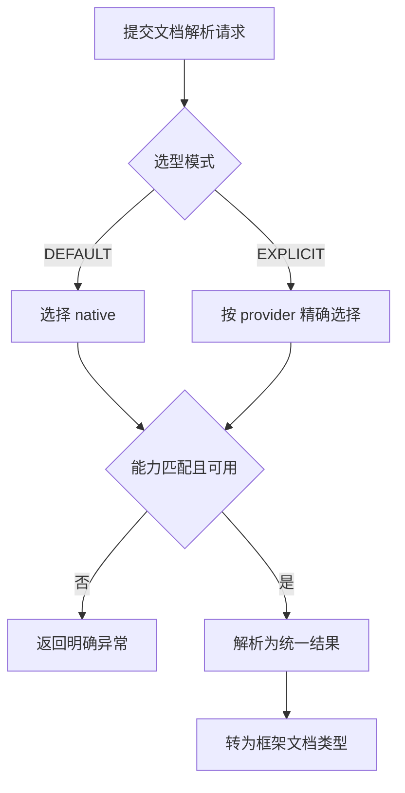

# RAG文档解析器扩展需求说明书

> 功能标识：`rag-document-parser-extension`
> 版本：V1.0.0
> 文档状态：已确认
> 创建日期：2026-07-28
> 更新日期：2026-07-28
>
> **更新时间维护规则**：任何正文修改必须同步更新 `更新日期` 为本次修改日期，并在 `版本修订记录` 中追加变更记录。

## 一句话说明

为 Fons4AI RAG 提供统一、可选择的文档解析能力，使 Spring AI 和 LangChain4j 调用方可以在保持原生解析兼容的同时，显式选用 MinerU 解析复杂文档。

## 需求澄清摘要

### 已确认内容

| 序号 | 澄清问题 | 已确认结论 | 影响范围 |
| --- | --- | --- | --- |
| Q1 | MinerU 以什么形式接入？ | 不新增 MinerU Starter，MinerU 作为文档解析 provider，由 Spring AI 和 LangChain4j 现有 RAG 模块接入。 | 范围、兼容、交付形式 |
| Q2 | 解析器如何选择？ | 通过统一选型模型支持 `DEFAULT` 和 `EXPLICIT`，V1 不使用 LLM 自动选型。 | 选择规则、验收 |
| Q3 | `DEFAULT` 失败时是否自动切换 MinerU？ | 否。`DEFAULT` 始终使用 native，native 不支持或解析失败时直接返回明确异常；仅 `EXPLICIT + mineru` 且 MinerU 可用时调用 MinerU。 | 失败语义、配置、验收 |
| Q4 | MinerU V1 输出范围是什么？ | 同步解析并返回 Markdown，不下载 ZIP、不上传图片、不调用视觉模型生成图片描述。 | 输出语义、非目标 |
| Q5 | MinerU 官方格式支持边界是什么？ | MinerU provider 只声明官方支持的 PDF、图片、DOCX、PPTX、XLSX；旧 DOC/PPT/XLS 可由 native 处理，但不冒充 MinerU 能力。 | 格式兼容、验收 |

### 待确认内容

- 无。

## 背景与目标

- 背景：Fons4AI 已有按文档类型匹配的 Spring AI 读取策略，但没有跨框架的解析器契约、provider 能力描述和显式选择模型。
- 当前问题：同类型的多个解析实现会发生冲突，框架适配与 provider 判断容易重复，复杂 PDF、扫描件、表格、公式和 Office 文档缺少可选的高结构解析通道。
- 目标：先建立框架无关的统一解析模型，再将 native 和 MinerU 作为 provider 注册，由 Spring AI 和 LangChain4j 在边界转换各自文档类型。
- 不做会怎样：每增加一个解析器都需要在不同框架中重复分支和协议调用，双框架能力难以保持一致。

## 需求范围

### 本次包含

- 建立统一的解析请求、可重复文档源、provider 选择、能力描述、解析结果、选择轨迹和异常语义。
- 支持 `DEFAULT` 与 `EXPLICIT` 选型，并以能力注册防止 provider 冲突。
- 在 Spring AI 中保留既有文档读取入口与已有参数，通过适配器接入新模型。
- 在 LangChain4j 中提供符合其文档解析使用习惯的适配入口。
- 两个框架共享 MinerU 协议客户端与通用解析实现，但保持独立的 native 注册表。
- MinerU 默认关闭，启用后通过健康检查和明确选择才参与解析。
- 补充演示文档和自动化验证，说明 MinerU 部署、配置、超时、文件限制和许可证边界。

### 本次不包含

- 不新增 `fons4ai-rag-mineru-starter` 或其他 MinerU 独立 Maven 模块。
- 不使用 LLM 自动判断解析器，不提供复杂评分路由。
- 不在 provider 失败后静默 fallback。
- 不接入 MinerU 异步任务、ZIP 结果、图片上传、对象存储或视觉模型补充描述。
- 不复制 Know-engine 中与知识库实体、MinIO、Qwen 或文档状态绑定的实现。
- 不修改向量化、切片、检索和持久化结构。

## 角色与场景

| 角色或参与方 | 使用场景 | 触发条件 | 期望结果 |
| --- | --- | --- | --- |
| Fons4AI 框架接入者 | 使用默认文档解析 | 未显式指定 provider | 仍使用 native，既有调用方式不变 |
| 知识库建设者 | 解析复杂版式或扫描文档 | 显式选择 MinerU 且服务可用 | 获得保留标题、列表、表格和公式结构的 Markdown |
| 解析器扩展开发者 | 接入新 provider | 实现统一解析契约并声明 capability | 无需修改双框架选择分支 |
| 运维与配置维护者 | 启用或禁用 MinerU | 配置 MinerU 地址、后端、超时和大小上限 | 可控制外部依赖并获得可诊断错误 |

## 需求列表

| 需求编号 | 需求内容 | 优先级 | 关联场景 | 关联验收 |
| --- | --- | --- | --- | --- |
| REQ-001 | 系统应使用统一解析模型表达文档源、选择条件、provider 能力、解析结果和执行轨迹。 | P0 | 默认解析、provider 扩展 | AC-001、AC-002 |
| REQ-002 | V1 应支持 `DEFAULT` 和 `EXPLICIT` 选型，严格校验 provider、文档类型和所需能力，不执行静默切换。 | P0 | 解析器选择 | AC-002、AC-003、AC-004 |
| REQ-003 | MinerU 应作为可关闭的共享 provider，以同步方式解析官方支持文档并返回 Markdown。 | P0 | 复杂文档解析 | AC-004、AC-005、AC-006 |
| REQ-004 | Spring AI 应保持既有文档读取入口兼容，并能显式选用 MinerU；MinerU Markdown 不得被压缩空白的清洗逻辑破坏。 | P0 | Spring AI 接入 | AC-001、AC-005、AC-007 |
| REQ-005 | LangChain4j 应通过自身文档解析入口同时支持 native 与 MinerU，与 Spring AI 共享协议实现但不共享 native 注册状态。 | P0 | LangChain4j 接入、双框架共存 | AC-005、AC-008 |
| REQ-006 | 系统应对 MinerU 未启用、不可达、超限、超时、协议错误、响应错误和解析失败提供可诊断的分类结果，且不记录文档正文。 | P0 | 运维、异常处理 | AC-006、AC-009 |

## 业务规则

| 规则编号 | 规则内容 | 适用场景 | 例外或边界 |
| --- | --- | --- | --- |
| BR-001 | 未提供选型时按 `DEFAULT` 处理，V1 的 `DEFAULT` 固定为 native。 | 所有旧调用与默认调用 | 不允许通过配置将 V1 默认切为 MinerU |
| BR-002 | `EXPLICIT` 必须指定 provider，选中的 provider 不可用或不支持请求时直接失败。 | 显式选型 | 无 fallback |
| BR-003 | 同一注册表中 provider 标识必须唯一，不能因注册顺序覆盖。 | provider 注册 | Spring AI 与 LangChain4j 使用不同注册表 |
| BR-004 | MinerU 只在开关开启、配置完整、健康检查通过且格式受支持时可用。 | MinerU 显式解析 | 旧 Office 格式不属于 MinerU capability |
| BR-005 | MinerU Markdown 必须保留标题、列表、表格、代码块和公式的空白结构。 | MinerU 输出转换 | 不经过压缩所有空白的旧清洗路径 |
| BR-006 | 旧 `params` 和 `cleanDocument` 继续有效；MinerU V1 只消费已明确的通用解析选项。 | Spring AI 兼容 | 不将任意参数透传给外部服务 |

## 业务流程

### 主要流程

1. 调用方提交文档、文档类型和可选的解析选型。
2. 系统校验文档源、选型模式、provider 和所需能力。
3. `DEFAULT` 选择 native；`EXPLICIT` 选择指定 provider。
4. 选中的 provider 解析文档并返回统一结果与轨迹。
5. 框架边界适配器将统一结果转为 Spring AI 或 LangChain4j 文档。

### 异常或分支

- native 不支持文档类型或解析失败时，按 native 失败语义返回，不调用 MinerU。
- 显式选择 MinerU 但开关关闭、配置缺失、健康检查失败或格式不支持时，返回具体原因。
- MinerU 调用超时或协议失败时，不进行静默重试或 fallback。

### 流程图

## 业务数据口径

### 数据影响判断

| 检查项 | 是否涉及 | 说明 |
| --- | --- | --- |
| 新增、修改、删除或查询持久化数据 | 否 | 不修改数据库或向量存储结构 |
| 外部数据入库、出库、同步、对账或报表 | 否 | 本次输出是解析结果，不直接入库 |
| 字段映射、金额、日期、状态、流水号或客户标识 | 否 | 不涉及这些业务数据口径 |
| 手机号、证件号、银行卡、合同、地址、交易流水等敏感数据 | 可能 | 用户文档可能包含敏感内容，新增日志不得记录正文 |
| 跨系统、跨服务、跨库或第三方数据流转 | 是 | 显式选择 MinerU 时文档二进制内容发送到用户配置的 MinerU 服务 |

### 关键数据口径

| 业务对象/数据项 | 用户能理解的含义 | 来源或产生方式 | 单位/格式/状态口径 | 本次是否变化 | 是否关键 | 确认状态 |
| --- | --- | --- | --- | --- | --- | --- |
| 解析 provider | 实际执行文档解析的实现 | 选型模型和注册能力 | `native` 或 `mineru` | 是 | 是 | 已确认 |
| 解析内容 | 从原始文档提取的文本或 Markdown | native 或 MinerU | `TEXT` 或 `MARKDOWN`，保留结构 | 是 | 是 | 已确认 |
| 解析轨迹 | 实际 provider、耗时、输出格式和选择原因 | 每次解析生成 | 不包含文档正文 | 是 | 是 | 已确认 |
| 文档二进制内容 | 用户要解析的原文件 | 调用方提供 | 仅在显式选择 MinerU 时发送至配置服务 | 否 | 是 | 已确认 |

## 影响说明

| 影响对象 | 影响说明 |
| --- | --- |
| Spring AI 既有调用方 | 默认仍使用 native，原入口、参数和返回类型保持兼容 |
| LangChain4j 调用方 | 新增统一选型与 MinerU 适配能力 |
| 运维与部署 | MinerU 默认不生效；启用后需要可达的 MinerU API 和适当的超时、文件大小限制 |
| 后续 provider 扩展 | 通过实现统一契约和声明 capability 接入，不再分别修改双框架选择分支 |

## 验收标准

- AC-001：Given 现有 Spring AI 调用方未提供解析选型，when 按原入口读取已支持文档，then 系统使用 native 并返回与既有契约兼容的结果。关联需求：REQ-001、REQ-004。
- AC-002：Given 注册表包含多个不同 provider，when 执行 `DEFAULT` 或 `EXPLICIT` 选择，then 系统根据选型模型、文档类型和所需能力唯一选中 provider，并记录选择原因。关联需求：REQ-001、REQ-002。
- AC-003：Given native 不支持请求类型或解析失败，when 使用 `DEFAULT`，then 系统返回可诊断的 native 失败且不调用 MinerU。关联需求：REQ-002。
- AC-004：Given 显式指定的 provider 不存在、不可用、不支持文档类型或不具备必需能力，when 执行解析，then 系统返回包含 provider 和原因的明确异常，不执行 fallback。关联需求：REQ-002、REQ-003。
- AC-005：Given MinerU 已启用、健康且文档格式受支持，when Spring AI 或 LangChain4j 显式选择 `mineru`，then 两者通过同一 MinerU 协议实现获得等价 Markdown 内容和解析元数据。关联需求：REQ-003、REQ-004、REQ-005。
- AC-006：Given MinerU 未启用、不可达、文件超限、请求超时、HTTP 异常、响应非法或服务解析失败，when 显式选择 MinerU，then 调用方能区分失败类型，且系统不记录文档正文。关联需求：REQ-003、REQ-006。
- AC-007：Given MinerU 返回含标题、列表、表格、代码块或公式的 Markdown，when 结果被转为 Spring AI 文档，then 结构性换行和空白保持不变。关联需求：REQ-004。
- AC-008：Given Spring AI 与 LangChain4j 模块同时装配，when 分别执行 native 和 MinerU 解析，then 两套 native 注册不发生 Bean/provider 冲突，且 MinerU 协议实现不重复。关联需求：REQ-005。
- AC-009：Given 解析成功或失败，when 输出日志和轨迹，then 仅记录 provider、文档类型、耗时、结果大小和非敏感原因，不记录文档正文、认证信息或原始敏感响应。关联需求：REQ-006。

## 质量要求

- 性能：默认 native 路径不新增外部调用；MinerU 调用受连接超时、读取超时和文件大小上限约束。
- 安全：MinerU 地址由接入方配置；日志、异常和 `toString` 不得泄露文档正文、Token、认证头或内部连接信息。
- 兼容：旧 Spring AI 入口默认语义不变；旧 Office 扩展名不被错误宣称为 MinerU 支持。
- 可用性：资源在成功、失败和超时路径均可释放；文档源可重复打开，但必须有明确所有权和清理语义。

## 风险与待确认

### 风险

- MinerU API 会随版本演进，实现必须基于当前官方协议并对响应结构严格校验。
- 大文件和长耗时解析可能带来内存、临时磁盘和请求线程占用，V1 需通过大小上限、可重复源和超时控制。
- MinerU 为外部服务，文档内容的传输合规性由部署与接入方负责，Fons4AI 不默认启用。
- MinerU 使用自定义的 MinerU Open Source License，集成文档需提醒使用方核对适用条款。

### 假设

- 上层应用在显式选择 MinerU 前已确认可以向配置的 MinerU 服务发送对应文档。
- V1 每次 MinerU 请求只处理一个文件。

### 待确认

- 无。

## 版本修订记录

| 日期 | 版本 | 说明 |
| --- | --- | --- |
| 2026-07-28 | V1.0.0 | 初始化正式需求说明书，记录 5 项已确认澄清结论 |
