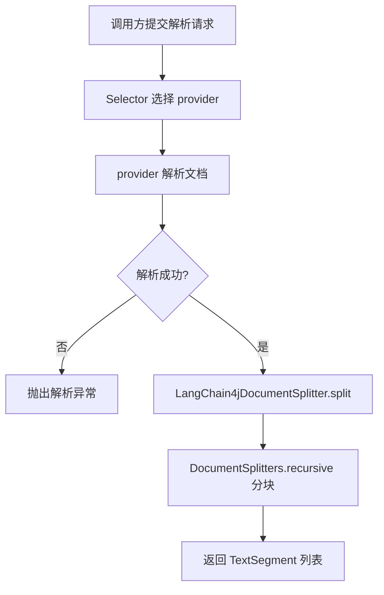

# LangChain4j文档分块技术设计说明书

> 功能标识：`langchain4j-document-splitter`
> SDD 等级：`S1`
> 来源需求：`spec/features/20260729/LangChain4j文档分块-需求说明书.md`
> 文档状态：初稿
> 创建日期：2026-07-29
> 更新日期：2026-07-29
>
> **更新时间维护规则**：任何正文修改必须同步更新 `更新日期` 为本次修改日期。不得正文已变更而更新日期仍停留在旧日期。

## 1. 设计概要

- 功能描述：为 fons4ai LangChain4j 模块补充文档分块能力，支持 recursive（递归降级）和 markdown-header（标题层级+父子模式）两种策略，可配置 chunkSize、overlap 和标题级别。
- 影响模块：`fons4ai-rag-langchain`
- 关键技术点：`DocumentSplitters.recursive()` 递归降级分块、`MarkdownHeaderParentTextSplitter` 标题层级分块+父子模式、策略选择机制、配置绑定、Facade 扩展、自动配置注册
- 依赖关系：依赖 `langchain4j` 1.11.0（已引入）、`fons4ai-rag-common`（已引入）
- 非目标：不引入 Token 计量分块、不实现兄弟模式分块、不涉及向量化与入库
- SDD 等级理由：单模块改动、无数据库迁移、无权限安全风险、无公共 API 变更

### 1.1 技术栈与交付画像

| 项目事实 | 已确认结论 | 证据或原因 |
| --- | --- | --- |
| 项目形态 | 库/SDK | fons4ai-rag-langchain 是 Spring Boot starter 模块 |
| 主要语言与运行时 | JVM / Java 21 | 根 pom java.version=21 |
| 构建与测试入口 | `mvn test`（fons4ai-rag-langchain 目录） | 现有构建配置 |
| 交付入口 | Spring Boot AutoConfiguration | META-INF/spring/AutoConfiguration.imports |
| 独立可运行服务 | 否，原因：是库/SDK 模块 | 非独立服务 |
| 页面/交互型交付物 | 否，原因：无前端代码 | 纯后端 |

### 1.2 证据清单

| 结论 | 证据来源 | 等级 | 状态 |
| --- | --- | --- | --- |
| LangChain4j 1.11.0 提供 DocumentSplitters.recursive() | langchain4j 官方文档和 JavaDoc | L2 | 已确认 |
| 现有 Facade 和 AutoConfiguration 结构 | 源码 LangChain4jDocumentParserFacade.java、LangChain4jDocumentParserAutoConfiguration.java | L2 | 已确认 |
| DocumentSplitters.recursive(int, int) 使用字符计量 | 官方 JavaDoc，参数为 maxSegmentSizeInChars | L2 | 已确认 |
| TextSegment 继承 Document metadata | LangChain4j DocumentSplitter 接口契约 | L2 | 已确认 |

## 2. 架构与调用链路

### 2.1 模块边界

```
fons4ai-rag-langchain
├── document/
│   ├── LangChain4jDocumentParserFacade.java       (修改：新增分块入口)
│   ├── LangChain4jDocumentSplitter.java            (新增：分块器策略路由)
│   ├── LangChain4jDocumentParserAdapterFactory.java (不修改)
│   ├── MarkdownHeaderParentSplitter.java           (新增：Markdown 标题分块器)
│   └── MetadataKeyConstants.java                   (新增：元数据键常量)
├── infrastructure/config/
│   ├── LangChain4jDocumentSplitterProperties.java  (新增：分块配置绑定)
│   └── LangChain4jDocumentParserAutoConfiguration.java (修改：注册分块 Bean)
```

### 2.2 调用链路

**分块入口（两步）**：
```
调用方 -> LangChain4jDocumentSplitter.split(Document) -> TextSegment 列表
```

**一站式入口（解析+分块）**：
```
调用方 -> Facade.parseAndSplit(DocumentParseRequest) 
       -> Selector.parse() -> Document
       -> LangChain4jDocumentSplitter.split(Document) -> TextSegment 列表
```

### 2.3 流程图



## 3. API / RPC / 消息契约设计

### 3.1 新增公开接口

**LangChain4jDocumentSplitter**（新增类）：
```java
public final class LangChain4jDocumentSplitter {
    public LangChain4jDocumentSplitter(int chunkSize, int overlap);
    public List<TextSegment> split(Document document);
    public List<TextSegment> split(List<Document> documents);
}
```

**LangChain4jDocumentParserFacade**（扩展）：
```java
// 新增方法，保留原有 parse/parseWithTrace 不变
public List<TextSegment> parseAndSplit(DocumentParseRequest request);
```

### 3.2 配置属性

**LangChain4jDocumentSplitterProperties**（新增类）：
```java
@ConfigurationProperties(prefix = "sys.rag.document-splitter")
public class LangChain4jDocumentSplitterProperties {
    private String strategy = "recursive";  // recursive | markdown-header
    private int chunkSize = 1000;           // 默认 1000 字符
    private int overlap = 100;              // 默认 100 字符
    private int titleLevel = 3;             // 标题分块级别 1-6，仅 markdown-header 策略使用
    // @PostConstruct validate():
    //   strategy 必须是 recursive 或 markdown-header
    //   chunkSize > 0, overlap >= 0, overlap < chunkSize
    //   titleLevel 1-6（仅 markdown-header 时校验）
}
```

### 3.3 配置示例

```yaml
sys:
  rag:
    document-splitter:
      strategy: recursive          # recursive | markdown-header
      chunk-size: 1000
      overlap: 100
      title-level: 3               # 仅 markdown-header 策略使用
```

## 4. 数据模型与 DDL 影响

不适用，原因：分块在内存中处理，不涉及持久化数据结构变更。

### 4.2 字段映射契约

不适用，原因：分块不涉及外部数据入库、接口入库或跨系统数据流转，无字段映射。

### 4.3 数据流设计

不适用，原因：数据流为单向内存操作（Document -> TextSegment 列表），无跨系统流转。

### 4.4 数据安全与合规设计

不适用，原因：分块不处理敏感数据字段，但分块器日志不记录文档正文内容。

### 4.5 结构变更详设

不适用，原因：不涉及数据库表、Redis、Elasticsearch 等数据服务结构变更。

## 5. 核心逻辑设计

### 5.1 LangChain4jDocumentSplitter

分块器策略路由入口，根据配置的 strategy 创建 recursive 或 markdown-header 内部分块器。

```java
public final class LangChain4jDocumentSplitter {

    private final DocumentSplitter splitter;

    public LangChain4jDocumentSplitter(int chunkSize, int overlap) {
        this("recursive", chunkSize, overlap, 3);
    }

    public LangChain4jDocumentSplitter(String strategy, int chunkSize, int overlap, int titleLevel) {
        validateParams(chunkSize, overlap);
        this.splitter = switch (strategy) {
            case "recursive" -> DocumentSplitters.recursive(chunkSize, overlap);
            case "markdown-header" -> new MarkdownHeaderParentSplitter(titleLevel, chunkSize, overlap);
            default -> throw new IllegalArgumentException("不支持的策略: " + strategy);
        };
    }

    public List<TextSegment> split(Document document) { ... }
    public List<TextSegment> split(List<Document> documents) { ... }
}
```

### 5.2 MarkdownHeaderParentSplitter

参考 know-engine 的 `MarkdownHeaderParentTextSplitter` 实现，适配 fons4ai 包结构，移除 System.out.println，使用 UUID 替代 SnowflakeIdGenerator。

核心逻辑：
1. 按标题标记（`#`~`######`）切分文档，维护标题栈处理层级回退
2. 识别代码块标记（``` 和 ~~~），代码块内不检测标题
3. 聚合相同元数据的行为一个分块
4. 超长片段（超出 chunkSize）二次切割为父子模式：
   - 保留完整父块，标记 `skipEmbedding=1`
   - 生成多个子块，携带 `parentChunkId` 指向父块
   - 子块之间有 overlap 字符重叠
5. 每个分块携带标题元数据（title/subtitle/.../headerLevel）

### 5.3 MetadataKeyConstants

```java
public final class MetadataKeyConstants {
    public static final String CHUNK_ID = "chunkId";
    public static final String PARENT_CHUNK_ID = "parentChunkId";
    public static final String SKIP_EMBEDDING = "skipEmbedding";
    public static final String HEADER_LEVEL = "headerLevel";
}
```

### 5.4 Facade 扩展

在现有 `LangChain4jDocumentParserFacade` 中新增 `parseAndSplit` 方法，复用现有 selector 解析后委托分块器。

```java
// 新增字段
private final LangChain4jDocumentSplitter splitter;

// 新增构造器参数（保持旧构造器兼容）
// parseAndSplit 方法
public List<TextSegment> parseAndSplit(DocumentParseRequest request) {
    Document document = parse(request);  // 复用现有解析逻辑
    return splitter.split(document);
}
```

### 5.3 自动配置扩展

在 `LangChain4jDocumentParserAutoConfiguration` 中新增：
- `@EnableConfigurationProperties` 增加 `LangChain4jDocumentSplitterProperties.class`
- 注册 `LangChain4jDocumentSplitter` Bean
- 修改 `LangChain4jDocumentParserFacade` Bean 注册，注入 splitter

## 6. 领域建模与业务规则落地

| 规则 | 技术落地点 |
| --- | --- |
| BR-001 chunkSize > 0 | LangChain4jDocumentSplitter 构造器 + Properties @PostConstruct |
| BR-002 overlap >= 0 且 < chunkSize | LangChain4jDocumentSplitter 构造器 + Properties @PostConstruct |
| BR-003 解析失败保留原有异常 | parseAndSplit 先调用 parse，异常直接传播不包装 |
| BR-004 分块不修改原始 Document | DocumentSplitters.recursive() 返回新 TextSegment，不改 Document |
| BR-005 代码块保护 | MarkdownHeaderParentSplitter 识别 ``` 和 ~~~，代码块内不检测标题 |
| BR-006 父子模式元数据 | MarkdownHeaderParentSplitter 二次切割时写入 skipEmbedding/parentChunkId |
| BR-007 策略校验 | LangChain4jDocumentSplitterProperties @PostConstruct 校验 strategy 合法性 |

## 7. 状态流转设计

不适用，原因：无状态流转，分块是无状态的一次性操作。

## 8. 异常、安全、事务与性能

- 异常：解析异常由 Selector/Provider 抛出，直接传播；分块参数非法在构造器或启动校验时抛出 IllegalArgumentException
- 安全：分块器不记录 Document 内容到日志，Facade 日志仅记录分块数量和耗时
- 事务：不适用，无数据库事务
- 性能：分块在内存中处理，复杂度 O(n)，n 为文档字符数

## 9. 技术决策

| 决策 | 选择 | 原因 | 替代方案 | 影响 |
| --- | --- | --- | --- | --- |
| D-001 分块策略 | recursive + markdown-header 双策略 | recursive 覆盖通用场景，markdown-header 覆盖结构化文档 | 仅 recursive | 配置选择策略 |
| D-002 计量方式 | 字符计量 | 无需额外 Tokenizer 依赖，简单可用 | Token 计量（需引入 OpenAiTokenizer） | 中文场景可能不够精确，后续可扩展 |
| D-003 分块器封装 | 独立 LangChain4jDocumentSplitter 类 | 封装原生 API，便于策略路由 | 直接在 Facade 中调用 DocumentSplitters | 不利于后续扩展 |
| D-004 配置前缀 | sys.rag.document-splitter | 与文档解析配置 sys.rag.document-parser 平行 | 合并到 document-parser 下 | 保持职责分离 |
| D-005 标题分块实现 | 参考 know-engine MarkdownHeaderParentTextSplitter | 已验证的实现，支持标题栈/代码块保护/父子模式 | 自行从零实现 | 工作量大 |
| D-006 ID 生成 | UUID | 无需引入 SnowflakeIdGenerator 依赖 | Snowflake | 分布式 ID 不必要 |
| D-007 父子模式 | 超长片段保留父块(skipEmbedding=1)+子块(parentChunkId) | 父块作上下文不向量化，子块精确向量化 | 仅子块不保留父块 | 丢失上下文 |

## 10. 验证策略、AC 映射与风险

### 10.1 AC 映射

| AC | 设计决策 | 验证方式 |
| --- | --- | --- |
| AC-001 | D-001、LangChain4jDocumentSplitter.split | JUnit：创建 chunkSize=500/overlap=50 的分块器，验证每个 TextSegment 不超 500 字符 |
| AC-002 | D-001、DocumentSplitters.recursive() | JUnit：多段落文档分块，验证段落边界优先切分 |
| AC-003 | Facade.parseAndSplit | JUnit：一站式入口返回结果等价于两步结果 |
| AC-004 | LangChain4jDocumentSplitterProperties | Spring Boot contextRunner：配置 chunk-size=800/overlap=80，验证 Bean 属性 |
| AC-005 | DocumentSplitters.recursive() 契约 | JUnit：Document 携带 metadata，验证 TextSegment 继承 |
| AC-006 | Properties @PostConstruct + 构造器校验 | JUnit：chunk-size=0/overlap=-1/overlap>=chunk-size 启动失败 |
| AC-007 | D-005、MarkdownHeaderParentSplitter | JUnit：含#/##/###的文档，title-level=2，验证按标题切分且携带 title/subtitle/headerLevel 元数据 |
| AC-008 | D-007、MarkdownHeaderParentSplitter.splitByChunkSize | JUnit：超长片段二次切割，父块 skipEmbedding=1，子块 parentChunkId 指向父块，子块有 overlap |
| AC-009 | D-001、LangChain4jDocumentSplitterProperties | Spring Boot contextRunner：strategy=recursive 使用递归策略，strategy=markdown-header 使用标题策略，strategy=unknown 启动失败 |

### 10.2 风险

- 无阻塞性风险
- DocumentSplitters.recursive() 对中文无空格分词支持有限，后续可通过引入 Token 计量或自定义分块策略改进

### 10.3 知识影响

- 是，需记录 LangChain4j 文档分块能力到 RAG 能力域文档
- 知识沉淀由 fons4ai-knowledge-summary 在用户显式触发后处理

## 知识同步影响

本次变更产生长期知识影响：是。影响类型为技术方案，影响说明为 LangChain4j 文档分块能力（recursive + markdown-header 双策略、chunkSize/overlap 配置、标题层级分块、父子模式二次切割、Facade 一站式入口）。

### 版本修订记录

| 日期 | 版本 | 说明 |
| --- | --- | --- |
| 2026-07-29 | V1.0.0 | 初始化技术设计说明书 |
| 2026-07-29 | V1.1.0 | CR-001：新增 Markdown 标题分块器设计、策略选择机制、父子模式设计 |
