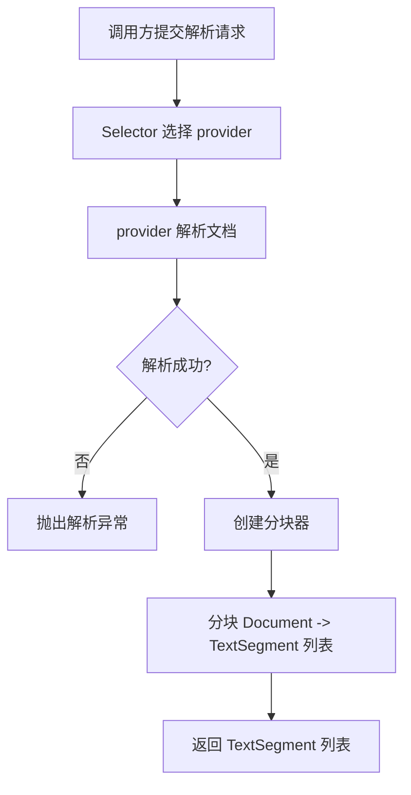

# LangChain4j文档分块需求说明书

> 功能标识：`langchain4j-document-splitter`
> 版本：V1.1.0
> 文档状态：已确认
> 创建日期：2026-07-29
> 更新日期：2026-07-29
>
> **更新时间维护规则**：任何正文修改必须同步更新 `更新日期` 为本次修改日期，并在 `版本修订记录` 中追加变更记录。不得正文已变更而更新日期仍停留在旧日期。

## 一句话说明

为 fons4ai LangChain4j 模块补充文档分块能力，使解析后的 Document 能按可配置的 chunkSize 和 overlap 切分为 TextSegment 列表，供下游向量化与检索使用。

## 需求澄清摘要

> 复杂业务场景可通过苏格拉底式五问澄清：业务目标、参与角色、核心流程、规则边界、验收信号。这里只记录确认后的业务结论，不记录完整问答日志。

### 已确认内容

| 序号 | 澄清问题 | 已确认结论 | 影响范围 |
| --- | --- | --- | --- |
| Q1 | 分块策略应支持哪种方式？ | 使用 LangChain4j 原生 DocumentSplitters.recursive()（段落->句子->词->字符递归降级）作为默认策略，支持 chunkSize 和 overlap 配置 | 需求/技术设计/验收 |
| Q2 | 标题分块需要支持哪种模式？ | 仅父子模式：按 Markdown 标题层级分块，超长片段二次切割为父子关联（父块作上下文不向量化，子块向量化） | 需求/技术设计/验收 |

### 待确认内容

- 无

## 背景与目标

- 背景：fons4ai LangChain4j 模块已完成文档解析（Tika native + MinerU），但解析后的 Document 是完整的文档内容，未进行分块。RAG 流程中"读取文档 -> 分块 -> 向量化 -> 入库"是标准链路，当前缺少分块环节。
- 当前问题：LangChain4j 模块没有文档分块能力，调用方需要自行处理分块逻辑，无法通过配置统一管理分块参数。
- 目标：提供可配置的文档分块能力，调用方解析文档后可直接分块，或通过一站式入口完成"解析 -> 分块"链路。
- 不做会怎样：调用方需自行实现分块逻辑，分块参数无法统一治理，MinerU 返回的 Markdown 结构可能在分块时被破坏。

## 需求范围

### 本次包含

- 基于 LangChain4j 原生 `DocumentSplitters.recursive()` 的分块能力
- Markdown 标题层级分块策略（父子模式），支持按标题级别切分和超长片段父子关联
- 可配置的 chunkSize 和 overlap 参数
- 分块策略选择，支持 recursive 和 markdown-header 两种策略
- 分块器工厂，支持按配置创建分块器
- Facade 新增分块入口，支持"解析 -> 分块"一站式调用
- 自动配置注册分块相关 Bean

### 本次不包含

- 兄弟模式分块（后续可扩展）
- Token 计量分块（需引入 Tokenizer 依赖，后续可扩展）
- 向量化与向量入库（由调用方或后续需求处理）
- Spring AI 模块的分块（Spring AI 已有 OverlapParagraphTextSplitter 等组件）

## 角色与场景

| 角色或参与方 | 使用场景 | 触发条件 | 期望结果 |
| --- | --- | --- | --- |
| RAG 应用开发者 | 解析文档后需要分块 | 调用方获得 Document 后需要切分为 TextSegment | 通过配置指定 chunkSize/overlap，获得分块后的 TextSegment 列表 |
| RAG 应用开发者 | 一站式解析并分块 | 调用方希望一步完成解析和分块 | 通过 Facade 入口直接获得 TextSegment 列表 |

## 需求列表

| 需求编号 | 需求内容 | 优先级 | 关联场景 | 关联验收 |
| --- | --- | --- | --- | --- |
| REQ-001 | 提供文档分块能力，支持配置 chunkSize 和 overlap | P0 | 分块场景 | AC-001 |
| REQ-002 | 使用 LangChain4j 原生 recursive 策略（段落->句子->词->字符递归降级） | P0 | 分块场景 | AC-002 |
| REQ-003 | Facade 新增分块入口，支持"解析 -> 分块"一站式调用 | P0 | 一站式场景 | AC-003 |
| REQ-004 | 通过自动配置注册分块相关 Bean，支持配置前缀 sys.rag | P0 | 自动配置 | AC-004 |
| REQ-005 | 分块保留原始 Document 的 metadata 到每个 TextSegment | P1 | 分块场景 | AC-005 |
| REQ-006 | 分块参数有合理默认值且校验非法配置 | P1 | 自动配置 | AC-006 |
| REQ-007 | 支持 Markdown 标题层级分块策略，可配置标题切分级别（1-6） | P0 | 标题分块场景 | AC-007 |
| REQ-008 | 超长片段采用父子模式：保留完整父块（不向量化），生成子块（关联父块ID） | P0 | 标题分块场景 | AC-008 |
| REQ-009 | 支持通过配置选择分块策略（recursive 或 markdown-header） | P0 | 策略选择 | AC-009 |

## 业务规则

| 规则编号 | 规则内容 | 适用场景 | 例外或边界 |
| --- | --- | --- | --- |
| BR-001 | chunkSize 必须大于 0 | 分块配置 | 无 |
| BR-002 | overlap 必须大于等于 0 且小于 chunkSize | 分块配置 | 无 |
| BR-003 | 分块入口在解析失败时保留原有异常分类，不额外包装 | 分块场景 | 无 |
| BR-004 | 分块不修改原始 Document 内容，仅切分 | 分块场景 | 无 |
| BR-005 | 标题分块识别代码块标记（``` 和 ~~~），代码块内不检测标题 | 标题分块场景 | 无 |
| BR-006 | 父块标记 skipEmbedding=1，子块携带 parentChunkId | 标题分块场景 | 无 |
| BR-007 | 策略默认值为 recursive，配置非法值时启动失败 | 策略选择 | 无 |

## 业务流程

### 主要流程

1. 调用方通过 Facade 提交文档解析请求（可选携带分块参数）
2. Facade 委托 Selector 选择 provider 并解析文档
3. 解析成功后，使用配置的 chunkSize/overlap 创建分块器
4. 分块器将 Document 切分为 TextSegment 列表
5. 返回 TextSegment 列表给调用方

### 异常或分支

- 解析失败：直接抛出原有解析异常，不执行分块
- 分块参数非法：启动时校验失败，应用不启动
- Document 内容为空：返回空 TextSegment 列表

### 流程图



## 业务数据口径

只记录用户或业务方需要理解的数据含义，不记录表名、字段名、DDL、存储方案或技术模型。

### 数据影响判断

| 检查项 | 是否涉及 | 说明 |
| --- | --- | --- |
| 新增、修改、删除或查询持久化数据 | 否 | 分块仅在内存中处理，不涉及持久化 |
| 外部数据入库、出库、同步、对账或报表 | 否 | 分块结果由调用方决定是否入库 |
| 字段映射、金额、日期、状态、流水号或客户标识 | 否 | 不涉及业务字段映射 |
| 手机号、证件号、银行卡、合同、地址、交易流水等敏感数据 | 否 | 分块不处理敏感数据，但 Document 内容可能包含敏感文本，分块器不记录内容到日志 |
| 跨系统、跨服务、跨库或第三方数据流转 | 否 | 分块在本地内存完成 |

### 关键数据口径

| 业务对象/数据项 | 用户能理解的含义 | 来源或产生方式 | 单位/格式/状态口径 | 本次是否变化 | 是否关键 | 确认状态 |
| --- | --- | --- | --- | --- | --- | --- |
| chunkSize | 单个分块最大字符数 | 配置项 | 整数，默认 1000 | 否 | 是 | 已确认 |
| overlap | 相邻分块重叠字符数 | 配置项 | 整数，默认 100 | 否 | 是 | 已确认 |

## 影响说明

| 影响对象 | 影响说明 |
| --- | --- |
| LangChain4j 模块 | 新增分块相关类和配置，Facade 扩展分块入口 |
| 现有解析功能 | 无影响，分块是解析后的独立环节 |
| Spring AI 模块 | 无影响，Spring AI 已有独立分块组件 |

## 验收标准

- AC-001：Given 一个已解析的 Document 和配置 chunkSize=500/overlap=50，when 调用分块，then 返回的 TextSegment 列表中每个片段不超过 500 字符，相邻片段有约 50 字符重叠。关联需求：REQ-001。
- AC-002：Given 一个含多段落的长文档，when 调用分块，then 分块在段落边界优先切分，超限时降级到句子/词/字符切分，不截断段落中间。关联需求：REQ-002。
- AC-003：Given 一个文档解析请求和分块参数，when 调用 Facade 的解析并分块入口，then 返回 TextSegment 列表，等价于先解析再分块的两步结果。关联需求：REQ-003。
- AC-004：Given 应用配置 sys.rag.document-splitter.chunk-size=800/overlap=80，when 应用启动，then 分块器 Bean 使用配置值创建。关联需求：REQ-004。
- AC-005：Given 原始 Document 携带 metadata（如 source、format），when 分块后，then 每个 TextSegment 继承原始 metadata。关联需求：REQ-005。
- AC-006：Given 配置 chunk-size=0 或 overlap=-1 或 overlap>=chunk-size，when 应用启动，then 启动校验失败并抛出明确异常。关联需求：REQ-006。
- AC-007：Given 一个含 Markdown 标题（#/##/###）的文档和配置 strategy=markdown-header/title-level=2，when 调用分块，then 按 1-2 级标题切分，每个分块携带标题层级元数据（title/subtitle/headerLevel）。关联需求：REQ-007。
- AC-008：Given 标题分块后某片段超出 chunkSize，when 二次切割，then 保留完整父块（skipEmbedding=1），生成多个子块（parentChunkId 指向父块），子块之间有 overlap 重叠。关联需求：REQ-008。
- AC-009：Given 配置 strategy=recursive，when 应用启动，then 使用递归策略；Given 配置 strategy=markdown-header，when 应用启动，then 使用标题分块策略；Given 配置 strategy=unknown，when 应用启动，then 启动失败。关联需求：REQ-009。

## 质量要求

- 性能：不适用，原因：分块在内存中处理，性能取决于文档大小和分块参数，无特殊要求
- 安全：分块器不记录 Document 内容到日志，仅记录分块数量和耗时
- 兼容：不破坏现有 LangChain4jDocumentParserFacade 的 parse/parseWithTrace 方法签名
- 可用性：分块参数有合理默认值，调用方不配置时也能正常工作

## 风险与待确认

### 风险

- 无

### 假设

- LangChain4j 1.11.0 的 DocumentSplitters.recursive() API 稳定可用
- 分块使用字符计量而非 Token 计量（Token 计量需额外引入 Tokenizer 依赖，本次不包含）

### 待确认

- 无

## 版本修订记录

| 日期 | 版本 | 说明 |
| --- | --- | --- |
| 2026-07-29 | V1.0.0 | 初始化需求说明书 |
| 2026-07-29 | V1.1.0 | CR-001：新增 Markdown 标题分块（父子模式）需求 REQ-007/008/009，AC-007/008/009 |
