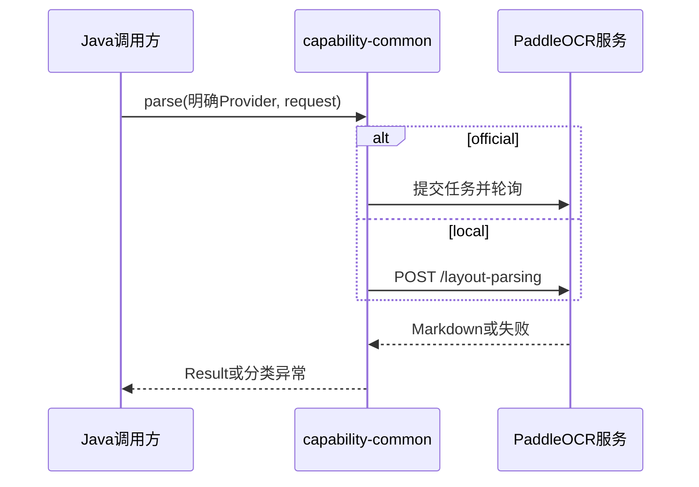

# PaddleOCR双通道解析技术设计说明书

> 功能标识：`paddleocr-dual-provider`
> SDD 等级：`S2`
> 来源需求：`spec/features/20260828/PaddleOCR双通道解析-需求说明书.md`
> 文档状态：已确认
> 设计确认状态：approved
> 创建日期：2026-08-28
> 更新日期：2026-08-28

## 1. 设计摘要与关键决策

- 功能目标：实现 REQ-001 至 REQ-005 的独立 PaddleOCR Java 能力。
- 设计范围：仅在 `fons4ai-capability-common` 新增公共请求/结果/异常/Provider 契约及 official、local 两个 HTTP 客户端实现。
- 非目标：不引用或修改 RAG、Spring AI、LangChain4j、Starter、自动配置、数据库或独立服务。
- SDD 等级理由：新增公共 Java 契约、外部文件传输和官方凭证边界。
- 交付画像：库/SDK；独立可运行服务：否；页面/交互型交付物：否；数据结构变更：否。
- 规划建议：V1 单文件，4 个线性/可并行任务即可完成。

### 1.1 关键决策

| 决策 | 选择 | 原因 | 替代方案 | 影响 | 需用户确认 |
| --- | --- | --- | --- | --- | --- |
| D-001 | 能力仅位于 `fons4ai-capability-common` | OCR 是框架无关 AI 能力，可供任意上层直接调用 | 挂到 RAG 或两个 AI 框架 Starter | 物理模块、依赖边界 | 否，用户已确认 |
| D-002 | 公共 API 要求显式传入 `PaddleOcrProvider` | 从类型层面杜绝默认/隐式外发 | 默认 official/local 或自动路由 | 调用方式、安全 | 否，用户已确认 |
| D-003 | `paddleocr-official` 在同步 API 内封装提交—轮询—取结果 | 为普通 Java 调用方隐藏 job 生命周期，但保留超时边界 | 暴露 jobId 和新异步公共 API | official 客户端 | 否，用户已确认 |
| D-004 | `paddleocr-local` 只对接完整 `PaddleOCR-VL-1.6` 的 `/layout-parsing` | 该 Pipeline 有明确 Markdown 契约 | 通用 OCR、任意 Pipeline 或 VLM 子服务 | local 客户端 | 否，用户已确认 |
| D-005 | V1 支持 PDF、PNG、JPG、JPEG，输出纯 Markdown 且不处理图片资产 | 以官方与本地完整 Pipeline 可验证交集为边界 | 宣称 Office/坐标输出支持 | capability 与测试 | 否，用户已确认 |

### 1.2 设计确认 Gate

- Gate 是否适用：是，涉及公共契约和外部文档传输。
- 设计确认状态：approved。
- 确认证据：用户先确认原设计，后于 2026-08-28 明确要求将能力改为 common 独立能力；本次 SDD 已直接同步该已确认边界。

## 2. 系统边界、模块与调用链

### 2.1 模块与职责

| 模块/组件 | 职责 | 输入 | 输出 | 影响 AC |
| --- | --- | --- | --- | --- |
| `fons4ai-capability-common` 公共 OCR API | 表达 Provider、请求、结果、异常与显式选择不变量 | Provider、文档源、选项 | Markdown 结果或分类异常 | AC-001、AC-002 |
| official 适配器 | 官方任务提交、轮询、结果映射 | Token、PDF/图片 | Markdown | AC-003、AC-006、AC-007 |
| local 适配器 | 调用本地 Pipeline 并映射 `markdown.text` | Base64 PDF/图片 | Markdown | AC-004、AC-006、AC-007 |

### 2.2 调用链、服务形态与运行态设计

- 入口：调用方使用 `PaddleOcrDocumentParser.parse(provider, request)`，或通过显式 Provider 工厂创建相应解析器。
- 核心调用链：调用方 → common 公共 API → official/local 适配器 → PaddleOCR 服务 → `PaddleOcrDocumentResult`。
- 外部依赖：PaddleOCR 官方 API；调用方自建的完整 `PaddleOCR-VL-1.6` 服务。
- 启动入口、注册发现、健康端点：不适用，本次不新增服务进程。
- 配置来源：调用方构造 `PaddleOcrOfficialOptions` 或 `PaddleOcrLocalOptions`；Token、地址和限额由调用方外置管理，不引入 Spring 配置绑定。



## 3. 接口、消息与外部契约

### 3.1 契约清单

| 契约 | 类型 | 标识/路径 | 鉴权 | 错误处理 | AC |
| --- | --- | --- | --- | --- | --- |
| 公共解析 API | Java API | `PaddleOcrDocumentParser` + `PaddleOcrProvider` | 调用方构造 options | 缺失 Provider/配置时失败 | AC-001、AC-002 |
| official | HTTPS 异步任务 | 实施时官方 API Reference | Access Token | 提交、轮询、终态、超时分类 | AC-003、AC-006 |
| local | HTTP JSON | `POST {base-url}/layout-parsing` | 调用方网络/网关治理 | HTTP、`errorCode`、响应格式分类 | AC-004、AC-006 |

### 3.2 详细契约

- `PaddleOcrProvider` 仅包含 `paddleocr-official`、`paddleocr-local`；构造/解析时 Provider 为必填。
- `PaddleOcrDocumentRequest` 包含单文件可重复文档源、文件名/扩展名、媒体类型与允许的文档解析选项；拒绝不支持扩展名与超限文件。
- `PaddleOcrDocumentResult` 包含 Markdown、Provider、耗时和非敏感服务版本信息；不含坐标、图片、正文副本以外的原始响应或认证信息。
- official：固定使用 PaddleOCR-VL-1.6 文档解析模型；提交后在 `poll-timeout` 内轮询；不重试、不持久化 jobId、不下载派生资源。低层字段以实施时官方文档为准。
- local：`file` 传 Base64；PDF `fileType=0`，图片 `fileType=1`；固定 `returnMarkdownImages=false`、`visualize=false`、`restructurePages=true`、`concatenatePages=true`；严格读取唯一的 `markdown.text`。

## 4. 核心业务、领域规则与状态流转

### 4.1 核心流程

```text
parse(provider, request):
  require provider is explicit
  validate provider options, extension and file size
  if provider is official: markdown = submitAndPoll(request)
  else: markdown = postLocalPipeline(request)
  return result(markdown, provider, nonSensitiveTrace)
```

- Provider 未提供、未启用、配置错误、格式不支持、超时、网络/业务/响应失败均直接抛出分类异常。
- 不存在默认 Provider、自动选择、重试或失败回退；local 不得转发 official。

### 4.2 规则落地

| 行为 | 归属对象 | 扩展点 | 验证方式 |
| --- | --- | --- | --- |
| 显式 Provider 不变量 | 公共请求/解析 API | Provider 枚举与工厂 | 单元测试 |
| 官方任务生命周期 | official 客户端 | 官方 options | HTTP 契约测试 |
| 本地 Markdown 映射 | local 客户端 | local options | HTTP 契约测试 |
| 安全异常边界 | 公共异常/trace | 既有 JDK 标准库 | 敏感内容断言 |

- DDD-lite 判断：这是 capability 端口与 HTTP 适配器，不新增业务实体、应用服务或持久化模型。
- 状态流转：不适用；official 的远端 job 状态仅在一次方法调用内轮询，不作为 Fons4AI 持久化状态。

## 5. 数据结构、迁移与初始化

### 5.1 数据影响判断

| 检查项 | 是否涉及 | 设计结论 |
| --- | --- | --- |
| 持久化数据或数据服务结构 | 否 | 不写数据库、缓存、对象存储、消息或任务表 |
| 外部数据传输 | 是 | 原始文档只发送至明确选择的服务 |
| 敏感数据与安全 | 是 | 文档和 Token 不落盘、不记录 |

### 5.2 字段映射与数据流

| 来源项 | 目标项 | 转换规则 | 异常规则 | 安全要求 | 状态 |
| --- | --- | --- | --- | --- | --- |
| 单文件内容 | official/local 请求 | official 按当前协议；local Base64 | 读取失败/超限分类 | 仅显式目标地址，不记录 | 已确认 |
| 服务 Markdown | `result.markdown` | 只提取合法单个 Markdown | 缺失/类型错误为响应错误 | 不保留原始 JSON | 已确认 |

### 5.3 结构变更详设

不适用，原因：无数据库、索引、对象存储、缓存或消息结构变更；SQL 当前结构、迁移、DDL、回填和回滚均不适用。

### 5.4 运行初始化 DML / Seed 数据

- 是否涉及：否。

### 5.5 数据安全与生命周期

| 检查项 | 设计结论 | 验证方式 |
| --- | --- | --- |
| 传输与存储安全 | official 强制 HTTPS；local 由调用方网络策略控制；不持久化任何输入或结果 | options 校验、HTTP 测试 |
| 日志脱敏 | 禁止正文、Token、Authorization、Base64、jobId 与完整响应 | 异常/trace/日志断言 |
| 权限与审计 | Provider 显式选择；凭证由调用方提供 | 零 fallback 与地址断言 |
| 保留与删除 | 方法结束关闭流/响应，不创建缓存或文件 | 资源释放测试 |

## 6. 横切质量设计

| 主题 | 设计结论 | 验证方式 |
| --- | --- | --- |
| 异常 | 使用 capability 专属分类异常，区分请求、配置、认证、网络、超时、服务失败和非法响应 | 异常矩阵测试 |
| 依赖 | 优先 JDK `HttpClient`、Base64 与 JSON 处理，不引入 AI 框架依赖 | 依赖树与源码扫描 |
| 性能 | official 有单请求/总轮询超时；local 默认 25MB 防 Base64 内存放大 | 上限与超时测试 |
| 兼容 | 新增独立包，不影响现有 RAG 或 capability API | 相关模块构建与依赖检查 |
| 回滚 | 删除调用或停用构造入口即可；无数据恢复 | 人工检查 |

## 7. AC、验证、风险与回滚

### 7.1 AC 设计矩阵

| REQ/AC | 设计落点 | 验证方式 | 风险 | 回滚 |
| --- | --- | --- | --- | --- |
| REQ-001 / AC-001、AC-002 | capability-common 公共 API | 编译、显式选择和零 HTTP 测试 | 误依赖 RAG/框架 | 移除新能力，不影响旧模块 |
| REQ-002 / AC-003 | official 适配器 | 提交、轮询、Markdown 契约测试 | 协议演进、外发 | 停用 official 构造/调用 |
| REQ-003 / AC-004 | local 适配器 | `/layout-parsing` 契约测试 | Pipeline 版本、内存 | 停用 local 构造/调用 |
| REQ-002、REQ-003 / AC-005 | 结果映射 | Markdown 保持测试 | 结构空白破坏 | 回退映射实现 |
| REQ-004、REQ-005 / AC-006、AC-007 | 异常、trace 与资源边界 | 安全、超时、无 fallback 测试 | 泄密 | 停止使用凭证并回退代码 |

### 7.2 知识同步影响

- 是否需要知识同步：是，实施验证后可将独立 OCR capability 的接口、Provider 边界与安全规则沉淀到 `ai-capability` 能力文档。
- 本 Feature 不直接更新知识库。

## 附录 A. 证据清单

| 关键结论 | 证据来源 | 证据等级 | 状态 |
| --- | --- | --- | --- |
| capability-common 已承载框架无关图像能力接口 | `ImageRecognitionService`、`ImageGenerationService` 源码 | L2 | 已验证 |
| official 使用异步任务 | PaddleOCR 官方 API 文档 | L2 | 已验证 |
| local 完整 Pipeline 的 Markdown 契约 | PaddleX 3.7 服务化文档 | L2 | 已验证 |
| 无持久化结构变化 | 已确认范围 | L1 | 已验证 |

## 附录 B. 版本修订记录

| 日期 | 版本 | 说明 |
| --- | --- | --- |
| 2026-08-28 | V1.0.0 | 原设计 |
| 2026-08-28 | V1.1.0 | 移除 RAG/Spring AI/LangChain4j 适配，改为 capability-common 独立设计 |
