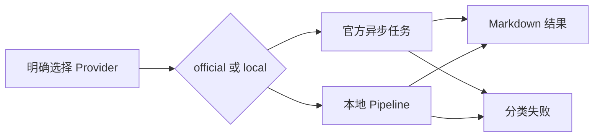

# PaddleOCR双通道解析需求说明书

> 功能标识：`paddleocr-dual-provider`
> 版本：V1.1.0
> 文档状态：已确认
> 创建日期：2026-08-28
> 更新日期：2026-08-28

## 一句话说明

在 `fons4ai-capability-common` 提供独立的 PaddleOCR 文档解析能力，调用方必须明确选择官方托管 API `paddleocr-official` 或自建服务 `paddleocr-local`，统一取得 Markdown。

## 需求就绪摘要

### 已确认内容

- 自建端采用完整 `PaddleOCR-VL-1.6` PaddleX/PaddleOCR 服务，Provider 标识为 `paddleocr-local`。
- 官方托管端 Provider 标识为 `paddleocr-official`，需要处理异步任务。
- 本次仅返回 Markdown 文档解析结果；不包含通用 OCR 的坐标、置信度、检测框或票据字段。
- 调用 PaddleOCR 必须明确选择 Provider；系统不得提供默认 Provider 或自动切换。
- OCR 是独立 AI 能力，交付只放在 `fons4ai-capability-common`；不依赖 RAG，不提供 Spring AI 或 LangChain4j 适配。

### 待确认内容

- 无。

## 背景与目标

- 当前问题：官方托管服务与自建 PaddleX 服务协议、完成模式不同，调用方无法安全地通过替换地址实现切换。
- 目标：向任意 Java 调用方提供框架无关、显式选型、可诊断的两条 PaddleOCR 文档解析通道。
- 不做会怎样：各调用方重复处理协议差异、官方任务轮询、错误映射和 Markdown 提取，且容易混淆本地与官方契约。

## 需求范围

### 本次包含

- 在 `fons4ai-capability-common` 提供公开的文档解析请求、结果、Provider 选择和解析服务契约。
- 提供 `paddleocr-official`：提交官方异步文档解析任务，等待完成并取得 Markdown。
- 提供 `paddleocr-local`：调用调用方配置的完整 `PaddleOCR-VL-1.6` 服务并取得 Markdown。
- 支持 PDF、PNG、JPG、JPEG 单文件输入，保持标题、列表、表格等 Markdown 结构。
- 对配置、认证、超时、任务/服务失败和响应错误提供可区分且不泄密的异常。
- 提供直接 Java 使用说明和自动化验证。

### 本次不包含

- 不接入 RAG 的 `DocumentParseProvider`、Registry、Selector、Spring AI 或 LangChain4j。
- 不提供默认 Provider、自动选择或失败 fallback。
- 不部署、运维或暴露 PaddleOCR/PaddleX 服务。
- 不提供批量、回调、队列、结果持久化、对象存储、图片资产下载或通用 OCR 结构化输出。

## 角色与场景

| 角色 | 场景 | 触发条件 | 结果 |
| --- | --- | --- | --- |
| Java 应用接入者 | 使用官方托管解析 | 明确创建或选择 `paddleocr-official` 且提供 Token | 在受控等待时间内得到 Markdown |
| Java 应用接入者 | 使用内网自建服务 | 明确创建或选择 `paddleocr-local` 且配置服务地址 | 只向本地地址发送文件并得到 Markdown |
| 运维人员 | 管理凭证、地址和限额 | 为应用注入配置 | 可独立禁用任一通道并定位失败 |

## 需求列表

| 需求编号 | 需求内容 | 优先级 | 关联验收 |
| --- | --- | --- |
| REQ-001 | 提供不依赖 AI 框架或 RAG 的公共 PaddleOCR 文档解析契约，调用方必须明确 Provider。 | P0 | AC-001、AC-002 |
| REQ-002 | `paddleocr-official` 应完成官方异步文档解析并返回 Markdown。 | P0 | AC-003、AC-005 |
| REQ-003 | `paddleocr-local` 应调用完整本地 `PaddleOCR-VL-1.6` 服务并返回 Markdown。 | P0 | AC-004、AC-005 |
| REQ-004 | 两通道不可用或失败时不得调用另一通道、不得 fallback，并返回分类失败。 | P0 | AC-002、AC-006 |
| REQ-005 | 原始文档、Token 和敏感响应不得进入日志、异常、结果或本地持久化。 | P0 | AC-006、AC-007 |

## 业务规则

| 编号 | 规则 |
| --- | --- |
| BR-001 | 调用方必须显式传入或创建 `paddleocr-official` 或 `paddleocr-local`；不存在默认值。 |
| BR-002 | official 仅在有效 Token 与配置齐备时发送文件；local 仅向调用方配置地址发送文件。 |
| BR-003 | 任一失败直接返回对应分类异常，不重试、不转发、不切换 Provider。 |
| BR-004 | V1 仅处理 PDF、PNG、JPG、JPEG 单文件，成功结果只包含 Markdown 及非敏感运行信息。 |

## 业务流程

1. 调用方显式选择 Provider 并提交单个文档。
2. 服务校验配置、格式和文件大小。
3. official 提交并轮询任务；local 调用本地 Pipeline。
4. 服务提取 Markdown 并返回结果；失败则返回分类异常。

## 业务数据口径

### 数据影响判断

| 检查项 | 是否涉及 | 说明 |
| --- | --- | --- |
| 持久化数据结构 | 否 | 不读写数据库、缓存、对象存储或消息 |
| 敏感文档 | 可能 | 原始文档可能包含敏感内容 |
| 跨服务传输 | 是 | 仅发送到调用方显式选择的 official 或 local 地址 |

### 关键数据口径

| 数据项 | 含义 | 格式 | 确认状态 |
| --- | --- | --- | --- |
| Provider | 被调用的服务通道 | `paddleocr-official` 或 `paddleocr-local` | 已确认 |
| 原始文档 | 单个待解析文件 | PDF、PNG、JPG、JPEG | 已确认 |
| 解析结果 | 可供后续业务使用的正文 | Markdown | 已确认 |

## 影响说明

| 对象 | 影响 |
| --- | --- |
| `fons4ai-capability-common` | 新增独立 OCR 公共能力与两个 HTTP 适配器 |
| RAG、Spring AI、LangChain4j | 无代码、依赖或自动装配影响 |
| 调用方 | 通过直接 Java API 显式构造/选择 Provider，并自行管理外置配置 |

## 验收标准

- AC-001：Given 仅引入 `fons4ai-capability-common`，when 创建 OCR 解析服务，then 不需要 RAG、Spring AI 或 LangChain4j 类型和依赖。
- AC-002：Given 调用方未明确选择 Provider 或所选 Provider 不可用，when 请求解析，then 返回明确失败且不产生对任何另一 Provider 的 HTTP 调用。
- AC-003：Given official 配置有效且任务成功，when 显式选择 `paddleocr-official`，then 服务完成提交、轮询并返回 Markdown。
- AC-004：Given local 配置有效且 Pipeline 成功，when 显式选择 `paddleocr-local`，then 服务调用 `/layout-parsing` 并返回 Markdown。
- AC-005：Given 两 Provider 成功处理含标题、列表或表格的文档，when 返回结果，then Markdown 结构性空白保持可用。
- AC-006：Given 配置、认证、连接、超时、任务/服务业务失败或响应非法，when 解析，then 调用方能区分失败类别，且无 fallback。
- AC-007：Given 任一成功或失败路径，when 检查结果、异常、日志与运行信息，then 不含正文、Token、认证头、Base64 或完整外部响应。

## 质量要求

- 官方请求、轮询总时限和本地请求均有上限；local 额外限制 Base64 输入大小。
- 公开类型和复杂协议分支具备中文职责/边界注释。
- 不引入未经确认的第三方 HTTP、JSON 或 AI 框架依赖；优先复用 JDK 标准库。

## 风险与待确认

- 官方 API 与 PaddleX 协议会演进，实施时需以当前官方文档复核字段。
- official 的文件外发合规、local 的网络准入与密钥管理由调用方负责。
- 无待确认事项。

## 版本修订记录

| 日期 | 版本 | 说明 |
| --- | --- | --- |
| 2026-08-28 | V1.0.0 | 原始双通道需求 |
| 2026-08-28 | V1.1.0 | 改为 capability-common 独立 OCR 能力，移除 RAG 与框架适配范围 |
